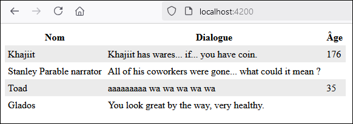
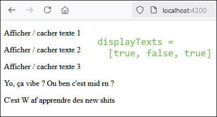
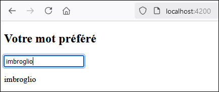
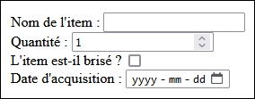

# Cours 2 - Composant dynamique

Ce cours aborde l'interaction entre la classe TypeScript d'un composant et son template HTML.

* Boucles (Afficher une liste)
* Conditions
* Événements
* Formulaires

### 💫 Boucles *ngFor

Il faudra d'abord importer un module qui nous permettra d'utiliser la directive `*ngFor` dans le template HTML :

<center></center>

#### 👶 Exemple simple

Disons qu'on souhaite afficher une liste de longueur arbitraire dans la page Web de manière élégante ...

```ts showLineNumber
export class AppComponent {
  
  myCatToys : string[] = ["balle", "écouteurs bluetooth", "clé USB", "lacets de chaussures neuves"];

}
```

Nous allons utiliser la directive `*ngFor` dans le template HTML, qui permet de répéter un élément \<?\> pour chaque donnée d'un tableau.

```html showLineNumbers
<ul>
    <li *ngFor="let t of myCatToys">{{t}}</li>
</ul>
```

Le code `let t of myCatToys` permet de créer la variable `t`, qui contiendra la valeur de chaque donnée
du tableau, une à la fois, dans chaque élément **\<li\>** répété.

<center></center>

:::warning

La directive `*ngFor` doit être intégrée à la balise ouvrante de l'élément HTML que l'on souhaite répéter.
Ce serait une erreur de mettre le `*ngFor` dans la balise **\<ul\>**, car c'est bel et bien le **\<li\>** qu'on
souhaite répéter pour chaque donnée du tableau.

:::

import Tabs from '@theme/Tabs';
import TabItem from '@theme/TabItem';

#### 🧩 Exemple sophistiqué

Voici un exemple avec un objet personnalisé :

<Tabs>
    <TabItem value="class" label="Classe personnalisée" default>
    ```ts showLineNumbers
    export class Npc{

        constructor(
            public name : string,
            public dialogue : string,
            public age : number | null
        ){}

    }
    ```
    </TabItem>
    <TabItem value="componentClass" label="Classe du composant" default>
    ```ts showLineNumbers
    export class AppComponent {
    
        npcs : Npc[] = [
            new Npc("Khajiit", "Khajiit has wares... if... you have coin.", 176),
            new Npc("Stanley Parable narrator", "All of his coworkers were gone... what could it mean ?", null),
            new Npc("Toad", "aaaaaaaaa wa wa wa wa wa", 35),
            new Npc("Glados", "You look great by the way, very healthy.", null)
        ];

    }
    ```
    </TabItem>
    <TabItem value="htmlTemplate" label="Template HTML" default>
    ```html showLineNumbers
    <table>
        <tr>
            <th>Nom</th><th>Dialogue</th><th>Âge</th>
        </tr>
        <tr *ngFor="let n of npcs">
            <td>{{n.name}}</td><td>{{n.dialogue}}</td><td>{{n.age}}</td>
        </tr>
    </table>
    ```
    </TabItem>
    <TabItem value="css" label="CSS du composant" default>
    ```css showLineNumbers
    th, td{
        padding:5px;
    }

    tr:nth-child(even){
        background-color:rgb(235, 235, 235);
    }

    table{
        border-collapse: collapse;
    }
    ```
    </TabItem>
</Tabs>

<center></center>

### ✅ Conditions *ngIf

La directive `*ngIf` permet d'afficher un élément HTML (et ses enfants) seulement si une condition est respectée.

Il faudra d'abord importer `CommonModule`, qui nous permettra d'utiliser la directive `*ngIf` dans le template HTML :

<center></center>

#### 👶 Exemple simple

```ts showLineNumbers
export class AppComponent {
    
    userAge : number = 17;

}
```

```html showLineNumbers
<button *ngIf="userAge >= 18">Acheter des cigarettes 🚬</button>

<button>Acheter des belles briques 🧱</button>
```

Bien entendu, dans ce cas, puisque `userAge` est inférieur à 18, seul le deuxième bouton s'affichera.

<center></center>

#### 🧩 Exemple sophistiqué

Voici un exemple avec des objets personnalisés :

<Tabs>
    <TabItem value="class" label="Classe personnalisée" default>
    ```ts showLineNumbers
    export class Youtuber{

        constructor(
            public name : string,
            public content : string,
            public age : number | null
        ){}

    }
    ```
    </TabItem>
    <TabItem value="componentClass" label="Classe du composant" default>
    ```ts showLineNumbers
    export class AppComponent {

        youtubers : Youtuber[] = [
            new Youtuber("MotherSniperZz", "Call of Duty gaming", 16),
            new Youtuber("Ka$haStudioASMR", "ASMR", 24),
            new Youtuber("SussyBaka69", "NSFW", null),
            new Youtuber("Bl0ck4L1f3", "LEGO Collection", 47)
        ];

    }
    ```
    </TabItem>
    <TabItem value="componentHtml" label="Template HTML" default>
    ```html showLineNumbers
    <ul>
        <li *ngFor="let y of youtubers">
            {{y.name}} ({{y.age != null ? y.age + ' ans' : 'âge inconnu'}}) fait des vidéos sur le thème 
            « {{y.content}} » <span *ngIf="y.content == 'ASMR' || y.content == 'NSFW'">😳</span>
        </li>
    </ul>
    ```
    </TabItem>
</Tabs>

<center></center>

Remarquez qu'utiliser des conditions ternaires `condition ? valeur_si_vrai : valeur_si_faux` est pratique
dans certaines situations. Cela dit, le `*ngIf` était incontournable pour rendre l'élément `<span>` optionnel
à la fin de chaque ligne.

#### 😠 Où est le *ngElse ?

Il n'y a pas de *ngElse à proprement parler, mais il y a tout de même cette alternative :

```html showLineNumbers
<div *ngIf="... condition ... ; else autreChose">Allo</div>
<ng-template #autreChose><div>Buh-bye</div></ng-template>
```

Sinon vous avez toujours la possibilité de créer un `*ngIf` avec la condition inverse. 🧠

:::note

Un élément HTML ne peut pas à la fois contenir la directive `*ngIf` et `*ngFor`. Cela dit, rien ne vous
empêche de mettre un élément enfant avec l'autre directive. (Par exemple, un élément parent avec `*ngIf`
qui contient un élément enfant avec `*ngFor`)

:::

### 🖱 Événements

Angular nous simplifie la vie lorsqu'on souhaite intégrer des écouteurs d'événements à nos pages Web.

#### 👶 Exemple simple

Par exemple, disons qu'on veut un bouton qui augmente un compteur de 1 et qu'on veut afficher ce compteur...

D'abord, créons une variable de classe pour stocker la valeur du compteur et une fonction qui permet 
d'incrémenter cette variable.

```ts showLineNumbers
export class AppComponent {

  n : number = 0;

  count() : void{
    this.n++;
  }

}
```

Ensuite, dans le template HTML, on ajoute un écouteur d'événements de type `click` sur un bouton pour
appeler la fonction `count()` à chaque fois que le bouton est **cliqué**.

```html showLineNumbers
<button (click)="count()">+1</button>

<p>Compteur : {{n}}</p>
```

Résultat : Comme on affiche `{{n}}` dans la page Web, on peut voir la valeur de `n` évoluer dynamiquement
à chaque fois qu'on appuie sur le bouton.

<center></center>

#### 🧩 Exemple sophistiqué

Commençons par préparer un tableau avec trois `boolean` ainsi qu'une fonction permettant de basculer la
valeur des booléens dans le tableau :

```ts showLineNumbers
export class AppComponent {

  displayTexts : boolean[] = [false, false, false];

  toggleText(index : number) : void{
    if(index < 0 || index >= this.displayTexts.length) return; // Ignorer si index outOfRange
    this.displayTexts[index] = !this.displayTexts[index]; // Inverser un booléen
  }

}
```

Ensuite, dans le template HTML, on veut trois boutons qui permettent chacun d'afficher / de cacher un texte spécifique.

```html showLineNumbers
<p (click)="toggleText(0)">Afficher / cacher texte 1</p>
<p (click)="toggleText(1)">Afficher / cacher texte 2</p>
<p (click)="toggleText(2)">Afficher / cacher texte 3</p>

<p *ngIf="displayTexts[0]">Yo, ça vibe ? Ou ben c'est mid rn ?</p>
<p *ngIf="displayTexts[1]">Man c'te shit là est bussin' fr no cap</p>
<p *ngIf="displayTexts[2]">C'est W af apprendre des new shits</p>
```

En gros, grâce aux booléens dans le tableau `displayTexts` et à l'usage de la directive `*ngIf`, les trois `<p>` du haut
permettent de basculer les booléens du tableau entre `true` et `false` pour gérer l'affichage de chacun des textes. Par
défaut, comme nous avions mis les trois booléens à `false`, les trois textes seront initialement cachés.

Voici l'état de la page si on a cliqué pour afficher les textes 1 et 3 : 

<center></center>

:::note

L'écouteur d'événements `(click)` a été intégré à un élément `<p>` cette fois. Gardez à l'esprit qu'on peut mettre
un écouteur d'événements sur la grande majorité des types d'éléments HTML sans problème. Il y a quelques exceptions...
On pourrait éviter de mettre `(click)` dans un élément `<a>` puisque cet élément est déjà cliquable et permet de changer
de page.

:::

#### 🔍 Autres types d'événements

En HTML, il existe des tonnes de types d'événements. N'hésitez pas à vérifier la [liste des événements existants](https://www.w3schools.com/jsref/dom_obj_event.asp).

Dans le cadre du cours, nous utiliserons principalement `(click)` et également `(change)` une ou deux fois.

### 📝 Formulaires

Le module `FormsModule` nous donnera accès à certaines directives et gadgets en lien avec les formulaires.

<center></center>

#### ♊ Two-way binding

Il est possible d'associer une **variable** du composant avec un élément `<input>` du template HTML. C'est-à-dire que si
la valeur de la **variable** est modifiée dans le code TypeScript, la valeur de l'élément `<input>` sera modifiée également. De plus, si
l'utilisateur modifie la valeur dans l'élément `<input>`, la valeur de la **variable** changera également. (Bref, les deux valeurs sont **liées**)

On doit d'abord créer une variable dans le composant. Notez que dans certains cas il faudra permettre à la variable d'être `undefined`, mais
comme ici nous avons un `string`, la chaîne vide `""` fait le travail.

```ts showLineNumbers
export class AppComponent {

  motPrefere : string = "";

}
```

Puis, on prépare un `<input>` HTML. N'oubliez surtout pas de remplir l'attribut `name` ! (Sa valeur peut être arbitraire, mais par convention on peut lui donner le même nom que la variable)

```html showLineNumbers
<input type="text" name="motPrefere">
```

Pour le moment, la variable du composant et l'input HTML ne sont **pas liés du tout**. La prochaine étape concrétisera le _two way binding_.

Ajoutez l'attribut `[(ngModel)]` (les parenthèses et crochets sont essentiels) suivi du nom de la variable que vous avez créée dans le composant :

```html showLineNumbers
<input type="text" name="motPrefere" [(ngModel)]="motPrefere">
```

Désormais, la variable et l'input sont bel et bien liés : leur valeur sera toujours synchronisée. On peut tester visuellement
cette synchronisation en modifiant le HTML comme ceci :

```html showLineNumbers
<input type="text" name="motPrefere" [(ngModel)]="motPrefere">

<p>{{motPrefere}}</p>
```

Bien entendu, l'élément `<p>` contiendra toujours le même texte que l'input.

<center></center>

Grâce à ce mécanisme, nous aurons facilement accès à la donnée fournie par l'utilisateur
en utilisant `this.motPrefere`, n'importe où dans la classe du composant.

#### Exemple de formulaire plus sophistiqué

Dans cet exemple, nous utiliserons une classe `Item` et nous permettrons à l'utilisateur d'ajouter plusieurs
items à son inventaire à l'aide d'un formulaire.

Voici la classe `Item` qui sera utilisée :

```ts showLineNumbers
export class Item{

    constructor(
        public name : string,
        public dateAdded : Date,
        public quantity : number,
        public isBroken : boolean
    ){}

}
```

Dans la classe du composant, on a une variable prête à accueillir la donnée fournie par l'utilisateur
pour chacun des quatre champs et une liste qui contiendra tous les items créés par l'utilisateur :

```ts showLineNumbers
export class AppComponent {

  name : string = "";
  dateAdded ?: Date;
  quantity : number = 1;
  isBroken : boolean = false;

  items : Item[] = [];

}
```

Dans le HTML, on crée quatre `<input>` adapté à chaque propriété et on utilise `[(ngModel)]` pour faire
la liaison avec les variables de classe. Remarquez que les valeurs par défaut choisies pour les variables de
classe (nom vide, date indéfinie, quantité à 1 et item pas brisé) se reflètent dans l'état initial du formulaire.

<Tabs>
    <TabItem value="html" label="Code HTML" default>
    ```html showLineNumbers
    Nom de l'item : <input type="text" name="name" [(ngModel)]="name"><br>
    Quantité : <input type="number" name="quantity" [(ngModel)]="quantity"><br>
    L'item est-il brisé ? <input type="checkbox" name="isBroken" [(ngModel)]="isBroken"><br>
    Date d'acquisition : <input type="date" name="dateAdded" [(ngModel)]="dateAdded"><br>
    ```
    </TabItem>
    <TabItem value="ui" label="Page Web" default>
    
    </TabItem>
</Tabs>

Ensuite, sous le formulaire, on a besoin d'un bouton qui permettra à l'utilisateur de créer son item pour l'ajouter à la liste d'items :

```html
<button (click)="ajouterItem()">Ajouter l'item à l'inventaire</button>
```

Nous allons devoir coder la fonction `ajouterItem()` dans le composant. Elle va simplement créer un `new Item(...)`
à l'aide des données fournies par l'utilisateur. Ce nouvel item sera ajouté à la liste dans la variable de classe `items`.

```ts
ajouterItem(){
    // Une valeur invalide ? On s'arrête
    if(this.name == "" || this.dateAdded == undefined || this.quantity < 1) return;

    let newItem : Item = new Item(this.name, this.dateAdded, this.quantity, this.isBroken);
    this.items.push(newItem);
}
```

Avant de tester, on prépare un affichage simple quelque part dans le HTML pour la liste d'items :

```html
<p *ngFor="let i of items">L'item {{i.name}} (x{{i.quantity}}{{i.isBroken ? ', brisé' : ''}}) 
    a été acquis le {{i.dateAdded}}</p>
```

Voici le résultat final dans la page Web après avoir créé 3 items grâce au formulaire :

<center></center>

### 🔁 Gadgets syntaxiques supplémentaires

#### ✅ @if

Similaire à `*ngIf`. Peut-être accompagné d'un `@else`.

```ts showLineNumbers
export class AppComponent{

    isDaytime : boolean = true;

}
```

```html showLineNumbers
<div class="tab">
    @if(isDaytime){
        <p>Bonjour</p>
        <button (click)="buy('coffee')">Acheter un café</button>
    }
    @else{
        <p>Bonsoir</p>
        <button (click)="buy('beer')">Acheter une bière</button>
    }
</div>
```

#### 🔄 @for

Similaire à `*ngFor`. Peut être accompagné d'un `@empty`, qui permet un affichage alternatif si la collection est vide.

```ts showLineNumbers
export class AppComponent{

    ingredients : string[] = ["farine", "beurre", "lait", "ongles d'orteil"];

}
```

```html showLineNumbers
<div class="recipe">
    @for(i of ingredients; track $index){
        <p>{{i}}</p>
    }
    @empty{
        <p>La liste n'ingrédients n'a pas pu être chargée. Veuillez ressayer.</p>
    }
</div>
```

L'instruction `track $...` est nécessaire. Elle permet à Angular d'associer chaque élément de la
collection avec la partie répétée du HTML qui lui est associée. (Par exemple, dans ce cas, chaque
élément de la liste `ingredients` est associée à un élément `<p>`)

Si une liste est statique (c'est-à-dire qu'aucun élément ne sera ajouté, modifié ou retiré), on peut
se contenter d'utiliser `track $index`. Si la liste est dynamique, dans ce cas, on doit utiliser une
propriété unique à chaque élément de la liste. (Donc `track $i.id` la plupart du temps, mais dans ce 
cas comme c'est une liste de `string` et qu'un `string` n'a pas de sous-propriété, c'est impossible.)

Bref, pour une liste statique, utilisez `track $index` et pour une liste dynamique d'objet personnalisé,
tentez de trouver une propriété unique à _tracker_. Cela améliorera la performance de l'application Angular,
surtout si votre liste contient énormément d'éléments.

#### 👉 @switch

Similaire à `*ngIf`. Le bloc `@default` est facultatif.

```ts showLineNumbers
export class AppComponent{

    roomCapacity : number = 4;

}
```

```html showLineNumbers
<div class="roomPricing">
    @switch(roomCapacity){
        @case(1){
            <p>Prix : 125$</p>
        }
        @case(2){
            <p>Prix : 175$</p>
        }
        @case(4){
            <p>Prix : 225$</p>
        }
        @default{
            <p>Damn vous êtes cooked ça coûte 400$+</p>
        }
    }
</div>
```

### ❓ Est-ce du TypeScript ou du HTML ?

Prenons ce composant et son HTML :

```ts showLineNumbers
export class AppComponent{

    n : string = "allo";

}
```

```html showLineNumbers
<p class="n">Bonjour</p>
```

La classe sera-t-elle `n` ou `allo` ? Dans ce cas, le `n` ne sera pas interprété comme du TypeScript, 
alors le HTML final sera bel et bien `class="n"`.

#### ⚙ C'est du TypeScript lorsque...

* L'attribut existe seulement avec Angular (`(click)`, `*ngIf`, `[(ngModel)]`, etc.)
* Des accolades doubles `{{ ... }}` ont été utilisées.
* L'attribut est natif en HTML, mais des crochets `[ ... ]` l'encadrent.

Ci-dessous, les variables `theme`, `age` et `itemName` seront toutes remplacées par leur valeur
dans le rendu final du HTML.

```html showLineNumbers
<p [class]="theme">Salut</p>
<p *ngIf="age >= 18">🍷🍺🍸</p>
<p id="{{itemName}}">Article</p>
```

#### 📜 C'est du HTML lorsque...

* L'attribut est natif en HTML, aucun crochet `[ ... ]` n'encadre l'attribut et il n'y a pas de 
double accolades `{{ ... }}` qui encadrent la valeur de l'attribut.

Cette fois-ci, ci-dessous, les variables `theme` et `itemName` ne seront pas remplacées par
leur valeur dans le rendu final du HTML. Le HTML sera affiché tel quel !

```html showlineNumbers
<p class="theme">Salut</p>
<p id="itemName">Article</p>
```

#### 📝 Chaîne de caractères dans le HTML

:::note

**Rappel** : Un élément HTML peut contenir plusieurs classes CSS. Il suffit de les séparer par des espaces.

:::

Si jamais on souhaite d'un attribut contienne un élément hardcodé et du TypeScript, on peut faire comme ceci :

```html showLineNumbers
<div [class]="'container ' + selectedTheme">
 <!-- Contenu quelconque -->
</div>
```

Ci-dessus, grâce aux apostrophes `' ... '`, la partie `container` sera affichée tel quel. (C'est un string) 
Cela dit, la variable `selectedTheme` sera remplacée par sa valeur. Cela pourrait donner quelque chose
comme ceci une fois le rendu compilé :

```html showLineNumbers
<div class="container dark">
 <!-- Contenu quelconque -->
</div>
```

