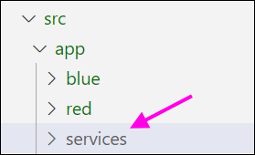

# Cours 6 - Services

⚙ Les services sont des **classes TypeScript** qui ne sont associées à aucun code HTML ou CSS.
Ces classes permettent de rassembler des données (variables) et fonctionnalités (fonctions)
qui pourront être utilisées par **plusieurs composants**.

🔄 Cela permet d'éviter de répéter des variables ou des fonctions similaires dans plusieurs composants.

♻ Les services peuvent également être conçus dans l'optique d'être facilement réutilisés dans un
autre projet Angular plus tard.

### 🐣 Créer un nouveau service

Vous êtes invités à créer un dossier `services` dans le dossier `app` pour y ranger vos services :

<center></center>

La commande `ng generate service nomDeVotreService` permet de créer un nouveau service. Commencez par
vous déplacer vers le dossier de destination à l'aide de la commande `cd` :

<center></center>

Puis, créez votre nouveau service :

<center></center>

Deux nouveaux fichiers ont été générés. N'hésitez pas à supprimer le fichier `...spec.ts`, qui sert
aux tests unitaires.

<center></center>

N'oubliez pas de retourner dans le dossier racine du projet avec `cd ../../..` ou encore de simplement ouvrir un nouveau terminal.

Un service vide ressemblera donc à ceci :

```ts showLineNumbers
import { Injectable } from '@angular/core';

@Injectable({
  providedIn: 'root'
})
export class DataService {

  constructor() { }
  
}
```
