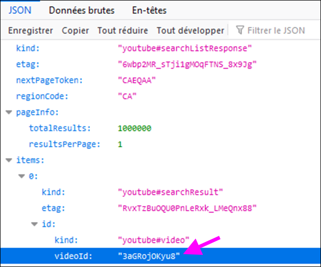

# Cours 8 - Maps, vidéos, pipes

### ▶ Intégration YouTube

Dans la section qui suit, nous aborderons comment intégrer un lecteur vidéo YouTube à une page Web Angular, mais aussi
comment envoyer une requête à l'**API Web de YouTube** pour rechercher et afficher une vidéo.

#### 📽 Lecteur YouTube avec \<iframe\>

Pour afficher une **vidéo YouTube spécifique** dans un composant, suivez les étapes suivantes :

**Étape 1 - 🔍 Trouver une vidéo YouTube de notre choix**

<center>
    
    
</center>

**Étape 2 - 🚚 Copier le \<iframe\> prémâché dans le composant**

<center></center>

On colle dans le HTML d'un composant :

<center></center>
<br/>
:::warning

Il est possible qu'Angular bloque la vidéo puisque c'est une ressource externe.
Dans ce cas, il faudra indiquer à Angular d'ignorer l'origine de la ressource. (Étape 2.5)

:::

**Étape 3 (optionnelle) - ⛔ Contourner le blocage d'une ressource externe**

<center></center>

Si vous avez ce problème, voici la solution :

1. Mettre l'URL de la vidéo dans une variable du composant :

```ts showLineNumbers
export class AppComponent{

  videoUrl : string = "https://www.youtube.com/embed/vxLzDwScCu";

}
```

2. Injecter la dépendance `DomSanitizer` dans le composant :

```ts showLineNumbers
export class AppComponent{

  videoUrl : string = "https://www.youtube.com/embed/vxLzDwScCu";

  constructor(public sanitizer : DomSanitizer){} // Injection 💉

}
```

3. Utiliser le `DomSanitizer` pour transformer la ressource externe en « ressource de confiance » :

```ts showLineNumbers
export class AppComponent{

  videoUrl : string = "https://www.youtube.com/embed/vxLzDwScCu";

  constructor(public sanitizer : DomSanitizer){}

  getSafeUrl() : SafeResourceUrl{
    return this.sanitizer.bypassSecurityTrustResourceUrl(this.videoUrl);
  }

}
```

4. Il ne reste plus qu'à utiliser `getSafeUrl()` dans le `src` du `<iframe>` du composant :

```html
<iframe width="560" height="315" [src]="getSafeUrl()"  title="YouTube video player" ...>
```

La vidéo devrait pouvoir être chargée sans problème à ce moment.

**Étape 4 (optionnelle) - 🧠 Meilleur stockage des URLs YouTube**

Si on compte afficher plusieurs vidéos YouTube dans la page, autant mettre la **partie commune**
de l'URL dans une **constante** :

```ts showLineNumbers
const YT_URL = "https://www.youtube.com/embed/"; // Constante

@Component({
    ...
})
export class AppComponent{

  videoUrl_1 : string = "vxLzDwMScCu";
  videoUrl_2 : string = "Yv5saunLRdQ";

  constructor(public sanitizer : DomSanitizer){}

  getSafeUrl() : SafeResourceUrl{
    return this.sanitizer.bypassSecurityTrustResourceUrl(YT_URL + this.videoUrl_1); // Concaténation
  }

}
```

### 📶 Requête YouTube

**L'API Web de YouTube** permet de rechercher des vidéos à l'aide d'une requête contenant un simple texte de recherche.
En gros, c'est un peu comme si on utilisait la barre de recherche sur le site Web de YouTube, mais dans une requête.
De plus, au lieu d'avoir accès à une liste de vidéos cliquables, nous obtiendrons plutôt une liste **d'ids de vidéos**.
Ces **ids** nous permettront d'afficher une vidéo ou plusieurs vidéos à l'aide de la technique vue plus haut avec un
`<iframe>`.

Voici les étapes à suivre pour pouvoir faire des **requêtes YouTube** et afficher les vidéos obtenues :

**Étape 1 - 🔑 Obtenir une clé d'API YouTube**

Commencez par créer un compte Google.

Une fois connecté(e), rendez-vous sur cette page : [https://console.cloud.google.com/apis/credentials?](https://console.cloud.google.com/apis/credentials?)

Pour pouvoir générer une clé d'API (« Create credentials »), vous devrez : 

1. Créer un projet (remplir plusieurs champs d'un formulaire pour décrire votre application à Google)
2. « Configure consent screen » (Choisissez **external**)
3. « Create credentials » puis « API key »

Vous aurez ensuite accès à une clé d'API.

:::danger

Il se peut que Google vous redirige vers une page permettant de fournir vos informations de paiement. ⛔ Ce n'est
absolument pas nécessaire ! Vous devriez pouvoir revenir en arrière et / ou obtenir votre clé d'API sans avoir à faire cela.

:::

**Étape 2 - 🚀 Activer YouTube Data API v3**

<center></center>

Pour que nos requêtes à **l'API Web de YouTube** fonctionnent, il faudra activer l'API pour notre compte Google.
Cliquez sur « Enable APIs and services », puis cherchez l'API de YouTube pour **l'activer**.

**Étape 3 - 📬 Utiliser la requête YouTube**

Voici la requête à utiliser :

`https://www.googleapis.com/youtube/v3/search?type=video&part=id&maxResults=1&key=VOTRE_CLÉ_API&q=PHRASE_DE_RECHERCHE`

Notez les éléments suivants :

* `maxResults=1` : L'API ne nous retournera que la **première vidéo** trouvée. (Notre phrase de recherche devra être très précise...)
* `key=VOTRE_CLÉ_API` : Remplacez `VOTRE_CLÉ-API` par... votre clé d'API. 🧠
* `q=PHRASE_DE_RECHERCHE` : Remplacez `PHRASE_DE_RECHERCHE` par un `string` de votre choix. Exemple : `"cher believe"`.

:::warning

Avec le forfait gratuit, vous avez une **limite de 10 000 requêtes par jour**. Ça ne devrait pas trop poser problème à moins
que vous appeliez plusieurs requêtes maladroitement **dans une boucle \*ngFor**. Soyez prudents ! 👷‍♂️👷‍♀️🚧

:::

Le résultat JSON pourrait ressembler à ceci :

<center></center>

Ce qui nous intéresse le plus est `videoId` car nous pourrons l'utiliser pour afficher la vidéo avec un `<iframe>`.

**Étape 4 - 📽 Afficher la vidéo**

Que faire avec **l'id obtenu** ? Comme on a vu plus haut, il suffit de le glisser à la fin de l'URL `https://www.youtube.com/embed/`
dans un `<iframe>`.

### 🗺 Intégration Google Maps

<center></center>

Notez qu'il faudra activer une autre API (« Maps JavaScript API ») pour pouvoir afficher une **carte Google** dans notre application Web.

**Étape 1 - 📦 Installer une dépendance**

`npm install @angular/google-maps`

**Étape 2 - 🎁 Importation d'un module dans le composant souhaité**

```ts showLineNumbers
@Component({
  selector: 'app-root',
  standalone : true,
  imports: [GoogleMapsModule], // Ici !
  templateUrl: './app.component.html',
  styleUrls: ['./app.component.css']
})
```

**Étape 3 - ⚙ Inclusion d'un script dans `index.html`**

⛔ Remarquez que vous devrez y glisser votre clé d'API Google. (La même que pour YouTube si vous voulez)

Cet élément `<script>` doit être dans le `<head>` du fichier `index.html`. ☢ Pas dans le composant `app` !

` <script src="https://maps.googleapis.com/maps/api/js?key=VOTRE_CLÉ_API"></script>`