# Cours 1 - Intro à React / Next.js

### 🙈 Application Web ASP.NET Core <u>sans</u> Next.js

Quand on envoie une requête HTTP au serveur sur lequel l'application ASP.NET Core roule, le serveur 
nous renvoie du **HTML**, du **CSS** et du **JavaScript** pour que la page Web à afficher chez
l'utilisateur soit toute prête. 🎁👌


### ✅ Application Web ASP.NET Core <u>avec</u> Next.js

Désormais, il y a une application Web **Next.js** qui est hébergée sur un serveur (ça peut être le même que l'application **ASP.NET Core** ou pas) qui s'occupe de nous envoyer tout le **HTML**, **CSS** et **JavaScript** de nos pages Web. Par contre, ces pages Web ne contiennent pas encore les **données** à afficher. (Vidéos, commentaires, messages, titres, articles de blogs, etc.)

Quand on envoie une requête HTTP au serveur sur lequel l'application **ASP.NET Core** roule, le serveur
nous renvoie seulement les **données** à afficher (vidéos, images, morceaux de texte, etc.) sous forme 
de JSON ou de XML et l'application **Next.js** s'occupera de « pluguer » les données dans les pages Web. 📦🔌


Par exemple, lorsque je souhaite naviguer sur YouTube, voici ce qu'il se passe, grossièrement :

1. J'envoie ma **première requête HTTP** (`https://www.youtube.ca`) à YouTube.
2. Le ou les serveurs de YouTube me retournent les choses suivantes :

    * ⚙ L'application **Next.js** m'envoie le **HTML**, le **CSS** et le **JavaScript** de la page Web, puis, une **2e requête** est envoyée pour que...
    * 📦 L'application **ASP.NET Core** m'envoie les données à afficher sur la page d'accueil du site Web (Quelques thumbnails de vidéo, les titres des vidéos, etc.)

3. Ma navigation se poursuit. Par exemple, je clique sur une vidéo. (Ce qui envoie une **deuxième requête HTTP** à Youtube : `https://www.youtube.com/watch?v=dQw4w9WgXcQ`)
4. L'application **Next.js** de YouTube me retourne du **HTML**, du **CSS** et du **JavaScript** supplémentaire au besoin, puis une **2e requête** est envoyée pour que l'application **ASP.NET Core** m'envoie :

    * 🎥 La vidéo à visionner.
    * 📃 Le titre de la vidéo.
    * 📜 Les commentaires de la vidéo.
    * etc.

### 🎭 Différences avec / sans une application Web cliente

| Aspect | Avec Next.JS + ASP.NET Core | Avec ASP.NET Core uniquement |
| - | - | - |
| ⚡ Charge du projet ASP.NET Core | Allégée : il n'a plus besoin de construire les pages Web. (Les views) | Alourdie : il doit construire chaque page Web avant de les envoyer. |
| 🖥 Charge du navigateur Web du client | Alourdie : il y a plus de JavaScript qui travaille côté client pour faire évoluer les pages Web dynamiquement. | Allégée : les pages Web arrivent toutes faites. Il y a parfois un peu de JavaScript pour rendre les pages Web dynamiques, mais c'est léger. |
| 📱🖥💻 Portabilité | Flexible : le serveur Web retourne des données sous format JSON / XML ! On pourrait créer une application mobile qui envoie des requêtes au même serveur ASP.NET Core sans problème. | Rigide : Le serveur retourne du HTML, du CSS et du JavaScript... Il faut utiliser la page Web tel quel. |
| 🤹‍♂️ Interactivité (Menus, jeux, formulaires, événements, etc.) | Plus performante et facile à mettre en place. | Plus difficile à mettre en place, parfois moins performant. |

:::tip

Bien qu'utiliser un framework client comme Next.js offre plusieurs avantages pour un site Web dont le contenu est très dynamique, 
pour des sites Web simples et très statiques, (blogs, journaux, recettes, etc.) se passer d'une application cliente est parfois préférable.
On pourrait même aller plus loin et simplement utiliser un CMS (Content Management System) comme Wordpress pour ne pas avoir à écrire
la moindre ligne de code.

:::

### 🐟 Autres frameworks

#### ⚙ Frameworks serveurs

Depuis votre premier cours de Web, vous utilisez le framework **ASP.NET Core** pour créer des applications Web **serveur**.
Il existe d'autres frameworks Web serveurs (_back end_) qui peuvent jouer le même rôle. Ils sont généralement similaires,
avec quelques fonctionnalités, avantages et défis différents.

Comme ce type de projet ne roule pas dans un navigateur Web, n'importe quel langage de programmation peut être utilisé.

<center>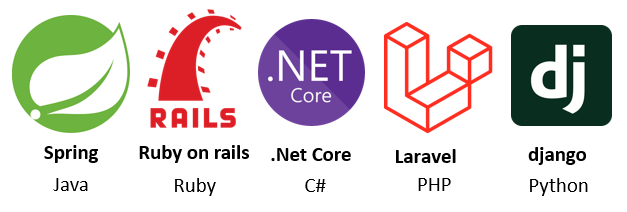</center>

#### 🖥 Frameworks clients

Dans ce cours, nous apprendrons à utiliser **React** avec le framework **Next.js** pour créer des applications Web **cliente**.
Il existe d'autres frameworks Web clients (_front end_) également.

Comme ce type de projet roule dans le navigateur Web de l'utilisateur, **JavaScript** est un choix relativement obligatoire.

<center></center>

:::warning

> Pourquoi ne pas communiquer directement avec la base de données avec une application cliente comme React / Next.js ? (Et se passer
d'un framework serveur comme ASP.NET Core)

En général, les frameworks clients envoient leur code JavaScript au navigateur de l'utilisateur. Ça impliquerait de rendre public les identifiants et mots de passe de connexion à la base de données. 💀⛔

:::

:::info

Contrairement à Angular et Vue, React n'est pas vraiment un **framework client**, mais plutôt une **librairie**. (Avec moins de fonctionnalités qu'Angular et Vue) Des frameworks comme **Next.js**, **Gatsby**, **Vite.js**, etc. sont construits autour de la librairie React. De notre côté, nous utiliserons **Next.js** car c'est, en date d'aujourd'hui, le framework client le plus populaire™. 💃🕺📢

:::

### 🛠 Outil à installer (à la maison seulement)

⛔ Ces outils sont déjà installés à l'école. Cette section n'est pertinente qu'à la maison. 🏠

#### NPM
<center></center>

Gestionnaire de paquets 📦 pour JavaScript. Nous aidera à gérer les dépendances pour nos projets React.  
Installez simplement [Node.js](https://nodejs.org/fr/), qui inclut NPM. Utilisez les paramètres par défaut lors de l'installation. Pas besoin d'installer Chocolatey.

<center>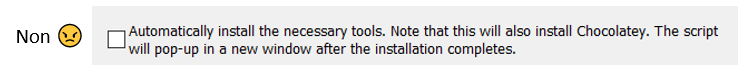</center>

Pour vérifier que NPM est bien installé, ouvrez **PowerShell**  
<center></center>
...et tapez simplement la commande `npm`, qui devrait vous proposer de l'aide pour taper d'autres commandes npm.

### 🧪 Introduction à TypeScript
<center></center>

**TypeScript** est le langage que nous utiliserons (en plus de HTML et CSS) pour travailler sur nos projets React. L'extension des fichiers TypeScript est **.ts**.

:::info

Un instant ! **JavaScript** n'est-il pas le seul langage qui peut être interprété par les navigateurs Web ?
Oui, c'est exact. **TypeScript** n'est pas un _vrai langage_. C'est un _superset_ (Dérivé avec plus de contenu)
de **JavaScript**. Lorsque du code **TypeScript** est compilé, il est secrètement converti en **JavaScript** pour être
interprété par le navigateur Web. Pourquoi ne pas directement coder en **JavaScript** alors ? Car **TypeScript** nous apportera
plusieurs avantages importants et quelques fonctionnalités supplémentaires. 

:::

#### Exemple en JavaScript

Cela ressemble assez à **C#** pour que vous puissiez déduire le comportement de ce code.

```js showLineNumbers
function printToConsole(m){
    console.log(m);
}

let message = "Please send";
let n = 5;

message = 5 < 4 ? "Pick a Shoe" : message + " dudes";

for(let i = 0; i < n; i++){
    if(i % 2 == 0){
        printToConsole(message);
    }
}
```

import Tabs from '@theme/Tabs';
import TabItem from '@theme/TabItem';

#### TypeScript VS JavaScript

Voici le même exemple de code, dans les deux langages :

<Tabs>
    <TabItem value="js" label="JavaScript" default>
        ```js showLineNumbers
        multiplyByTwo(n){
            let newValue = n * 2;
            return newValue;
        }
        ```
    </TabItem>
    <TabItem value="ts" label="TypeScript" default>
        ```ts showLineNumbers
        multiplyByTwo(n : number) : number {
            let newValue : number = n * 2;
            return newValue;
        }
        ```
    </TabItem>
</Tabs>

On remarque surtout le typage dans l'exemple en **TypeScript** :
* Le paramètre de la fonction est typé.
* Le paramètre de retour est typé.
* La variable locale newValue est typée.

:::note

Les langages typés (C#, Java, TypeScript, C++, etc.) permettent généralement d'avoir moins d'erreurs lors de l'exécution du code. 
(Les erreurs sont détectées par le compilateur) Les langages non typés (JavaScript, Python, Ruby, etc.) ont plus de chances de
générer des erreurs lors de l'exécution. (Les erreurs ne sont pas détectées à la compilation)

:::

<center>
    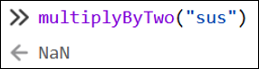  
    Oups ! "sus" multiplié par 2 ne donne pas une donnée valide...
</center>

### 🧰 Classes, variables et fonctions en TypeScript

Exemple de classe simple ඞ :

```ts showLineNumbers
class Crewmate{

    // Propriétés de la classe (publiques par défaut)
    impostor : boolean;
    alive : boolean;

    // Constructeur
    constructor(public color : string, public playerName : string){
        this.impostor = Math.random() < 0.5;
        this.alive = true;
    }

    // Fonction quelconque
    kill() : void{
        console.log(this.playerName + (this.impostor ? " was an impostor" : " was not an impostor"));
        this.alive = false;
    }

}
```

#### Propriétés de classe

* Doivent être typées `impostor : boolean` ou initialisées immédiatement `impostor = false`, au choix. (On peut faire les deux également)
* Peuvent posséder plusieurs types au besoin : `color : string | null` (Cette variable pourrait être `= "blue"` ou encore `= null`)
* Peuvent être undefined à l'aide de `?` : `playerName ?: string` ou carrément `playerName : string | undefined`.
* Pour les utiliser dans une fonction, il faut obligatoirement utiliser le préfixe `this`.

```ts showLineNumbers
class SkibidiCar{

    // Propriétés
    brand : string;
    isNew : boolean = true;
    year : number | null = null;
    driverName ?: string;

    // Constructeur
    ...

}
```

* **brand** : Devra obligatoirement être initialisée avec une chaîne de caractères par le constructeur.
* **isNew** : Initialisée avec true par défaut, mais pourrait être remplie avec `true` / `false` ailleurs.
* **year** : Initialisée avec null par défaut, mais pourrait être remplie avec un nombre ailleurs.
* **driverName** : Pourra être remplie avec une chaîne de caractères ailleurs. (Peut aussi rester `undefined` / vide)

:::note

Les types que nous utiliserons le plus en TypeScript seront `boolean`, `null`, `undefined` (ou `?:` devant le type), 
`number` (Remplace float, int, etc.), `string`, `number[]` et `string[]`. (`[]` signifie tableau)

:::

#### Constructeurs

Si un paramètre du constructeur possède le préfixe `public`, ce paramètre devient automatiquement une propriété de classe.

```ts showLineNumbers
class Imposter{

    impostor : boolean;
    alive : boolean = true;

    constructor(public color : string){
        this.impostor = Math.random() < 0.5;
    }

}
```

Ci-dessus, la classe `Impostor` possède donc 3 propriétés : impostor, alive et **color.** 
De plus, la valeur passée en paramètre au constructeur pour color est automatiquement assignée à la propriété color.

```ts showLineNumbers
// Cet imposteur aura "red" comme valeur pour sa propriété color
let impostor : Impostor = new Impostor("red");
```

Si ce n'est pas clair, voici deux classes dont le fonctionnement et les propriétés sont **identiques** :

<Tabs>
    <TabItem value="no_prefix" label="Sans le préfixe public" default>
        ```js showLineNumbers
        class Cat{

            name : string;
            color : string;

            constructor(name : string, color : string){
                this.name = name;
                this.color = color;
            }

        }
        ```
    </TabItem>
    <TabItem value="prefix" label="Avec le préfixe public" default>
        ```ts showLineNumbers
        class Cat{

            constructor(public name : string, public color : string){}

        }
        ```
    </TabItem>
</Tabs>

#### Fonctions de classe

* Pas obligé de préciser le type de retour, mais c'est souhaitable pour éviter des erreurs.
* Il est obligatoire de préciser le type des paramètres.
* N'oubliez pas le préfixe `this` lorsque vous faites référence à une propriété de classe.
* Il est possible de déclarer des variables locales à l'aide du mot-clé `let`.
    * Si une valeur lui est immédiatement assignée, préciser le type n'est pas obligatoire, mais on peut.

```ts showLineNumbers
playWithToy(toyName : string) : string {
    let msg : string = this.catName + " joue avec " + toyName;
    return msg;
}
```

### 🌳 Environnements de développement

#### Visual Studio code

<center></center>

Nous l'utiliserons pour travailler sur nos projets **React**. (Semaines 1 à 15)

#### Visual Studio

<center></center>

Nous l'utiliserons pour travailler sur nos projets **ASP.NET Core**. (Semaines 8 à 15)

### 🐣 Créer un projet Next.js

Avec l'explorateur de fichiers Windows, rendez-vous dans le répertoire parent de votre choix, puis faites `shift + clic-droit` -> `Ouvrir PowerShell`.

Tapez ensuite la commande `npx create-next-app@latest`. Vous aurez quelques décisions à prendre  :

1. Ok to proceed -> `y`
2. What is your project named -> `nomDeMonProjet`
3. Would you like to use the recommended Next.js default -> `Yes, use the recommended defaults`

:::info

Quelques précisions sur les « `Next.js defaults` » :

* **TypeScript** est le langage que nous utiliserons. (Plutôt que **JavaScript**)
* **Tailwind CSS** est une librairie CSS qui simplifie l'usage de styles.
* **Turbopack** est un « *bundler* », c'est-à-dire un outil qui transforme notre projet **Next.js** en un ensemble de fichiers qui pourront être exécutés efficacement par les navigateurs Web.
* **ESLint** est un outil qui analyse le code afin de relever des erreurs 🐞 et avertissements ⚠ pour aider à améliorer la qualité du code.

:::

Le gabarit de départ contient plusieurs fichiers essentiels :

<center>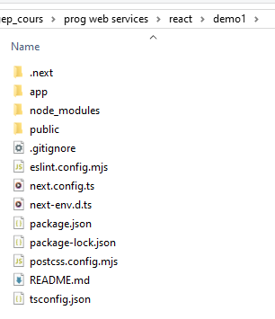</center>

### 🚬 Gestion des dépendances

#### 🐳 node_modules

<center>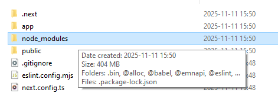</center>

Ce dossier contient toutes les dépendances qui permettent le fonctionnement de notre projet **Next.js**. Cela dit, il pèse au minimum `400 Mo` 
et contient des tonnes et des tonnes de sous-dossiers et fichiers. Nous ne le modifierons jamais manuellement. Nous toucherons seulement
au contenu des dossiers `app` et `public`.

:::warning

Lorsque vous transférez un projet **Next.js** sur un autre disque / ordinateur par une autre méthode que Git (Ex : Teams, clé USB, courriel, OneDrive, etc.), il est **indispensable** de d'abord supprimer le dossier `node_modules` pour alléger considérablement le transfert. (Si vous utilisez **Git**, le fichier `.gitignore` se chargera déjà d'exclure `node_modules` de chaque **commit**.)

:::

À tout moment, le dossier `node_modules` peut être généré de nouveau en tapant la commande `npm install` (ou `npm i`). N'oubliez pas
de d'abord ouvrir PowerShell dans le dossier qui contient les fichiers du projet à l'aide de `shift + clic-droit`. 
(Le dossier qui contient `app`, `public`, etc.)

<center>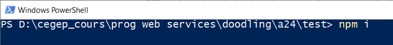</center>

<!--
#### 🍷 Installer une dépendance

Pour pouvoir utiliser certaines librairies dans un projet Angular, on peut se servir de **npm** pour installer la librairie
sous forme de dépendance. Par exemple, pour pouvoir utiliser **Bootstrap**, on doit installer deux dépendances : `jquery` et
`bootstrap`, à l'aide des commandes suivantes :

1. `npm install jquery`
2. `npm install bootstrap`

N'oubliez pas de d'abord ouvrir PowerShell dans le dossier qui contient les fichiers du projet à l'aide de `shift + clic-droit`. 
(Le dossier qui contient `src`, `public`, etc.) Si vos dépendances sont bien installées, elles seront visibles dans le fichier 
`package.json` :

<center>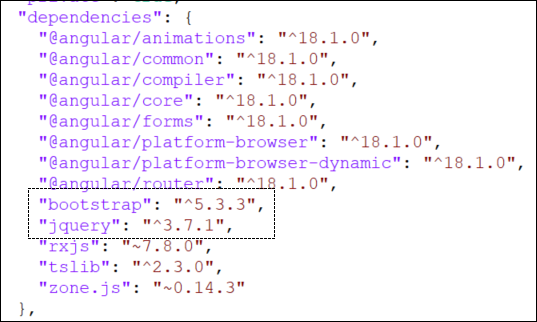</center>

Notons que des fichiers auront été ajoutés dans `node_modules` également.

#### 🩹 Désinstaller une dépendance

Les dépendances peuvent être désinstallées à l'aide de la commande `npm uninstall nomDeLaDependance`.
-->

### 🏁 Ouvrir et exécuter un projet Next.js

Il suffit d'ouvrir le dossier dans **Visual Studio Code** à l'aide d'un clic-droit à l'intérieur du dossier lui-même ou sur le dossier.

<center>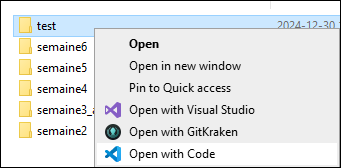</center>

<center>... ou encore ...  </center>
  
<center>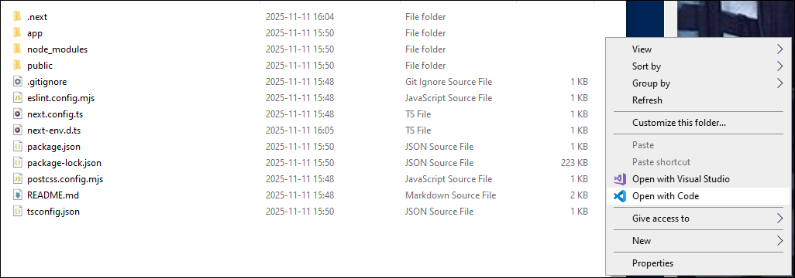</center>

Pour exécuter le projet, ouvrez un terminal (Onglet `Terminal` -> `Nouveau terminal`) puis tapez la commande `npm run dev`.

<center>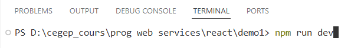</center>

Pour voir votre site Web, ouvrez un navigateur Web de votre choix et tapez l'adresse `localhost:3000`.
Pour le moment, ce sera le gabarit par défaut qui est affiché :

<center>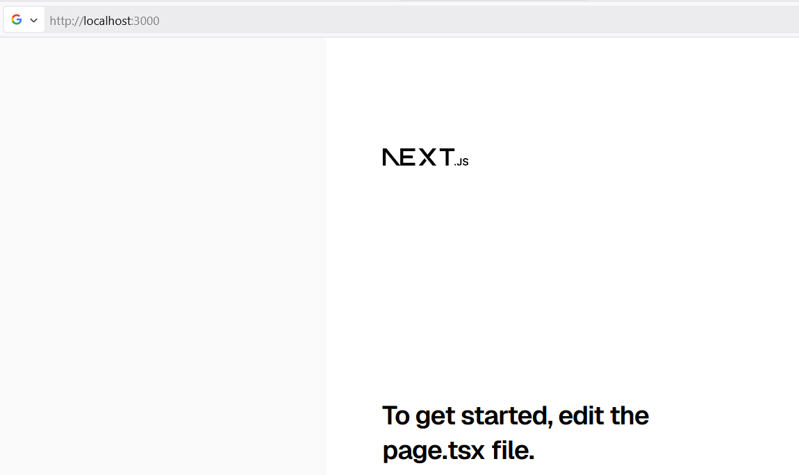</center>
  
  
:::info

Bonne nouvelle ! Dès que vous modifiez un fichier du projet Next.js dans Visual Studio, le site Web sera automatiquement
mis à jour lorsque vous sauvegarderez le fichier modifié. Il n'est pas nécessaire de refaire la commande `npm run dev`. ✨

:::

:::tip

Si jamais le port `3000` est déjà monopolisé, vous pouvez préciser un port spécifique dans la commande :

`npm run dev -- -p 3001`

:::

### 🕵️‍♂️ Comprendre les fichiers de base

Pour le moment, tous les fichiers que nous aborderons seront situés dans le dossier `app`.

<center>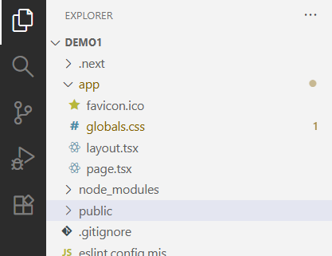</center>

:::warning

Pour respecter la convention de nommage en JavaScript / TypeScript, les noms de fichiers **ne doivent pas contenir de majuscules**.
Essayez de le garder à l'esprit, même si vous êtes habitués à la convention PascalCase en C#.

* ✅ Valides :
  * page.tsx
  * ma-super-classe.ts

* ⛔ À éviter :
  * Page.tsx
  * maSuperClasse.ts

:::

#### 🎨 globals.css

<center>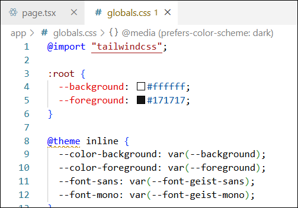</center>

`globals.css` regroupe les **styles CSS** qui s'appliquent à **tout le projet**. Éventuellement, nous verrons comment créer des styles qui s'appliqueront uniquement à certaines **parties** de notre HTML.

:::note

Certains éléments dans `globals.css` pourraient vous faire sourciller, voici des explications :
* Il y a des déclarations de **variables CSS** comme `--background` et `--foreground`.
* On retrouve l'usage de **variables CSS** déclarées ailleurs (dans `layout.tsx`), comme `--font-geist-sans` et `--font-geist-mono`.
* Il y a un `@theme`. (Syntaxe propre à la librairie `Tailwind`) Le thème déjà présent spécifie des **couleurs** et **polices**, qui seront utilisées par certaines classes de la librairie `Tailwind`.
* Un bloc `@media` qui cible les **thèmes sombres** : ceci existe déjà en CSS *ordinaire*, ça permet d'activer certains styles lorsqu'un utilisateur a activé le mode sombre dans son système d'exploitation.

:::

#### 📄 page.tsx

:::note

L'extension `.tsx` représente un fichier qui peut contenir du **TypeScript** et du **JSX**. (`.jsx` est elle-même une extension de fichier qui peut contenir du **JavaScript** et du **XML** / **HTML**. Bref, un fichier `.tsx` peut contenir du TypeScript et du HTML 😵)

:::

Pour le moment, sachez que le fichier `page.tsx` contient la fonction `Home()`, qui **retourne** le HTML affiché dans votre page Web Next.js. N'hésitez pas à modifier ce qu'il y a dans la fonction `Home()` pour modifier la page Web, comme ceci :

```tsx showLineNumbers
import Image from "next/image";

export default function Home() {
  return (
    <h2 className="text-4xl">Salut</h2>
  );
}
```

<center>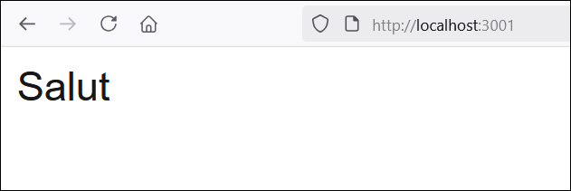</center>

Éventuellement, nous apprendrons à utiliser plusieurs **pages** en créant d'autres fichiers similaires à `page.tsx`.

#### 🖼 layout.tsx

`layout.tsx` est un fichier qui décrit le **squelette de la page Web**. (Avec des éléments comme `<html>`, `<body>`, etc. qui sont communs à toutes les pages Web)

<center>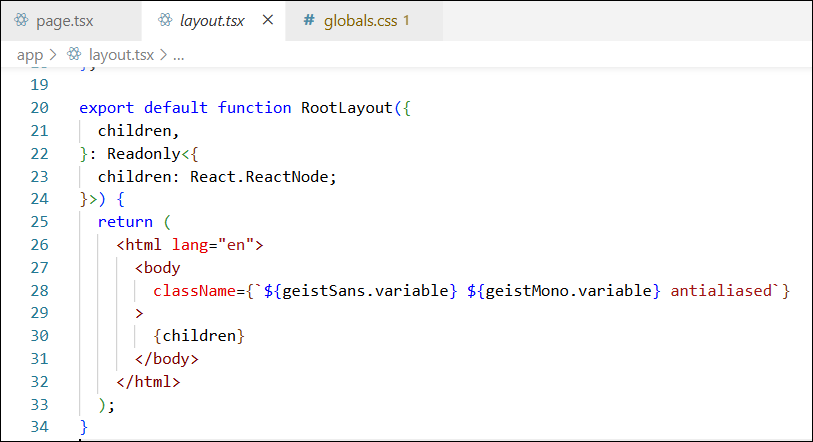</center>

Remarquez la variable nommée `metadata`, qui permet de configurer l'élément `<head>` du layout. **Next.js** va s'occuper de convertir ces données en un élément `<head>` qui sera intégré au layout.

```tsx showLineNumbers
export const metadata: Metadata = {
  title: "Create Next App",
  description: "Generated by create next app",
  // D'autres propriétés peuvent être ajoutées ici (comme authors, keywords, etc.)
};
```

Remarquez les variables nommées `geistSans` et `geistMono`, qui permettent de **charger des polices**. (Elles sont chargées ici plutôt que dans `globals.css` car le chargement de ces polices doit être fait avec **JavaScript**, donc c'est impossible dans un fichier **CSS**)

Ces variables sont tout de même utilisables dans le fichier `globals.css`. (Et elles y sont d'ailleurs déjà utilisées)

Notez que `subsets: ["latin"]` permet de seulement charger les caractères latins. (Pas besoin de charger les alphabets russes, grecs, arabes, japonais, etc. si on compte créer un site Web uniquement en français)

```tsx showLineNumbers
const geistSans = Geist({
  variable: "--font-geist-sans",
  subsets: ["latin"],
});

const geistMono = Geist_Mono({
  variable: "--font-geist-mono",
  subsets: ["latin"],
});
```

Finalement, le `{children}` dans le HTML retourné par la fonction `RootLayout()` indique où le HTML du fichier `page.tsx` sera **intégré** dans le layout. (C'est-à-dire à l'intérieur de l'élément `<body>`)

```tsx showLineNumbers
export default function RootLayout({
  children,
}: Readonly<{
  children: React.ReactNode;
}>) {
  return (
    <html lang="en">
      <body
        className={`${geistSans.variable} ${geistMono.variable} antialiased`}
      >
        {children}
      </body>
    </html>
  );
}
```

Nous n'aborderons pas le fonctionnement d'autres fichiers du projet pour le moment, mais ça viendra ! 🙈

### 🗃 Afficher une variable (un « état ») dans la page Web

:::warning

Prérequis : il faut ajouter l'instruction `'use client'` tout en haut de notre composant. L'utilité de cette instruction sera abordée plus tard.

```tsx showLineNumbers
'use client'; // Nécessaire

export default function Home(){

  ...

}
```

:::

Il est possible de déclarer des **états** (variables) dans un composant. (Par exemple, dans le fichier `page.tsx` qui existe par défaut)
Ci-dessous, on a déclaré deux **états** (`name` et `age`) :

```tsx showLineNumbers
'use client';

import { useState } from "react"; // Importation de useState

export default function Home() {
  
  // Deux variables :
  const [name, setName] = useState("Simone");
  const [age, setAge] = useState(37);

  return (
    ...
  );

}
```

:::tip

Il faudra souvent ajouter des **importations** dans nos composants pour pouvoir utiliser certains *bidules* comme `useState`. Lorsque vous avez du **rouge**, n'hésitez pas à faire un **clic gauche** sur le segment souligné en rouge, puis à utiliser le raccourci `Ctrl + .` pour faire apparaître le menu de suggestions, qui vous proposera généralement les **importations manquantes**. 

<center>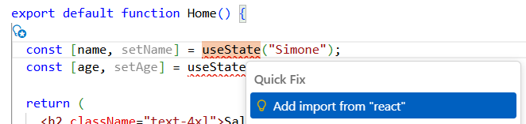</center>

:::

Pour afficher la valeur de ces états dans le **HTML** du composant, nous devrons utiliser
des **accolades** :

```tsx showLineNumbers
export default function Home() {

  const [name, setName] = useState("Simone");
  const [age, setAge] = useState(37);

  return (
    <h2 className="text-4xl">Salut {name}, vous avez {age} ans.</h2>
  );
}
```

<center>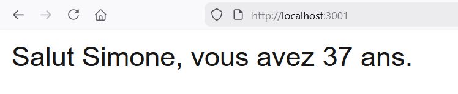</center>

:::note

Pour le moment, on n'a pas expliqué à quoi servent `setName` et `setAge`, mais vous avez sûrement une petite idée 🙄 Nous en reparlerons au prochain cours.

:::

### ✨ Afficher le résultat d'une fonction

On déclare une fonction (qui retourne quelque chose !) dans le composant et on affiche sa valeur retournée à l'aide d'**accolades** :

```tsx showLineNumbers
export default function Home() {

  // Fonction
  function displayValue() : number{
    return 67;
  }

  return (
      <p>Voici une valeur : {displayValue()}</p>
  );
}
```

<center>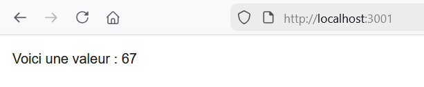</center>

### ⚱ Afficher un objet personnalisé

D'abord, créez une nouvelle classe en tentant de respecter ces indications :

* Son fichier aura l'extension `.ts` et sera en minuscules. (Convention JavaScript / TypeScript)
* Pour bien organiser votre projet, rangez cette classe dans le dossier `app`/`_types`.
* Le nom de la classe doit commencer par une majuscule. (C'est une convention aussi)

<center>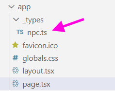</center>

Votre classe pourrait ressembler à ceci. Rappelez-vous que le mot-clé `public` peut être
utilisé pour simplifier la déclaration des propriétés de la classe. De plus, notez que
le mot-clé `export` est nécessaire pour que d'autres fichiers comme nos composants aient accès à la classe que nous déclarons.

```ts showLineNumbers
export class Npc{

    constructor(
        public name : string,
        public quote : string,
        public age : number
    ){}

}
```

Nous pourrons maintenant créer une instance de cette nouvelle classe personnalisée dans un composant. Vous aurez à **importer** la classe pour pouvoir l'utiliser.

<center>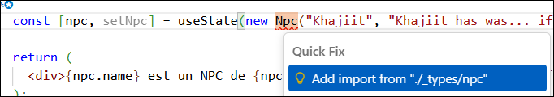</center>

Utilisez le **constructeur** de votre classe pour instancier un nouvel objet :

<center>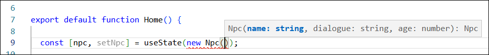</center>

Voici un exemple avec un **état** qui contient un `Npc` et l'affichage dans le **HTML** :

```ts showLineNumbers
import { Npc } from "./_types/npc";

export default function Home() {

  const [npc, setNpc] = useState(new Npc("Khajiit", "Khajiit has wares... if you have coin.", 176));

  return (
    <div>{npc.name} est un NPC de {npc.age} an(s) dont le dialogue est « {npc.quote} »</div>
  );
}

```

<center>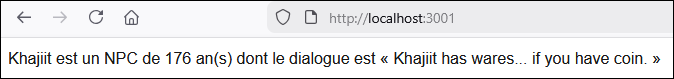</center>

### 📜 Afficher un tableau

En JavaScript (et donc en TypeScript), les tableaux ressemblent à `["chat", "chien", "perruche"]`, `[1, 5, 2, 4]`, `[true, false, false]`, etc.

Voici un exemple où un tableau est déclaré et affiché dans un composant :

```tsx showLineNumbers
export default function Home() {

  const [colors, setColors] = useState(["indigo", "cramoisi", "ocre"]);

  return (
    <div>
      <p>J'adore les couleurs suivantes ! Youpi !</p>
      <ul className="list-disc mx-5">
        <li>{colors[0]}</li>
        <li>{colors[1]}</li>
        <li>{colors[2]}</li>
      </ul>
    </div>
  );
}

```

<center>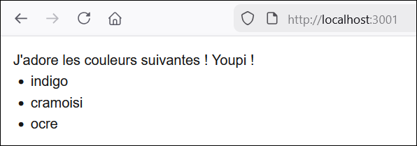</center>

:::note

Lors du Cours 2, nous verrons une méthode plus élégante pour afficher les éléments d'un tableau dans le HTML.

:::

### 🎨 Tailwind

Tel que mentionné plus haut, **Tailwind** est une **librairie CSS**. Son installation est suggérée, par défaut, lorsqu'on crée un projet **Next.js**. Nous allons l'utiliser docilement pour se plier aux standards de Next.js, mais gardez à l'esprit que c'est optionnel en dehors de ce cours !

:::info

> Pourquoi on n'utilise pas Bootstrap à la place ? 😠

**Bootstrap** est une librairie plutôt *invasive* qui engendre plusieurs incompatibilités avec d'autres librairies CSS / UI. Elle est relativement lourde et nécessite l'usage de `jQuery`. Ça reste un choix de librairie admissible, surtout si on ne compte utiliser aucune autre librairie CSS / UI.

:::

#### 📐 Styles *preflight*

Un ensemble de styles nommés `Preflight` sont appliqués par défaut dans les projets **Next.js**. Ils visent à **uniformiser les styles de bases** des navigateurs. (Par défaut, certains styles des navigateurs sont différents ! Ça veut dire que la même page Web pourrait être différente d'un navigateur à l'autre, alors Tailwind tente de mitiger cela)

* Les marges de nombreux éléments sont retirées. (Titres, paragraphes, listes, etc.)
* Les tailles de texte sont uniformisées. (Et oui, même les `<h1>` ont la même taille que les `<p>` !)
* Les bordures et fond sont retirés / uniformisés. (Les `<button>` et les `<input>` semblent identiques à un `<div>`)
* Les listes ne sont pas stylisées. (Pas de marge, pas de puces ou de numérotation, ...)
* Etc.

Bien entendu, avec **Tailwind** et / ou du CSS vanille, nous pourrons, au besoin, styliser tous ces éléments, avec l'avantage que ce soit uniformisé pour tous les navigateurs.

:::warning

**😳 Désactiver les styles Preflight**

Il est possible de désactiver les styles **Preflight** en modifiant le fichier `globals.css`. Il suffit de remplacer ceci ...

```css showLineNumbers
@import "tailwindcss";
```

... par ceci ...

```css showLineNumbers
@layer theme, base, components, utilities;
@import "tailwindcss/theme.css" layer(theme);
/* @import "tailwindcss/preflight.css" layer(base); */
@import "tailwindcss/utilities.css" layer(utilities);
```

En gros, on importe les mêmes choses qu'avant ... sauf les styles **Preflight** ! ( `@import "tailwindcss"` est un raccourci qui remplace ces 4 instructions)

Bien entendu, désactiver les styles **Preflight** n'est pas recommandé.

:::

#### 🖌 Classes Tailwind

La librairie **Tailwind** nous invite à n'écrire presque aucun CSS par nous-mêmes : à la place, il existe une **classe** pour à peu près tout. Le but sera de les appliquer, individuellement, à chaque élément dont on souhaite modifier le style. [Voir la documentation](https://tailwindcss.com/docs)

Voici quelques exemples :

<table>
<tr>
<th>Effet</th><th>Classes</th><th>Précisions</th>
</tr>
<tr>
<td>Alignement du texte</td><td>`text-left`, `text-center`, `text-right`, `text-justify`, etc.</td><td></td>
</tr>
<tr>
<td>Taille du texte</td><td>`text-xs`, `text-sm`, `text-base` (taille normale), `text-lg`, `text-xl`, `text-█xl`</td><td>Pour des tailles plus grandes que `text-xl`, utilisez `text-█xl` en remplaçant le █ par un nombre entier de 2 à 9.</td>
</tr>
<tr>
<td>Marges externes</td><td>`m-█` pour les 4 côtés<br/>`mx-█` pour horizontal<br/>`my-█` pour vertical<br/>`m-auto` pour centrer<br/>`mt-█` ou `mr-█` ou `mb-█` ou `ml-█` pour un côté précis</td><td>Remplacez █ par un nombre entier plus grand ou égal à 0</td>
</tr>
<tr>
<td>Marges internes (padding)</td><td>`p-█` pour les 4 côtés<br/>`px-█` pour horizontal<br/>`py-█` pour vertical<br/>`pt-█` ou `pr-█` ou `pb-█` ou `pl-█` pour un côté précis</td><td>Remplacez █ par un nombre entier plus grand ou égal à 0</td>
</tr>
<tr>
<td>Couleur du texte</td><td>`text-black`, `text-white`, `text-█-█`</td><td>Pour les couleurs autres que blanc et noir, il faut utiliser le [système de couleur de Tailwind](https://tailwindcss.com/docs/colors). Le premier █ est le nom d'une couleur (blue, red, gray, green, etc.) et le deuxième █ est un multiple de 100. (Maximum 900. Il existe aussi 50 et 950 pour une saturation/luminosité aux extrêmes. Un grand nombre veut dire foncé)</td>
</tr>
<tr>
<td>Couleur de fond</td><td>`bg-black`, `bg-white`, `bg-█-█`</td><td>^ Voir les explications de la cellule au-dessus ^</td>
</tr>
<tr>
<td>Couleur de bordure</td><td>`border-black`, `border-white`, `border-█-█`</td><td>^^ Voir les explications deux cellules plus haut ^^</td>
</tr>
<tr>
<td>Largeur de bordure</td><td>`border-█`</td><td>Remplacez █ par le nombre de pixels. (Sans écrire `px`)</td>
</tr>
<tr>
<td>Largeur</td><td>`w-full` pour 100%<br/>`w-FRACTION` pour un autre pourcentage<br/>`w-3xs`, `w-2xs`, `w-xs`, `w-sm`, `w-md`, `w-lg`, `w-xl`, `w-2xl`, `w-3xl`, etc. pour une variété de tailles.</td><td>`w-FRACTION` doit utiliser une *fraction* de votre choix comme `w-1/2`, `w-2/5`, etc.<br/>`w-3xs` correspond à 256px. `w-md` correspond à 448px, etc.</td>
</tr>
<tr>
<td>Hauteur</td><td>Comme pour la largeur, mais remplacez le `w` par un `h`</td><td>`h-FRACTION` doit utiliser une *fraction* de votre choix comme `h-1/2`, `h-2/5`, etc.</td>
</tr>
<tr>
<td>Listes</td><td>`list-disc` pour des puces<br/>`list-decimal` pour des numéros</td><td></td>
</tr>
<tr>
<td>Dédoublement des bordures d'un tableau (**border-collapse**)</td><td>`border-collapse`, `border-separate`</td><td>Qui, sur Terre, utilise `border-separate` ?</td>
</tr>
<tr>
<td>Type de bloc</td><td>`inline`, `block`, `inline-block`, `flex`, `grid`, etc.</td><td></td>
</tr>
<tr>
<td>Espacement horizontal dans une flexbox / grid</td><td>`justify-start`, `justify-end`, `justify-center`, `justify-between`, `justify-around`, etc.</td><td>À appliquer sur l'élément parent, pas sur les éléments enfants. Pour les éléments enfant, ce serait `justify-self-█`, où █ est la valeur au choix.</td>
</tr>
<tr>
<td>Alignement vertical dans une flexbox / grid</td><td>`items-start`, `items-end`, `items-center`, etc.</td><td>À appliquer sur l'élément parent, pas sur les éléments enfants. Pour les éléments enfant, ce serait `self-█`, où █ est la valeur au choix.</td>
</tr>
<tr>
<td>Espacements entre les items dans une flexbox / grid (**gap**)</td><td>`gap-█` pour tous côtés<br/>`gap-x-█` pour horizontal<br/>`gap-y-█` pour vertical</td><td>█ doit être remplacé par un nombre entier supérieur ou égal à 0.</td>
</tr>
<tr>
<td>Retour à la ligne dans une flexbox / grid (**wrap**)</td><td>`flex-wrap`, `flex-nowrap`</td><td></td>
</tr>
<tr>
<td>Largeur relative d'un item dans une flexbox / grid</td><td>`flex-█`</td><td>Doit être attribué à un élément enfant. █ doit être remplacé par un nombre entier supérieur ou égal à 1. Par exemple, si un enfant possède `flex-2`, il sera deux fois plus large qu'un enfant avec `flex-1`.</td>
</tr>
<tr>
<td>Largeur *absolue* d'un item dans une flexbox / grid (**flex-basis**)</td><td>`basis-full` pour 100%.<br/>`basis-FRACTION` pour une fraction.<br/>`basis-3xs`, `basis-2xs`, `basis-xs`, `basis-sm`, `basis-md`, `basis-lg`, `basis-xl`, `basis-2xl`, `basis-3xl`, etc. pour une variété de tailles.</td><td>`basis-FRACTION` doit utiliser une *fraction* de votre choix comme `basis-1/2`, `basis-2/5`, etc.<br/>`basis-3xs` correspond à 256px. `basis-md` correspond à 448px, etc.</td>
</tr>
<tr>
<td>Position</td><td>`static`, `relative`, `fixed`, `absolute`, `sticky`</td><td></td>
</tr>
<tr>
<td>Top / left / right / bottom</td><td>`top-█`, `bottom-█`, `left-█`, `right-█`</td><td>Remplacez █ par un nombre entier supérieur ou égal à 0. Ce n'est pas le nombre de pixels, mais bien une unité relative à l'espacement.</td>
</tr>
</table>


### 📂 Git

**Rappel** : N'hésitez pas à visiter [cette page](https://info.cegepmontpetit.ca/git) du site départemental pour 
retrouver les conventions de la technique en informatique en lien avec l'usage de Git.

Les adultes 👨👩 doivent utiliser Git. L'usage de Git sera évalué pour les quatres TPs du cours. 
Bien entendu, pour les laboratoires, vous pouvez vous contenter de OneDrive si vous êtes paresseux. (Pratiquez-vous au moins une fois
à utiliser Git avec Next.js avant le TP1, qui est juste après le labo 3 !)

:::warning

Si vous décidez d'opter pour OneDrive ou une clé USB, n'oubliez jamais de supprimer le dossier `node_modules` de votre
projet ! Sinon les transferts seront exponentiellement longs ! 🐳

:::

#### 🐣 Créer un repository avec un projet Next.js

Commencez par initialiser votre repository sur GitHub. (Pour pouvoir le cloner dans **Fork** 🔱 ensuite)

⛔ Assurez-vous qu'il soit privé !

<center>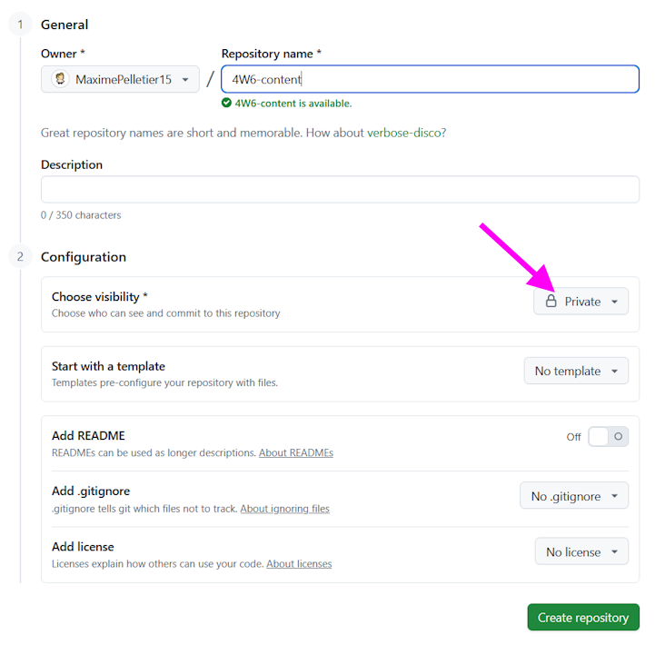</center>

Clonez le repository sur votre ordinateur à l'aide de son URL :

<center>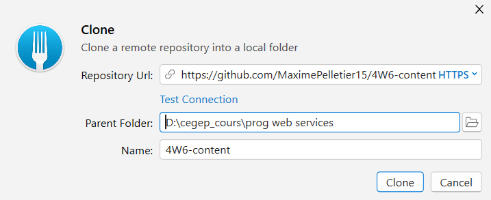</center>

Ensuitez, créez votre projet Next.js dans le repository à l'aide de la [commande désignée](/notes/rencontre1.1#-créer-un-projet-nextjs).

<center>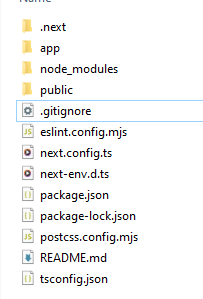</center>

Vous remarquerez que le projet Next.js est automatiquement muni d'un fichier `.gitignore`. Il est parfait
pour nos besoins car il permettra d'ignorer les documents lourds comme `node_modules`.

Vous pourrez donc faire un premier **commit** pour l'ajout initial du projet Next.js.

<center>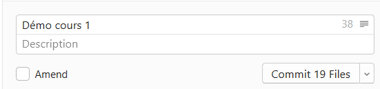</center>

On peut également faire son premier push.

<center>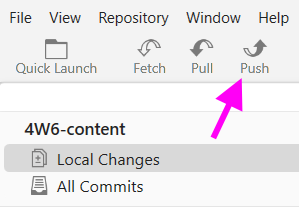</center>

#### 🐑🐑 Cloner un repo pour poursuivre son travail plus tard

Toutes les fois suivantes où vous **clonerez** votre repository, la première chose à faire ensuite sera d'utiliser la commande `npm install` dans votre projet Next.js pour générer le dossier `node_modules` ! Gardez à l'esprit que ce dossier sera toujours absent après avoir cloné un projet à cause du `.gitignore`.