# Cours 2 - Composant dynamique

:::warning

Dans de nombreux exemples à partir de ce cours, des classes personnelles sont utilisées à la place des classes **Tailwind** pour alléger le code HTML des exemples. C'est normal qu'en copiant certains exemples, l'apparence de vos pages Web soit un peu moins pétillant 🌶 !

:::

Ce cours aborde l'interaction entre le code TypeScript d'un composant et son code HTML.

* Changer un état
* Boucles (Afficher une liste / un tableau)
* Conditions
* Événements
* Formulaires

## ✏ Changer un état

Au **cours 1**, nous avions abordé les **états** (Variable qui peut être affichée dans le HTML d'un composant)

```tsx showLineNumbers
'use client';

import { useState } from "react";

export default function Home() {

  const [favoriteColor, setFavoriteColor] = useState("indigo"); // État
  const [daysWithoutWorkAccident, setDaysWithoutWorkAccident] = useState(0); // État

  return (
    <div className="m-2">
        <p>Salut. Tu aimes la couleur {favoriteColor}</p>
        <p>Il y a eu {daysWithoutWorkAccident} jour(s) sans accident au travail.</p>
    </div>
  );
}
```

<center>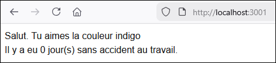</center>

Pour **modifier** la valeur d'un état, il faudra utiliser le `set...` de sa déclaration. Exemple :

```tsx showLineNumbers
function whateverFunction() : void{
  setFavoriteColor("cramoisi"); // favoriteColor vaudra maintenant "cramoisi"
  setDaysWithoutWorkAccident(daysWithoutWorkAccident + 1); // On augmente la valeur de 1
}
```

:::warning

⛔ Il est **impossible** de modifier un **état** comme ceci :

```tsx
favoriteColor = "cramoisi";
daysWithoutWorkAccident++;
```

:::

:::info

> Pourquoi est-ce aussi compliqué de manipuler des états ? 😠

Cette manière de procéder aide **React** à mettre à jour le rendu visuel de la page Web de façon **plus performante**, sans avoir à recompiler tous les états et tous les éléments de la page Web. Ce mode opératoire indique à React **qu'est-ce qui doit changer**.

Il existe toutefois des librairies comme **Immer** qui permet de simplifier certaines mutations d'état. Cela peut devenir une solution intéressante pour un projet avec des états particulièrement sophistiquées. (Ce qui sera rarement notre cas)

:::

### 😵 Changer une propriété dans un objet

Disons qu'on a l'état suivant, qui contient un **objet** :

```tsx
const [npc, setNpc] = useState(new Npc("Khajiit", "Khajiit has wares... if you have coin.", 176));
```

Pour modifier **la moindre propriété** de cet objet, il faudra malheureusement **le recréer en entier** !

```tsx showLineNumbers
function whateverFunction() : void{
  // On veut seulement augmenter son âge de 1 !
  setNpc(new Npc(npc.name, npc.dialog, npc.age + 1));
}
```

On voit qu'on a dû récupérer son ancien `name` et son ancienne `quote` en recréant l'objet.

:::warning

⛔ Encore une fois, il est **impossible** de modifier un **état** qui contient un objet comme ceci :

```tsx
npc.age = npc.age + 1;
```

(Ça compile, mais appeler la fonction ne changera rien dans la page, **visuellement**.)

:::

:::tip

✨ Il existe un raccourci pour ne pas avoir à remplir les propriétés **qu'on ne souhaitait pas changer** :

```tsx showLineNumbers
function whateverFunction() : void{
  setNpc({
    ...npc,            // On garde tout comme avant
    age : npc.age + 1  // sauf l'âge !
  });
}
```

Remarquez l'usage de `...npc` et l'usage d'accolades `{ ... }`.

:::

### 🗄 Changer un tableau

Que ce soit pour **ajouter**, **retirer** ou **modifier** une donnée dans un tableau, il faudra être minutieux également.

Disons qu'on a l'état suivant, qui contient un **tableau** 🥔🍟 :

```tsx showLineNumbers
const [ingredients, setIngredients] = useState(["patate", "huile d'olive", "sel"]);
```

:::warning

🚫 Malheureusement, il est **impossible** de faire les manipulations suivantes sur un **état** :

```tsx showLineNumbers
function whateverFunction() : void{
  ingredients.push("fécule de maïs"); // Code pour ajouter une donnée à la fin
  ingredients.pop();                  // Code pour retirer la dernière donnée
  ingredients.splice(0, 1);           // Code pour retirer la première donnée
  ingredients[0] = "courgette";       // Code pour modifier la première donnée
}
```

(En fait, ça compile, mais ça ne fonctionnera pas, visuellement, dans la page)

:::

#### ✅ Alternatives valides

**Ajouter** une donnée (remarquez `...ingredients` et les crochets `[ ... ]`) :

```tsx showLineNumbers
function whateverFunction() : void {
    setIngredients([
      ...ingredients,   // On conserve les données actuelles
      "fécule de maïs"  // et on ajoute celle-ci à la fin !
    ]);
}
```

**Retirer** une donnée :

```tsx showLineNumbers
function whateverFunction() : void {
    // On garde tout... sauf la dernière donnée
    setIngredients(ingredients.slice(0, ingredients.length - 1));

    // On garde tout... sauf la première donnée
    setIngredients(ingredients.slice(1, ingredients.length));

    // On garde tout... sauf une donnée à un index quelconque (i est l'index) 😵
    let i : number = 5;
    setIngredients(ingredients.slice(0, i).concat(ingredients.slice(i + 1, ingredients.length)));
}
```

**Modifier** une donnée :

```tsx showLineNumbers
function whateverFunction() : void {
    let ingredientsCopy : string[] = [...ingredients]; // Copier le tableau dans une variable locale
    ingredientsCopy[0] = "courgette";                  // Modifier une valeur

    setIngredients(ingredientsCopy);                   // Modifier l'état
  }
```

**Modifier** un **tableau d'objets**  :

```tsx showLineNumbers
const [npcs, setNpcs] = useState([
    new Npc("Ali", "Allo !", 19),
    new Npc("Bob", "Bonjour !", 23),
    new Npc("Camilo", "Ça va ?", 18)
]);

function whateverFunction(): void {
    let npcsCopy : Npc[] = [...npcs];       // Copier le tableau dans une variable locale
    npcsCopy[1].age++;                      // Modifier un objet

    setNpcs(npcsCopy);                      // Modifier l'état
}
```

## 🗄 Afficher une liste

### 👶 Exemple simple

Disons qu'on souhaite afficher une liste de longueur arbitraire dans la page Web de manière élégante ...

```tsx
const [ingredients, setIngredients] = useState(["patate", "huile d'olive", "sel"]);
```

Nous allons utiliser la fonction `map()` dans le HTML, qui sert à répéter une opération pour **chaque élément** du tableau :

```tsx showLineNumbers
return (
    <div className="m-2">
        <div className="text-2xl">Ingrédients</div>
        <ul className="list-disc mx-4">
            {ingredients.map(
                (i) => <li key={i}>{i}</li>
            )}
        </ul>
    </div>
);
```

<center>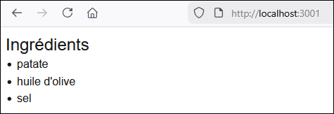</center>

Le morceau de code ci-dessous permet de créer un élément `<li>` pour **chaque donnée** du tableau **ingredients** :

```tsx
{ingredients.map(
    (i) => <li key={i}>{i}</li>
)}
```

* `i` représente chaque donnée du tableau, séquentiellement. (`"patate"`, puis `"huile d'olive"`, puis `"sel"`)
* `<li key={i}>{i}</li>` est l'élément HTML qui sera répété pour chaque donnée du tableau.
* `key` est un attribut **obligatoire** qui doit être rempli avec **une donnée unique** pour chaque élément du tableau. Comme c'est un simple tableau de `string`... chaque `string` lui-même servira de **key** unique.

:::tip

🤔 L'attribut `key` est **obligatoire** car React s'en sert pour **mettre à jour le rendu HTML** lorsqu'un élément du tableau change.

⚠ Si jamais votre liste ne possède aucune **key unique** pouvant identifier chaque donnée, vous pouvez utiliser `key={index}`, qui est moins performant, mais qui dépanne :

```tsx
const [ages, setAges] = useState([17, 18, 17, 19, 20, 18]); // Certaines valeurs se répètent ...
```

```tsx showLineNumbers
<ul className="list-disc mx-4">
    {ages.map(
        (i, index) => <li key={index}>{index} - {i}</li>
        // i contient chaque donnée.
        // index contient chaque ... index ! (0, 1, 2, etc.)
    )}
</ul>
```

<center>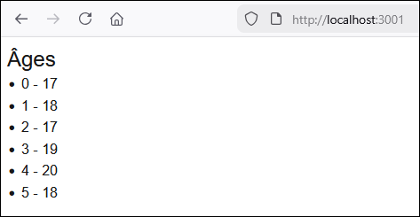</center>

:::

import Tabs from '@theme/Tabs';
import TabItem from '@theme/TabItem';

### 🧩 Exemple sophistiqué

Voici un exemple avec un objet personnalisé :

<Tabs>
    <TabItem value="class" label="Classe" default>
    ```ts showLineNumbers
    export class Npc{

        constructor(
            public name : string,
            public quote : string,
            public age : number | null
        ){}

    }
    ```
    </TabItem>
    <TabItem value="state" label="État">
    ```tsx showLineNumbers
    const [npcs, setNpcs] = useState([
        new Npc("Ali", "Allo !", 19),
        new Npc("Bob", "Bonjour !", 23),
        new Npc("Camilo", "Ça va ?", 18)
    ])
    ```
    </TabItem>
    <TabItem value="htmlTemplate" label="HTML">
    ```tsx showLineNumbers
    <ul className="list-disc mx-4">
        {npcs.map(
          (n) => <li key={n.name}>{n.name} a {n.age} an(s) et dit « {n.quote} »</li>
        )}
    </ul>
    ```
    </TabItem>
</Tabs>

<center>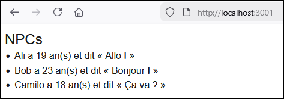</center>

## ✔ Affichage conditionnel

### 👶 Exemple simple

```tsx showLineNumbers
// Âge de l'utilisateur
const [userAge, setUserAge] = useState(18);

function displayButtons(){

  // Boutons pour les 18+
  if(userAge >= 18){
    return <div>
      <button className="bg-blue-500 text-white py-2 px-4 rounded-sm font-bold mr-2">Acheter des cigarettes 🚬</button>
      <button className="bg-blue-500 text-white py-2 px-4 rounded-sm font-bold">Acheter des briques 🧱</button>
    </div>;
  }
  // Boutons pour les 17-
  else{
    return <button className="bg-blue-500 text-white py-2 px-4 rounded-sm font-bold">Acheter des briques 🧱</button>;
  }
}

// Rendu HTML
return (
  <div className="m-2">
    {displayButtons()}
  </div>
);
```

Bien entendu, dans ce cas, puisque `userAge` est supérieur ou égal à 18, les deux boutons s'afficheront.

<center>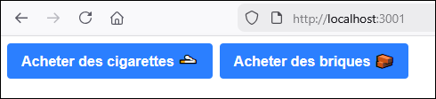</center>

:::tip

Il est également possible d'utiliser un *stratagème syntaxique* suivant la forme `booléen && expression` pour éviter d'avoir à créer une fonction :

```tsx showLineNumbers
return (
  <div className="m-2">
    {
      userAge >= 18 && <button className="bg-blue-500 text-white py-2 px-4 rounded-sm font-bold">Acheter des cigarettes 🚬</button>
    }
    <button className="bg-blue-500 text-white py-2 px-4 rounded-sm font-bold">Acheter des briques 🧱</button>
  </div>
);
```

Le résultat est identique : 
<center></center>

On peut utiliser une **condition ternaire** dans certaines situations (Quand on veut afficher une chose OU l'autre) :

```tsx showLineNumbers
return (
  <div className="m-2">
    <button className="bg-blue-500 text-white py-2 px-4 rounded-sm font-bold">
      { 
        userAge >= 18 ? <span>Acheter des cigarettes 🚬</span> : <span>Acheter des briques 🧱</span>
      }
    </button>
  </div>
);
```


:::

### 🧩 Exemple sophistiqué

Voici un exemple avec des objets personnalisés :

<Tabs>
    <TabItem value="class" label="Classe" default>
    ```ts showLineNumbers
    export class Youtuber{

        constructor(
            public name : string,
            public content : string,
            public age : number | null
        ){}

    }
    ```
    </TabItem>
    <TabItem value="componentClass" label="Composant" default>
```tsx showLineNumbers
const [youtubers, setYoutubers] = useState([
  new Youtuber("MotherSniperZz", "Call of Duty gaming", 16),
  new Youtuber("Ka$haStudioASMR", "ASMR", 24),
  new Youtuber("SussyBaka69", "NSFW", null),
  new Youtuber("Bl0ck4L1f3", "LEGO Collection", 47)
]);

// Ajouter l'émoji 😳 si le contenu est suspect
function isSussy(content : string){
  if(content == "ASMR" || content == "NSFW"){
    return <span>😳</span>;
  }
  else{
    return "";
  }
}

// Rendu HTML
return (
  <div className="m-2">
    <div className="text-2xl">Youtubeurs</div>
    <ul className="list-disc ml-4">
      {youtubers.map((y) =>
        <li key={y.name}>{y.name} ({y.age ?? '???'} ans) fait des vidéos sur le thème « {y.content} » {isSussy(y.content)}</li>
      )}
    </ul>
  </div>
);
```
    </TabItem>
</Tabs>

<center>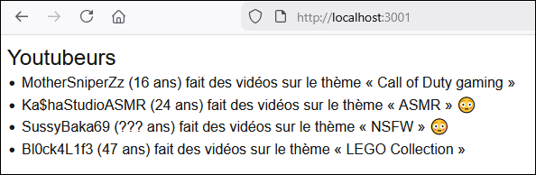</center>

:::info

L'opérateur `??` permet de choisir une valeur différente si jamais la propriété `y.age` est `null`. Ça a permis d'afficher `???` pour `SussyBaka69` puisque son âge est `null`

:::

:::tip

Dans la fonction `isSussy()`, on aurait également pu utiliser une condition ternaire, bien entendu. C'est pas mal plus léger :

```tsx showLineNumbers
function isSussy(content : string){
  return content == "ASMR" || content == "NSFW" ? <span>😳</span> : "";
}
```

Il est même possible d'intégrer directement la condition ternaire dans le rendu HTML (plus besoin de la fonction `isSussy()` !) :

```tsx showLineNumbers
<li key={y.name}>{y.name} ({y.age ?? '???'} ans) fait des vidéos sur le thème « {y.content} » {y.content == "ASMR" || y.content == "NSFW" ? <span>😳</span> : ""}</li>
```

:::

## 🖱 Événements

React nous simplifie la vie lorsqu'on souhaite intégrer des **écouteurs d'événements** à nos pages Web.

### 👶 Exemple simple

Par exemple, disons qu'on veut un bouton qui augmente un compteur de 1 et qu'on veut afficher ce compteur...

D'abord, créons un état pour stocker la valeur du compteur et une fonction qui permet d'incrémenter cet état.

```tsx showLineNumbers
const [x, setX] = useState(0);

function incrementX(){
  setX(x + 1);
}
```

Ensuite, dans le rendu HTML, on ajoute un écouteur d'événements de type `onClick` sur un bouton pour
appeler la fonction `incrementX()` à chaque fois que le bouton est **cliqué**.

```tsx showLineNumbers
return (
  <div className="m-2">
    <div>{x}</div>
    <button className="bg-blue-500 text-white py-2 px-4 rounded-sm font-bold" onClick={incrementX}>Incrémenter X</button>
  </div>
);
```

Résultat : Comme on affiche `{x}` dans la page Web, on peut voir la valeur de `x` évoluer dynamiquement
à chaque fois qu'on appuie sur le bouton.

<center>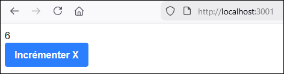</center>

:::warning

⛔ Dans un écouteur d'événements, il n'est pas possible d'appeler une fonction **avec paramètre(s)** comme ceci :

```tsx showLineNumbers
<button onClick={maFonction("param1", "param2")}>Clique-moi</button>
```

✅ Pour y arriver, il faut utiliser une **fonction anonyme** qui permet de contourner cette contrainte :

```tsx showLineNumbers
<button onClick={() => maFonction("param1", "param2")}>Clique-moi</button>
```

(Donc on a simplement ajouté `() =>` devant l'appel de la fonction)

:::

### 🧩 Exemple sophistiqué

Bien entendu, `onClick` n'est pas le seul type d'événement. N'hésitez pas à consulter [cette liste](https://www.w3schools.com/jsref/dom_obj_event.asp).

:::info

Si vous ne connaissez pas déjà les **template string**, voici un exemple :

```tsx
let nom = "Simone";
let moment = "jour";

// phrase contient "Hey ! Bonjour Simone"
let phrase = `Hey ! ${moment == "jour" ? "Bonjour" : "Bonsoir"} ${nom}`;
```

Notez qu'un **template string** est entouré d'**accents graves** `` ` ``

:::

Ci-dessous, nous avons trois boutons qui peuvent être **survolés** pour changer la classe d'un texte. Remarquez que l'état `textColor` est utilisé comme **classe** pour un **élément HTML** à l'aide d'un **template string**.

```tsx showLineNumbers
const [textColor, setTextColor] = useState("blueText");

function changeTextColor(color : string){
  setTextColor(color);
}

// Rendu HTML
return (
  <div className="m-2">
    <div className={`${textColor} mb-1`}>Ce texte peut changer de couleur</div>
    <button className="btn btn-blue mr-2" onMouseOver={() => changeTextColor('blueText')}>Bleu</button>
    <button className="btn btn-red mr-2" onMouseOver={() => changeTextColor('redText')}>Rouge</button>
    <button className="btn btn-yellow" onMouseOver={() => changeTextColor('yellowText')}>Jaune</button>
  </div>
);
```

<center>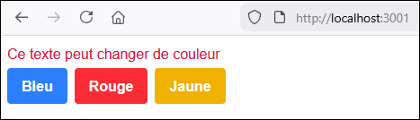</center>

CSS utilisé pour le texte :

```css showLineNumbers
.blueText{
  color:cornflowerblue;
}

.redText{
  color:crimson;
}

.yellowText{
  color:goldenrod;
}
```

## 📝 Formulaires


### ♊ Two-way binding

Il est possible d'associer un **état** du composant avec la valeur d'un élément `<input>` du HTML. C'est-à-dire que si
la valeur de l'**état** est modifiée dans le code TypeScript, la valeur de l'élément `<input>` sera modifiée également. De plus, si
l'utilisateur modifie la valeur dans l'élément `<input>`, la valeur de l'**état** changera également. (Bref, les deux valeurs sont **liées**)

On doit d'abord créer un **état** dans le composant.

```tsx
const [favoriteWord, setFavoriteWord] = useState("");
```

Puis, on prépare un `<input>` HTML :

```html
<input type="text" className="textInput" name="favoriteWord" placeholder="Mot préféré" />
```

Pour le moment, l'**état** et l'input HTML ne sont **pas liés du tout**. La prochaine étape concrétisera le _two way binding_.

Ajoutez l'événement `onChange` suivant et l'attribut `value` suivant :

```tsx
<input value={favoriteWord} onChange={(e) => setFavoriteWord(e.target.value)} type="text" className="textInput" name="favoriteWord" placeholder="Mot préféré" />
```

Désormais, l'**état** et l'input sont bel et bien liés : leur valeur sera toujours synchronisée, car **dès que l'`input` change, l'état changera aussi**. On peut tester visuellement
cette synchronisation en modifiant le HTML comme ceci :

```tsx showLineNumbers
const [favoriteWord, setFavoriteWord] = useState("");

return (
  <div className="m-2">
    <input value={favoriteWord} onChange={(e) => setFavoriteWord(e.target.value)}  type="text" className="textInput" name="favoriteWord" placeholder="Mot préféré" />
    <div>{favoriteWord}</div>
  </div>
);
```

Bien entendu, l'élément `<div>` contiendra toujours le même texte que l'input.

<center>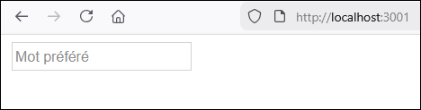</center>

<center>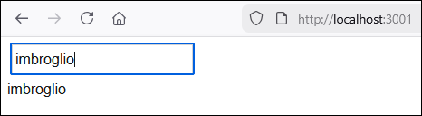</center>

Grâce à ce mécanisme, nous aurons facilement accès à la donnée fournie par l'utilisateur
dans l'état `favoriteWord`.

:::warning

Parfois, lorsqu'on implémente le **two-way binding**, **Next.js** lève une erreur 🐞 au sujet d'un *controlled input*. Si vous avez bel et bien fait les deux étapes du **two-way binding** (`value` et `onChange`), réactualisez la page Web et l'erreur devrait disparaître.

:::

### 🧩 Exemple de formulaire plus sophistiqué

Dans cet exemple, nous utiliserons une classe `Item` et nous permettrons à l'utilisateur d'ajouter plusieurs
items à son inventaire à l'aide d'un formulaire.

Voici la classe `Item` qui sera utilisée :

```ts showLineNumbers
export class Item{

    constructor(
        public name : string,
        public dateAdded : Date,
        public quantity : number,
        public isBroken : boolean
    ){}

}
```

Dans le composant, on a un **état** prêt à accueillir la donnée fournie par l'utilisateur
pour chacun des quatre champs et une liste qui contiendra tous les items créés par l'utilisateur :

```tsx showLineNumbers
const [name, setName] = useState<string>("");
const [dateAdded, setDateAdded] = useState<string>("");
const [quantity, setQuantity] = useState<number>(1);
const [isBroken, setIsBroken] = useState<boolean>(false);

const[items, setItems] = useState<Item[]>([]); // Tableau d'items vide
```

:::tip

`useState<T>()` permet de spécifier le **type** ( `T` ) d'un état. Dans ce cas-ci c'est uniquement essentiel pour `items` puisque le tableau est **vide** initialement et ne permet pas de témoigner du **type d'objets** qu'il contiendra. `Item[]` signifie **tableau d'`Item`**.

:::

Dans le HTML, on crée quatre `<input>` adaptés à chaque propriété et on utilise `onChange` et `value` pour faire
la liaison avec les **états**. Remarquez que les valeurs par défaut choisies pour les variables de
classe (nom `""`, date `""`, quantité à `1` et item *pas brisé*) se reflètent dans l'état initial du formulaire.

<Tabs>
    <TabItem value="html" label="Code HTML" default>
    ```tsx showLineNumbers
    Nom : <input type="text" value={name} onChange={(e) => setName(e.target.value)} className="textInput" />
    Date d'ajout : <input type="date" value={dateAdded}  onChange={(e) => setDateAdded(e.target.value)} className="textInput" />
    Quantité : <input type="number" value={quantity}  onChange={(e) => setQuantity(+e.target.value)} className="textInput" />
    Brisé ? : <input type="checkbox" checked={isBroken}  onChange={(e) => setIsBroken(e.target.checked)} className="textInput" />
    ```
    </TabItem>
    <TabItem value="ui" label="Page Web" default>
    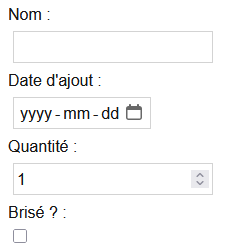
    </TabItem>
</Tabs>

:::info

Ci-dessus, l'opérateur `+` dans l'expression `setQuantity(+e.target.value)` permet de convertir le `string` du champ en `number`.

:::

Ensuite, sous le formulaire, on a besoin d'un bouton qui permettra à l'utilisateur de créer son item pour l'ajouter à la liste d'items :

```tsx
<button className="btn btn-blue" onClick={addItem}>Ajouter</button>
```

Nous allons devoir coder la fonction `addItem()` dans le composant. Elle va simplement créer un `new Item(...)`
à l'aide des données fournies par l'utilisateur. Ce nouvel item sera ajouté à la liste dans l'état `items` :

```tsx showLineNumbers
function addItem(){
  setItems([
    ...items,
    new Item(name, new Date(dateAdded), quantity, isBroken)
  ]);
}
```

Avant de tester, on prépare un affichage quelque part dans le HTML pour la liste d'items :

```tsx showLineNumbers
<ul className="list-disc ml-6 mb-5">
  {items.map((i) => <li key={i.name}>{i.quantity} x {i.name} (Obtenu le {i.dateAdded.toLocaleDateString()}) ({i.isBroken ? 'Brisé' : 'Intact'})</li>)}
</ul>
```

Voici le résultat final dans la page Web après avoir créé 3 items grâce au formulaire :

<center>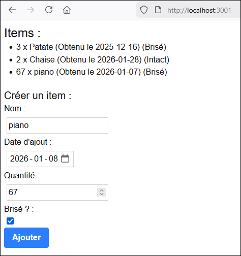</center>

**Code complet** :

```tsx showLineNumbers
const [name, setName] = useState<string>("");
const [dateAdded, setDateAdded] = useState<string>("");
const [quantity, setQuantity] = useState<number>(1);
const [isBroken, setIsBroken] = useState<boolean>(false);

const[items, setItems] = useState<Item[]>([]); // Tableau d'items vide

function addItem(){
  setItems([
    ...items,
    new Item(name, new Date(dateAdded), quantity, isBroken)
  ]);
}

return (
  <div className="m-2">
    <div className="text-2xl">Items :</div>
    <ul className="list-disc ml-6 mb-5">
      {items.map((i) => <li key={i.name}>{i.quantity} x {i.name} (Obtenu le {i.dateAdded.toLocaleDateString()}) ({i.isBroken ? 'Brisé' : 'Intact'})</li>)}
    </ul>
    <div className="text-xl">Créer un item : </div>
    Nom : <input type="text" value={name} onChange={(e) => setName(e.target.value)} className="textInput" />
    Date d'ajout : <input type="date" value={dateAdded}  onChange={(e) => setDateAdded(e.target.value)} className="textInput" />
    Quantité : <input type="number" value={quantity}  onChange={(e) => setQuantity(+e.target.value)} className="textInput" />
    Brisé ? : <input type="checkbox" checked={isBroken}  onChange={(e) => setIsBroken(e.target.checked)} className="textInput" />
    <button className="bg-blue-500 text-white py-2 px-4 rounded-sm font-bold" onClick={addItem}>Ajouter</button>
  </div>
);
```
