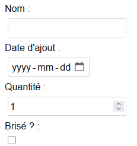

import ReactPreview from '@site/src/components/ReactPreview';
import statePage from '!!raw-loader!./_02-rencontre1.2/state-page.tsx';
import displayArrayPage from '!!raw-loader!./_02-rencontre1.2/display-array-page.tsx';
import displayArrayIndexPage from '!!raw-loader!./_02-rencontre1.2/display-array-index-page.tsx';
import displayConditionPage from '!!raw-loader!./_02-rencontre1.2/display-condition-page.tsx';
import displayArrayObjectPage from '!!raw-loader!./_02-rencontre1.2/display-array-object-page.tsx';
import npcClass from '!!raw-loader!./_02-rencontre1.2/npc-class.ts';
import displayConditionAndPage from '!!raw-loader!./_02-rencontre1.2/display-condition-and-page.tsx';
import displayConditionTernaryPage from '!!raw-loader!./_02-rencontre1.2/display-condition-ternary-page.tsx';
import displayConditionListPage from '!!raw-loader!./_02-rencontre1.2/display-condition-list-page.tsx';
import youtuberClass from '!!raw-loader!./_02-rencontre1.2/youtuber-class.ts';
import displayEventPage from '!!raw-loader!./_02-rencontre1.2/display-event-page.tsx';
import displayEventOverPage from '!!raw-loader!./_02-rencontre1.2/display-event-over-page.tsx';
import displayEventOverCss from '!!raw-loader!./_02-rencontre1.2/display-event-over.css';
import twoWayBindingPage from '!!raw-loader!./_02-rencontre1.2/two-way-binding-page.tsx';

:::warning

Dans de nombreux exemples à partir de ce cours, des classes personnelles sont utilisées à la place des classes **Tailwind** pour alléger le code HTML des exemples. C'est normal qu'en copiant certains exemples, l'apparence de vos pages Web soit un peu moins pétillant 🌶 !

:::

Ce cours aborde l'interaction entre le code TypeScript d'un composant et son code HTML.

* Changer un état
* Boucles (Afficher une liste / un tableau)
* Conditions
* Événements
* Formulaires

## ✏ Changer un état

Au **cours 1**, nous avions abordé les **états** (Variable qui peut être affichée dans le HTML d'un composant)

<ReactPreview code={statePage} previewHeight={75}/>
<NonVoyant>
  Le bac à sable affiche le code du composant à gauche et son résultat à droite.
  Résultat html = Salut. Tu aimes la couleur indigo. Il y a eu 0 jour(s) sans accident de travail.
  Le code de l'exemple peut être modifié : l'aperçu se met à jour tout seul.
</NonVoyant>

Pour **modifier** la valeur d'un état, il faudra utiliser le `set...` de sa déclaration. Exemple :

```tsx showLineNumbers
function whateverFunction() : void{
  setFavoriteColor("cramoisi"); // favoriteColor vaudra maintenant "cramoisi"
  setDaysWithoutWorkAccident(daysWithoutWorkAccident + 1); // On augmente la valeur de 1
}
```

:::warning

⛔ Il est **impossible** de modifier un **état** comme ceci :

```tsx
favoriteColor = "cramoisi";
daysWithoutWorkAccident++;
```

:::

:::info

> Pourquoi est-ce aussi compliqué de manipuler des états ? 😠

Cette manière de procéder aide **React** à mettre à jour le rendu visuel de la page Web de façon **plus performante**, sans avoir à recompiler tous les états et tous les éléments de la page Web. Ce mode opératoire indique à React **qu'est-ce qui doit changer**.

Il existe toutefois des librairies comme **Immer** qui permet de simplifier certaines mutations d'état. Cela peut devenir une solution intéressante pour un projet avec des états particulièrement sophistiqués. (Ce qui sera rarement notre cas)

:::

### 😵 Changer une propriété dans un objet

Disons qu'on a l'état suivant, qui contient un **objet** :

```tsx
const [npc, setNpc] = useState(new Npc("Khajiit", "Khajiit has wares... if you have coin.", 176));
```

Pour modifier **la moindre propriété** de cet objet, il faudra malheureusement **le recréer en entier** !

```tsx showLineNumbers
function whateverFunction() : void{
  // On veut seulement augmenter son âge de 1 !
  setNpc(new Npc(npc.name, npc.dialog, npc.age + 1));
}
```

On voit qu'on a dû récupérer son ancien `name` et son ancienne `quote` en recréant l'objet.

:::warning

⛔ Encore une fois, il est **impossible** de modifier un **état** qui contient un objet comme ceci :

```tsx
npc.age = npc.age + 1;
```

(Ça compile, mais appeler la fonction ne changera rien dans la page, **visuellement**.)

:::

:::tip

✨ Il existe un raccourci pour ne pas avoir à remplir les propriétés **qu'on ne souhaitait pas changer** :

```tsx showLineNumbers
function whateverFunction() : void{
  setNpc({
    ...npc,            // On garde tout comme avant
    age : npc.age + 1  // sauf l'âge !
  });
}
```

Remarquez l'usage de `...npc` et l'usage d'accolades `{ ... }`.

:::

### 🗄 Changer un tableau

Que ce soit pour **ajouter**, **retirer** ou **modifier** une donnée dans un tableau, il faudra être minutieux également.

Disons qu'on a l'état suivant, qui contient un **tableau** 🥔🍟 :

```tsx showLineNumbers
const [ingredients, setIngredients] = useState(["patate", "huile d'olive", "sel"]);
```

:::warning

🚫 Malheureusement, il est **impossible** de faire les manipulations suivantes sur un **état** :

```tsx showLineNumbers
function whateverFunction() : void{
  ingredients.push("fécule de maïs"); // Code pour ajouter une donnée à la fin
  ingredients.pop();                  // Code pour retirer la dernière donnée
  ingredients.splice(0, 1);           // Code pour retirer la première donnée
  ingredients[0] = "courgette";       // Code pour modifier la première donnée
}
```

(En fait, ça compile, mais ça ne fonctionnera pas, visuellement, dans la page)

:::

#### ✅ Alternatives valides

**Ajouter** une donnée (remarquez `...ingredients` et les crochets `[ ... ]`) :

```tsx showLineNumbers
function whateverFunction() : void {
    setIngredients([
      ...ingredients,   // On conserve les données actuelles
      "fécule de maïs"  // et on ajoute celle-ci à la fin !
    ]);
}
```

**Retirer** une donnée :

```tsx showLineNumbers
function whateverFunction() : void {
    // On garde tout... sauf la dernière donnée
    setIngredients(ingredients.slice(0, ingredients.length - 1));

    // On garde tout... sauf la première donnée
    setIngredients(ingredients.slice(1, ingredients.length));

    // On garde tout... sauf une donnée à un index quelconque (i est l'index) 😵
    let i : number = 5;
    setIngredients(ingredients.slice(0, i).concat(ingredients.slice(i + 1, ingredients.length)));
}
```

**Modifier** une donnée :

```tsx showLineNumbers
function whateverFunction() : void {
    let ingredientsCopy : string[] = [...ingredients]; // Copier le tableau dans une variable locale
    ingredientsCopy[0] = "courgette";                  // Modifier une valeur

    setIngredients(ingredientsCopy);                   // Modifier l'état
  }
```

**Modifier** un **tableau d'objets**  :

```tsx showLineNumbers
const [npcs, setNpcs] = useState([
    new Npc("Ali", "Allo !", 19),
    new Npc("Bob", "Bonjour !", 23),
    new Npc("Camilo", "Ça va ?", 18)
]);

function whateverFunction(): void {
    let npcsCopy : Npc[] = [...npcs];       // Copier le tableau dans une variable locale
    npcsCopy[1].age++;                      // Modifier un objet

    setNpcs(npcsCopy);                      // Modifier l'état
}
```

### ⌛ Nouvelle valeur retardée

⛔⛔⛔ En tout temps, lorsqu'on utilise le **setter** d'un **état**, gardez à l'esprit que l'état ne changera pas de valeur pour de vrai **tant que l'exécution du code ne sera pas terminée**. Exemple :

```tsx showLineNumbers
const [x, setX] = useState(3);

function someFunction(){

  setX(x + 1); // x va donc devenir 4
  console.log(x); // Imprime pourtant 3 !

}
```

Une fois que la fonction `someFunction()` sera terminée, c'est à ce moment que `x` contiendra vraiment `4`.

> Et si j'ai immédiatement besoin d'utiliser sa nouvelle valeur ?

Il faudra utiliser un stratagème simple comme celui-ci :

```tsx showLineNumbers
const [x, setX] = useState(3);

function someFunction(){

  const newX = x + 1; // Préparation de la nouvelle valeur (4)

  setX(newX); // x va donc devenir 4
  console.log(newX); // Imprime 4 ✅

}
```

:::danger

Cette contrainte ne va pas vous agacer pour le **laboratoire 2**, mais ça deviendra un défi récurrent **pour toute la session**, alors tentez de faire un *effort prononcé* pour vous en souvenir.

:::

## 🗄 Afficher une liste

### 👶 Exemple simple

Disons qu'on souhaite afficher une liste de longueur arbitraire dans la page Web de manière élégante ...

```tsx
const [ingredients, setIngredients] = useState(["patate", "huile d'olive", "sel"]);
```

Nous allons utiliser la fonction `map()` dans le HTML, qui sert à répéter une opération pour **chaque élément** du tableau :

<ReactPreview code={displayArrayPage} previewHeight={150} /> 
<NonVoyant>
  Le bac à sable affiche le code du composant, puis son résultat.
  Résultat html = Ingrédients, suivi d'une liste à puces : patate, huile d'olive, sel.
  Le code de l'exemple peut être modifié : l'aperçu se met à jour tout seul.
</NonVoyant>

Le morceau de code ci-dessous permet de créer un élément `<li>` pour **chaque donnée** du tableau **ingredients** :

```tsx
{ingredients.map(
    (i) => <li key={i}>{i}</li>
)}
```

* `i` représente chaque donnée du tableau, séquentiellement. (`"patate"`, puis `"huile d'olive"`, puis `"sel"`)
* `<li key={i}>{i}</li>` est l'élément HTML qui sera répété pour chaque donnée du tableau.
* `key` est un attribut **obligatoire** qui doit être rempli avec **une donnée unique** pour chaque élément du tableau. Comme c'est un simple tableau de `string`... chaque `string` lui-même servira de **key** unique.

:::tip

🤔 L'attribut `key` est **obligatoire** car React s'en sert pour **mettre à jour le rendu HTML** lorsqu'un élément du tableau change.

⚠ Si jamais votre liste ne possède aucune **key unique** pouvant identifier chaque donnée, vous pouvez utiliser `key={index}`, qui est moins performant, mais qui dépanne :

```tsx
const [ages, setAges] = useState([17, 18, 17, 19, 20, 18]); // Certaines valeurs se répètent ...
```

<ReactPreview code={displayArrayIndexPage} />
<NonVoyant>
  Le bac à sable affiche le code du composant, puis son résultat.
  Résultat html = Âges, suivi d'une liste à puces : 0 - 17, 1 - 18, 2 - 17, 3 - 19, 4 - 20, 5 - 18.
  Le code de l'exemple peut être modifié : l'aperçu se met à jour tout seul.
</NonVoyant>

:::

import Tabs from '@theme/Tabs';
import TabItem from '@theme/TabItem';

### 🧩 Exemple sophistiqué

Voici un exemple avec un objet personnalisé :

<ReactPreview
  code={displayArrayObjectPage}
  files={{ "/_types/npc.ts": npcClass }}
  previewHeight={160}
/>
<NonVoyant>
  Le bac à sable contient deux onglets : page.tsx (le composant, actif au départ)
  et npc.ts (la classe Npc, rangée dans le dossier _types).
  L'aperçu du résultat suit le code.
  Résultat html = NPCs, suivi d'une liste à puces :
  Ali a 19 an(s) et dit « Allo ! », Bob a 23 an(s) et dit « Bonjour ! »,
  Camilo a 18 an(s) et dit « Ça va ? ».
  Le code de l'exemple peut être modifié : l'aperçu se met à jour tout seul.
</NonVoyant>

## ✔ Affichage conditionnel

### 👶 Exemple simple

<ReactPreview code={displayConditionPage} previewHeight={75}/>

Bien entendu, dans ce cas, puisque `userAge` est supérieur ou égal à 18, les deux boutons s'afficheront.

<NonVoyant>
  Le bac à sable affiche le code du composant, puis son résultat.
  Résultat html = deux boutons : Acheter des cigarettes 🚬 et Acheter des briques 🧱.
  Le code de l'exemple peut être modifié : en remplaçant useState(18) par useState(17),
  l'aperçu n'affichera plus que le bouton Acheter des briques 🧱.
</NonVoyant>

:::tip

Il est également possible d'utiliser un *stratagème syntaxique* suivant la forme `booléen && expression` pour éviter d'avoir à créer une fonction :

<ReactPreview code={displayConditionAndPage} previewHeight={75}/>
<NonVoyant>
  Le bac à sable affiche le code du composant, puis son résultat.
  Résultat html = deux boutons : Acheter des cigarettes 🚬 et Acheter des briques 🧱.
  Le code de l'exemple peut être modifié : en remplaçant useState(18) par useState(17),
  l'aperçu n'affichera plus que le bouton Acheter des briques 🧱.
</NonVoyant>

Le résultat est identique.

On peut utiliser une **condition ternaire** dans certaines situations (Quand on veut afficher une chose OU l'autre) :

<ReactPreview code={displayConditionTernaryPage} previewHeight={75}/>
<NonVoyant>
  Le bac à sable affiche le code du composant, puis son résultat.
  Résultat html = un seul bouton : Acheter des cigarettes 🚬.
  Le code de l'exemple peut être modifié : en remplaçant useState(18) par useState(17),
  le même bouton affichera plutôt Acheter des briques 🧱.
</NonVoyant>


:::

### 🧩 Exemple sophistiqué

Voici un exemple avec des objets personnalisés :

<ReactPreview
  code={displayConditionListPage}
  files={{ "/_types/youtuber.ts": youtuberClass }}
/>
<NonVoyant>
  Le bac à sable contient deux onglets : page.tsx (le composant, actif au départ)
  et youtuber.ts (la classe Youtuber, rangée dans le dossier _types).
  L'aperçu du résultat suit le code.
  Résultat html = Youtubeurs, suivi d'une liste à puces :
  MotherSniperZz (16 ans) fait des vidéos sur le thème « Call of Duty gaming »,
  Ka$haStudioASMR (24 ans) fait des vidéos sur le thème « ASMR » 😳,
  SussyBaka69 (??? ans) fait des vidéos sur le thème « NSFW » 😳,
  Bl0ck4L1f3 (47 ans) fait des vidéos sur le thème « LEGO Collection ».
  Le code de l'exemple peut être modifié : l'aperçu se met à jour tout seul.
</NonVoyant>

:::info

L'opérateur `??` permet de choisir une valeur différente si jamais la propriété `y.age` est `null`. Ça a permis d'afficher `???` pour `SussyBaka69` puisque son âge est `null`

:::

:::tip

Dans la fonction `isSussy()`, on aurait également pu utiliser une condition ternaire, bien entendu. C'est pas mal plus léger :

```tsx showLineNumbers
function isSussy(content : string){
  return content == "ASMR" || content == "NSFW" ? <span>😳</span> : "";
}
```

Il est même possible d'intégrer directement la condition ternaire dans le rendu HTML (plus besoin de la fonction `isSussy()` !) :

```tsx showLineNumbers
<li key={y.name}>{y.name} ({y.age ?? '???'} ans) fait des vidéos sur le thème « {y.content} » {y.content == "ASMR" || y.content == "NSFW" ? <span>😳</span> : ""}</li>
```

:::

## 🖱 Événements

React nous simplifie la vie lorsqu'on souhaite intégrer des **écouteurs d'événements** à nos pages Web.

### 👶 Exemple simple

Par exemple, disons qu'on veut un bouton qui augmente un compteur de 1 et qu'on veut afficher ce compteur...

D'abord, créons un état pour stocker la valeur du compteur et une fonction qui permet d'incrémenter cet état.

```tsx showLineNumbers
const [x, setX] = useState(0);

function incrementX(){
  setX(x + 1);
}
```

Ensuite, dans le rendu HTML, on ajoute un écouteur d'événements de type `onClick` sur un bouton pour
appeler la fonction `incrementX()` à chaque fois que le bouton est **cliqué**.

<ReactPreview code={displayEventPage} previewHeight={95} />
<NonVoyant>
  Le bac à sable affiche le code du composant, puis son résultat.
  Résultat html = la valeur 0, suivie d'un bouton bleu Incrémenter X.
  Le bouton fonctionne : chaque clic augmente la valeur affichée de 1.
</NonVoyant>

Résultat : Comme on affiche `{x}` dans la page Web, on peut voir la valeur de `x` évoluer dynamiquement
à chaque fois qu'on appuie sur le bouton.

:::warning

⛔ Dans un écouteur d'événements, il n'est pas possible d'appeler une fonction **avec paramètre(s)** comme ceci :

```tsx showLineNumbers
<button onClick={maFonction("param1", "param2")}>Clique-moi</button>
```

✅ Pour y arriver, il faut utiliser une **fonction anonyme** qui permet de contourner cette contrainte :

```tsx showLineNumbers
<button onClick={() => maFonction("param1", "param2")}>Clique-moi</button>
```

(Donc on a simplement ajouté `() =>` devant l'appel de la fonction)

:::

### 🧩 Exemple sophistiqué

Bien entendu, `onClick` n'est pas le seul type d'événement. N'hésitez pas à consulter [cette liste](https://www.w3schools.com/jsref/dom_obj_event.asp).

:::info

Si vous ne connaissez pas déjà les **template string**, voici un exemple :

```tsx
let nom = "Simone";
let moment = "jour";

// phrase contient "Hey ! Bonjour Simone"
let phrase = `Hey ! ${moment == "jour" ? "Bonjour" : "Bonsoir"} ${nom}`;
```

Notez qu'un **template string** est entouré d'**accents graves** `` ` ``

:::

Ci-dessous, nous avons trois boutons qui peuvent être **survolés** pour changer la classe d'un texte. Remarquez que l'état `textColor` est utilisé comme **classe** pour un **élément HTML** à l'aide d'un **template string**.

<ReactPreview code={displayEventOverPage} css={displayEventOverCss} previewHeight={95} />
<NonVoyant>
  Le bac à sable contient deux onglets : page.tsx (le composant, actif au départ)
  et globals.css (les classes de couleur du texte). L'aperçu du résultat suit le code.
  Résultat html = le texte « Ce texte peut changer de couleur », suivi de trois boutons :
  Bleu, Rouge et Jaune.
  Les boutons fonctionnent : survoler un bouton change la couleur du texte.
</NonVoyant>

## 📝 Formulaires

### ♊ Two-way binding

Il est possible d'associer un **état** du composant avec la valeur d'un élément `<input>` du HTML. C'est-à-dire que si
la valeur de l'**état** est modifiée dans le code TypeScript, la valeur de l'élément `<input>` sera modifiée également. De plus, si
l'utilisateur modifie la valeur dans l'élément `<input>`, la valeur de l'**état** changera également. (Bref, les deux valeurs sont **liées**)

On doit d'abord créer un **état** dans le composant.

```tsx
const [favoriteWord, setFavoriteWord] = useState("");
```

Puis, on prépare un `<input>` HTML :

```html
<input type="text" className="textInput" name="favoriteWord" placeholder="Mot préféré" />
```

Pour le moment, l'**état** et l'input HTML ne sont **pas liés du tout**. La prochaine étape concrétisera le _two way binding_.

Ajoutez l'événement `onChange` suivant et l'attribut `value` suivant :

```tsx
<input value={favoriteWord} onChange={(e) => setFavoriteWord(e.target.value)} type="text" className="textInput" name="favoriteWord" placeholder="Mot préféré" />
```

Désormais, l'**état** et l'input sont bel et bien liés : leur valeur sera toujours synchronisée, car **dès que l'`input` change, l'état changera aussi**. On peut tester visuellement
cette synchronisation en modifiant le HTML comme ceci :

<ReactPreview code={twoWayBindingPage} previewHeight={95} />
<NonVoyant>
  Le bac à sable affiche le code du composant, puis son résultat.
  Résultat html = un champ de texte vide portant l'invite « Mot préféré », suivi d'une ligne vide.
  Le champ fonctionne : le texte saisi s'affiche aussitôt sur la ligne en dessous.
</NonVoyant>

Bien entendu, l'élément `<div>` contiendra toujours le même texte que l'input.

Grâce à ce mécanisme, nous aurons facilement accès à la donnée fournie par l'utilisateur
dans l'état `favoriteWord`.

:::warning

Parfois, lorsqu'on implémente le **two-way binding**, **Next.js** lève une erreur 🐞 au sujet d'un *controlled input*. Si vous avez bel et bien fait les deux étapes du **two-way binding** (`value` et `onChange`), réactualisez la page Web et l'erreur devrait disparaître.

:::

### 🧩 Exemple de formulaire plus sophistiqué

Dans cet exemple, nous utiliserons une classe `Item` et nous permettrons à l'utilisateur d'ajouter plusieurs
items à son inventaire à l'aide d'un formulaire.

Voici la classe `Item` qui sera utilisée :

```ts showLineNumbers
export class Item{

    constructor(
        public name : string,
        public dateAdded : Date,
        public quantity : number,
        public isBroken : boolean
    ){}

}
```

Dans le composant, on a un **état** prêt à accueillir la donnée fournie par l'utilisateur
pour chacun des quatre champs et une liste qui contiendra tous les items créés par l'utilisateur :

```tsx showLineNumbers
const [name, setName] = useState<string>("");
const [dateAdded, setDateAdded] = useState<string>("");
const [quantity, setQuantity] = useState<number>(1);
const [isBroken, setIsBroken] = useState<boolean>(false);

const[items, setItems] = useState<Item[]>([]); // Tableau d'items vide
```

:::tip

`useState<T>()` permet de spécifier le **type** ( `T` ) d'un état. Dans ce cas-ci c'est uniquement essentiel pour `items` puisque le tableau est **vide** initialement et ne permet pas de témoigner du **type d'objets** qu'il contiendra. `Item[]` signifie **tableau d'`Item`**.

:::

Dans le HTML, on crée quatre `<input>` adaptés à chaque propriété et on utilise `onChange` et `value` pour faire
la liaison avec les **états**. Remarquez que les valeurs par défaut choisies pour les variables de
classe (nom `""`, date `""`, quantité à `1` et item *pas brisé*) se reflètent dans l'état initial du formulaire.

<Tabs>
    <TabItem value="html" label="Code HTML" default>
    ```tsx showLineNumbers
    Nom : <input type="text" value={name} onChange={(e) => setName(e.target.value)} className="textInput" />
    Date d'ajout : <input type="date" value={dateAdded}  onChange={(e) => setDateAdded(e.target.value)} className="textInput" />
    Quantité : <input type="number" value={quantity}  onChange={(e) => setQuantity(+e.target.value)} className="textInput" />
    Brisé ? : <input type="checkbox" checked={isBroken}  onChange={(e) => setIsBroken(e.target.checked)} className="textInput" />
    ```
    </TabItem>
    <TabItem value="ui" label="Page Web" default>
    
    </TabItem>
</Tabs>

:::info

Ci-dessus, l'opérateur `+` dans l'expression `setQuantity(+e.target.value)` permet de convertir le `string` du champ en `number`.

:::

Ensuite, sous le formulaire, on a besoin d'un bouton qui permettra à l'utilisateur de créer son item pour l'ajouter à la liste d'items :

```tsx
<button className="btn btn-blue" onClick={addItem}>Ajouter</button>
```

Nous allons devoir coder la fonction `addItem()` dans le composant. Elle va simplement créer un `new Item(...)`
à l'aide des données fournies par l'utilisateur. Ce nouvel item sera ajouté à la liste dans l'état `items` :

```tsx showLineNumbers
function addItem(){
  setItems([
    ...items,
    new Item(name, new Date(dateAdded), quantity, isBroken)
  ]);
}
```

Avant de tester, on prépare un affichage quelque part dans le HTML pour la liste d'items :

```tsx showLineNumbers
<ul className="list-disc ml-6 mb-5">
  {items.map((i) => <li key={i.name}>{i.quantity} x {i.name} (Obtenu le {i.dateAdded.toLocaleDateString()}) ({i.isBroken ? 'Brisé' : 'Intact'})</li>)}
</ul>
```

Voici le résultat final dans la page Web après avoir créé 3 items grâce au formulaire :

<center></center>

**Code complet** :

```tsx showLineNumbers
const [name, setName] = useState<string>("");
const [dateAdded, setDateAdded] = useState<string>("");
const [quantity, setQuantity] = useState<number>(1);
const [isBroken, setIsBroken] = useState<boolean>(false);

const[items, setItems] = useState<Item[]>([]); // Tableau d'items vide

function addItem(){
  setItems([
    ...items,
    new Item(name, new Date(dateAdded), quantity, isBroken)
  ]);
}

return (
  <div className="m-2">
    <div className="text-2xl">Items :</div>
    <ul className="list-disc ml-6 mb-5">
      {items.map((i) => <li key={i.name}>{i.quantity} x {i.name} (Obtenu le {i.dateAdded.toLocaleDateString()}) ({i.isBroken ? 'Brisé' : 'Intact'})</li>)}
    </ul>
    <div className="text-xl">Créer un item : </div>
    Nom : <input type="text" value={name} onChange={(e) => setName(e.target.value)} className="textInput" />
    Date d'ajout : <input type="date" value={dateAdded}  onChange={(e) => setDateAdded(e.target.value)} className="textInput" />
    Quantité : <input type="number" value={quantity}  onChange={(e) => setQuantity(+e.target.value)} className="textInput" />
    Brisé ? : <input type="checkbox" checked={isBroken}  onChange={(e) => setIsBroken(e.target.checked)} className="textInput" />
    <button className="bg-blue-500 text-white py-2 px-4 rounded-sm font-bold" onClick={addItem}>Ajouter</button>
  </div>
);
```
