# Cours 3 - Requêtes HTTP

✅ Une application Web client **Next.js** peut :

* Gérer tout le côté visuel du site Web.
* Gérer le routage (illusion de « changement de page »)
* Rendre une page Web dynamique à l'aide de JavaScript.
* Gérer l'internationalisation / i18n / la traduction.
* Etc.

🛑 Une application Web cliente **Next.js** **ne doit pas** :

* Se connecter directement à une base de données pour obtenir les
données à afficher. (Vidéos 📽, images 🖼, messages 📃, etc)

Puisque l'application **Next.js** est exécutée sur l'ordinateur du client (de l'utilisateur),
**tout le code HTML, CSS et JavaScript est accessible par nos utilisateurs**. 🙈😩 Donc si
on inclut des identifiants pour se connecter à une base de données... la sécurité
de notre base de données sera compromise.

<center>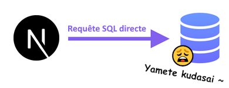</center>

> Oui mais si on utilise seulement des identifiants permettant de faire des SELECT sur certaines tables précises ?

À un certain moment, il faudra faire de la **gestion utilisateurs**, permettre d'ajouter du contenu sur le site Web
(commentaires, articles, vidéos, images, etc... donc des **INSERT** dans la base de données !), etc. Donc il va
falloir qu'une autre application (qui n'est pas un projet **Angular**) s'en occupe.

À partir de la **semaine 8**, nous créerons un **serveur Web ASP.NET Core** nous-mêmes, mais pour le moment, nous allons
envoyer des requêtes à des **serveurs Web existants** pour obtenir des données à afficher dans nos applications Web.

:::note

En fait, il est possible d'utiliser **Next.js** comme une application **serveur** dans certains cas, ce qui rendrait sécuritaire des interactions avec une base de données. Nous en rediscuterons plus tard.

:::

## 🌐 Exemple d'API Web

:::info

Beaucoup d'API Web (serveurs Web auxquel on peut envoyer des requêtes) sont payants 💲, mais il en existe de nombreux qui
sont gratuits 🗿 ou partiellement gratuits et auxquels nous pourrons envoyer des requêtes HTTP en échange de données à 
des fins d'apprentissage.

:::

[**Last FM**](https://www.last.fm/fr/) est une webradio et un site Web qui propose des données en lien avec la musique.

**Last FM** met à notre disposition une **API** (un serveur Web avec lequel nous pourrons interagir) auquel on peut envoyer
des **requêtes HTTP** pour obtenir des **données** sour format **JSON** ou **XML** pour ensuite utiliser ces données pour 
meubler les pages Web de notre application Next.js.

<center></center>

Rendez-vous à [cette page](https://www.last.fm/api/intro) pour accéder à la documentation qui décrit toutes les **requêtes disponibles**
avec **Last FM**.

<center>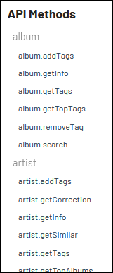</center>

Par exemple, si je souhaite obtenir des informations sur un album en particulier, la requête nommée `album.getInfo` risque
de répondre à mes besoins.

<center>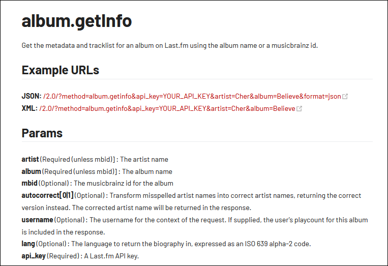</center>

Last FM nous fournit un exemple d'URL complète pour cette requête :

`http://ws.audioscrobbler.com/2.0/?method=album.getinfo&api_key=YOUR_API_KEY&artist=Cher&album=Believe&format=json`

On voit que l'artiste utilisé dans l'exemple fourni est `Cher` et l'album est `Believe`.

La seule chose qu'il resterait à faire pour que cette requête soit fonctionnelle, c'est de remplacer `YOUR_API_KEY` par
une **clé d'API**. Il est possible d'en obtenir une en créant un **compte Last FM**, mais je vous en fournis une ~~car vous êtes paresseux~~
pour vous simplifier la vie.

🔑 Clé d'API : `9a8a3facebbccaf363bb9fd68fa37abf`

On peut même essayer la requête directement dans la barre d'adresse d'un navigateur (L'affichage avec Firefox 🔥🦊 est le plus clair) :

<center>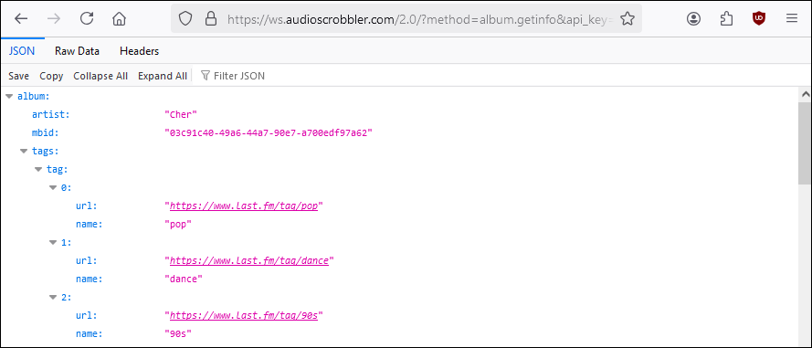</center>

Ce qu'on voit présentement est un **objet JSON**. Nous allons pouvoir extraire des données (liste de chansons, genre, nom de l'album, etc.)
de notre choix afin de les afficher dans notre application Angular. Tout ceci sera automatisé avec du code **TypeScript** dans notre
application.

## ✈ Envoyer une requête

🔽📦 Nous allons d'abord installer `Axios`, une librairie qui simplifie l'envoi de requête : `npm install axios`.

:::note

Il est possible d'envoyer des requêtes sans installer de librairie supplémentaire en utilisant `Fetch API`, mais `Axios` propose quelques fonctionnalités supplémentaires qui rendront notre expérience plus confortable au fil de la session.

:::

Si on utilise l'URL de la requête qui a été abordé un peu plus haut, ça pourrait ressembler à ceci dans un composant quelconque :

```tsx showLineNumbers
async function getData(){

  const response = await axios.get("http://ws.audioscrobbler.com/2.0/?method=album.getinfo&api_key=9a8a3facebbccaf363bb9fd68fa37abf&artist=Cher&album=Believe&format=json")
  console.log(response.data);

}
```

🔍 Avant de jeter un coup d'oeil à ce que `console.log(response.data)` a imprimé dans la console du navigateur, abordons quelques
éléments clés de cette fonction :

* On voit que l'URL de la requête (`"http://ws.audioscrobbler....."`) a été glissé dans la fonction `get()`.
* La fonction `get()` permet d'envoyer des requêtes HTTP de type `GET`. (Exemples d'autres types de requête : `post`, `put`, `delete`, etc.)
* La constante `reponse` contient les données reçues en **JSON**.
* On remarque les éléments `async` et `await`, qui seront expliqués en détails plus loin.

Dans la console du navigateur où la fonction `getData()` a été appelée, on peut apercevoir ceci suite à l'appel de
`console.log(response.data)` :

<center>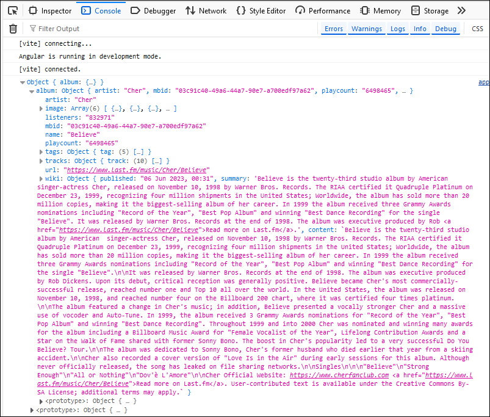</center>

C'est le même **objet JSON** que lorsque nous avions directement testé la requête dans la barre d'adresse du navigateur.
Cependant, cette fois-ci, l'objet JSON a été stocké dans la variable `reponse` ! On pourrait donc accéder à toutes les données
de l'objet JSON en manipulant `reponse.data`. (`response` ne contient pas seulement les données, mais aussi d'autres méta-données sur la requête HTTP)

## 📝 Extraire des données de l'objet JSON

Disons qu'on souhaite afficher le **nom de l'artiste** et le **titre de l'album** :

<center>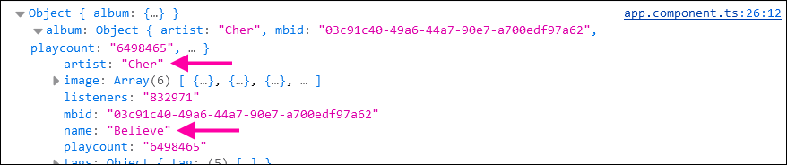</center>

Voici comment on pourrait extraire ces données dans le code :

```tsx showLineNumbers
async getData(){

  const response = await axios.get("http://ws.audioscrobbler.com/2.0/?method=album.getinfo&api_key=9a8a3facebbccaf363bb9fd68fa37abf&artist=Cher&album=Believe&format=json")
  console.log(response.data);

  let nomArtiste : string = response.data.album.artist; // Contient "Cher"
  let nomAlbum : string = response.data.album.name; // Contient "Believe"

}
```

Pour déterminer le chemin (Exemple : `response.data.album.artist`) vers une donnée à extraire, il faut partir de la racine
de **l'objet JSON** et descendre dans sa hiérarchie jusqu'à la propriété voulue.

<center>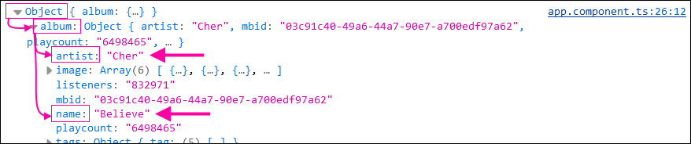</center>
<br/>
> Pourquoi le chemin utilisé dans le code n'est pas `response.data.Object.album.artist` ?

Comme les données ont été rangées dans `response.data` dans le code, et que `Object` n'est qu'un
_placeholder_ pour représenter la **racine** de l'objet JSON, on doit simplement utiliser `response.data` lorsqu'on parle de la racine.

:::warning

Faites bien attention lorsque vous accédez à des données dans **l'objet JSON**, car cela peut facilement générer des **exceptions** 🐞 si on essaye d'accéder à des sous-propriétés **qui n'existent pas**.

Par exemple, `response.data.bruh.six.seven` n'existe pas dans l'objet JSON reçu.

:::

#### 🧩 Extraire une donnée un peu plus enfouie

Disons qu'on souhaite extraire l'URL de l'image de taille `medium` pour la glisser dans un élément `` plus tard :

<center>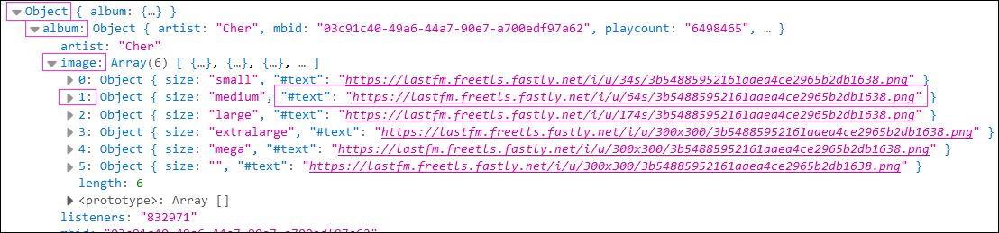</center>

C'est un peu plus pimenté 🌶 puisqu'il y a un tableau impliqué (nommé `image`) et le *damné* caractère `#` dans le nom de la propriété `#text`.

Voici comment extraire la propriété `#text` :

```ts showLineNumbers
async getSongs(){
  
  const response = await axios.get("http://ws.audioscrobbler.com/2.0/?method=album.getinfo&api_key=9a8a3facebbccaf363bb9fd68fa37abf&artist=Cher&album=Believe&format=json")
  console.log(response.data);

  let urlImageMedium : string = response.data.album.image[1]["#text"];

}
```
<br/>
> Pourquoi ce n'est pas plutôt `response.data.album.image[1].#text` ?

S'il n'y avait pas eu le caractère `#` dans le nom de la propriété `text`, cela aurait été possible d'utiliser `response.data.album.image[1].text` !
Hélas, `#` est un symbole spécial délicat et pour pouvoir l'utiliser dans le nom d'une propriété, il faut absolument remplacer la syntaxe
`.nomPropriété` par `["nomPropriété"]` pour ne pas que le symbole `#` cause un problème.

## 🎨 Intégration des données dans la page Web

Faisons le nécessaire pour pouvoir afficher les données que nous avons extraites de **l'objet JSON** dans la page Web.

#### 1 - 📦 Préparer des états pour stocker les données à afficher

```tsx showLineNumbers
export default function Home() {

  const [artistName, setArtistName] = useState("");
  const [albumName, setAlbumName] = useState("");
  const [imageUrl, setImageUrl] = useState<string | null>(null);

  ...

}
```

#### 2 - 🚚 Ranger les données extraites dans ces états

```tsx showLineNumbers
async function getData() {

  const response = await axios.get("http://ws.audioscrobbler.com/2.0/?method=album.getinfo&api_key=9a8a3facebbccaf363bb9fd68fa37abf&artist=Cher&album=Believe&format=json")
  console.log(response.data);

  setArtistName(response.data.album.artist);
  setAlbumName(response.data.album.name);
  setImageUrl(response.data.album.image[1]["#text"]);

}
```

#### 3 - 🖼 Afficher les états dans le HTML

(Vous remarquerez également un `div` **cliquable** qui permet de **lancer** la requête)

```html showLineNumbers
<div className="text-xl" onClick={getData}>Obtenir les données</div>
<p>Artiste : {artistName}</p>
<p>Album : {albumName}</p>
{imageUrl != null && }
```

<center>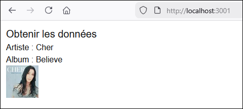</center>

## 📜 Extraire un tableau de données

Disons que je souhaite extraire la liste des chansons de **l'objet JSON** (Le titre et la durée en secondes pour
chaque chanson) ...

<center>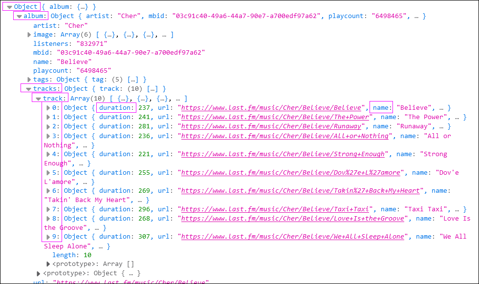</center>

#### ⚱ 1 - Préparer un model (au besoin)

```ts showLineNumbers
export class Song{

    constructor(
        public name : string,
        public duration : number
    ){}

}
```

#### 📦 2 - Préparer un tableau pour y ranger les données

```ts showLineNumbers
export default function Home() {

  const [artistName, setArtistName] = useState("");
  const [albumName, setAlbumName] = useState("");
  const [imageUrl, setImageUrl] = useState<string | null>(null);
  const [songs, setSongs] = useState<Song[]>([]); // Initialisé avec un tableau vide

  ...
}
```

#### 🔬 3 - Extraire les données de l'objet JSON

```tsx showLineNumbers
async function getData() {

  const response = await axios.get("http://ws.audioscrobbler.com/2.0/?method=album.getinfo&api_key=9a8a3facebbccaf363bb9fd68fa37abf&artist=Cher&album=Believe&format=json")
  console.log(response.data);

  setArtistName(response.data.album.artist);
  setAlbumName(response.data.album.name);
  setImageUrl(response.data.album.image[1]["#text"]);

  // On prépare une nouvelle liste vide
  let songList : Song[] = [];

  // Pour chaque chanson de l'album, on ajoute une new Song() dans songList
  for(let s of response.data.album.tracks.track){
    songList.push(new Song(s.name, s.duration));
  }

  // On met songList dans l'état songs.
  setSongs(songList);

}
```

En gros, on a une boucle _foreach_ qui parcourt le tableau dans l'objet JSON. Chaque enregistrement du tableau
est consécutivement représenté par la variable `s` dans la boucle. Il reste donc juste à accéder à chacune
des sous-propriétés `name` et `duration` pour remplir notre état `songs`.

<center>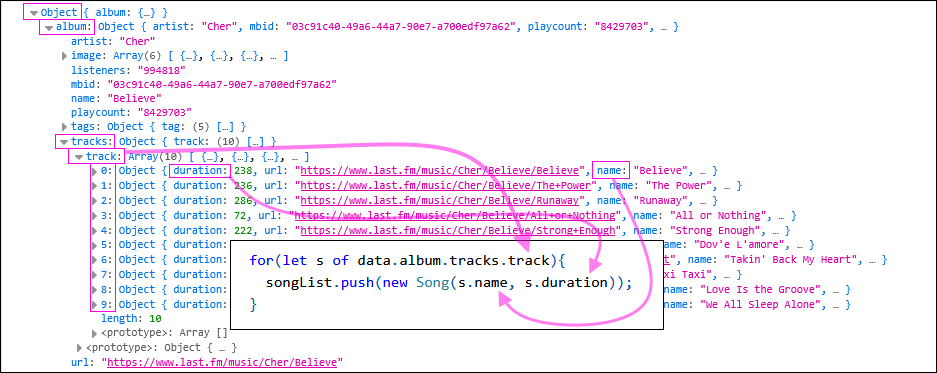</center>

:::warning

> Pourquoi ne pas avoir appelé `setState` dans la boucle `for` ? Ça aurait permis de ne pas avoir à créer un **tableau temporaire**.

```tsx showLineNumbers
for(let s of response.data.album.tracks.track){

  // Ceci ne fonctionne pas !
  setSongs([
    ...songs, 
    new Song(s.name, s.duration)
  ]);

}
```

⛔ Ça ne fonctionne pas car `setState()` (ou `setSongs()` ici) ne doit être appelée qu'**une seule fois par fonction**. L'exécution de `setState()` est seulement « concrétisée » après l'appel de la fonction parente (Ici, c'était `getData()`) et tiendra seulement compte du **dernier appel** effectué. (On aurait donc seulement la **dernière** chanson dans le tableau)

:::

#### 🖼 4 - Afficher les données dans le HTML

Comme c'est un tableau, on va utiliser notre ami `map()` pour l'affichage. 😵

```tsx showLineNumbers
<ul className="list-disc ml-4">
  {songs.map(s => <li key={s.name}>{s.name} ({s.duration} secondes)</li>)}
</ul>
```

<center>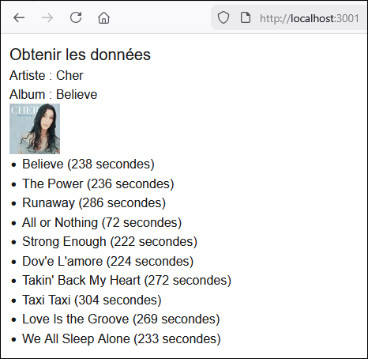</center>

## 📈 Améliorer la requête

### ⚡ Lancer la requête dès le chargement de la page Web

Dans certaines situations, on souhaite lancer certaines requêtes dès le chargement de la page. (Lorsque vous arrivez
sur la plupart des sites Web, des informations / articles / images / vidéos sont déjà étalées sur la page Web)

Nous allons devoir utiliser la fonction spéciale `useEffect`, qui est automatiquement appelée lorsque le composant est chargé.

```tsx showLineNumbers
export default function Home() {

  // États ...

  // Sera appelée une fois, lorsque le composant sera chargé dans la page.
  useEffect(() => {

    getData();

  }, []);

  // Fonction qui contient la requête
  async function getData(){

    // ...

  }

  // etc

}
```

:::info

`useEffect()` prend deux paramètres : une **fonction** à appeler (dans notre cas, c'est une **fonction anynonyme** qui appelle `getData()`) et un **tableau de dépendances**. (Dans l'exemple, nous n'avons besoin d'aucune dépendance, alors on le laisse vide.)

:::

### 🔑 Ranger la clé d'API dans une constante

Plutôt que de _harcoder_ la clé d'API directement dans la requête, il est préférable  de la ranger dans une constante.
Ainsi, si on a plusieurs requêtes, il suffira d'y concaténer la constante. De plus, si jamais la clé d'API change ⛔,
nous n'aurons pas à modifier chaque requête répétitivement.

```tsx showLineNumbers
// Clé d'API déclarée EN DEHORS du composant 
// (Préférable pour une constante qui ne changera jamais)
const lastFmKey = "9a8a3facebbccaf363bb9fd68fa37abf"; 

export default function Home() {

  // ...

}
```

Un peu plus loin, dans la ou les requêtes, on **concatène** la **clé d'API** :

```tsx
const response = await axios.get("http://ws.audioscrobbler.com/2.0/?method=album.getinfo&api_key="+lastFmKey+"&artist=Cher&album=Believe&format=json")
```

Si vous préférez utiliser des `template strings` plutôt que la concaténation avec des `+`, voici une alternative :

```tsx
const response = await axios.get(`http://ws.audioscrobbler.com/2.0/?method=album.getinfo&api_key=${$lastFmKey}&artist=Cher&album=Believe&format=json`);
```

### 🛒 Personnaliser la requête (Choisir l'input)

Dans l'exemple abordé, nous étions toujours obligé de rechercher l'album **Believe** de l'artiste **Cher**. Permettons
à l'utilisateur de choisir l'artiste et l'album.

On ajoute deux états au composant et deux champs dans le HTML et on utilise `onChange` et `value` pour exploiter le `two-way binding` :

```tsx showLineNumbers
const[artistInput, setArtistInput] = useState("");
const[albumInput, setAlbumInput] = useState("");
```

```tsx showLineNumbers
Artiste : <input type="text" className="textInput" onChange={(e) => setArtistInput(e.target.value)} value={artistInput} />
Album : <input type="text" className="textInput" onChange={(e) => setAlbumInput(e.target.value)} value={albumInput} />
```

Les états `artistInput` et `albumInput` sont intégrés à la requête, de manière à ce que les champs remplis
par l'utilisateur soient utilisés lors de la recherche.

```tsx showLineNumbers
axios.get(`http://ws.audioscrobbler.com/2.0/?method=album.getinfo&api_key=${lastFmKey}&artist=${artistInput}&album=${albumInput}&format=json`);
```

### 🐞 Gérer les erreurs

Permettre à l'utilisateur de personnaliser la recherche implique que certaines recherches ne fonctionneront pas ! (L'artiste n'existe pas,
l'album n'existe pas ou bien il y a une typo dans la rédaction d'une donnée)

Oups ! Qui l'eut cru ! Rechercher l'artiste `oeif0u809` et l'album `08f0w9ufe` n'a pas fonctionné. Il n'y a aucune donnée à afficher.
C'est important d'offrir du feedback à l'utilisateur lorsqu'une opération échoue.

<center>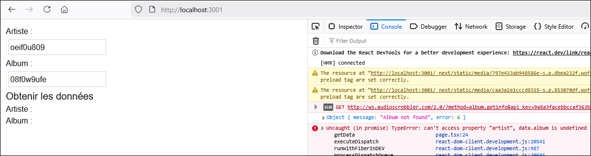</center>

Voici comment on pourrait s'y prendre.

* On a ajouté un état qui contient un **message d'erreur**.
* On utilise un `try ... catch` pour gérer l'envoi de la requête et indiquer un message d'erreur au besoin.

```tsx showLineNumbers
const [errorMessage, setErrorMessage] = useState("");

async function getData() {

  try {
    const response = await axios.get(`http://ws.audioscrobbler.com/2.0/?method=album.getinfo&api_key=${lastFmKey}&artist=${artistInput}&album=${albumInput}&format=json`)
    console.log(response.data);

    // Obtenir les chansons
    let songList: Song[] = [];
    for (let s of response.data.album.tracks.track) {
      songList.push(new Song(s.name, s.duration));
    }
    setSongs(songList);

    // Ça a fonctionné : pas de message d'erreur
    setErrorMessage("");
  }
  catch (error) {

    console.log(error);

    // Oups !
    setErrorMessage("Cet artiste n'existe pas.");

  }

}
```

Enfin, on affichage l'état avec le **message d'erreur** dans le HTML. (Qui sera invisible tant qu'il n'y aura pas d'erreur)

```tsx showLineNumbers
<p className="error">{errorMessage}</p>
```

<center>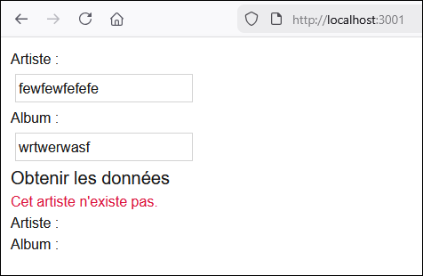</center>

## ⌛ Asynchronisme

Nous allons finalement aborder `await` et `async`. Laissez-moi vous en parler beaucoup trop en détails.

```tsx showLineNumbers
async function getSongs(){
  
  const response = await axios.get("http://ws.audioscrobbler.com/2.0/?method=album.getinfo&api_key=9a8a3facebbccaf363bb9fd68fa37abf&artist=Cher&album=Believe&format=json")
  console.log(response.data);

}
```

Gardez à l'esprit que la requête prend beaucoup de temps. ⌛ (de quelques millisecondes à quelques secondes) 

* Le `await`, devant `axios.get()` sert à attendre que la réponse HTTP ait été reçue. (Ça fige l'exécution du code)
* Pour avoir le droit d'utiliser l'opérateur `await` dans une fonction, il faut déclarer la fonction avec `async`.

:::info

Toute fonction déclarée `async` ne figera pas l'exécution du code lorsqu'elle sera appelée, à moins qu'on utilise `await`
devant leur appel.

:::

Puisque ça vous intéresse beaucoup, voyons un exemple qui illustre le phénomène :

```tsx showLineNumbers
function test(){
    console.log("A");
    slowRequest(); 
    console.log("C");
  }

async function slowRequest(){
  let x = await axios.get("..requête..");
  let y = await x.json();
  console.log("B");
}
```

Dans quel ordre seront imprimées les lettres `A`, `B` et `C` ?

<center>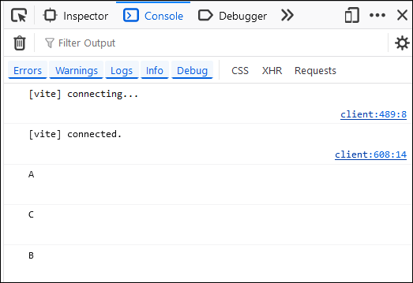</center>
<br/>
> Pourquoi `B` a-t-il été imprimé après `C` ?

Voici comment l'exécution du code s'est déroulée :

1. `console.log("A")` est appelé.
2. La fonction `slowRequest()` est appelée, mais comme c'est une fonction `async`, nous n'attendons pas qu'elle soit
terminée et on passe **immédiatement** à la suite du code.
3. `console.log("C")` est appelé ET la requête est lancée. (Ces deux opérations sont à peu près exécutées en même temps)
4. Quelques millisecondes ou secondes plus tard, la requête se termine et `console.log("B")` est finalement appelé.

Voyons maintenant un scénario légèrement différent :

```tsx showLineNumbers
async function test(){
    console.log("A");
    await slowRequest(); 
    console.log("C");
  }

async function slowRequest(){
  let x = await axios.get("..requête..");
  let y = await x.json();
  console.log("B");
}
```

Dans quel ordre seront imprimées les lettres `A`, `B` et `C` ?

<center>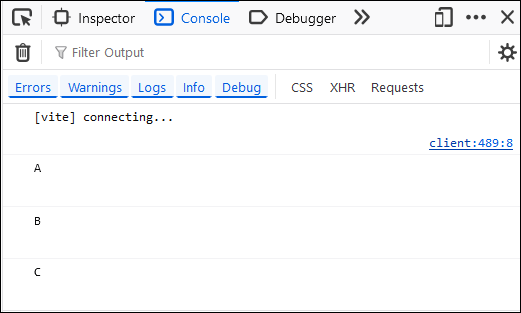</center>
<br/>
> Pourquoi `B` a-t-il été imprimé **avant** `C` ?

Puisque l'opérateur `await` a été utilisé devant l'appel de `slowRequest()` cette fois-ci, on a attendu sur la 
fonction soit totalement résolue avant de passer à la suite et d'imprimer `C`.

Notez que pour pouvoir utiliser l'opérateur `await` dans la fonction `test()`, il a fallu déclarer `test()`
comme étant `async` elle aussi !

## 🕵️‍♂️ Débogage

Bien que `console.log(...)` soit un outil intéressant pour identifier des bogues dans le code, voici les démarches à suivre si jamais vous souhaiter faire du **débogage** en pas-à-pas.

#### 🛑 Étape 1 - Instruction `debugger`

Ajoutez, temporairement, l'instruction `debugger;` dans le code, à l'endroit où vous aimeriez amorcer le débogage pas-à-pas.

```ts showLineNumbers
const response = await axios.get(`http://ws.audioscrobbler.com/2.0/?method=album.getinfo&api_key=${lastFmKey}&artist=${artistInput}&album=${albumInput}&format=json`)
console.log(response.data);

debugger; // Ajouter cette instruction dans le code
let songList: Song[] = [];
for (let s of response.data.album.tracks.track) {
  songList.push(new Song(s.name, s.duration));
}
setSongs(songList);
```

#### 💰 Étape 2 - Profiter

Dans le navigateur **Microsoft Edge** (Pour une rare fois, hélas, le débogueur de **Firefox 🦊🔥** est un peu moins intéressant), ouvrez votre page Web et faites le nécessaire pour que la section du code qui contient l'instruction `debugger;` s'active.

<center></center>

Vous pouvez utiliser des boutons pour progresser dans l'exécution du code, Vous pouvez survoler des variables pour inspecter leur contenu, etc.

N'oubliez pas de retirer l'instruction `debugger;` éventuellement 🙄.