import Tabs from '@theme/Tabs';
import TabItem from '@theme/TabItem';

# Cours 5 - Plusieurs composants

Utiliser plusieurs composants permettra de « naviguer sur plusieurs pages Web » et permettra également d'éviter
de répéter des portions de page Web similaires.

## 🐣 Créer un nouveau composant

Pour **créer un composant**, c'est très simple : il suffit de créer un nouveau fichier `page.tsx` dont le code initial correspondra généralement à ceci :

```tsx showLineNumbers
'use client'; // Seulement nécessaire pour les composants interactifs

export default function NomDuComposant() {

  return (
    <div>Ceci est le composant NomDuComposant !</div>
  );
}
```

:::warning

Pour le nom de la **fonction principale** d'un composant, la convention à respecter est **PascalCase**. (C'est-à-dire qu'on commence avec une **majuscule** et chaque nouveau mot commence par une **majuscule**)

* ❌ `export default function nomDuComposant()`
* ✅ `export default function NomDuComposant()`

:::

> Mais où crée-t-on ce fichier `page.tsx` ? Il y en a déjà un avec ce nom dans le dossier `app`.

La réponse est située dans les sections **♻ Composants réutilisables** et **🚗 Routage**, plus bas. Cela dépendra de comment on souhaite **utiliser** le composant.

Il y a deux manières d'utiliser et d'intégrer un composant au site Web :

1. ♻ **Composants réutilisables** : afficher un composant spécifique dans un autre composant spécifique. 
Pratique pour réutiliser un affichage répétitif.
2. 🚗 **Routage** : afficher un composant différent selon la route (l'URL) actuelle. Pratique pour
créer une « illusion de navigation entre les pages Web ».

## 🚗 Routage

Ci-dessous, on peut observer la navigation entre **plusieurs composants**. Selon la 
**route** (chemin après le domaine dans la barre d'URL) actuelle, un composant différent est intégré
dans la page parmi les composants `blue`, `red`, `yellow` et `pink`.

<center>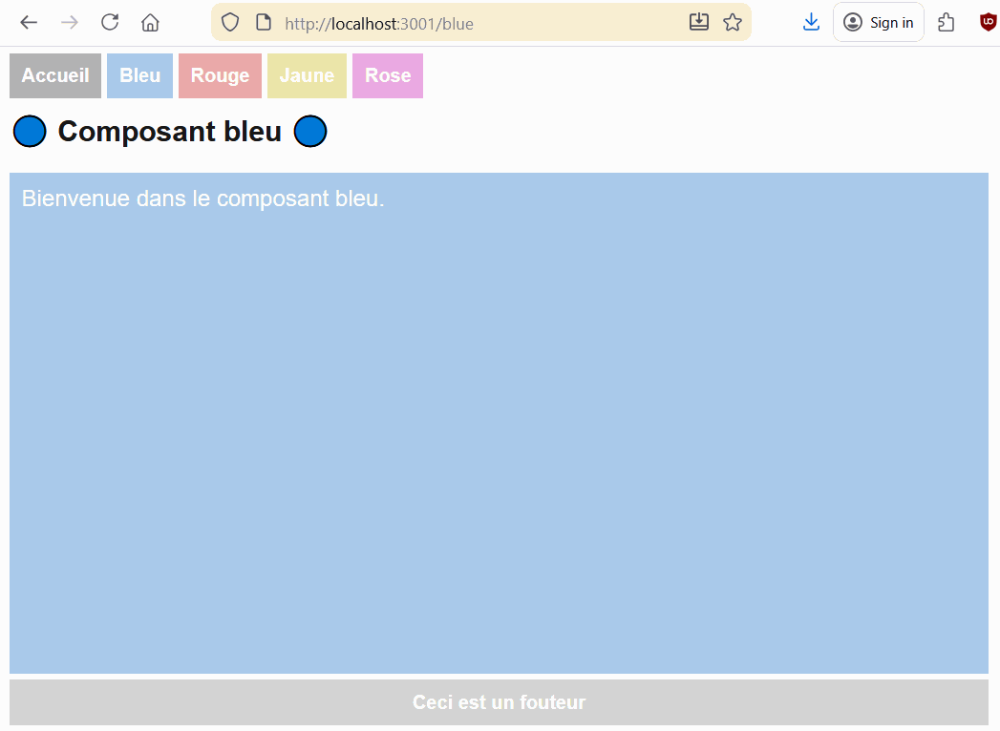</center>

### 📂 Routage basé sur les répertoires

Avec **Next.js**, le routage des pages Web est **basé** sur la structure des dossiers du projet. 

Exemples :

* Le chemin `localhost:3000/blue` affiche le composant `Blue` car il est situé dans le dossier `/app/blue`.
* Le chemin `localhost:3000/red` affiche le composant `Red` car il est situé dans le dossier `/app/red`.
* Le chemin racine ( `localhost:3000` ) affiche le composant `Home` car il est situé dans le dossier `/app`.

<center>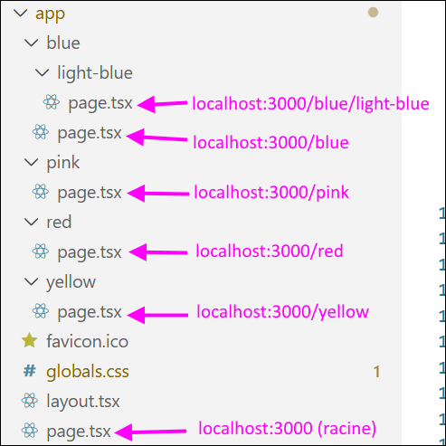</center>

**Quelques remarques :**

* 🌳 Le composant situé directement dans le dossier `app` est celui associé au **chemin racine** ( `localhost:3000` ) et s'affiche immédiatement lorsqu'on ouvre l'application Web.
* 🌿 On peut créer des **sous-dossiers** à volonté. (Comme le composant `LightBlue`, situé dans le dossier `/app/blue/light-blue` )
* 🌌 Certains dossiers **peuvent être vides** (On peut avoir un composant avec la route `localhost:3000/options/langue` et n'en avoir aucun avec la route `localhost:3000/options`. Le dossier `/app/options` ne contiendrait aucun fichier `page.tsx`, mais le dossier `/app/options/langue` contiendrait un fichier `page.tsx`.)

:::warning

Pour les noms des dossiers, la convention à respecter est **kebab-case**. (C'est-à-dire pas de **majuscules** : on sépare les mots par des **traits d'union** !)

* ❌ LightBlue
* ❌ lightBlue
* ❌ light_blue
* ✅ light-blue

<center>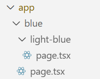</center>

:::

### 🔲 Layouts et menus de navigation

> Et si on souhaite qu'une **partie du HTML** soit commune à toutes les pages Web ? (Menu de navigation, header, footer, etc.)

Les fichiers `layout.tsx` sont fait pour ça.

<center>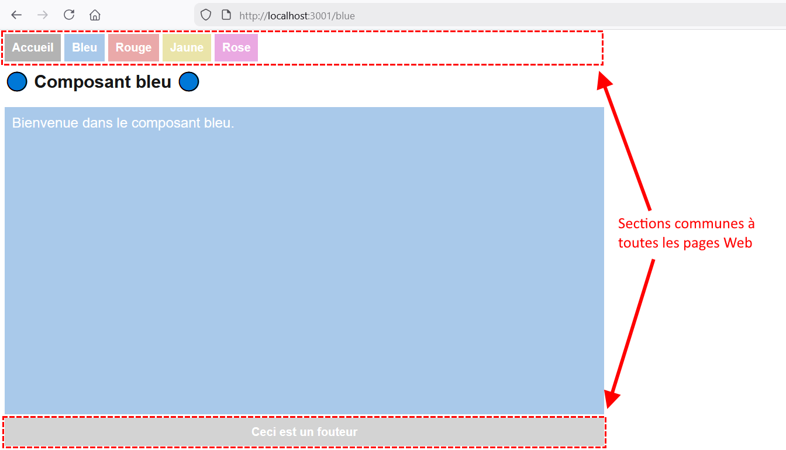</center>

Ci-dessus, on a un **layout global** (utilisé pour toutes les pages du site Web) défini dans le fichier `layout.tsx` qui est situé dans le dossier `app`.

On remarque d'ailleurs un **menu de navigation** qui fonctionne à l'aide d'éléments `<Link>` :

```tsx showLineNumbers
export default function RootLayout({
  children,
}: Readonly<{
  children: React.ReactNode;
}>) {
  return (
    <html lang="en">
      <body className={`${geistSans.variable} ${geistMono.variable} antialiased`}>
        <nav>
          <Link className="home" href="/">Accueil</Link>
          <Link className="blue" href="/blue">Bleu</Link>
          <Link className="red" href="/red">Rouge</Link>
          <Link className="yellow" href="/yellow">Jaune</Link>
          <Link className="pink" href="/pink">Rose</Link>
        </nav>
        {children}  {/* ◀◀◀ Le composant sera chargé ici ! */}
        <footer>Ceci est un fouteur</footer>
      </body>
    </html>
  );
}
```

:::info

Gardez à l'esprit que le **composant** associé à la route sera intégré à l'endroit où on place l'instruction `{children}`.

:::

#### 🔳 Layout supplémentaire pour certains composants

Si on préfère que certaines pages aient un **layout** supplémentaire EN PLUS du **layout racine**, on peut ajouter un fichier `layout.tsx` dans un autre dossier. Tous les composants de **ce dossier** et de **ses sous-dossiers** seront intégré à ce nouveau **layout**.

<center>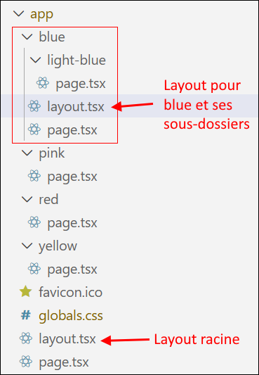</center>

Le code pour un **layout** pourrait ressembler à ceci :

```tsx showLineNumbers
export default function BlueLayout( {children}: Readonly<{children: React.ReactNode }> ) {

    return(
        <div>
            <nav>
                <Link className="blue" href="/blue">Bleu</Link>
                <Link className="lightBlue" href="/blue/light-blue">Bleu pâle</Link>
            </nav>
            {children} { /* ◀◀◀ Intégration des composants */}
            <footer>Fouteur supplémentaire</footer>
        </div>
    )

}
```

**Quelques remarques** :

* Il ne faut surtout pas oublier d'intégrer `{children}` quelque part, sinon le composant `Blue` et les potentiels composants dans ses sous-dossiers **ne seront pas affichés**.
* Ce **layout** lui-même sera intégré dans le **layout racine**, où `{children}` était placé.

On peut voir le résultat, visuellement, pour les composants `Blue` et `LightBlue` :

<center>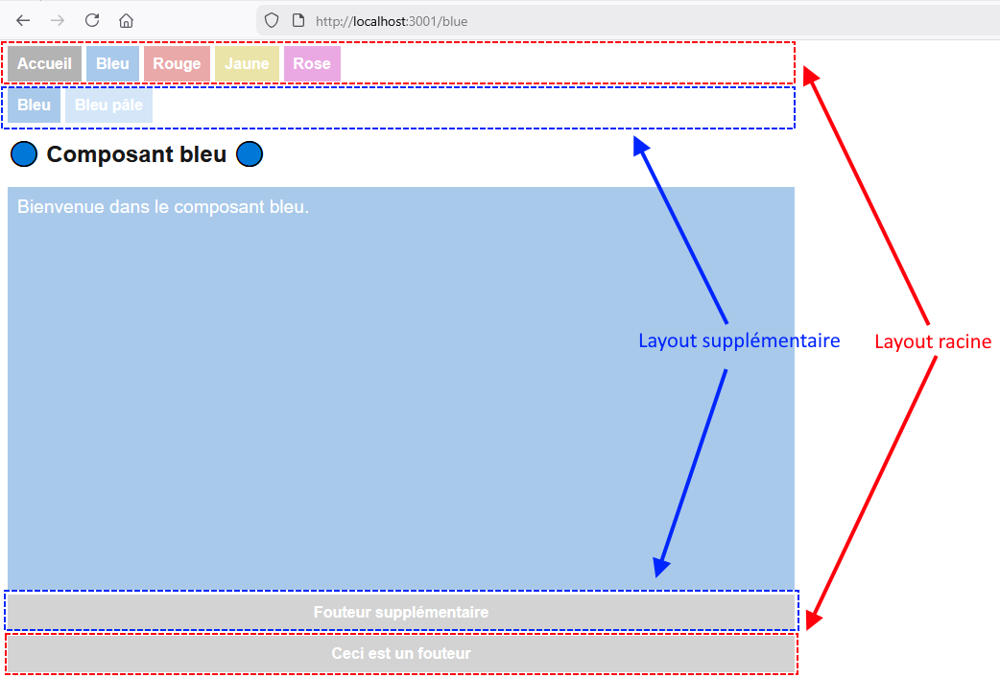</center>

#### 🖼 Utiliser un layout différent pour certains composants

Le **layout racine** est essentiel à l'affichage car il contient certains éléments **indispensables** comme `<html>`, `<head>` et `<body>`. On ne peut pas afficher un **composant** sans l'intégrer au **layout racine**.

Ce qu'on peut faire, cela dit, est de **séparer nos pages Web par layout**. Dans ce cas-ci, nous aurons **deux groupes** :

1. Les pages qui utilisent le menu de navigation principal.
2. Les pages qui utilisent le menu de navigation limité aux composants `Blue` et `LightBlue`.

**👻 Étape 1 : Alléger le layout racine au maximum**

On conserve uniquement les éléments indispensables, comme `<html>`, `<head>` et `<body>`. Il n'y a aucun élément **visible** dans ce layout. Le `<nav>` et le `<footer>` précédemment présents seront déplacés dans **un autre layout**.

```tsx showLineNumbers
export default function RootLayout({ children }: Readonly<{ children : React.ReactNode }>) {
  return (
    <html lang="en">
      <body className={`${geistSans.variable} ${geistMono.variable} antialiased`}>
        {children} {/* Le composant ou layout sera chargé ici ! */}
      </body>
    </html>
  );
}
```

**📂 Étape 2 : Séparer les composants en deux groupes**

Grâce à des dossiers encadrés de **parenthèses**, qui seront **ignorés par le routage**, on sépare les composants en deux groupes.

Chaque groupe possède son **propre layout**, déclaré dans le dossier parent du groupe. (Ici, `(root)` et `(blue)`)

<center>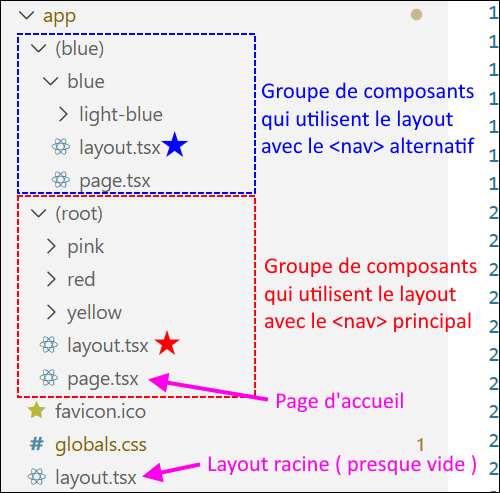</center>

**Quelques remarques :**

* Aucun des chemins (Ex : `http://localhost:3001/blue`) n'a changé ! Les dossiers entourés de **parenthèses** sont invisibles pour le routage.
* Le **composant** utilisé pour la page d'**accueil** doit être situé dans `(root)` OU dans `(blue)`, mais pas les deux ! S'il y avait un fichier `page.tsx` dans chacun de ces deux dossiers, ils auraient la **même route**, et cela lancerait une erreur.

On a maintenant des composants qui utilisent exclusivement le **layout `root`** ou le **layout `blue`** :

<Tabs>
    <TabItem value="mainLayout" label="Layout principal" default>
<center>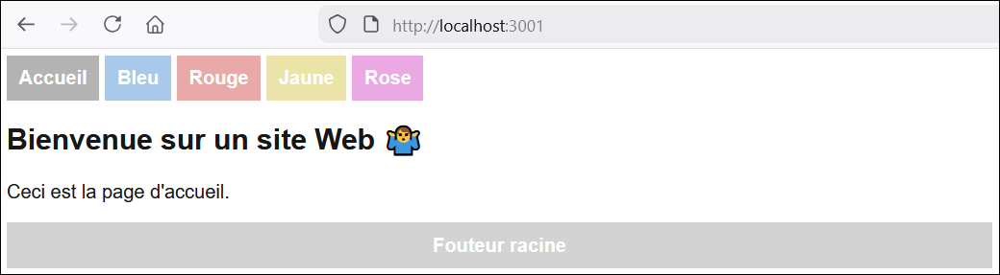</center>
    </TabItem>
    <TabItem value="otherLayout" label="Layout alternatif">
<center>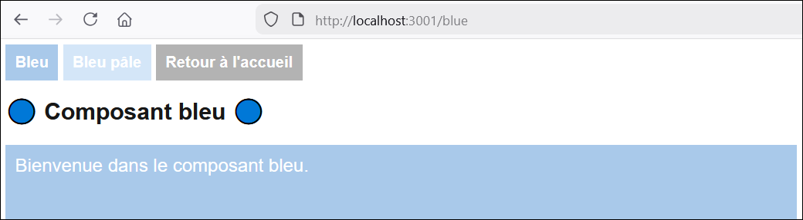</center>
    </TabItem>
</Tabs>

### ❓ Routes dynamiques

Parfois, on souhaite utiliser des **paramètres** dans la route. Cela signifie qu'une partie de la route est **variable** (dynamique).

Exemple :

* `localhost:3000/list/character/1`
* `localhost:3000/list/character/4`
* `localhost:3000/list/character/12`

Bien entendu, le composant qui sera chargé par cette route devra récupérer ce **paramètre de route** (qui, ici, vaut `1`, `4` ou `12` dans ces exemples) pour l'utiliser. (Par exemple, faire une **requête** à un API Web pour obtenir des données associées au nombre obtenu)

Pour créer une **route dynamique**, on doit créer un dossier **encadré de crochets** :

<center>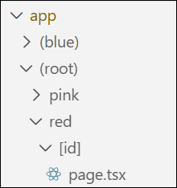</center>

On peut ensuite y ajouter un **composant**, comme d'habitude, avec un fichier `page.tsx`.

La route pour le composant dans le dossier ` [id] ` sera `http://localhost:3000/red/ID_DE_NOTRE_CHOIX`. Par exemple, `http://localhost:3000/red/2` fonctionnerait et chargerait le composant.

Pour récupérer la valeur associé au **paramètre de route** nommé `id`, on pourrait procéder comme ceci :

```tsx showLineNumbers
'use client';

import { useParams } from "next/navigation";

export default function RedId() {

  // Conteneur pour tous les paramètres de route (Dans ce cas, on a juste « id »)
  const params = useParams<{ id : string }>();

  return (
    <div>
      <h2>🔴 Composant rouge/{params.id} 🔴</h2>
      <div className="red big">L'id reçue est {params.id}</div>
    </div>
  );
}
```

<center>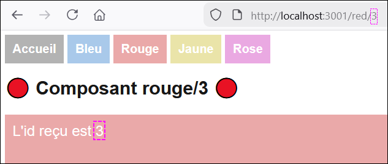</center>

:::note

Les **paramètres de route** sont **toujours** des `string`. (Même si ça ressemble à un nombre, c'est un `string` qui passe par l'URL)

:::

### 🚧 Rediriger l'utilisateur

Si jamais on désire **rediriger** l'utilisateur (par exemple, après s'être connecté ou après avoir rempli un formulaire), on peut procéder comme ceci dans une fonction de notre choix :

```tsx showLineNumbers
// Attention d'utiliser cette importation et non next/router !
import { useRouter } from "next/navigation";

export default function Red() {

  // Objet permettant de manipuler la route
  const router = useRouter();

  function someFunction(){
    router.push("/red/1"); // Redirige vers une autre route
  }

  // ...
}
```

## ♻ Composants réutilisables

Ci-dessous, on peut apercevoir trois sections / composants :

<center>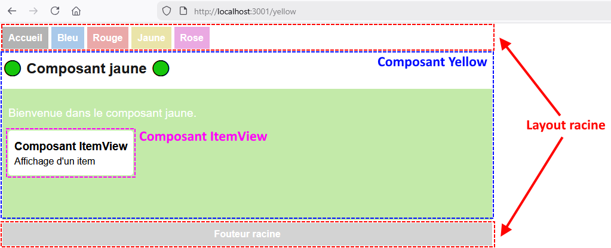</center>

Le composant `ItemView` est un **composant réutilisable** qui peut être intégré dans n'importe quel autre composant. C'est très utile s'il y a une section du HTML qu'on a besoin de réutiliser dans plusieurs pages Web.

### 📌 Afficher un composant dans un autre composant

Disons qu'on souhaite afficher le composant `ItemView` quelque part dans le composant `Yellow`, comme ceci :

<center>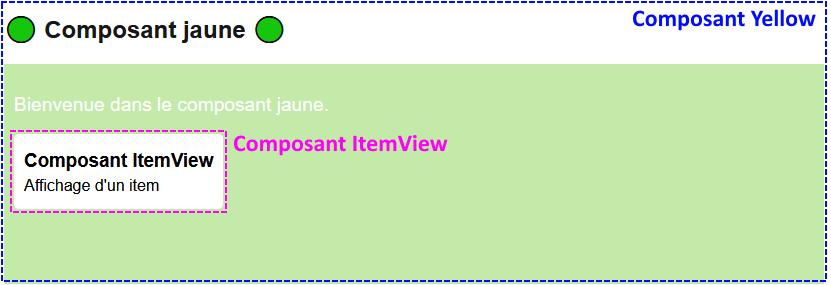</center>

📝 **Étapes à suivre**

1. **Créer le composant dans un dossier nommé `_components`**

<center>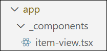</center>

```tsx showLineNumbers
'use client';

export default function ItemView() {

    return(
        <div className="item">
            <h3>Composant ItemView</h3>
            <p>Affichage d'un item</p>    
        </div>
    );

}
```

:::warning

Le trait de soulignement au début du nom du dossier `_components` est **indispensable** pour que ce dossier ne soit pas pris en compte par le **routage**. C'est ici qu'on rangera tous nos **composants réutilisables**. Comme il y aura **plusieurs composants** dans ce dossier, leur fichier peut être nommé avec quelque chose de plus descriptif que `page.tsx`, mais n'oubliez pas de respecter la covenvention **kebab-case**.

:::

2. **Intégrer le composant réutilisable**

Dans **un autre composant** de notre choix (ou dans plusieurs !), il suffit d'ajouter un élément HTML dont le **nom** correspond à la fonction principale de notre **composant réutilisable** :

```tsx showLineNumbers
'use client';

// Importation du composant réutilisable
import ItemView from "@/app/_components/item-view";

export default function Yellow() {

  return (
    <div>
      <h2>🟢 Composant jaune 🟢</h2>
      <div className="green big">
        <p>Bienvenue dans le composant jaune.</p>
        <ItemView /> {/* ◀◀◀ Intégration du composant réutilisable */}
        </div>
    </div>
  );
}
```

### 🕊 Passer un paramètre à un composant

On veut généralement transmettre une ou plusieurs données du composant **parent** vers le composant **enfant**. (Des données
qui seront utilisées dans l'affichage, par exemple)

📝 **Étapes à suivre**

1. **Spécifier un paramètre qui servira de conteneur pour le ou les paramètres du composant**

Ci-dessous, le composant `ItemView` possède un paramètre `props`, dont le type est un *objet anonyme* qui possède une propriété `itemNo` et une propriété `itemName`. (Dont leur **type** est spécifié)

```tsx showLineNumbers
'use client';

export default function ItemView(props : {itemNo : number, itemName : string}) {

    return(
        <div className="item">
            <h3>Composant ItemView</h3>
            <p>Item #{props.itemNo} : {props.itemName}</p>    
        </div>
    );

}
```

On remarque d'ailleurs que `props.itemNo` et `props.itemName` sont utilisés dans le HTML du composant.

:::note

Le paramètre conteneur n'est pas obligé d'être nommé `props`, mais c'est une convention.

:::

:::info

Contrairement aux **paramètres de route**, les **paramètres de composant** peuvent avoir n'importe quel **type** puisqu'ils ne sont pas passés dans l'URL.

:::

2. **Depuis le composant parent, fournir des valeurs pour le(s) paramètre(s)**

Ci-dessous, on voit que l'élément `<ItemView />` a été complété avec deux attributs qui serviront à envoyer la valeur `1` pour la propriété `itemNo` et la valeur `'Chaise'` pour la propriété `itemName`. (Les apostrophes `''` encadrent le mot « Chaise » car c'est un `string`)

```tsx showLineNumbers
'use client';

import ItemView from "@/app/_components/item-view";

export default function Yellow() {

  return (
    <div>
      <h2>🟢 Composant jaune 🟢</h2>
      <div className="green big">
        <p>Bienvenue dans le composant jaune.</p>
        <ItemView itemNo={1} itemName={'Chaise'} /> {/* itemNo et itemName sont remplis ! */}
        </div>
    </div>
  );
}
```

Observez le résultat dans le HTML :

<center></center>

### 🍇 Intégration multiple

Rien ne nous empêche d'afficher plusieurs fois un composant réutilisable ! Voici un exemple :

Code du **composant parent** :

```tsx showLineNumbers
'use client';

import ItemView from "@/app/_components/item-view";
import { Item } from "@/app/_types/item";

export default function Yellow() {

  // Liste d'items à afficher
  const items : Item[] = [
    new Item(1, "Chaise"),
    new Item(2, "Pneu"),
    new Item(3, "Cheval")
  ];

  return (
    <div>
      <h2>🟢 Composant jaune 🟢</h2>
      <div className="green big">
        <p>Bienvenue dans le composant jaune.</p>
        {/* Affichage multiple du composant ItemView à l'aide de la liste d'items et de .map() */}
        {items.map(
          (i) => <ItemView key={i.id} itemNo={i.id} itemName={i.name} />
        )}
        </div>
    </div>
  );
}
```

<center>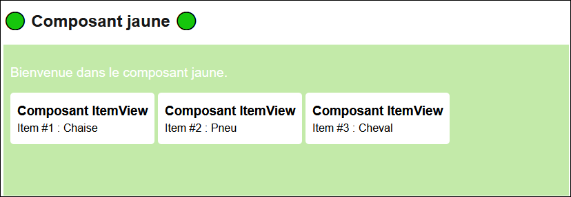</center>

## 🎨 Modules CSS

Bien que le fichier `globals.css` soit pratique, parfois on pourrait vouloir créer des styles qui **s'appliquent seulement à certains composants** plutôt qu'au projet en entier. Les **modules CSS** permettent de le faire.

### 🐣 Créer un module CSS

Le nom du fichier doit avoir la forme `____.module.css` en respectant la convention **kebab-case**.

Il y a deux endroits cohérents où on peut ranger ce fichier, selon l'usage de votre **module CSS** :

* Le module servira à **plusieurs composants variés** : On range le module dans `app/_styles`.
* Le module servira à **un composant précis** : On range le module dans le dossier du composant.

<center>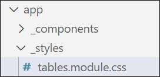</center>

Le fichier contiendra simplement des styles, par exemple :

```css showLineNumbers
.test{

    color:fuchsia;

}
```

:::warning

Les **modules CSS** ne peuvent pas cibler de simples éléments. (Sélecteurs *purs*) Il faut absolument utiliser des **classes** ! (ou des **ids**)

```css showLineNumbers
/* ✅ Valide car c'est une classe */ 
.test{
    color:fuchsia;
}

/* ⛔ Invalide car c'est un sélecteur pur */
p{
  margin:0px;
}

/* ✅ Valide car implique une classe */
p.large{
  width:1000px;
  padding:10px;
}
```

Avant de crier au scandale que les *modules CSS sont trop limités*, gardez à l'esprit que l'usage de **sélecteurs purs**, en général, n'est pas idéal car cela cible généralement trop d'éléments de manière *potentiellement imprévisible et conflictuelle*.

:::

### 📬 Importer un module CSS

Dans le ou les **composants** de votre choix, importez un ou plusieurs **modules CSS** comme ceci, par exemple :

```tsx showLineNumbers
'use client';

// Importation d'un module CSS
import styles from '../../_styles/tables.module.css';

export default function Pink() {

  return (
    <div>
      <h2>🌸 Composant rose 🌸</h2>
      <div className="pink big">Bienvenue dans le composant rose.</div>
      <p className={styles.test}>Du texte fuchsia</p> {/* Usage de la classe .test dans le module tables.module.css */}
    </div>
  );
}
```

**Quelques remarques :**

* Il faut (malheureusement) préciser `styles.nomDeMaClasse` pour pouvoir utiliser une **classe** du **module CSS**. Cependant, cela permet d'avoir des **classes** avec le même nom dans d'autres **modules CSS**.
* Le mot `styles` qui a été utilisé dans l'instruction `import` aurait pu être n'importe quoi d'autre. (Ex : `styles1`) N'hésitez pas à utiliser des noms variés si vous voulez importer **plusieurs modules CSS**.
* Notez que les classes `.pink` et `.big` viennent de `globals.css`. C'est pour ça qu'elles ne sont pas précédées de `styles.`
* Si vous souhaitez utiliser un `id` de votre **module CSS**, la syntaxe sera `id={styles.nomDeMonId}`.

:::tip

Si jamais vous souhaitez combiner **plusieurs classes** de votre **modules CSS** et / ou **plusieurs classes** déclarées dans `globals.css`, ça pourrait ressembler à ceci :

```tsx showLineNumbers
<p className={styles.test + ' ' + styles.ghost + ' ' + 'big'}>Du texte fuchsia</p>
```

On a donc utilisé la **concaténation** pour jumeler les classes `.test` et `.ghost` du **module CSS** ainsi que la classe `.big` de `globals.css`.

Si vous préférez les **template strings**, c'est *à peine* plus élégant :

```tsx showLineNumbers
<p className={`${styles.test} ${styles.ghost} big`}>Du texte fuchsia</p>
```

:::