import Tabs from '@theme/Tabs';
import TabItem from '@theme/TabItem';

# Cours 6 - Contexts et hooks

Nous avons appris comment créer et utiliser plusieurs composants. Il reste cependant certains défis à adresser pour pouvoir utiliser plusieurs composants stratégiquement.

> Comment **partager des états** (ou données) entre plusieurs composants ?

La solution sera d'utiliser des **🏝 contexts**.

> Si plusieurs composants ont besoin des mêmes **fonctions / requêtes**, que faire ?

Pour ne pas avoir à répéter du code similaire ou identique dans plusieurs composants, la solution sera d'utiliser des **🎣 hooks**.

:::note

Les **contexts** et les **hooks** sont des concepts plutôt *magiques* qui risquent d'être moins intuitifs pour plusieurs personnes. Consultez attentivement les notes de cours, bien doucement.

:::

## 🏝 Contexts

Les `Contexts` permettent de partager des **données** entre **plusieurs composants**. Il arrive parfois qu'on doive afficher **la même information** dans 2+ pages Web différentes. Un `Context` permettra de s'assurer que l'information est **accessible** partout et que sa **valeur soit synchronisée** (Si elle change quelque part, elle change partout)

On peut voir ça comme une **variable globale**, mais plus **propre** et plus **compliquée**.

### 🦴 Structure

Un **Context** est généralement composé de trois morceaux :

1. 🥚 Une **déclaration**

```tsx
export const NomDeMonContext = createContext<string>("");
```

:::note

`string` peut être remplacé par un autre **type** comme `number` ou `any`. `""` (string vide) peut être remplacé par une autre **valeur de départ** au besoin.

:::

2. 📬 Un **provider**

```tsx
<NomDeMonContext.Provider value={"Valeur de départ"}>
    {/* ... Intégration de composants ... */}
</NomDeMonContext.Provider>
```

:::info

Ce morceau est le plus **bizarre**. Il doit être placé **dans le HTML**, à un endroit qui **contient** (intègre) les **composants** qui utiliseront ce **Context**. 

⛔ Ça signifie qu'aucun composant situé **plus haut dans la hiérarchie HTML** ne pourra profiter de ce **Context**.

:::

:::tip

📌 Notez que la **déclaration** et le **provider** peuvent très bien être dans **le même fichier** pour centraliser le code du **Context**.

:::

3. 📧 Une ou plusieurs **intégration(s)**

Dans le ou les **composants** qui doivent profiter du **Context** (pour avoir accès à la **donnée**), on intègre comme ceci :

```tsx showLineNumbers
export default function MonComposant() {

    // maDonnee contient la donnée déclarée dans NomDeMonContext.
    const maDonnee = useContext(NomDeMonContext);

    // ...

}
```

Par la suite, dans les composants concernés, on peut utiliser la valeur de `maDonnee` et l'afficher dans le HTML avec `{maDonnee}`.

:::info

> Dans quel fichier / composant dois-je déclarer mon **Context** ?

Disons qu'on a la **hiérarchie** 🌳 de composants suivante dans notre projet :

<center>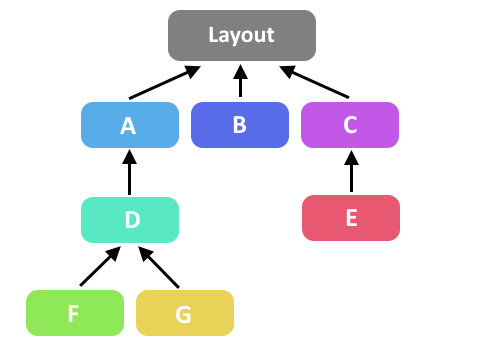</center>

On peut donc comprendre que les composants `A`, `B` et `C` sont tous les trois accessibles séparément à l'aide du **Routage**. Tous les autres composants sont des **composants réutilisables** intégrés dans un **composant parent**.

**Exemple 1** : Les composants `F` et `G` doivent avoir accès à la même donnée. Dans ce cas, le **Context** pourra être **déclaré** et **provided** dans le composant `D`, qui est leur **parent**.

**Exemple 2** : Les  composants `D` et `E` doivent avoir accès à la même donnée. *Oof !* Dans ce cas, on n'a pas trop le choix : il faut **déclarer** et **provide** le **Context** dans le **Layout racine**. 

⛔ Bémol : on n'a pas le droit de déclarer un **état** dans le **Layout racine**. (On peut déclarer une simple valeur, mais pas un **état** avec `useState`) Ça risque de limiter le type de données qu'on pourra choisir pour un **Context** déclaré dans le **Layout racine**. La solution est généralement d'introduire un **composant** entre le **Layout racine** et les composants `A`, `B` et `C` : 

<center>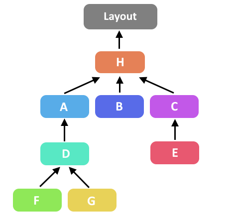</center>

Voilà, on pourra **déclarer** et **provide** un **Context** avec une *portée* relativement *globale* dans le composant `H` ! 🌐

:::

### 👶 Exemple « simple »

Dans cet exemple, un composant **parent** partagera une **donnée** avec ses composants **enfants**. La donnée aura d'abord été obtenue grâce à une **requête HTTP**.

<center>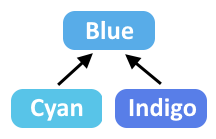</center>

Le Context sera ... :

* **Déclaré** dans le composant `Blue`.
* **Provided** dans le composant `Blue`.
* **Intégré** dans les composants `Cyan` et `Indigo`.

Voici le composant `Blue` :

<Tabs>
    <TabItem value="typescript" label="TypeScript" default>
```tsx showLineNumbers
"use client";

import { createContext, useContext, useState } from "react";
import { CounterContext } from "../_contexts/counter-context";
import Cyan from "../_components/cyan";
import Indigo from "../_components/indigo";

// 🥚 Déclaration du Context (en dehors du composant !)
export const ItemUrlContext = createContext<undefined | string>("");

export default function Blue() {

    // 📬 État dont la valeur sera utilisée pour PROVIDE le Context
    const [imageUrl, setImageUrl] = useState<undefined|string>(undefined);

    // État avec two-way binding pour lire l'input de l'utilisateur pour la recherche
    const [itemInput, setItemInput] = useState("");

    // Obtenir l'Url de l'image pour la mettre dans imageUrl
    async function searchItemImage(){

        let response = await fetch("https://botw-compendium.herokuapp.com/api/v3/compendium/entry/" + itemInput);
        let data = await response.json();
        console.log(data);
        setImageUrl(data.data.image);

    }

    // HTML ...
}
```
    </TabItem>
    <TabItem value="html" label="HTML">
```tsx showLineNumbers
return (
<div className="blue big">
    <h3>Composant Blue</h3>

    {/* Input et bouton pour chercher un item et obtenir l'url de son image */}
    <input type="text" placeholder="Ex : silent shroom" value={itemInput} onChange={(e) => setItemInput(e.target.value)} />
    <button onClick={searchItemImage}>Chercher</button>

    {/* 📫 On provide le Context et on intègre les deux composants enfants à l'intérieur */}
    <ItemUrlContext.Provider value={imageUrl}>
        <div className="container">
            <Cyan />
            <Indigo />
        </div>
    </ItemUrlContext.Provider>
</div>
);
```
    </TabItem>
    <TabItem value="peek" label="Page Web">
<center>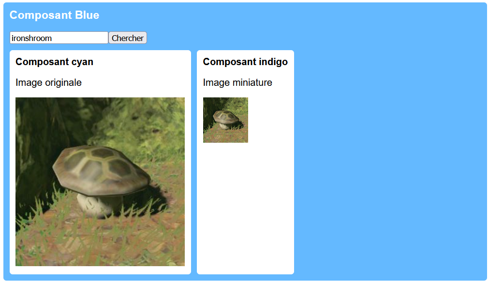</center>
    </TabItem>
</Tabs>

Voici le composant `Indigo` (Le composant `Cyan` lui ressemble comme deux gouttes d'eau 💧💧)

```tsx showLineNumbers
"use client";

import { useContext } from "react";
import { ItemUrlContext } from "../blue/page";

export default function Indigo() {

    // 📧 Intégration du contexte ! imageUrl restera toujours synchronisé avec la valeur fournie par le composant Blue
    const imageUrl = useContext(ItemUrlContext);

    return(
        <div>
            <h4>Composant indigo</h4>
            <p>Image miniature</p>
            {/* Affichage d'une image SI imageUrl n'est pas undefined */}
            {imageUrl != undefined && }
        </div>
    );

}
```

:::note

> Comment `imageUrl` peut rester synchronisée et changer de valeur si c'est une `const` ?

En effet, en JavaScript / TypeScript, une `const` ça ne peut pas changer de valeur. Ce qui se produit, c'est qu'à chaque fois que la valeur du context `ItemUrlContext` change, le composant `Indigo` est **exécuté à nouveau**.

:::

### 🧩 Exemple compliqué

Dans cet exemple, les composants `Blue` et `Red`, qui sont intégrés au **layout racine** et chargés par **routage**, doivent avoir accès à une même donnée. De plus, on souhaite que ces deux composants puissent également **modifier** la donnée en plus de pouvoir la **lire**.

<center>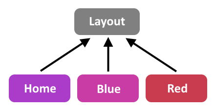</center>

Comme il est **impossible de déclarer un état** dans le **layout racine**, il faudra commencer par introduire un nouveau **composant** entre le **layout racine** et les composants chargés par **routage**. Comme son seul objectif sera de déclarer et *provide* un **context**, on peut le nommer `ContextWrapper`, par exemple.

<center>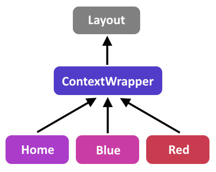</center>

Le Context sera ... :

* **Déclaré** dans le composant `ContextWrapper`.
* **Provided** dans le composant `ContextWrapper`.
* **Intégré** dans les composants `Blue` et `Red`.

Voici le nouveau composant `ContextWrapper` :

<center>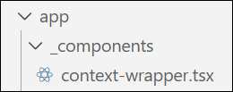</center>

Comme `CounterContext` servira à stocker un **état** ET son `setState`, le type de `CounterContext` sera `any`.

```tsx showLineNumbers
"use client";

import { createContext, useState } from "react";

// Déclaration du context
export const CounterContext = createContext<any>(undefined);

// ContextWrapper va recevoir les children du layout racine et les intégrer dans son HTML à la place du layout racine.
export function ContextWrapper({ children } : { children : React.ReactNode }){

    // Déclaration d'un état qui sera mis dans le CounterContext. Valeur de départ à 0.
    const [counter, setCounter] = useState<number>(0);

    return (
        {/* On met counter ET setCounter, entre accolades { ... } */}
        <CounterContext.Provider value={ {counter, setCounter} }>
            {children}
        </CounterContext.Provider>
    );

}
```

On modifie le **layout racine** ( `app/layout.tsx` ) pour y intégrer le `ContextWrapper` et lui passer `children` plutôt que l'intégrer lui-même :

```tsx showLineNumbers
  return (
    <html lang="en">
      <body className={`${geistSans.variable} ${geistMono.variable} antialiased`}>
        <div>
          <nav>
            <Link href="/">Accueil</Link>
            <Link href="/blue" className="blue">Bleu</Link>
            <Link href="/red" className="red">Rouge</Link>
          </nav>
          {/* children est passé au ContextWrapper */}
          <ContextWrapper children={children} />
        </div>
      </body>
    </html>
  );
```

Voici le composant `Red`, qui ressemble comme deux gouttes d'eau 💧💧 au composant `Blue`. La valeur du `CounterContext` est affichée et on peut appuyer sur un bouton pour l'augmenter de 1.

```tsx showLineNumbers
"use client";

import { useContext } from "react";
import { CounterContext } from "../_components/context-wrapper";

export default function Red() {

    // Intégration du context
    const {counter, setCounter} = useContext(CounterContext);
    
    // Fonction pour augmenter la valeur du context de 1
    function increment(){
        setCounter(counter + 1);
    }

    return (
        <div className="red big">
            <h3>Composant Red</h3>

            {/* Affichage du compteur et bouton pour l'augmenter */}
            <p>Le compteur vaut {counter}</p>
            <button onClick={increment}>Augmenter</button>
        </div>
    );
}
```

Bien entendu, quand on augmente l'état avec `setCounter()`, la valeur change également dans le composant `Blue`.

<center>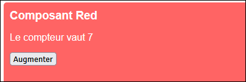</center>

## 🎣 Hooks

Les **hooks** sont des **fonctions** très variées qui donnent accès à des fonctionnalités et données. (Ce début de description est censé sembler vague 🌊, c'est normal, les **hooks** permettent de faire tellement de choses, c'est difficile de les définir de manière découpée et précise)

Il y a quelques **hooks préexistants**, comme `useState`, `useEffect` et `useContext`, que nous avons déjà abordés. 

* `useState` permet de stocker une donnée, la modifier et mettre à jour l'affichage du HTML quand elle change.
* `useEffect` permet d'exécuter des requêtes à des API externes lors du chargement d'un composant.
* `useContext` permet de partager des données entre plusieurs composants.

Il existe d'autres **hooks préexistants**, mais on comprend déjà qu'un **hook**, ça donne accès à des fonctionnalités variées.

🫃 Nous allons voir comment créer **nos propres hooks**. Il est intéressant de créer un **hook** dès qu'on remarque qu'il y a des **fonctionnalités qui se répètent dans notre projet**. (Du code TypeScript très similaire répété dans plusieurs composants) Dans ce cas, on peut parfois déplacer ce code répétitif dans un **hook**, puis utiliser ce nouveau **hook** dans les composants concernés.

### 🤡 Hook inutile

Commençons par un **hook** pas très pertinent pour mieux **comprendre** le potentiel et le fonctionnement des hooks. Le hook que nous allons créer se nommera `useStupidHook`.

<center>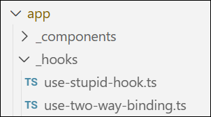</center>

:::info

Par convention, le nom des **hooks** doit commencer par « use » et respecter **camelCase**. (Bien que leur fichier respecte la convention **kebab-case**)

Un fichier n'a pas besoin de l'extension `.tsx` lorsqu'il ne contient QUE du **TypeScript**. (Donc pas de HTML)

:::

Voici la déclaration de notre **hook** (qui est une fonction) :

```ts showLineNumbers
import { useState } from "react";

// Fonction principal du hook. Elle peut recevoir des paramètres
export function useStupidHook(startValue : any){

    // Deux états déclarés dans le hook

    // Celui-ci utilise le paramètre reçu par le hook comme valeur de départ.
    const [x, setX] = useState(startValue); 

    // Celui-ci est obligé d'être un string et sa valeur de départ est "patate"
    const [y, setY] = useState<string>("patate"); 

    // Ceci est une fonction relativement banale
    function displayStates(name : string){
        console.log(`Salut ${name} ! x vaut ${x} et y vaut ${y}.`);
    }

    // Ceci est un objet anonyme dans lequel on a mis cinq propriétés (state1, setState1, state2, setState2 et displayFunction)
    const object = { 
        state1 : x, 
        setState1 : setX, 
        state2 : y, 
        setState2 : setY, 
        displayFunction : displayStates
    };

    // Le hook, lorsqu'il est appelé avec useStupidHook(), retourne l'objet anynome déclaré plus haut.
    return object;

}
```

Voici un **composant** qui **intègre** le `useStupidHook` :

```tsx showLineNumbers
"use client";

import { useStupidHook } from "../_hooks/useStupidHook";

export default function Yellow() {

    // Intégration du hook. stupid contient l'objet anonyme retourné par le hook
    const stupid = useStupidHook(5);

    function test(){

        // On appelle displayStates(), ce qui affichera un message dans la console
        stupid.displayFunction("Simone");

        // On augmente x de 1
        stupid.setState1(stupid.state1 + 1);

        // On fait alterne y entre "patate" et "fromage"
        stupid.setState2(stupid.state2 == "patate" ? "fromage" : "patate");
        
    }

    return (
        <div className="yellow big">
            <h3>Composant Yellow</h3>
            <button onClick={test}>Tester le hook stupide</button>
        </div>
    );
}
```

<center>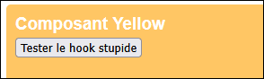</center>

#### 📚 Explications

La constante nommée `stupid` contient l'**objet anonyme** qui a été retourné par le `useStupidHook`. On peut donc accéder à `stupid.state1`, `stupid.setState1`, etc. (Les cinq propriétés de l'objet anonyme)

Bien que les **états** `[x, setX]` et `[y, setY]` sont déclarées dans le **hook**, notre **composant** a accès aux valeurs et aux *setState()* de ces deux **états** grâce à l'**objet anonyme**. (`stupid.state1` pour voir la valeur de `x`, `stupid.setState1(x + 1)` pour augmenter la valeur de `x`, etc.)

Bien que la fonction `displayStates()` est déclarée dans le **hook**, notre **composant** y a accès grâce à `stupid.displayFunction("nomDeMonChoix")`.

<center>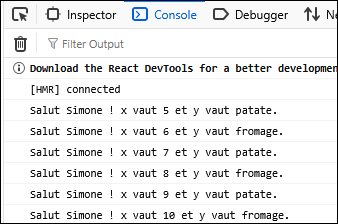</center>

:::info

Dans cet exemple, on a accès à tout ce qui a été déclaré dans le **hook** car on a tout mis dans l'**objet anonyme** retourné par le **hook**. Bien entendu, il est possible de déclarer des **états** et **fonctions** dans un **hook** sans forcément les rendre accessible aux **composants** qui intègrent ce **hook**.

:::

:::tip

🐁 Notons que nous aurions pu **ne pas nommer les propriétés** de l'**objet anonyme** dans le **hook** (Ça les nomme automatiquement avec le même nom que dans le hook. Par exemple, `x` continue de s'appeler `x`) :

```ts
return {x, setX, y, setY, displayStates};
```

Dans ce cas, dans chaque **composant** qui intègre le **hook**, on doit procéder comme ceci :

```ts
const {x, setX, y, setY, displayStates} = useStupidHook(5);
```

Pour accéder à la valeur de `x`, on n'utilise donc plus `stupid.state1`, mais simplement `x`.

:::

:::warning

⛔ Les **états** dans un **hook** ne sont pas **partagés**, même si plusieurs **composants** utilisent ce **hook**. (Par exemple, avec le `useStupidHook`, chaque composant aurait ses propres états `x` et `y`, séparément) 

💡 Ce sont vraiment les **contexts** qu'il faut préconiser pour partager des données entre plusieurs composants.

:::

### ♊ Hook pour le two-way binding

Le **two-way binding** utilisé pour chaque champ de formulaire est un classique de fonctionnalité que nous réutilisons constamment.

```tsx showLineNumbers
export default function Blue() {

    // État associé à l'input
    const [itemInput, setItemInput] = useState("");

    return(
        <div className="blue big">
            <h3>Composant Blue</h3>

            {/* Input avec attribut value et onChange */}
            <input value={itemInput} onChange={(e) => setItemInput(e.target.value)} type="text" placeholder="Ex : silent shroom" />
            <button>Chercher</button>
        </div>
    );
}
```

Pour utiliser cette **fonctionnalité**, à chaque fois, on doit :

1. Déclarer un état.
2. Rédiger la fonction `e => setState(e.target.value)` dans l'attribut `onChange`
3. Glisser la valeur de l'état dans l'attribut `value`.

Nous allons créer un **hook personnalisé** qui permet de réutiliser cette fonctionnalité avec moins de répétition.

```ts showLineNumbers
import { useState } from "react";

// Le type de startValue doit être any pour que ça puisse fonctionner avec des string, number, tableaux, etc.
export function useTwoWayBinding(startValue : any){

    // État pour stocker la valeur du champ
    const [inputValue, setInputValue] = useState(startValue);

    // Objet anonyme qui servira à remplir les attributs value et onChange du <input>
    return {value : inputValue, onChange : (e : any) => setInputValue(e.target.value)};

}
```

:::note

Dans l'**objet anonyme** qui est retourné, remarquez les noms des deux propriétés : `value` et `onChange`. Ce n'est pas un hasard qu'ils soient nommés exactement comme les attributs HTML que nous allons remplir : c'était **nécessaire**.

> Pourquoi a-t-il fallu ajouter le `: any` pour le paramètre `e` dans la **fonction anonyme** de l'attribut `onChange` ?

Lorsqu'on déclarait la fonction anonyme directement dans le HTML, le projet savait automatiquement que le type de `e` était `ChangeEvent<HTMLInputElement>`. Désormais, la fonction est déclarée dans un objet anonyme quelconque, alors le type ne peut plus être déduit automatiquement. Pour faire simple, on met `any` pour indiquer au compilateur qu'il peut nous laisser faire ce qu'on veut avec `e`.

:::

Il reste à intégrer `useTwoWayBinding` dans mon composant :

<Tabs>
    <TabItem value="withHook" label="Avec hook" default>
```tsx showLineNumbers
export default function Blue() {

    // Appel du hook avec "" comme valeur de départ pour l'état
    const itemInput = useTwoWayBinding("");

    return (
        <div className="blue big">
            <h3>Composant Blue</h3>

            {/* {...itemInput permet de créer et remplir les attributs onChange et value } */}
            <input {...itemInput} type="text" placeholder="Ex : silent shroom" />
            <button>Chercher</button>
        </div>
    );
}
```
    </TabItem>
    <TabItem value="withoutHook" label="Sans hook">
```tsx showLineNumbers
export default function Blue() {

    // État associé à l'input
    const [itemInput, setItemInput] = useState("");

    return(
        <div className="blue big">
            <h3>Composant Blue</h3>

            {/* Input avec attribut value et onChange */}
            <input value={itemInput} onChange={(e) => setItemInput(e.target.value)} type="text" placeholder="Ex : silent shroom" />
            <button>Chercher</button>
        </div>
    );
}
```
    </TabItem>
</Tabs>

:::note

🧠 Si la syntaxe `{...itemInput}` vous fait peur, vous pouvez remplir les deux attributs manuellement :

<Tabs>
    <TabItem value="withSpread" label="Opérateur spread">
```tsx
<input {...itemInput} type="text" placeholder="Ex : silent shroom" />
```
    </TabItem>
    <TabItem value="withoutSpread" label="Manuellement" default>
```tsx
<input onChange={itemInput.onChange} value={itemInput.value} type="text" placeholder="Ex : silent shroom" />
```
    </TabItem>
</Tabs>

:::

:::info

💡 Bien entendu, pour utiliser la valeur de l'input (pour une requête, par exemple), nous n'aurons à utiliser `itemInput.value` dans le code.

```ts showLineNumbers
async function searchItemImage(){

    let response = await fetch("https://botw-compendium.herokuapp.com/api/v3/compendium/entry/" + itemInput.value);
    let data = await response.json();
    console.log(data);

}
```

:::

### 📶 Hook pour une requête

Si jamais vous remarquez que vous utilisez **une même requête** dans **plusieurs composants** et que vous ne voulez pas **répéter** le même code plusieurs fois, vous pouvez toujours créer un **hook**.

Ce **hook** devrait, au minimum :

* Contenir un **état** servant à stocker les données de la requête.
* Contenir le code de la **requête**.

Voici un exemple :

<Tabs>
    <TabItem value="class" label="Classe">
```ts showLineNumbers
export class Item{

    constructor(
        public id : number,
        public name : string,
        public imageUrl : string
    ){}

}
```
    </TabItem>
    <TabItem value="hook" label="Hook" default>
```tsx showLineNumbers
import { useState } from "react";
import { Item } from "../_types/item";

export function useItemSearch(){

    // État pour stocker la donnée
    const [item, setItem] = useState<Item|null>(null);

    // Fonction pour lancer la requête
    async function searchItem(name : string){

        let response = await fetch("https://botw-compendium.herokuapp.com/api/v3/compendium/entry/" + name);
        let json = await response.json();
        console.log(json);

        // On stocke les données sous forme d'item (classe personnalisée)
        setItem(new Item(json.data.id, json.data.name, json.data.image));

    }

    // On retourne la valeur de l'état et la fonction pour que les composants y aient accès
    return {item, searchItem};

}
```
    </TabItem>
    <TabItem value="component" label="Composant">
```tsx showLineNumbers
export default function Blue() {

    const itemInput = useTwoWayBinding("");

    // Intégration du hook (donne accès à la valeur de l'état et à la fonction qui contient la requête)
    const {item, searchItem} = useItemSearch();

    return (
        <div className="blue big">
            <h3>Composant Blue</h3>
            <input type="text" placeholder="Ex : silent shroom" {...itemInput} />

            {/* Bouton qui appelle la fonction searchItem() du hook en lui fournissant le texte à chercher */}
            <button onClick={() => searchItem(itemInput.value)}>Chercher</button>

            {/* Affichage de l'item recherché */}
            {
                item != null &&
                <div>
                    <h4>Résultat</h4>
                    <p>Nom : {item.name}</p>
                    
                </div>
            }

        </div>
    );
}
```
    </TabItem>
</Tabs>

## 🏡 Environnements d'exécution