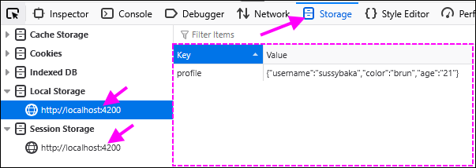
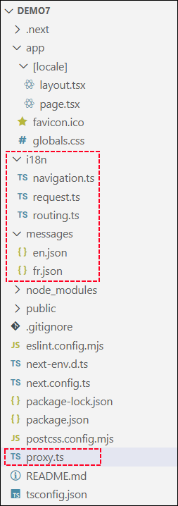
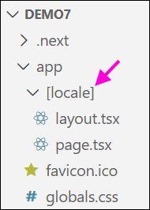
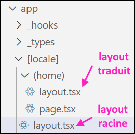
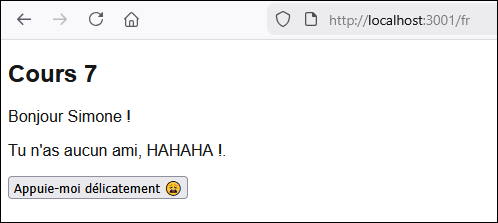
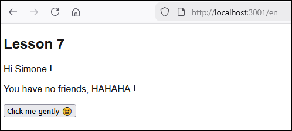
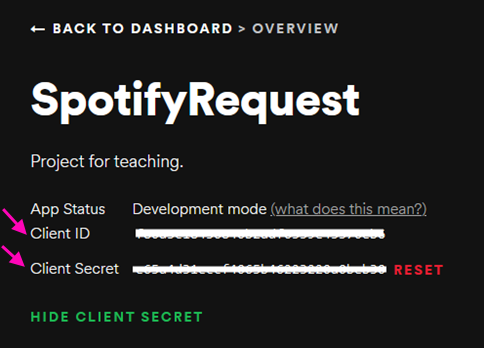
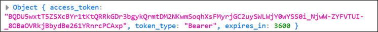

import Tabs from '@theme/Tabs';
import TabItem from '@theme/TabItem';

# Cours 7 - Stockage, i18n, token

## 💿 Stockage local

🧹 Tel que brièvement abordé au cours 6, si on réinitialise la page Web lorsque notre application Next.js est en exécution, toutes les données (contenu des états et variables) sont perdues.

💡 C'est là que le **stockage local** et le **stockage de session** entrent en jeu ! Ces deux types
de stockage permettent de sauvegarder des données <u>dans le navigateur du client</u>.

* Le stockage local est **permanent**. Il ne se nettoie jamais par lui-même.
* Le stockage de session est **temporaire**. Il se nettoie lorsque le navigateur est fermé.

:::warning

Le stockage local et le stockage de sssion peuvent seulement être manipulés dans un **composant client 👤**.

:::

### 💾 Sauvegarder un `string`

Cette opération peut être exécutée dans la fonction de votre choix.

```tsx showLineNumbers
export default function Home() {
    
  const [guestName, setGuestName] = useState("");

  function myFunctionToSaveSomeThings() : void{

    sessionStorage.setItem("username", guestName); // Stockage de session
    
    // ... ou encore ...

    localStorage.setItem("username", guestName); // Stockage local

  }

}
```

Pour les deux types de stockages, il suffit d'un paramètre servant de **clé** (vous pouvez
lui donner le nom de votre choix, mais assurez-vous que ce nom soit **unique ✨**) et un deuxième
paramètre qui contient la **donnée** à sauvegarder.

`sessionStorage` et `localStorage` sont deux outils automatiquement accessibles depuis n'importe quel **composant client 👤**.

### 📫 Récupérer un `string`

Cette opération est _généralement_ effectuée dans `useEffect()`, puisqu'on souhaite accéder à certaines données dès le chargement d'un composant.

Il suffit de préciser **la clé** de la donnée à récupérer en paramètre.

:::warning

Gardez à l'esprit qu'il se peut que le stockage local / stockage de session soit **vide** ! C'est généralement le cas pour la première navigation d'un utilisateur, par exemple. La fonction `.getItem()` peut donc retourner `null` dans certains cas.

:::

```tsx showLineNumbers
export default function Home() {
    
  const [guestName, setGuestName] = useState("");

  useEffect(() => {

    const usernameJSON1 : string | null = sessionStorage.getItem("username");

    // Si pas vide, on récupère l'info
    if(usernameJSON1 != null){
      setGuestName(usernameJSON1);
    }

    // ... ou encore ...

    const usernameJSON2 : string | null = localStorage.getItem("username");

    // Si pas vide, on récupère l'info
    if(usernameJSON2 != null){
      setGuestName(usernameJSON2);
    }

  }, []);

}
```

### 💾📦 Sauvegarder une donnée

Pour toute autre donnée qu'un `string`, il faudra « stringifier » (convertir en `string`) la
donnée avant de la ranger grâce à `JSON.stringify(...)`. Ceci s'applique pour les `boolean`, `number`, tableau, objet personnalisé, etc.

```tsx showLineNumbers
export default function Home() {
    
  const [guestData, setGuestData] = useState(new Guest("Simone", 39));

  function myFunctionToSaveSomeThings(){

    localStorage.setItem("guest", JSON.stringify(guestData));

  }

}
```

### 📫📦 Récupérer une donnée

Puisque la donnée que nous allons récupérer dans le stockage local a été convertie en `string`,
nous allons devoir la **reconvertir** en son type d'origine lorsqu'on la récupère grâce à `JSON.parse(...)`.

```tsx showLineNumbers
export default function Home() {
    
  const [guestData, setGuestData] = useState(null);

  useEffect(() => {

    const guestJSON : string | null = localStorage.getItem("guest");

    // N'oubliez pas qu'il se peut que le stockage local / de session soit vide !
    if(guestJSON != null) setGuestData(JSON.parse(guestJSON));

  }, []);

}
```

### 🚮 Supprimer des données

Que ce soit pour le stockage de session ou le stockage local, il est possible de supprimer
manuellement certaines données si on connait leur **clé** grâce à `removeItem(...)`.

```ts
localStorage.removeItem("preferredLanguage");
```

Si on souhaite vider le stockage **en entier**, on peut prendre le 🐂 par les cornes à
l'aide de `clear()` :

```ts
localStorage.clear();
```

### 🔍 Inspecter le stockage local

N'hésitez pas à utiliser l'outil du navigateur qui permet de jeter un coup d'oeil au **stockage local**. On peut
d'ailleurs y supprimer manuellement des données pour simplifier les tests.

<center></center>

## 👅 Internationalisation

Il y a plusieurs manières de traduire les textes d'un projet Next.js. Dans ce cours, nous utiliserons la librairie `next-intl`, qui semble être la solution la plus populaire™.

#### Étape 1 - 📦 Installer une dépendance

`npm install next-intl`

#### Étape 2 - 🧰 Modifications dans `next.config.ts`

On « active » les fonctionnalités de `next-intl` dans la configuration de notre projet.

```ts showLineNumbers
import type { NextConfig } from "next";
import createNextIntlPlugin from "next-intl/plugin";


const nextConfig: NextConfig = {};

// Ici
const withNextIntl = createNextIntlPlugin();
export default withNextIntl(nextConfig);
```

#### Étape 3 - 📄 Création de fichiers

<center></center>

On doit créer deux nouveaus dossiers nommés `i18n` et `messages` à la racine de notre projet. (Donc pas dans `app`, mais bien dans le dossier parent de `app`, dont le nom varie selon votre projet)

Il y aura six **fichiers** à créer : 

1. `i18n/routing.ts`

Notez que la langue 👅 (la « locale ») active sera spécifiée **dans la route** 🚗. Par exemple, les routes `http://localhost:3000/fr/home` et `http://localhost:3000/en/home` chargeront **la même page**, dans une langue différente.

Dans ce fichier, nous spécifions les **langues disponibles** et la **langue par défaut**.

```ts showLineNumbers
import { defineRouting } from "next-intl/routing";

export const routing = defineRouting({
    locales: ['en', 'fr'],
    defaultLocale:"fr"
});
```

2. `i18n/request.ts`

À chaque fois que l'utilisateur naviguera vers une nouvelle page, la fonction `getRequestConfig()` récupérera la **locale** présente dans la **route** et chargera les messages (textes) de la langue détectée. Si la langue est invalide (Ex : `'es'` n'existe pas dans `routing.ts`), les textes de la langue par défaut seront chargés à la place.

```ts showLineNumbers
import { hasLocale } from 'next-intl';
import { getRequestConfig } from 'next-intl/server';
import { routing } from './routing';
 
export default getRequestConfig(async ({requestLocale}) => {

  const requested = await requestLocale;
  const locale = hasLocale(routing.locales, requested)
    ? requested
    : routing.defaultLocale;
 
  return {
    locale,
    messages: (await import(`../messages/${locale}.json`)).default
  };
});
```

3. `i18n/navigation.ts`

Ce petit fichier **permettra de ne pas avoir à constamment préciser la langue dans la route**.

❌ Pas besoin de préciser la locale dans nos routes : `<Link href="/fr/home">...</Link>`  
✅ On peut continuer d'utiliser des routes ordinaires : `<Link href="/home">...</Link>`

La locale actuellement chargée sera simplement transposée dans la nouvelle route lors de la navigation.

```ts showLineNumbers
import { createNavigation } from 'next-intl/navigation';
import { routing } from './routing';

export const { Link, redirect, usePathname, useRouter, getPathname } = createNavigation(routing);
```

Attention, on change de dossier ! Rendez-vous dans `messages` :

4. `messages/fr.json`

Ce fichier sera relativement vide pour le moment. Il contiendra les textes français de nos pages Web.

```json showLineNumbers
{

}
```

5. `messages/en.json`

Ce fichier sera relativement vide pour le moment. Il contiendra les textes anglais de nos pages Web.

```json showLineNumbers
{

}
```

Finalement, à la <u>racine</u> du projet, on crée le fichier `proxy.ts`.

6. `proxy.ts`

Celui-ci permet entre autres d'ajouter la locale par défaut dans la route lorsqu'aucune locale n'est précisée dans l'URL et de détecter la locale actuelle. De plus, il permet aussi d'**exclure** certaines routes de la localisation. (ex : **fichiers** statiques, chargement d'**assets**, **requêtes** à des APIs, etc.)

```ts showLineNumbers
import createMiddleware from 'next-intl/middleware';
import { routing } from './i18n/routing';
 
export default createMiddleware(routing);
 
export const config = {
  matcher: '/((?!api|trpc|_next|_vercel|.*\\..*).*)'
};
```

#### Étape 4 - ⚙ Ajout d'une route dynamique

En général, il y a les fichiers `page.tsx` et `layout.tsx` directement dans le dossier `app`. Cela dit, il nous faut un segment de **route dynamique** à la racine de la route, alors on va créer un dossier `app/[locale]` et y déplacer les fichiers `page.tsx` et `layout.tsx`.

<center></center>

⛔ L'importation de `globals.css` devra être changée légèerement dans `layout.tsx` : `import "../globals.css";`

#### Étape 5 - 📐 Modification du RootLayout

Le layout racine, qu'on vient de déplacer dans `/app/[locale]`, doit être modifié légèrement pour **préciser la langue dans la balise `<html>`** et pour que les **composants** de l'application puissent avoir accès à la configuration de `next-intl` et être traduits.

```tsx showLineNumbers
// 1️⃣ Ajout d'un paramètre dans la fonction RootLayout
export default async function RootLayout({ children, params }: Readonly<{ children: React.ReactNode, params : Promise<{locale : string}> }>) {

  // 2️⃣ Récupération de la locale dans les paramètres
  const {locale} = await params;
  if (!hasLocale(routing.locales, locale)) {
    notFound();
  }

  return (
    <html lang={locale}> {/* 3️⃣ On spécifie la locale dans le HTML */}
      <body className={`${geistSans.variable} ${geistMono.variable} antialiased`}>

        {/* 4️⃣ Modification ici ! */}
        <NextIntlClientProvider>
          {children}
        </NextIntlClientProvider> 

      </body>
    </html>
  );
}
```

:::warning

Si jamais vous souhaitiez traduire certains textes de votre **layout** et / ou inclure un bouton ou menu permettant de changer la langue dans votre **layout**, il est plus simple de **séparer le layout en deux** :

* Le **layout racine** ressemble à celui ci-dessus, avec une quantité minimale de HTML.
* Un autre **layout**, directement sous la racine, intègre les éléments avec les textes. (`<header>`, `<footer>`, menu pour changer la langue, etc.)

Si vous voulez éviter que le 2e **layout** ait un impact sur le routage, n'oubliez pas d'utiliser un dossier entouré de **parenthèses** :

<center></center>

:::

#### Étape 6 - 🏷 Produire les textes et traduire les composants

Le plus gros du travail est bien entendu de produire les textes dans les fichiers `fr.json` et `en.json` et d'*étiquetter* le HTML des composants pour intégrer chaque texte au bon endroit.

📝 Voici un exemple **valide** pour les fichiers `json`.

* Remarquez que les textes sont **séparés par composants**.
* Remarquez que les **noms des propriétés sont identiques** dans les deux fichiers.

<Tabs>
    <TabItem value="fr" label="fr.json" default>
```json showLineNumbers
{
  "NomComposant1":{
    "title":"Titre de la page",
    "nav1":"Accueil",
    "nav2":"Profil"
  },
  "NomComposant2":{
    "left":"Texte à gauche",
    "right":"Texte à droite"
  }
}
```
    </TabItem>
    <TabItem value="en" label="en.json">
```json showLineNumbers
{
  "NomComposant1":{
    "title":"Page title",
    "nav1":"Home",
    "nav2":"Profile"
  },
  "NomComposant2":{
    "left":"Left text",
    "right":"Right text"
  }
}
```
    </TabItem>
</Tabs>

🏷 Étiquettez ensuite les composants pour intégrer chaque texte au bon endroit.

Il faut commencar par ajouter cette ligne de code dans chaque composant. La constante `t` nous permettra d'accéder aux **textes** préparés plus haut.

```tsx showLineNumbers
export default function Home() {

  // "Home" est le nom de la section dans les fichiers fr.json et en.json 
  // (Comme NomComposant1 ou NomComposant2, par exemple)
  const t = useTranslations('Home');

  return ( /* ...  */ );

}
```

**⚱ Exemple 1 : texte invariable**

C'est le cas le plus commun.

* 🌐 HTML : `<p>{t('title')}</p>`
* 📝 JSON : `"title":"Titre de la page"`
* 🔍 Résultat : `<p>Titre de la page</p>`

**✏ Exemple 2 : texte avec variable(s)**

`myName` et `myAge` sont des **états** déclarés dans le composant.

* 🌐 HTML : `<p>{t('greetings', {name : myName, age : myAge })}</p>`
* 📝 JSON : `"greetings":"Bonjour {name}, tu as {age} ans."`
* 🔍 Résultat : `<p>Bonjour Simone, tu as 39 ans.</p>`

**🧮 Exemple 3 : texte avec singulier / pluriel**

`myItemCount` est un **état** déclaré dans le composant.

* 🌐 HTML : `<p>{t('itemCount', {count : myItemCount})}</p>`
* 📝 JSON : `"itemCount":"Tu {count, plural, =0 {n'as aucun item} =1 {as un seul item} other {as # items}}."`
* 🔍 Résultat : `<p>Tu as 5 items.</p>`

**📅 Exemple 4 : Date**

`myDate` est une donnée de type `Date` déclarée dans le composant.

* 🌐 HTML : `<p>{t('currentDate', {dateVar : myDate})}</p>`
* 📝 JSON : `"currentDate":"Nous sommes le {dateVar, date, ::yyyyMMMMd}"`
* 🔍 Résultat : `<p>Nous sommes le 12 janvier 2026</p>`

:::note

Le format `::yyyyMMMMd` peut être remplacé par un autre format. `::::dMMMMyyyyHHmmss` est très utile aussi pour inclure l'heure. Vérifiez les autres formats disponibles [ici](https://next-intl.dev/docs/usage/dates-times#dates-and-times-within-messages).

Il existe plusieurs autres types de textes. [Voir la documentation](https://next-intl.dev/docs/usage/translations)

:::

:::warning

La date fournie doit respecter un format précis. Si votre date est sous forme de `string` ou de `number`, n'hésitez pas à la glisser dans `new Date(...)` pour satisfaire `next-intl` : `<p>{t('currentDate', {dateVar : new Date(myDate)})}</p>`

:::

**Voici une page qui exploite les quatre exemples abordés** :

<Tabs>
    <TabItem value="fr" label="fr.json">
```json showLineNumbers
{
    "Home":{
        "title":"Cours 7",
        "hi":"Bonjour {name} !",
        "friends":"Tu {count, plural, =0 {n'as aucun ami, HAHAHA !} =1 {as un ami.} other {as # amis.}}",
        "button":"Appuie-moi délicatement 😩",
        "currentDate":"Nous sommes le {dateVar, date, ::yyyyMMMMd}"
    }
}
```
    </TabItem>
    <TabItem value="en" label="en.json">
```json showLineNumbers
{
    "Home":{
        "title":"Lesson 7",
        "hi":"Hi {name} !",
        "friends":"You {count, plural, =0 {have no friends, HAHAHA !} =1 {have a single friend.} other {have # friends.}}",
        "button":"Click me gently 😩",
        "currentDate":"It is {dateVar, date, ::yyyyMMMMd}"
    }
}
```
    </TabItem>
    <TabItem value="component" label="Composant" default>
```tsx showLineNumbers
"use client";

import { useTranslations } from "next-intl";
import { useState } from "react";

export default function Home() {

  const t = useTranslations('Home');
  const [myName, setMyName] = useState("Simone");
  const [nbFriends, setNbFrients] = useState(0);

  const formatter = useFormatter(); // Hook préexistant nécessaire pour les dates !
  const myDate = new Date(); // Maintenant

  return (
    <div>
      <p>{t('currentDate', { 'dateVar' : myDate})}</p>
      <h2>{t('title')}</h2>
      <p>{t('hi', {name : myName})}</p>
      <p>{t('friends', {count : nbFriends})}</p>
      <input type="submit" value={t('button')} />
    </div>
  );
}
```
    </TabItem>
    <TabItem value="frResult" label="Résultat (fr)">
<center></center>
    </TabItem>
    <TabItem value="enResult" label="Résultat (en)">
<center></center>
    </TabItem>
</Tabs>

#### Étape 7 - 🙋‍♂️ Permettre à l'utilisateur de changer la langue

Généralement, le bouton ou le menu permettant de changer la **locale** (la langue) risque d'être dans un **layout** ou une page principale.

**🔘 Bouton permettant d'alterner entre `fr` et `en`**

```tsx showLineNumbers
"use client";

import { Link, usePathname } from "@/i18n/navigation"; // ⛔ Utilisez le BON import pour <Link> !
import { useLocale, useTranslations } from "next-intl";

export default function Home() {

  // Ce hook permet d'obtenir la route actuelle pour pouvoir rester sur la même page
  const pathname = usePathname();

  // Ce hook permet d'obtenir la locale actuelle
  const locale = useLocale();

  const t = useTranslations('Home');

  return (
    <div>
      <button>
       {/* Un élément <Link> est utilisé pour changer la locale */}
        <Link locale={locale == 'fr' ? 'en' : 'fr'} href={pathname}>{t('language')}</Link>
      </button>
    </div>
  );
}
```

**⚙ Menu déroulant permettant de choisir la langue**

Cette fois nous aurons besoin d'effectuer du **two-way binding ♊** pour un menu `<select>` :

```tsx showLineNumbers
"use client";

import { usePathname, useRouter } from "@/i18n/navigation";
import { useLocale } from "next-intl";
import { useState } from "react";

export default function Home() {

  // Ce hook permet d'obtenir la route actuelle pour pouvoir rester sur la même page
  const pathname = usePathname();

  // Ce hook permet d'obtenir la locale actuelle
  const locale = useLocale();

  // Ce hook nous permettra de changer la route sans utiliser un élément <Link>
  const router = useRouter();

  // État pour stocker la locale actuellement utilisée
  const [selectLocale, setSelectLocale] = useState(locale);

  // Fonction qui change la locale utilisée ET l'état selectLocale
  function chooseLocale(e : any){
    setSelectLocale(e.target.value); // On met l'état à jour
    router.replace(pathname, { locale : e.target.value }); // On change la locale dans la route
  }

  return (
    <div>
      {/* Un événement onChange est utilisé pour détecter la sélection d'une nouvelle option */}
      <select onChange={chooseLocale} value={selectLocale}>
        <option value="fr">Français</option>
        <option value="en">English</option>
      </select>
    </div>
  );
}

```

## 🪙 Requête avec authentification (token)

Certaines Web API requièrent une authentification pour être utilisées. C'est par exemple le cas
de **Spotify**, que nous allons aborder en exemple.

#### Étape 1 - 👤 Créer un compte

Rendez-vous sur [https://open.spotify.com/](https://open.spotify.com/ ) pour créer un compte
si vous n'en avez pas déjà un.

Une fois que vous avez un compte, rendez-vous sur [https://developer.spotify.com/dashboard](https://developer.spotify.com/dashboard) pour **créer une application Spotify**. (Spotify veut simplement que vous remplissiez un formulaire pour décrire votre application qui utilisera leur Web API)

Une fois l'application créée, nous aurons accès à un **Client ID** et un **Client Secret** qui nous
serviront plus tard pour envoyer des requêtes.

<center></center>

#### Étape 2 - 🕵️‍♂️ Hard-coder le Client ID et le Client Secret

Dans le **composant** ou **hook** de votre choix, créez des constantes pour y ranger
votre **Client ID** et votre **Client Secret** :

```tsx showLineNumbers
// Déclarées à l'extérieur comme ça elles ne sont pas réinitialisée à chaque fois que le composant est chargé
const CLIENT_ID = "098gf0fd987gdf89g7sd7g9sd";
const CLIENT_SECRET = "9dsh79d8m7j9ds7b97nber978675";

export default function Home() {

  //...

}
```

:::note

En temps normal, dans une vraie application, on demanderait à l'utilisateur de se connecter à **son propre compte**
Spotify et c'est **son ID** et **son secret** qui seraient utilisés par l'application pour envoyer des requêtes à **Spotify**.

:::

#### Étape 3 - 🔌 Utiliser une requête de connexion

Avant de pouvoir envoyer une requête quelconque à Spotify, nous allons devoir nous munir d'un **🪙 token d'authentification**.
Ce **🪙 token** peut être obtenu à l'aide d'une **requête de connexion** :

```tsx showLineNumbers
async function connect(){

  // Attention ! Pour une fois, on utilise une requête POST
  const response = await axios.post("https://accounts.spotify.com/api/token", 
    // On joint un contenu (body) à la requête
    new URLSearchParams({ grant_type : "client_credentials" }), {
    // On joint des en-têtes (headers) à la requête
    headers : {
      "Content-Type" : "application/x-www-form-urlencoded",
      "Authorization" : "Basic " + btoa(CLIENT_ID + ":" + CLIENT_SECRET)
    }});
  console.log(response.data);

  // response.data.access_token contient le token qu'on voulait obtenir !
  setSpotifyToken(response.data.access_token);

}
```

Dans l'objet JSON obtenu, on peut accéder au **token** grâce à `response.data.access_token` :

<center></center>

Dans notre cas, le **token** a été rangé dans l'**état** `spotifyToken`, qui a dû être déclaré plus haut :

```tsx showLineNumbers
export default function Home(){

  const [spotifyToken, setSpotifyToken] = useState(""); // Utilisé pour stocker le token

  // ...

}
```

:::tip

📶 Pour éviter d'avoir à se connecter manuellement (en cliquant sur un bouton par exemple), n'hésitez pas à appeler
la requête de connexion dans le **hook** `useEffect()` d'un composant :

```tsx showLineNumbers
useEffect(() => {

  connect();

}, []);
```

:::

#### Étape 4 - 🎵 Effectuer des requêtes avec authentification

Une fois le **token obtenu** grâce à la **requête de connexion**, on peut envoyer toutes sortes de requêtes
à la Web API de Spotify. Voici comment joindre le token à une requête :

```ts showLineNumbers
async function getArtist(){

  const response = await axios.get('https://api.spotify.com/v1/search?type=artist&offset=0&limit=1&q=' + artistInput, {
    // On joint le token dans les en-têtes de la requête !
    headers : {
      "Content-Type" : "application/x-www-form-urlencoded",
      "Authorization" : "Bearer " + spotifyToken
    }
  });
  console.log(response.data);

  // On récupère les infos de l'artiste
  setArtist(new Artist(response.data.artists.items[0].id, response.data.artists.items[0].name, response.data.artists.items[0].images[0].url));

}
```

C'est à peu près tout, sinon le fonctionnement est similaire à une requête sans authentification.

:::warning

Un token n'est pas valide éternellement. Selon l'API, le token peut expirer après 5 minutes, 60 minutes, etc.

:::

## 📜 Exemples de requêtes à Spotify pour le TP2

Voici deux classes qui pourraient vous être utiles dans le contexte du **TP2** (N'oubliez pas de les isoler chacune dans leur propre fichier !) :

```ts showLineNumbers
export class Artist{
  constructor(public id : string, public name : string, public imageUrl : string){}
}

export class Album{
  constructor(public id : string, public name : string, public image : string){}
}
```

Voici trois requêtes permettant d'obtenir des informations sur des **artistes**, **albums** et **chansons**. Vous remarquerez
que **Spotify** nous permet d'utiliser des **ids** pour trouver les informations d'un artiste ou d'un album en particulier.

N'oubliez pas la **requête de connexion** (disponible plus haut) qui vous sera également utile.
 
N'hésitez pas à consulter la [documentation de l'API de Spotify](https://developer.spotify.com/documentation/web-api) !

* Requête pour rechercher un **artiste** (il vous faudra le **nom de l'artiste**) :

```ts showLineNumbers
async function getArtist(artistName : string){

  const response = await axios.get('https://api.spotify.com/v1/search?type=artist&offset=0&limit=1&q=' + artistName, {
    headers : {
      "Content-Type" : "application/x-www-form-urlencoded",
      "Authorization" : "Bearer " + spotifyToken
    }
  });
  console.log(response.data);

  return new Artist(response.data.artists.items[0].id, response.data.artists.items[0].name, response.data.artists.items[0].images[0].url);

}
```

* Requête pour obtenir les **albums d'un artiste** précis (il vous faudra l'**id Spotify de l'artiste**) :

```ts showLineNumbers
async function getAlbums(artistId : string){

  const response = await axios.get("https://api.spotify.com/v1/artists/" + artistId + "/albums?include_groups=album,single", {
    headers : {
      "Content-Type" : "application/x-www-form-urlencoded",
      "Authorization" : "Bearer " + spotifyToken
    }
  });
  console.log(response.data);
  
  let albums : Album[] = [];
  for(let i = 0; i < response.data.items.length; i++){
    albums.push(new Album(response.data.items[i].id, response.data.items[i].name, response.data.items[i].images[0].url));
  }
  return albums;

}
```

* Requête pour obtenir les **chansons d'un album** précis (il vous faudra l'**id Spotify de l'album**) :

```ts showLineNumbers
async function getSongs(albumId : string){

  const response = await axios.get("https://api.spotify.com/v1/albums/" + albumId, {
    headers : {
      "Content-Type" : "application/x-www-form-urlencoded",
      "Authorization" : "Bearer " + spotifyToken
    }
  });
  console.log(response.data);
  
  let songs : string[] = [];
  for(let i = 0; i < response.data.tracks.items.length; i++){
    songs.push(response.data.tracks.items[i].name);
  }
  return songs;

}
```

## 📶 Intercepteurs

### 🔑 Problème du token

Si **plusieurs composants** différents doivent envoyer des requêtes à **Spotify**, il faudra trouver un moyen qu'ils se partagent le **token** d'authentification 🔑.

La solution pourrait être d'utiliser un **Context**, mais il existe une autre solution qui permet, en bonus, d'**alléger** les requêtes, dans lesquelles on doit constamment glisser le token avec des **en-têtes**. (Headers)

### ✨ Créer un intercepteur

Un **intercepteur** est une fonction qui **intercepte** (*et oui*) les requêtes HTTP qui sont envoyées. Les requêtes interceptées sont généralement modifiées, par exemple pour ajouter un **token** dans les en-têtes. Cela permet d'éviter de joindre manuellement le token à chaque requête constamment.

Voici un exemple d'**intercepteur**, dont le fichier a simplement été glissé dans le dossier `app` et nommé `spotify-interceptor.ts` :

```ts showLineNumbers
import axios from "axios";

// La variable spotifyRequest va nous servir dans d'autres fichiers !
export const spotifyRequest = axios.create();

spotifyRequest.interceptors.request.use((config) => {

  // À chaque fois qu'une requête est envoyée, on modifie le 
  // Content-Type et l'Authorization dans ses en-têtes
  config.headers["Content-Type"] = "application/x-www-form-urlencoded";
  config.headers.Authorization = "Bearer " + localStorage.getItem("token");

  return config;

});
```

:::warning

Pour exploiter le **token** qui a été obtenu en se **connectant** à l'API de Spotify, il a fallu le sauvegarder dans le **stockage local** lors de la connexion :

```ts showLineNumbers
async function connect(){

  const response = await axios.post("https://accounts.spotify.com/api/token", new URLSearchParams({ grant_type : "client_credentials" }), {
    headers : {
      "Content-Type" : "application/x-www-form-urlencoded",
      "Authorization" : "Basic " + btoa(CLIENT_ID + ":" + CLIENT_SECRET)
    }}
  );
  console.log(response.data);

  // ⛔ On range le token dans le stockage local plutôt que dans un état !
  localStorage.setItem("token", response.data.access_token);

}
```

:::

⚠ Pour que l'intercepteur ... *intercepte* ... une requête, il faudra lancer la requête comme ceci :

```ts showLineNumbers
async function getArtist(){

  // Remarquez qu'on n'utilise pas axios.get() et qu'on a retiré les en-têtes !
  const response = await spotifyRequest.get('https://api.spotify.com/v1/search?type=artist&offset=0&limit=1&q=' + artistInput);
  console.log(response.data);

  setArtist(new Artist(response.data.artists.items[0].id, response.data.artists.items[0].name, response.data.artists.items[0].images[0].url));

}
```

Plus haut dans le fichier, il y a l'**importation** suivante, qui fait référence à la constante `spotifyRequest` que nous avions créée au-dessus de l'**intercepteur**.

```ts
import { spotifyRequest } from "../axios-interceptor";
```

:::danger

Attention ! La requête de **connexion** à l'API de Spotify **ne** doit **pas** ⛔ être interceptée, car ses en-têtes sont légèrement différentes et il ne faut pas les modifier. (De toute façon, on n'a pas besoin d'un **token** pour se connecter ! 🧠)

Dans ce cas, on doit simplement utiliser `axios.get()` plutôt que `spotifyRequest.get()` comme avant, ou encore ajouter un `if` stratégique dans notre intercepteur :

```ts showLineNumbers
import axios from "axios";

export const spotifyRequest = axios.create();

spotifyRequest.interceptors.request.use((config) => {

    // S'il n'y a pas DÉJÀ une autorisation dans les en-têtes, on joint le token et on définit le Content-Type ...
    if(config.headers.Authorization == null){
        config.headers["Content-Type"] = "application/x-www-form-urlencoded";
        config.headers.Authorization = "Bearer " + localStorage.getItem("token");
    }

    return config;

});
```

:::

🕊 N'oubliez surtout pas que vous n'aurez plus à joindre des en-têtes avec le token manuellement dans vos requêtes !

```ts showLineNumbers
async function getAlbums(artistId : string){

  // La partie commentée n'est plus nécessaire ! L'intercepteur s'en occupe !
  const response = await spotifyRequest.get("https://api.spotify.com/v1/artists/" + artistId + "/albums?include_groups=album,single" /*, {
    headers : {
      "Content-Type" : "application/x-www-form-urlencoded",
      "Authorization" : "Bearer " + spotifyToken
    }
  }*/);
  console.log(response.data);
  
  // ...

}
```