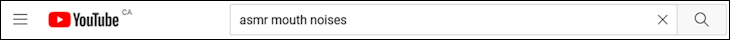
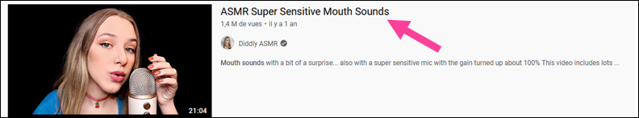
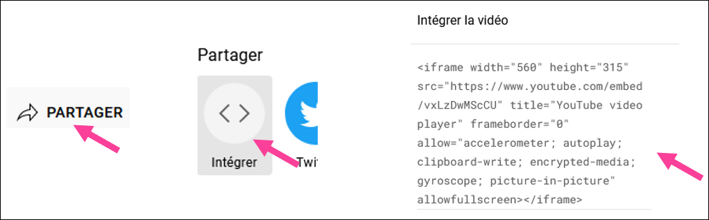
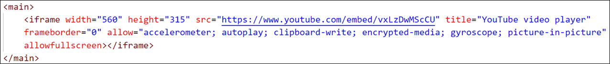
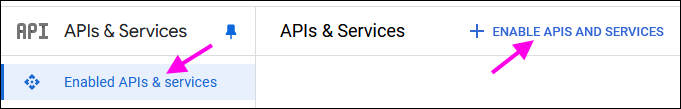
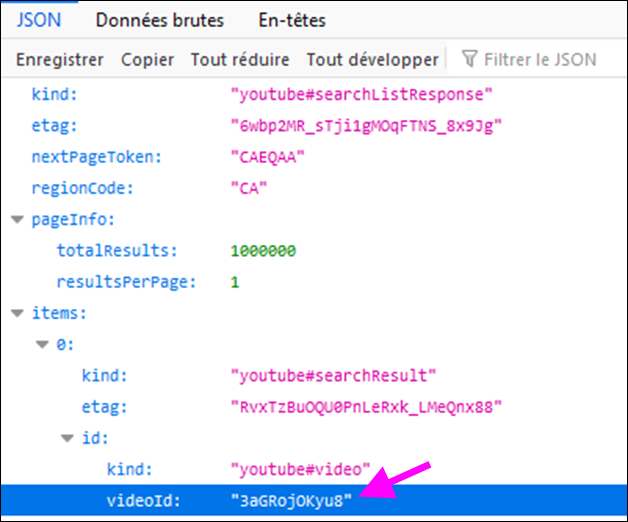
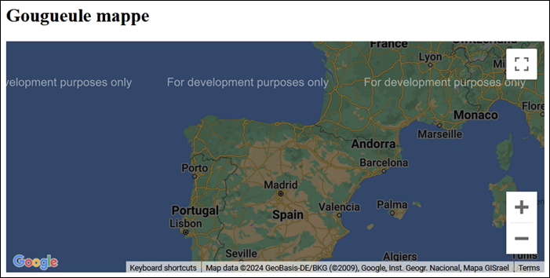
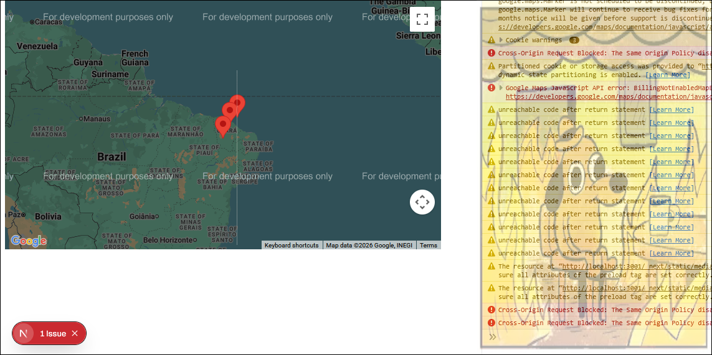

# Cours 8 - Maps, vidéos, pipes

### ▶ Intégration YouTube

Dans la section qui suit, nous aborderons comment intégrer un lecteur vidéo YouTube à une page Web Next.js, mais aussi
comment envoyer une requête à l'**API Web de YouTube** pour rechercher et afficher une vidéo.

#### 📽 Lecteur YouTube avec \<iframe\>

Pour afficher une **vidéo YouTube spécifique** dans un composant, suivez les étapes suivantes :

**Étape 1 - 🔍 Trouver une vidéo YouTube de notre choix**

<center>
    
    
</center>

**Étape 2 - 🚚 Copier le \<iframe\> prémâché dans le composant**

<center></center>

On colle dans le HTML d'un composant :

<center></center>
<br/>
:::warning

Certains attributs du `<iframe>` fourni par YouTube doivent être modifiés :

* `frameborder` peut être retiré.
* `allowfullscreen` doit être remplacé par `allowFullScreen`.
* `referrerpolicy` doit être remplacé par `referrerPolicy`.

:::

**Étape 3 (optionnelle) - 🧠 Meilleur stockage des URLs YouTube**

Si on compte afficher plusieurs vidéos YouTube dans la page, autant mettre la **partie commune**
de l'URL dans une **constante** :

```tsx showLineNumbers
"use client";

import { useState } from "react";

// Début de l'URL invariable
const YT_URL = "https://www.youtube.com/embed/";

export default function Home() {

  const [videoId, setVideoId] = useState("vxLzDwMScCU");

  return (
    <div>
      <h3>Cours 8</h3>
      {/* On a mis src={YT_URL + videoId} */}
      <iframe width="560" height="315" src={YT_URL + videoId} title="YouTube video player" 
      allow="accelerometer; autoplay; clipboard-write; encrypted-media; gyroscope; picture-in-picture; web-share" 
      referrerPolicy="strict-origin-when-cross-origin" allowFullScreen></iframe>
    </div>
  );
}
```

### 📶 Requête YouTube

**L'API Web de YouTube** permet de rechercher des vidéos à l'aide d'une requête contenant un simple texte de recherche.
En gros, c'est un peu comme si on utilisait la barre de recherche sur le site Web de YouTube, mais dans une requête.
De plus, au lieu d'avoir accès à une liste de vidéos cliquables, nous obtiendrons plutôt une liste **d'ids de vidéos**.
Ces **ids** nous permettront d'afficher une vidéo ou plusieurs vidéos à l'aide de la technique vue plus haut avec un
`<iframe>`.

Voici les étapes à suivre pour pouvoir faire des **requêtes YouTube** et afficher les vidéos obtenues :

**Étape 1 - 🔑 Obtenir une clé d'API YouTube**

Commencez par créer un compte Google.

Une fois connecté(e), rendez-vous sur cette page : [https://console.cloud.google.com/apis/credentials?](https://console.cloud.google.com/apis/credentials?)

Pour pouvoir générer une clé d'API (« Create credentials »), vous devrez : 

1. Créer un projet (remplir plusieurs champs d'un formulaire pour décrire votre application à Google)
2. « Configure consent screen » (Choisissez **external**)
3. « Create credentials » puis « API key »

Vous aurez ensuite accès à une clé d'API.

:::danger

Il se peut que Google vous redirige vers une page permettant de fournir vos informations de paiement. ⛔ Ce n'est
absolument pas nécessaire ! Vous devriez pouvoir revenir en arrière et / ou obtenir votre clé d'API sans avoir à faire cela.

:::

**Étape 2 - 🚀 Activer YouTube Data API v3**

<center></center>

Pour que nos requêtes à **l'API Web de YouTube** fonctionnent, il faudra activer l'API pour notre compte Google.
Cliquez sur « Enable APIs and services », puis cherchez l'API de YouTube pour **l'activer**.

**Étape 3 - 📬 Utiliser la requête YouTube**

Voici la requête à utiliser :

`https://www.googleapis.com/youtube/v3/search?type=video&part=id&maxResults=1&key=VOTRE_CLÉ_API&q=PHRASE_DE_RECHERCHE`

Notez les éléments suivants :

* `maxResults=1` : L'API ne nous retournera que la **première vidéo** trouvée. (Notre phrase de recherche devra être très précise...)
* `key=VOTRE_CLÉ_API` : Remplacez `VOTRE_CLÉ-API` par... votre clé d'API. 🧠
* `q=PHRASE_DE_RECHERCHE` : Remplacez `PHRASE_DE_RECHERCHE` par un `string` de votre choix. Exemple : `"cher believe"`.

:::warning

Avec le forfait gratuit, vous avez une **limite de 10 000 requêtes par jour**. Ça ne devrait pas trop poser problème à moins
que vous appeliez plusieurs requêtes maladroitement **dans une boucle**. Soyez prudents ! 👷‍♂️👷‍♀️🚧

:::

Le résultat JSON pourrait ressembler à ceci :

<center></center>

Ce qui nous intéresse le plus est `videoId` car nous pourrons l'utiliser pour afficher la vidéo avec un `<iframe>`.

**Étape 4 - 📽 Afficher la vidéo**

Que faire avec **l'id obtenu** ? Comme on a vu plus haut, il suffit de le glisser à la fin de l'URL `https://www.youtube.com/embed/`
dans un `<iframe>`.

### 🗺 Intégration Google Maps

<center></center>

Notez qu'il faudra activer une autre API (« Maps JavaScript API ») pour pouvoir afficher une **carte Google** dans notre application Web.

**Étape 1 - 📦 Installer une dépendance**

`npm install @react-google-maps/api`

**Étape 2 - ⚙ Préparation de trois constantes**

(Dans le **composant** de votre choix)

Il faudra copier-coller votre **clé d'API Google 🔑** dans la propriété `googleMapsApiKey`. (La même que pour YouTube)

```tsx showLineNumbers
export default function Home() {
  
  // Coordonnées du centre de la carte au chargement de la page et niveau de zoom
  const center = { lat: -4, lng: -40 };
  const zoom = 4;

  // Ce « useJsApiLoader » permet de charger un script JavaScript sur le pouce
  // afin de pouvoir exécuter correctement la carte Google.
  const { isLoaded } = useJsApiLoader({
    id : "google-map-script",
    googleMapsApiKey : "mEtTeZvOtRePrOpReCléHiHihiUwU"
  });

  // ...

```

**Étape 3 - 🗺 Placer un élément `<google-map>`**

```tsx showLineNumbers
<h2>Gougueule mappe</h2>

{ isLoaded && 
<GoogleMap 
  center={center} 
  zoom={zoom} 
  mapContainerStyle={{ width: "700px", height : "400px" }}
>
</GoogleMap>}
```

:::info

* `isLoaded` est utilisé pour attendre que le `JsApiLoader` soit prêt avant d'afficher la carte.
* `center` est la position initiale de la carte.
* `zoom` est le niveau de ... zoom 🧠 initial.
* `mapContainerStyle` permet de définir la largeur et la hauteur.

:::

<center></center>

:::warning

C'est normal qu'il y ait une erreur signalée par Next.js ainsi que quelques dizaines d'erreurs et d'avertissements dans la console lorsqu'on utilise une carte Google et / ou un lecteur YouTube. Nous vivrons avec 🚒🔥

<center></center>

:::

### 🚩 Ajouter des marqueurs sur une carte

Suivez les étapes suivantes pour afficher des marqueurs / punaises 📍 sur une carte Google.

**Étape 1 - 📍 Créer un tableau de marqueurs**

```tsx showLineNumbers
export default function Home() {
  
  const [markers, setMarkers] = useState([
    {lat : 42, lng : -4},
    {lat : 40, lng : 0},
    {lat : 48, lng : -8}
  ]);

  // ...

}
```

**Étape 2 - 📋 Intégrer le tableau de marqueurs à la carte**

```tsx showLineNumbers
{ isLoaded && 
<GoogleMap 
  center={center} 
  zoom={zoom} 
  mapContainerStyle={{ width: "700px", height : "400px" }}
>
  {/* Pour chaque marqueur, on crée un élément <Marker> */}
  {markers.map((m, index) => 
    <Marker key={index} position={{lat:m.lat,lng:m.lng}}></Marker>
  )}
</GoogleMap>}
```

**Étape 3 (optionnelle) - 📬 Permettre d'ajouter des marqueurs**

Si jamais vous aimeriez pouvoir ajouter des marqueurs supplémentaires dynamiquement dans le
tableau `markers`, le code pourrait ressembler à ceci :

```tsx
setMarkers([...markers, {lat : xValue, lng : yValue}]);
```

Dans le code ci-dessus, `xValue` et `yValue` doivent être des données de type `number`. Attention
de bien respecter la structure de l'objet avec les accolades `{ ... }` et les étiquettes `lat` et
`lng`.

:::warning

Attention ! Les valeurs pour `lat` et `lng` doivent absolument être des `number`. Si jamais vous souhaitez
convertir un `string` (Ex : `"-4.521"`) en `number`, vous pouvez utiliser `parseFloat(monString)`. Ce sera
nécessaire dans le **TP2** puisque l'API **BandsInTown** fournit les coordonnées des concerts sous forme 
de `string`.

:::
