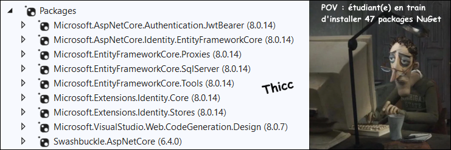

import Tabs from '@theme/Tabs';
import TabItem from '@theme/TabItem';

# Cours 22 - Rôles

## 👮‍♀️👨‍🍳 Rôles

Identifier qui envoie la requête à l'aide de ...  
`User? user = await _userManager.FindByIdAsync(User.FindFirstValue(ClaimTypes.NameIdentifier)!);`  
... nous aide à limiter l'accès aux données, mais ce n'est pas suffisant : il faudra aussi utiliser les **rôles** pour limiter l'accès **aux actions**.

### 📦 Packages

Il n'y en a pas de nouveaux par rapport à avant ! Assurez-vous simplement que tout soit déjà installé.

<center></center>

:::warning

Comme toujours, assurez-vous d'utiliser la dernière version `8.X.X` pour tous les packages. (Sauf `Swashbuckle`)

:::

### 🫃 Créer un rôle

Il y plusieurs manières de le faire. Par souci de simplicité, on pourrait le faire avec **seed** :

```cs showLineNumbers
protected override void OnModelCreating(ModelBuilder builder){
    
    base.OnModelCreating(builder);

    // Rôles
    builder.Entity<IdentityRole>().HasData(
        new IdentityRole { Id = "1", Name = "admin", NormalizedName = "ADMIN" },
        new IdentityRole { Id = "2", Name = "moderator", NormalizedName = "MODERATOR" }
    );

    // Utilisateur(s)
    PasswordHasher<User> hasher = new PasswordHasher<User>();
    User u1 = new User{
        Id = "11111111-1111-1111-1111-111111111111",
        UserName = "Bob69",
        Email = "bobibou@mail.com",
        NormalizedUserName = "BOB69",
        NormalizedEmail = "BOBIBOU@MAIL.COM"
    };
    u1.PasswordHash = hasher.HashPassword(u1, "Salut1!");
    builder.Entity<User>().HasData(u1);

    // Relation entre utilisateurs et rôles
    builder.Entity<IdentityUserRole<string>>().HasData(
        new IdentityUserRole<string> { UserId = u1.Id, RoleId = "1" } // Bob69 est un admin ! Wouhou 🥳
    );

}
```

### 🔑 Inclure les rôles dans le token

On le faisait déjà ! Il suffit de continuer d'utiliser la même méthode pour la connexion :

```cs showLineNumbers
[HttpPost]
public async Task<ActionResult> Login(LoginDTO login)
{
    User? user = await _userManager.FindByNameAsync(login.Username);

    if (user != null && await _userManager.CheckPasswordAsync(user, login.Password))
    {
        // ⛔ Récupérer les rôles de l'utilisateur ⛔
        IList<string> roles = await _userManager.GetRolesAsync(user);
        List<Claim> authClaims = new List<Claim>();
        foreach (string role in roles)
        {
            authClaims.Add(new Claim(ClaimTypes.Role, role));
        }
        authClaims.Add(new Claim(ClaimTypes.NameIdentifier, user.Id));

        // Générer et chiffrer le token 
        SymmetricSecurityKey key = new SymmetricSecurityKey(Encoding.UTF8
            .GetBytes("LooOOongue Phrase SiNoN Ça ne Marchera PaAaAAAaAas !"));
        JwtSecurityToken token = new JwtSecurityToken(
            issuer: "https://localhost:6969",
            audience: "http://localhost:3000",
            claims: authClaims, // ⛔ Rôle(s) joint(s) au token !
            expires: DateTime.Now.AddMinutes(30),
            signingCredentials: new SigningCredentials(key, SecurityAlgorithms.HmacSha256Signature)
            );

        // Envoyer le token à l'application cliente sous forme d'objet JSON
        return Ok(new
        {
            token = new JwtSecurityTokenHandler().WriteToken(token),
            validTo = token.ValidTo
        });
    }
    else
    {
        return StatusCode(StatusCodes.Status400BadRequest,
            new { Message = "Le nom d'utilisateur ou le mot de passe est invalide." });
    }
}
```

### 🔒 Limiter l'accès aux actions

Pour limiter l'usage d'une action (donc d'une requête) à certains rôles, on utilise l'annotation `[Authorize(Roles = "...")]`.

Il faut être **admin** 👑 pour utiliser cette action : 

```cs showLineNumbers
[HttpGet]
[Authorize(Roles = "admin")]
public async Task<IActionResult> DoSomethingSus(){
    ...
}
```

Il faut être admin 👑 **OU** modérateur ⚖ pour utiliser cette action : 

```cs showLineNumbers
[HttpGet]
[Authorize(Roles = "admin, moderator")]
public async Task<IActionResult> DoSomethingSus(){
    ...
}
```

Il faut être admin 👑 **ET** modérateur ⚖ pour utiliser cette action : 

```cs showLineNumbers
[HttpGet]
[Authorize(Roles = "admin")]
[Authorize(Roles = "moderator")]
public async Task<IActionResult> DoSomethingSus(){
    ...
}
``` 

On peut également vérifier le rôle d'un utilisateur **dans le code de l'action**. C'est pratique dans certaines situations.

```cs showLineNumbers
User? user = await _userManager.FindByIdAsync(User.FindFirstValue(ClaimTypes.NameIdentifier)!);
bool isAdmin = await _userManager.IsInRoleAsync(user, "admin");

// On n'a pas le droit d'exécuter l'opération si on est NI propriétaire de l'objet, NI administrateur.
if (myObject.User != user && !isAdmin) return Unauthorized();
``` 

### 🏅 Assigner un rôle

```cs showLineNumbers
[HttpPut]
[Authorize(Roles = "admin")]
public async Task<IActionResult> MakeRedactor(string username){
    
    User? newRedactor = await _userManager.FindByNameAsync(username);
    if(newRedactor == null) return NotFound(new { Message = "Cet utilisateur n'existe pas. 👻" });

    await _userManager.AddToRoleAsync(newRedactor, "redactor");
    return Ok(new { Message = username = " est maintenant rédacteur / rédactrice ! ✍" });

}
``` 

:::tip

Pour retirer un rôle, c'est très similaire :

```cs
await _userManager.RemoveFromRoleAsync(newRedactor, "redactor");
```

:::

### 🥚 Créer un rôle dynamiquement

Il faudra utiliser le `RoleManager` pour y arriver. On peut l'**injecter dans un contrôleur** exactement comme le `UserManager`.

```cs showLineNumbers
[HttpPost]
[Authorize(Roles = "admin")]
public async Task<IActionResult> PostRole(string roleName){
    
    bool roleExists = await _roleManager.RoleExistsAsync(roleName);
    if(roleExists) return BadRequest(new { Message = "Le rôle existe déjà." });

    IdentityResult result = await _roleManager.CreateAsync(new IdentityRole { Name = rolename});
    if(result.Succeeded) return Ok(new { Message = "Rôle " + roleName + " créé !" });
    else return BadRequest(new { Message = "La création du rôle a échoué." });

}
```

## 👤 Identité côté client

Parfois, côté client, on souhaite :

* Cacher certains boutons ou menus qui sont seulement disponibles pour certains **rôles**.
* Cacher certains boutons ou menus qui sont seulement disponibles pour les utilisateurs **authentifiés**.
* Afficher le **nom d'utilisateur** de ... l'utilisateur, s'il est connecté.
* etc.

Problème : La **gestion des utilisateurs** existe seulement **côté serveur**. Il n'y a pas de notions de `User` ou de `Role` **côté client**.

Il est tout de même possible de *bricoler* des solutions pour réaliser les défis mentionnés ci-dessus, mais il faut garder à l'esprit que cela ne permettra jamais de **sécuriser** l'application, seulement de **raffiner** l'apparence. Pour rappel, les utilisateurs ont **accès à tout le code** des composants qui sont `"use client";` !

⛔ Gardons tout de même à l'esprit que les utilisateurs n'aiment pas voir des menus ou boutons qui ne leur sont pas destinés.

### 🔑 Données de connexion

Pour rappel, lorsqu'on se **connecte**, on envoyait le token à l'application cliente :

```cs showLineNumbers
return Ok(new
{
    token = new JwtSecurityTokenHandler().WriteToken(token), // Token !
    validTo = token.ValidTo
});
```

Or, on peut également envoyer d'**autres informations** si on veut !

```cs showLineNumbers
return Ok(new
{
    token = new JwtSecurityTokenHandler().WriteToken(token),
    validTo = token.ValidTo,
    username = user.UserName, // Pseudo !
    roles = roles // List<string> des rôles !
});
```

Côté client, on peut récupérer ces informations et les utiliser pour cacher des menus et boutons ou personnaliser l'apparence de l'interface selon l'identité.

```tsx showLineNumbers
async function login(loginDTO : any){

    const x = await axios.post(domain + "api/Users/Login", loginDTO);
    console.log(x.data);

    // 🔑 On stocke le token... et les autres infos !
    sessionStorage.setItem("token", x.data.token);
    sessionStorage.setItem("username", x.data.username);
    sessionStorage.setItem("roles", JSON.stringify(x.data.roles));

    // 📬 Ça peut aussi être dans des états
    setUsername(x.data.username);
    setRoles(x.data.roles);

    // 🤷‍♂️ On peut aussi retourner les données pour qu'une autre fonction les utilise
    return x.data;

}
```

:::tip

✅ Stocker les données de l'utilisateur dans des **états** sera très intéressant pour gérer des **affichages conditionnels** dans le HTML. Cela dit, les données seront perdues si on réactualise la page.

💾 Stocker les données de l'utilisateur dans le **stockage du navigateur** n'est pas très pratique pour gérer les affichages conditionnels, mais c'est parfait pour s'assurer que les données puissent être récupérées avec `useEffect()` et les faire perdurer malgré un *reload*.

Combinez les **deux** stratégies autant que possible. Les **Contexts** pourraient même servir afin de **partager** ces données entre **plusieurs commposants** dans certains cas.

:::

### 📦 DTOs différenciés selon l'identité

Une autre stratégie possible est d'exploiter les *DisplayDTOs*. Par exemple, voici, les classes `Comment.cs` et `CommentDisplayDTO.cs`. Bien entendu, ce sont des `CommentDisplayDTO` qui seront envoyés au **client** car ils sont **plus adaptés** au projet **Next.js**.

<Tabs>
    <TabItem value="cs1" label="Comment.cs">
```cs showLineNumbers
public class Comment{

    public int Id { get; set; }
    public string Text { get; set; } = null!;
    
    [InverseProperty("Comments")]
    public virtual User Author { get; set; } = null!;

    [InverseProperty("Upvotes")]
    public virtual List<User> Upvoters { get; set; } = new List<User>();

    [InverseProperty("Downvotes")]
    public virtual List<User> Downvoters { get; set; } = new List<User>();
}
```
    </TabItem>
    <TabItem value="cs2" label="CommentDisplayDTO.cs" default>
```cs showLineNumbers
public class CommentDisplayDTO{

    public int Id { get; set; }
    public string Text { get; set; } = null!;
    public string Author { get; set; } = null!; // Simple pseudo plutôt qu'objet User
    public int Upvotes { get; set; } // Nombre d'upvotes plutôt que la liste des upvoters
    public int Downvotes { get; set; } // Nombre de downvotes plutôt que la liste des upvoters

    public CommentDisplayDTO(Comment comment){
        Id = comment.Id;
        Text = comment.Text;
        Author = comment.User.UserName;
        Upvotes = comment.Upvoters.Count;
        Downvotes = comment.Downvotes.Count;
    }
}
```
    </TabItem>
</Tabs>

Or, nous pourrions également en profiter pour inclure certaines données qui varient selon l'identité de l'utilisateur :

```cs showLineNumbers
public class CommentDisplayDTO{

    public int Id { get; set; }
    public string Text { get; set; } = null!;
    public string Author { get; set; } = null!;
    public int Upvotes { get; set; }
    public int Downvotes { get; set; }

    public bool IsAuthor { get; set; } // Celui qui envoie la requête est-il l'auteur ?
    public bool HasUpvoted { get; set; } // Celui qui envoie la requête a déjà posivoté ?
    public bool HasDownvoted { get; set; } // Celui qui envoie la requête a déjà négavoté ?

    public CommentDisplayDTO(Comment comment, User user){ // On demande le User en paramètre
        Id = comment.Id;
        Text = comment.Text;
        Author = comment.User.UserName;
        Upvotes = comment.Upvoters.Count;
        Downvotes = comment.Downvotes.Count;

        // Remplir les nouvelles propriétés
        IsAuthor = user.UserName == Author;
        HasUpvoted = comment.Upvoters.Contains(user);
        HasDownvoted = comment.Downvoters.Contains(user);
    }
}
```

Avec ces nouvelles propriétés, on pourrait facilement modifier l'apparence d'un commentaire **côté client** :

* Cacher le bouton pour Modifier / Supprimer le commentaire si `IsAuthor` est `false`.
* Changer la couleur des boutons pour upvote / downvote selon la valeur de `HasUpvoted` et `HasDownvoted`.
* Changer la couleur de fond du commentaire si `IsAuthor` est `true`.
* etc.