# Cours 23 - Git et TP4

## 👥 Git à deux

Fonctionnement général :

* Nous n'allons jamais **merge** dans `main`. (Seulement une fois, à la fin du TP)
* À chaque nouvelle fonctionnalité à implémenter, on crée une **branche** à partir de la branche `dev`.
* Une fois une fonctionnalité terminée, on **merge** `dev` dans la branche de la fonctionnalité pour d'abord résoudre les conflits.
* Une fois les conflits résolus, on pourra faire l'inverse : **merge** la branche de la fonctionnalité dans `dev`.
* Puis on recommence pour la prochaine fonctionnalité.
* Chaque partenaire travaille toujours **seul(e) sur sa propre branche**.

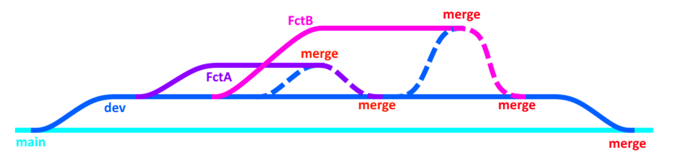

:::tip

* N'oubliez pas de faire des **push** fréquents si vous souhaitez que votre partenaire puisse voir vos commits, branches et merges.
N'oubliez pas de faire un **pull** si vous souhaitez voir le progrès de votre partenaire. (Surtout avant de merge dans `dev`)

:::

## 🥚 Setup initial du repo

1. Créer le repo sur Github

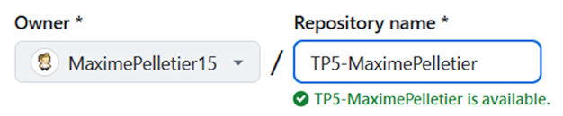

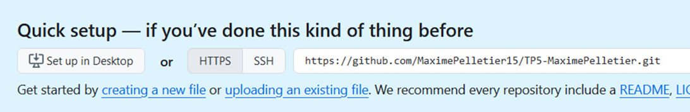

2. Cloner le repo avec **Fork** et y glisser les fichiers de départ.

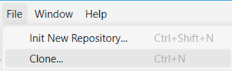

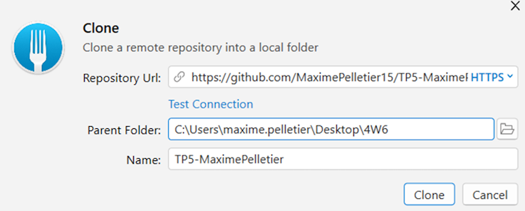

3. Commit les fichiers de départ sur `main`, puis créer une branche `dev` puis push `dev`.

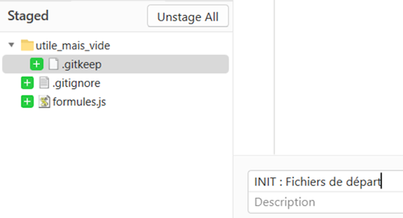

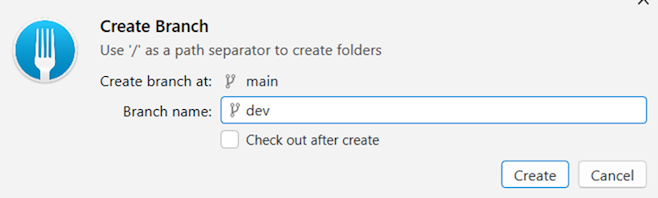  
N'oubliez pas de push `dev` !

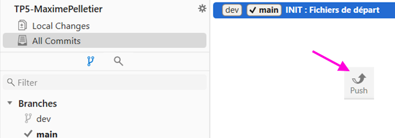

4. Ajouter le partenaire en collaborateur et cloner de son côté

5. Faire chacun votre sous-branche dans `dev`

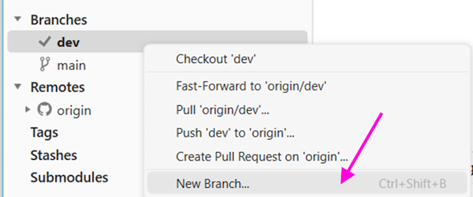

Tant que vous n'aurez pas chacun fait un commit dans votre sous-branche, elles seront toutes embarqués les unes sur les autres comme ceci :

:::danger

Attention de bien sélectionner (double-clic) la bonne branche avant de commencer à coder !

:::

## 🌌 Merge de branches

Il est crucial de **d'abord merge `dev` dans votre sous-branche**, de résoudre les conflits sur votre sous-branche, puis, une fois que vous avez tout testé, de finalement **merge votre sous-branche dans `dev`**. De cette manière, `dev` est censée être toujours fonctionnelle.

S'il n'y a aucun autre merge dans `dev` depuis que vous avez créé votre sous-branche, il n'y aura pas de conflits et vous pourrez directement **merge dans `dev`**.

1. Sélectionner votre branche et merge `dev` dedans :

    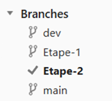
    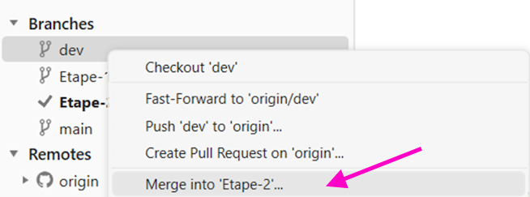

2. Résoudre les conflits (s'il y en a)

🚪 Notez qu'il faudra faire la gestion de conflits dans `Visual Studio` et dans `VS Code`. L'exemple ci-dessous est avec `VS Code`.

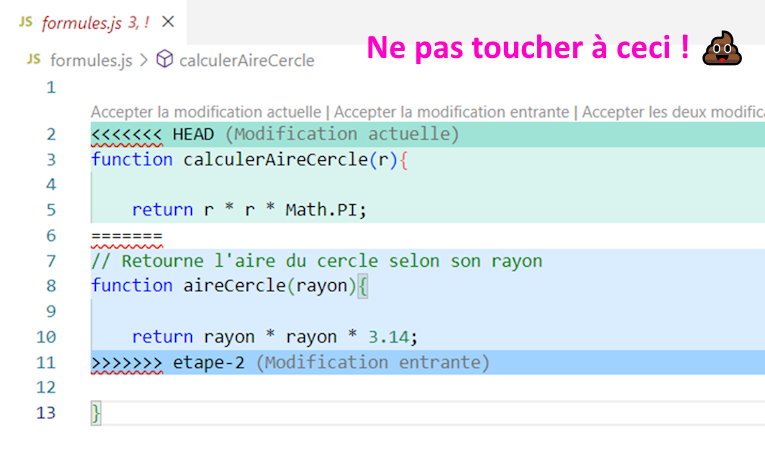

L'objectif est de s'assurer que le **code en bas** correspond au résultat souhaité. Vous pouvez l'éditer manuellement au besoin en vous servant des deux versions en conflit qui sont en haut.

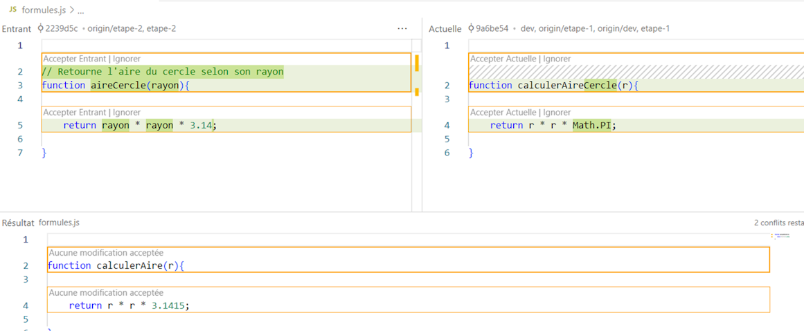

Il va falloir faire un aller-retour entre VS Code et Fork **pour chaque fichier**.

:::warning

S'il y a plusieurs fichiers en conflit, réglez-les dans l'ordre suivant :

1. Modèles
2. Services
3. Contrôleurs / composants

Inutile de gérer les conflits pour les migrations ! Au pire, supprimez les migrations et recréez-en sur votre prochaine branche.

:::

3. Retourner dans **Fork** pour conclure le merge

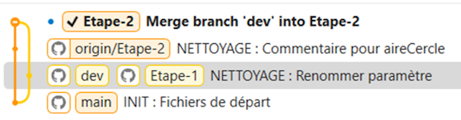

4. ⛔ TESTEZ votre code.

S'il y a des bugs, faites un commit supplémentaire sur votre sous-branche pour les régler AVANT de **merge dans `dev`**.

5. Merge dans `dev`

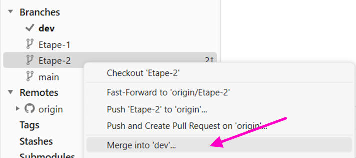

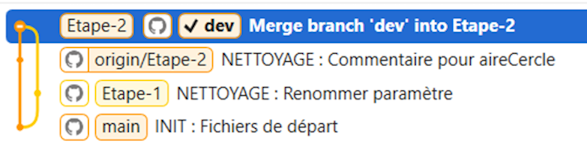

## 🤕 Erreurs fréquentes

### 🌿 J'ai travaillé sur la mauvaise branche

Par exemple, avoir fait un commit sur `dev` plutôt que dans une sous-branche : 

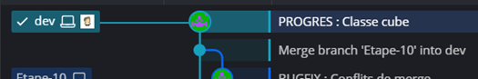

Commencez par **créer une nouvelle branche** à partir de ce commit de trop :

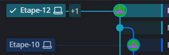

Sélectionner `dev` :

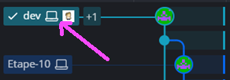

Pour ensuite faire un clic-droit sur le **commit précédent** et réinitialiser la branche `dev` à ce commit :

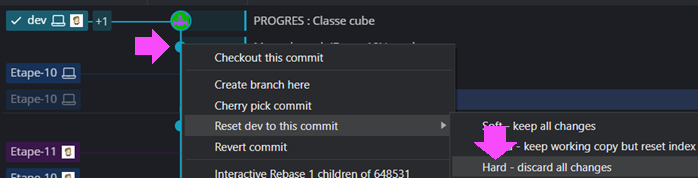

Pour le moment, cela va « dupliquer » la branche `dev` :

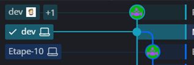

Il suffira de faire un **push** (« force push ») pour que seule la nouvelle branche `dev` soit conservée :

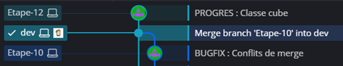

### ⏳ Revenir en arrière (annuler un commit)

Disons qu'on souhaite annuler le tout dernier commit qu'on a fait :

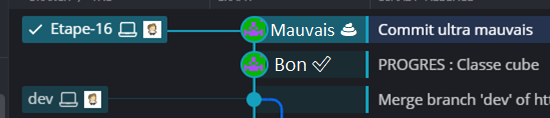

Faites un clic-droit sur le commit précédent et **réinitialisez votre branche** à celui-ci :

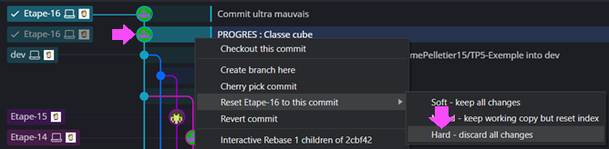

Après avoir fait un **push** (force push), vous devriez avoir ce résultat :

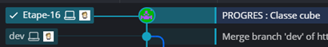

### 💥 Merge simultané accidentel

Disons que votre partenaire et vous avez fait un **merge** dans `dev` en même temps... Vous aurez des problèmes lors de votre prochain **pull** puisque la branche `dev` existera en deux versions !

Avant les merge :

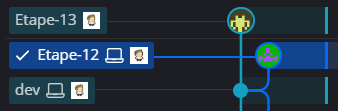

Merge réalisé par la personne 1 :

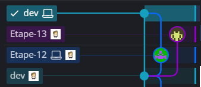

Merge réalisé par la personne 2 :

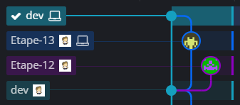

Lorsque les deux personnes feront un **push**, la première personne qui fera un **pull** aura ce problème : il y a deux versions de `dev` !

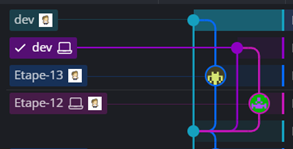

La solution sera de **merge** `dev` dans `dev` (oui oui) Alternativement, on peut aussi merge la branche `dev` générée par notre partenaire dans notre sous-branche à nous pour ne pas avoir à **gérer les conflits** directement sur `dev`. 

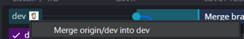

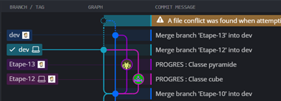

Résultat : (N'oubliez pas de **push** `dev` ensuite !)

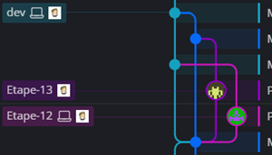

