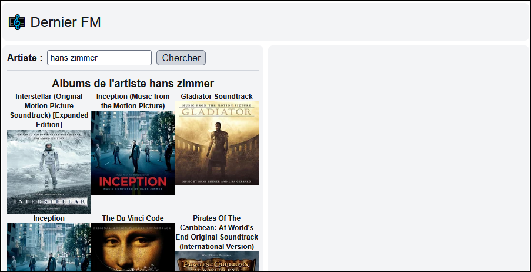
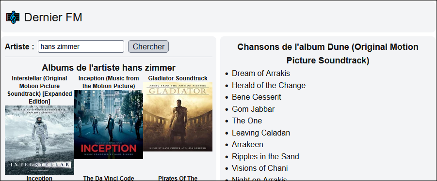
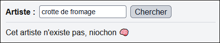

# TP1 - Dernier FM (5%)

### 📥 Remise
- 📍 Où : sur **Git** uniquement (N'oubliez pas l'invitation [https://github.com/MaximePelletier15](https://github.com/MaximePelletier15))
- ⏰ Quand : **6 février** avant **23h59**
- 👻 Pas de projet de départ pour ce TP ! `npx create-next-app@latest` 😩

### 📜 Présentation du TP

Ce premier TP sera plutôt court. 🤏 Il faudra créer une application Web **Next.js** permettant de
rechercher les albums d'un artiste et les chansons d'un album.

* 👤 Le TP doit être fait de manière **individuelle**.
* 🧰 L'usage du framework **Next.js** est obligatoire.
* 🎵 L'API Web de **Last FM** doit être utilisée.
* 👽 Attention au **plagiat**. Il est interdit de copier en partie ou complètement le code d'une autre personne ou de générer son code avec l'IA. Le niveau d'usage de l'intelligence artificielle générative permis pour ce TP est de **1**. (Se référer au plan de cours)
* 🎨 L'interface graphique de votre page Web n'a pas à être jolie ou identique à celle illustrée dans les exemples.
Il suffit qu'elle soit **simple à utiliser et claire**. Ne perdez pas trop de temps avec l'apparence.
* 🥚 Interdit d'utiliser un **laboratoire** comme point de départ. Il faut créer un nouveau projet de zéro. Cela dit, vous pouvez copier des morceaux qui viennent des laboratoires.

Clé d'API Last FM fournie : `9a8a3facebbccaf363bb9fd68fa37abf`

Requêtes à utiliser :

* Chercher les albums d'un artiste : [https://www.last.fm/api/show/artist.getTopAlbums](https://www.last.fm/api/show/artist.getTopAlbums)
* Chercher les chansons d'un album : [https://www.last.fm/api/show/album.getInfo](https://www.last.fm/api/show/album.getInfo)

:::danger
 
Si votre travail est suspecté de plagiat (code copié d'un(e) autre étudiant(e), code généré par IA, notions non abordées en classe, etc.), deux choses peuvent se produire :
 
* 💀 Le plagiat est prouvé par nos outils : Note de 0, automatiquement.
* 🔍 Le plagiat est plutôt évident, mais une validation est requise : vous serez convoqué(e) au bureau de votre enseignant(e). Vous devrez répondre à certaines questions pour prouver que vous comprenez et maîtrisez le code qui a été utilisé dans votre TP. Si vous ne réussissez pas à répondre à certaines questions, vous aurez la note de 0. (Si vous ne comprenez pas votre propre code, c'est que vous avez plagié, d'une manière ou d'une autre.)
 
:::

### ⚙ Fonctionnalités

On doit pouvoir chercher (et afficher) les albums d'un artiste en écrivant son nom :

On doit pouvoir chercher (et afficher) les chansons d'un album en cliquant sur sa pochette :

### ⚠ Exigences supplémentaires

Spoiler alert : c'est ici que vous allez perdre des points 😩

1. 🐞 Lorsque l'artiste recherché n'existe pas (et génère une erreur), un message d'erreur est affiché. Pas besoin de gérer les erreurs pour la requête des chansons par contre.

2. 🧹 Lorsqu'on cherche des albums, les précédents albums ET chansons doivent être nettoyés. Lorsqu'on clique sur un album pour chercher des chansons, les précédentes chansons doivent être nettoyées. (Mais pas les albums)

3. ➿ Les chansons d'un album sont seulement recherchées si on clique sur sa pochette. (Ne recherchez pas automatiquement toutes
les chansons de tous les albums d'un artiste ! C'est trop gourmand !)

4. ☝ Vous ne devez utiliser qu'un seul composant. (`Home`) 

5. 📦 Il est obligatoire de créer (et d'utiliser) une classe pour les albums.

6. 🎨 Il est interdit de rédiger la moindre ligne de CSS ou de créer le moindre style. (Usage de classes **Tailwind** obligatoire) Rassurez-vous, c'est seulement pour ce TP.

7. 📢 Les titres « Albums de l'artiste NOM_ARTISTE » et « Chansons de l'album NOM_ALBUM » sont obligatoires et doivent seulement disparaître / changer lorsqu'on lance une nouvelle recherche en appuyant sur le bouton ou album approprié.

### 🔱 Usage de Git

Utiliser Git sera obligatoire pour ce TP. (Et tous les suivants)

* Vous devez inviter l'enseignant ([https://github.com/MaximePelletier15](https://github.com/MaximePelletier15)) comme collaborateur dès le début du TP.
* Un minimum de trois commits est attendu. (Au moins 1 par fonctionnalité + le commit initial)
* Un titre (avec étiquette) et une description claire pour chaque commit. (Voir les [normes du département](https://info.cegepmontpetit.ca/git) au besoin)
* ⛔ Faites un push à chaque commit ! Protégez votre travail ! ⛔

### ⚖ Grille de correction

|Critère|Points|
|:-|-|
|Requête pour obtenir les albums et extraction des données JSON|3 pts|
|Requête pour obtenir les chansons et extraction des données JSON|3 pts|
|Affichage des albums|2 pts|
|Affichage des chansons|2 pts|
|Gestion des inputs de l'utilisateur (champ textuel, bouton cliquable et album cliquable)|4 pts|
|Gestion des erreurs|1 pt|
|Nettoyage d'anciens résultats|0.5 pt|
|Usage d'une classe pour les albums|1 pt|
|Titres dans la page pour les albums et les chansons|1.5 pts|
|Usage de Git approprié|2 pts|
|Pénalité en lien avec certaines exigences non respectées : interface graphique difficile à utiliser, requêtes inutiles, usage de plusieurs composants, conventions enseignées non respectées, usage de CSS ou de styles et usage d'un laboratoire comme point de départ |-10 pts|
|Total|20 pts|

