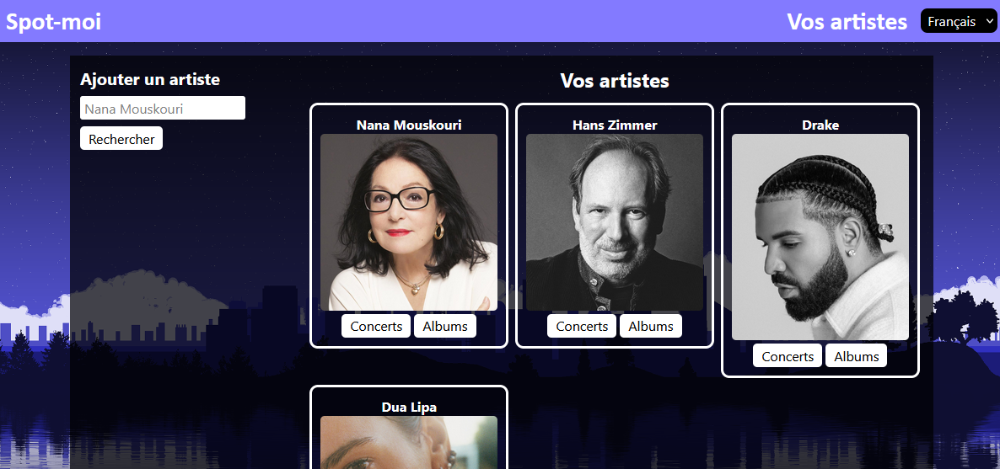
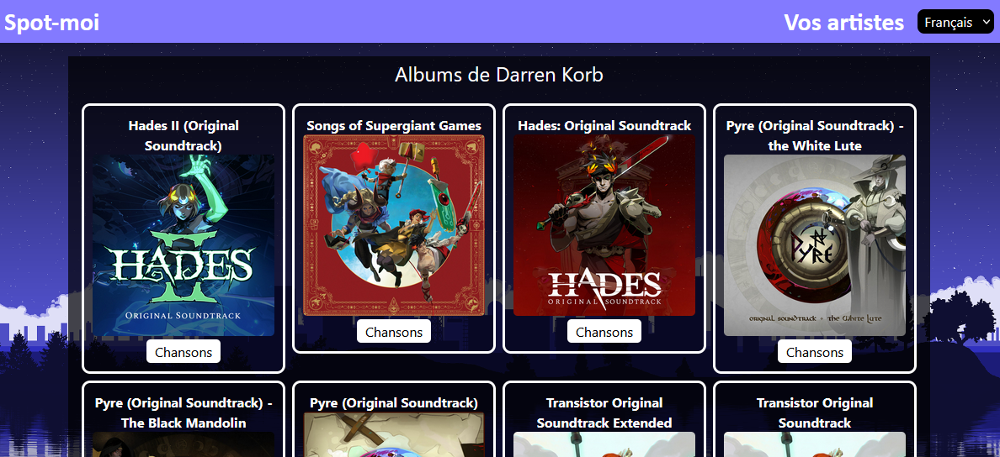
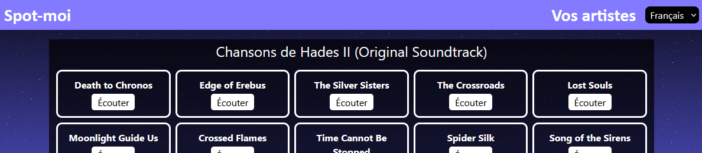
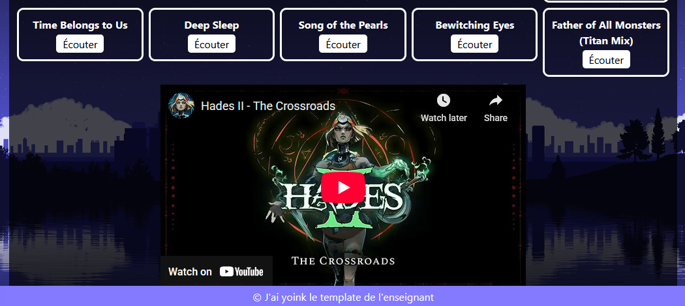
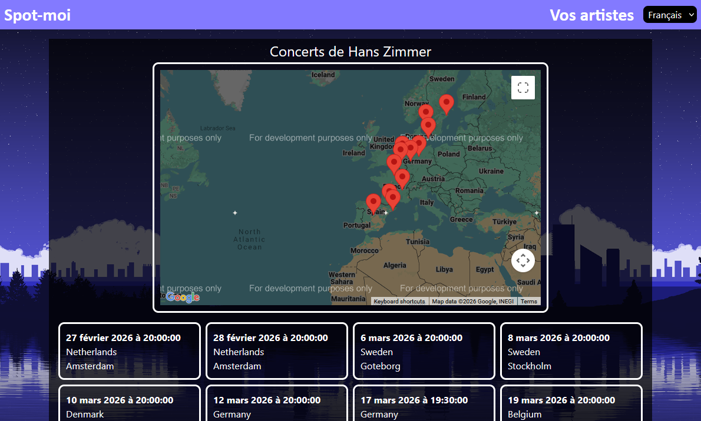

# TP2 - Spot-moi (20%)

🎁📦 Tout le HTML et le CSS de l'application vous sont fournis. [Cliquez ici](../../static/files/tp2_html_css.zip).

:::warning

Les fichiers de départ correspondent à du HTML et à du CSS vanille. Il faudra adapter le HTML et le CSS à la structure
d'un projet **Next.js** ! (Diviser en composants, déplacez les parties répétitives comme le `<header>` et `<footer>` dans un **layout**, etc.)
De plus, vous devrez déplacer les images dans un dossier du projet Next.js et réparer les `src` des éléments ``.

:::

## 📝 Consignes

* ⛔ Remise partielle : **26 février 17h59** (ou avant), **en classe**. [Explications ici](/tp/tp2#-remise-partielle)
* 📅 Date de remise : **6 mars 23h59**
* 🌐 Le framework **Next.js** doit être utilisé.
* 👤 Le projet doit être fait individuellement. Attention au plagiat.
* ⏰ Vous avez 4 cours (12h en classe !) consacrés au TP, **profitez-en**. (_Narrator : "... and nobody did"_)
* 🐙 Vous devez utiliser au moins **4 composants**, c'est-à-dire un par page.
* 👅 L'application doit être disponible en français et en anglais.

En résumé, nous réaliserons une **application Web client** permettant d'explorer des données musicales en utilisant les API **Spotify**, **Youtube** et **BandsInTown**. Nous utiliserons également **Google Maps**.

Si vous avez du mal à commencer le TP, suivez les instructions dens la section [😵 Ses tro compliquais](/tp/tp2#-ses-tro-compliquais).

:::danger
 
Si votre travail est suspecté de plagiat (code copié d'un(e) autre étudiant(e), code généré par IA, notions non abordées en classe, etc.), deux choses peuvent se produire :
 
* Le plagiat est prouvé par nos outils : Note de 0, automatiquement.
* Le plagiat est plutôt évident, mais une validation est requise : vous serez convoqué(e) au bureau de votre enseignant(e). Vous devrez répondre à certaines questions pour prouver que vous comprenez et maîtrisez le code qui a été utilisé dans votre TP. Si vous ne réussissez pas à répondre à certaines questions, vous aurez la note de 0. (Si vous ne comprenez pas votre propre code, c'est que vous avez plagié, d'une manière ou d'une autre.)
 
:::

## 👨‍🎨👩‍🎨 Page d'accueil

À partir de la page d'accueil, l'utilisateur pourra rechercher des artistes (API Spotify) pour les afficher. Rechercher un artiste
l'affiche et l'ajoute automatiquement aux « favoris ». (Favoris veut simplement dire que si on réactualise la page, les artistes
recherchés resteront présents) 

Il y aura également un bouton pour nettoyer tous les artistes. (Tous les favoris) Sous chaque artiste, il y a un bouton pour aller vers
la **page des concerts de l'artiste** et un bouton pour aller vers la **page des albums de l'artiste**.

## 💿 Page des albums

Accessible en cliquant sur le bouton « **Albums** » sous un artiste de la page d'accueil.

* On affiche le titre « Albums de NOM_ARTISTE » en haut.
* On affiche tous les albums de l'artiste (titre et pochette) à l'aide d'une requête à **Spotify**.
* Un bouton sous chaque album permet de naviguer vers la **page des chansons de l'album**.

## 🎵 Page des chansons

Accessible en cliquant sur le bouton « **Chansons** » sous un album dans la page des albums.

* On affiche le titre « Chansons de NOM_ALBUM » en haut.
* On affiche le titre de toutes les chansons de l'album à l'aide d'une requête à **Spotify**.
* Un bouton sous chaque chanson permet d'afficher la chanson dans un **lecteur YouTube** pour la faire jouer
à l'aide de **l'API de YouTube**.
  * ⛔ N'envoyez pas de requête pour une chanson qui n'a pas été cliquée !

:::warning

Pour que la requête YouTube fonctionne dans 99.99% des cas (ce qui est nécessaire pour ce TP), assurez-vous
de fournir le **nom de l'album** ET le **nom de la chanson** dans la phrase de recherche. Autrement, une chanson
avec un nom trop générique risque de donner un résultat invalide.

:::

## 🎤 Page des concerts

Accessible en cliquant sur le bouton « **Concerts** » sous un artiste dans la page d'accueil.

* On affiche le titre « Concerts de NOM_ARTISTE ».
* On affiche tous les concerts (date et heure qui respectent la *locale*, mais pays et ville juste en anglais) à l'aide de l'API **BandsInTown**.
    * 📶 Requête : `https://rest.bandsintown.com/artists/MON_ARTISTE/events?app_id=API_KEY`
    * 🔑 Clé d'API fournie : `2b32475766802ac01eefda45e9e42ea0`
* On affiche une carte **Google** avec un marqueur pour chaque concert.
    * 👻 Affichez un **message spécial** sous la carte si l'artiste n'a aucun concert.
    * 💡 Sachant que l'API **BandsInTown** vous fournit la latitude et longitude pour chaque concert, placer les marqueurs est possible facilement.

:::warning

**BandsInTown** vous fournira la latitude et la longitude pour chaque concert... sous forme de `string`. N'oubliez pas
de convertir ces valeurs en `number` avec la fonction `parseFloat(monString)` ou avec l'opérateur `+` placé devant la valeur.

:::

## 🤬 Exigences supplémentaires

* 🐙 Vous devez utiliser au minimum **4 composants**, c'est-à-dire un par page.
* 👅 L'application doit être disponible en français et en anglais. (16 textes à traduire)
* 📶 Il faut utiliser un **intercepteur** pour la gestion du **token Spotify**.
* ⚙ La requête de **connexion à Spotify**, qui risque d'être nécessaire dans 3 pages, doit être dans un **hook** pour ne pas la répéter !
* 💾 Le **stockage local** a été utilisé pour ranger les artistes dans les favoris.
* 🔱 Vous devez faire **au moins 8 commits** clairs. L'enseignant(e) doit être invité(e) sur Git dès le début du TP.
* 📦 Il est obligatoire d'utiliser au moins 3 classes : `Album`, `Artist` et `Show`.

## ⛔ Remise partielle

Avant le **26 février 17h59**, en **classe**, il faut montrer à l'enseignant(e) que vous avez terminé la **page des artistes**. (Ceci n'inclut pas l'internationalisation) Si vous ne réalisez pas cette démonstration, **vous perdez 25%**.

## ✅ Grille de correction

|Critère|Points|
|:-|:-|
|**⚙ Fonctionnement général** * 4 composants sont utilisés. * Les classes `Album`, `Artist` et `Show` existent et sont utilisées. * Les paramètres de route dynamique et les boutons de navigation sont fonctionnels. * Un hook a été utilisé pour la connexion à Spotify. * L'application est disponible en français et en anglais. * Un intercepteur a été utilisé pour l'authentification à Spotify| 1 pt 1 pt 3 pts 3 pts 7 pts 2 pts|
|**👨‍🎨 Page d'accueil (Artistes)** * Mini-formulaire de recherche * Requête à Spotify * Affichage des artistes * Artistes sauvegardés dans le stockage local * Bouton pour nettoyer le stockage local| 1 pt 3 pts 2 pts 3 pts 1 pt|
|**💿 Page des albums** * Titre avec nom de l'artiste en haut * Requête à Spotify * Affichage des albums (titre et pochette)| 0.666 pt 3 pts 2 pts|
|**🎵 Page des chansons** * Titre avec nom de l'album en haut * Requête à Spotify * Affichage des chansons * Affichage du lecteur YouTube sur demande avec résultat valide.| 0.666 pt 3 pts 1 pt 4 pts|
|**🎤 Page des concerts** * Titre avec nom de l'artiste en haut * Affichage des concerts (Date et heure localisés, pays et ville) * Requête à BandsInTown * Message spécial si aucun concert * Affichage de la carte Google avec marqueurs| 0.666 pt 4 pts 4 pts 1 pt 4 pts|
|**📰 Git** * Au moins 8 commits ont été réalisés. * Les commits sont clairs et respectent les conventions du département. * L'enseignant a été invité en tant que collaborateur.| 1 pt 3 pts 1 pt|
|**☢ Pénalités variées** * Pénalité par tranche de 24h de retard entamée. Oui, cinq minutes, c'est un retard. * Retard de 6+ jours. * Interface particulièrement déformée ou difficile à utiliser. * Non-respect de conventions de l'architecture Next.js. * Pas de remise partielle. * Le projet ne compile pas.| -10% pts -100% pts -10 pts -10 pts -15 pts -15 pts|
|Total|60 pts|

## 😵 Ses tro compliquais

:::warning

N'oubliez pas que **toutes les requêtes Spotify** (Connexion, artiste, albums et chansons) sont déjà codées pour vous et sont disponibles dans le [Cours 7](/notes/rencontre4.1#-exemples-de-requêtes-à-spotify-pour-le-tp2). Seule la requête **BandsInTown** sera codée par vous-même.

:::

La réalisation d’un projet **Next.js** avec plusieurs composants peut être intimidante. Voici une séquence suggérée (loin d’être incontournable) pour avancer dans le projet :

1. 📦 Créer tous les composants dont vous aurez besoin. (Cours 5)
    * N'oubliez pas qu'un **layout** est pratique pour les headers et footers répétitifs.
    * ⛔ Le HTML et le CSS de départ fournis ne conviennent pas du tout à la structure d'un projet Next.js ! Il faudra tout restructurer
sous forme de composants. Par exemple, n'oubliez pas que les éléments `<head>` et `<body>` sont déjà présents dans `layout.tsx`.
    * Préparez le routage (création des bons dossiers) de votre application. Êtes-vous capable d’accéder à tous les composants que vous avez créés en modifiant l'URL ?
2. ⚱ Préparer des classes (`/app/_types`) pour encapsuler les données. (Cours 1)
    * Quel type de données aurez-vous à afficher dans vos pages Web ? Vous pourriez déjà préparer les classes de vos modèles en conséquence.
3. ✅ Rendre vos composants fonctionnels, un à la fois. (Cours 5 à 8)
    * Le gros du travail ! Un composant à la fois, compléter l’interface HTML puis rendre fonctionnels les formulaires et requêtes qui permettent à l’utilisateur d’interagir avec la page.
    * ⚠⚠⚠ Généralement, la dynamique ressemble à ceci quand on navigue vers une autre page :
      1. Un paramètre de route contient le **nom** et / ou **l'id Spotify** de l’artiste / l’album à chercher. On tente de récupérer ce paramètre.
      2. On lance une requête à l’API appropriée grâce au paramètre de route reçu.
      3. On obtient les données dans un objet JSON et on les affiche.
4. 👅 Internationaliser. (Cours 7)
    * Si tout fonctionne et que vous êtes satisfait(e) de votre application, c’est l’heure de tout traduire !
    * Les seuls nouveaux défis que vous devriez rencontrer en comparaison avec le labo 7 est la nécessité de diviser le layout et la traduction de dates. Ces deux défis sont abordés dans les notes de cours ! 
