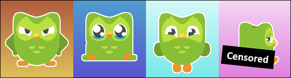
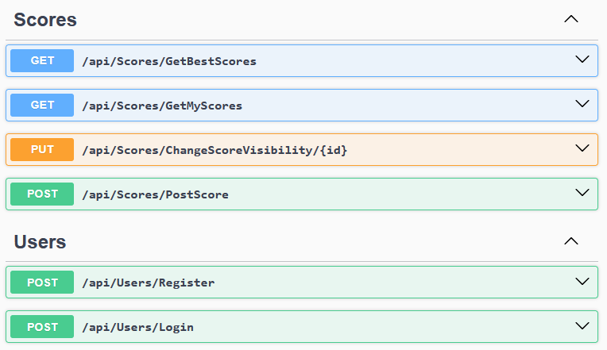
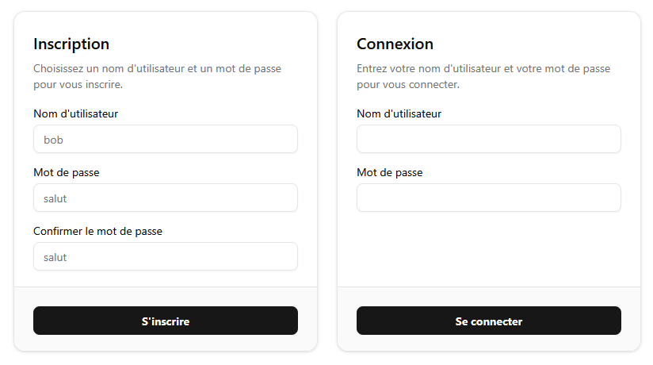
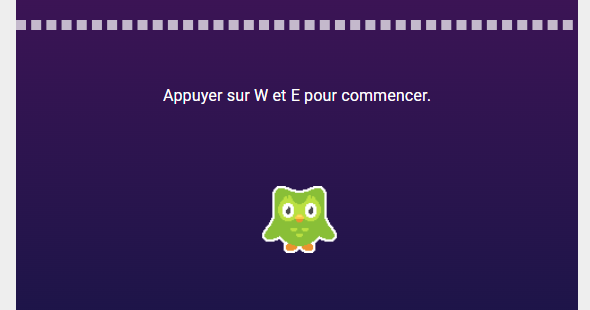
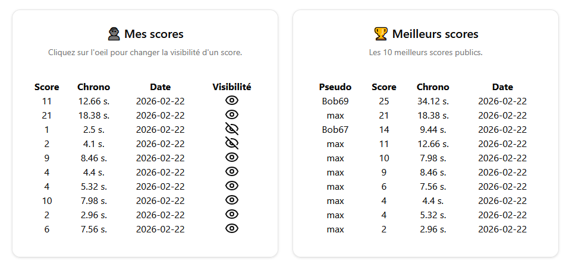

# TP3 - Flappy Birb (10%)

Le [projet Next.js est fourni](../../static/files/tp3.zip) pour ce TP. Sa structure doit être respectée et complétée.

Vous devrez créer le serveur Web API **à partir de zéro**. 

Une fois le serveur ASP.NET Core créé, vous êtes invités à immédiatement (**avant votre premier commit**) taper la commande `dotnet new gitignore` en vous situant dans le dossier de votre projet serveur. Sinon, vous pouvez aussi créer manuellement un fichier nommé `.gitignore` et ajouter trois lignes dedans : `.vs`, `bin` et `obj`.

## 📥 Remise
* 📍 Où : sur **Git** uniquement (N'oubliez pas l'invitation [https://github.com/MaximePelletier15](https://github.com/MaximePelletier15))
* ⏰ Quand : **21 avril 23h59**. Vous avez 2 cours consacrés au TP.

## 📝 Consignes

* 🌐 Les frameworks **Next.js** et **ASP.NET Core** doivent être utilisés.
* 👤 Le projet doit être fait individuellement.
* 👽 Attention au **plagiat**. Il est interdit de copier en partie ou complètement le code d'une autre personne ou de générer son code avec l'IA. Le niveau d'usage de l'intelligence artificielle générative permis pour ce TP est de **1**. (Se référer au plan de cours)
* 🥚 Vous êtes **obligés** de créer un projet **ASP.NET Core** à partir de zéro. Ne réutilisez pas un laboratoire.

En résumé, nous complèterons un **projet Web Next.js** et créerons un **projet Web serveur ASP.NET Core** qui collaboreront ensemble pour proposer un jeu et un système de classement à des joueurs authentifiés.

:::danger
 
Si votre travail est suspecté de plagiat (code copié d'un(e) autre étudiant(e), code généré par IA, notions non abordées en classe, etc.), deux choses peuvent se produire :
 
* Le plagiat est prouvé par nos outils : Note de 0, automatiquement.
* Le plagiat est plutôt évident, mais une validation est requise : vous serez convoqué(e) au bureau de votre enseignant(e). Vous devrez répondre à certaines questions pour prouver que vous comprenez et maîtrisez le code qui a été utilisé dans votre TP. Si vous ne réussissez pas à répondre à certaines questions, vous aurez la note de 0. (Si vous ne comprenez pas votre propre code, c'est que vous avez plagié, d'une manière ou d'une autre.)
 
:::

Voici une vue d'ensemble des **requêtes** à implémenter :

## 👥 Gestion des utilisateurs

Il faut qu'on puisse s'inscrire, se connecter et se déconnecter. Le fonctionnement doit correspondre à celui enseigné dans ce cours.

## 🏆 Création de scores 

Comment jouer : `w` pour monter et `e` pour changer de couleur. (On peut traverser les formes de la même couleur que la perruche)

Il est possible de sauvegarder (créer) un score après avoir joué. Pour savoir quelles sont les propriétés d'un score, vérifiez la question **📊 Afficher les scores**. Il faut être connecté pour que l'envoi du score fonctionne. (Ce n'est pas grave si la requête échoue, à condition d'être déconnecté)

:::warning

Il est interdit de mettre une propriété pour le **pseudo** dans votre modèle `Score.cs`. Utilisez un « DisplayDTO » au besoin.

:::

:::tip

Le client a seulement besoin d'envoyer le **score** et le **chrono** au serveur. La **date**, la **visibilité par défaut** et le **propriétaire du score**, le serveur pourra très bien les déterminer lui-même.

:::

## 📊 Afficher les scores

Si on est **authentifié**, on peut voir nos scores personnels. (À gauche) En cliquant sur l'oeil 👁 à côté d'un score, on peut le rendre privé / public. C'est **la seule** propriété d'un score qui est modifiable.

Qu'on soit **authentifié ou non**, on peut voir les **10 meilleurs scores publics**, **classés par score décroissant**.

:::warning

Lorsqu'on modifie la visibilité d'un score, trouvez le moyen de mettre à jour immédiatement la liste des scores publics affichés. Il faut également modifier l'oeil 👁 du score : un oeil biffé veut dire privé, un oeil normal veut dire public.

:::

## 🤬 Suppléments agaçants

* 🔒 L’accès aux données et la modification des données doit être sécuritaire.
* ⚙ Le projet ASP.NET Core doit posséder un service pour les scores. (Interdit d'injecter le **DbContext** dans un contrôleur)
* 📶 Un **intercepteur** doit être utilisé pour joindre le token d’authentification aux requêtes dans le projet Next.js.
* 🌱 Un seed doit être complété : deux **utilisateurs** et quatre **scores** doivent être inclus dans la base de données par défaut. (Chaque utilisateur doit posséder un score privé et un score public)

:::warning

⛔ Précision sur un bug mineur connu :

Dans le projet Next.js de départ, **lorsqu’on quitte le composant `Home`**, la page Web est **réactualisée**. (C’est nécessaire pour que l’état du jeu ne se duplique pas en revenant plus tard sur `Home`) Lorsqu'on quitte `Home` et qu’on va vers `Scores`, on observe des « **Request aborted** » dans la console : ce n'est pas grave.

:::

## ✅ Grille de correction

|Critère|Points|
|:-|:-|
|**👥 Gestion des utilisateurs** * Inscription * Connexion * Déconnexion| 0.5 pt 0.75 pt 0.25 pt|
|**🏆 Gestion des scores** * Création de scores * Modifier la visibilité d'un score * Afficher les scores publics * Afficher nos scores personnels| 1 pt 1.25 pt 1 pt 0.75 pt|
|**⛄ Divers** * L'application est sécuritaire * Le seed est réalisé tel que demandé * Usage d'un service côté serveur * Usage d'un intercepteur| 1 pt 1 pt 1 pt 0.5 pt|
|**📰 Git** * Respect des contraintes du cours et départementales * Au moins 5 commits cohérents * Enseignant(e) invité(e) avant la remise| 0.5 pt 0.25 pt 0.25 pt|
|**☢ Pénalités possibles** * Un projet ne compile pas * Pénalité par tranche de 24h entamée * Retard de 6 jours ou plus * Interface client Next.js déformée ou non respectée * Réutilisation d'un labo au lieu d'avoir créé un projet serveur * Structure du projet Next.js non respectée| -25% -10% -100% -2 pts -2 pts -2 pts|
|Total|10 pts|

