import Tabs from '@theme/Tabs';
import TabItem from '@theme/TabItem';

# TP4 - Raidite (25%)

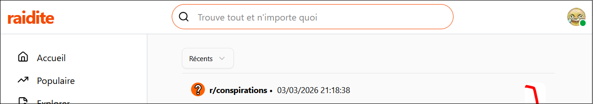

## 📥 Remise
* 📍 Où : sur **Git** uniquement (N'oubliez pas l'invitation [https://github.com/MaximePelletier15](https://github.com/MaximePelletier15))
* ⏰ Quand : **15 mai à 23h59**.
* ⛔ Attention, il y a une **remise partielle** à présenter avant le **4 mai à 17h59** pour la **partie C**.

## 📝 Consignes

* 👥 Le TP est fait en **équipe de deux imposée**.
* 📦 Le projet client utilise le framework **Next.js** et le projet serveur utilise le framework **ASP.NET Core**. (Projets de départ fournis)
* 👽 Attention au **plagiat**. Il est interdit de copier en partie ou complètement le code d'une autre personne ou de générer son code avec l'IA. Le niveau d'usage de l'intelligence artificielle générative permis pour ce TP est de **1**. (Se référer au plan de cours)
* 🖥 Il faudra respecter la structure existante dans les deux projets.

:::tip

Pendant le TP, ne vous cassez jamais la tête à régler les conflits de merge pour les **migrations**. Faites simplement une nouvelle migration dans chaque nouvelle branche.

:::

:::danger
 
Si votre travail est suspecté de plagiat (code copié d'un(e) autre étudiant(e), code généré par IA, notions non abordées en classe, etc.), deux choses peuvent se produire :
 
* Le plagiat est prouvé par nos outils : Note de 0, automatiquement.
* Le plagiat est plutôt évident, mais une validation est requise : vous serez convoqué(e) au bureau de votre enseignant(e). Vous devrez répondre à certaines questions pour prouver que vous comprenez et maîtrisez le code qui a été utilisé dans votre TP. Si vous ne réussissez pas à répondre à certaines questions, vous aurez la note de 0. (Si vous ne comprenez pas votre propre code, c'est que vous avez plagié, d'une manière ou d'une autre.)
 
:::

:::warning

Ce TP sera probablement plus long et sophistiqué que les autres TPs que vous avez faits jusqu'à maintenant dans le programme. Voyez cela comme un *rite de passage*, sachant que le cours **5W5 - Programmation Web avancée** est largement plus difficile que ce cours. Malgré tout, les 6 séances de 3 heures consacrées au **TP4** sont censées être suffisantes pour ceux qui ont fait tous leurs laboratoires.

:::

## 📦 Projets de départ

Les [projets Next.js + ASP.NET Core](../../static/files/tp4.zip) sont fournis pour ce TP.

Une application qui sert de multi-forums de discussion vous est fournie. Vous devrez ajouter des fonctionnalités à l'application, principalement pour la gestion d'images et de rôles.

En résumé, l'application contient des `hubs` (forums), des `posts` (publications) et des `commentaires`.

* Un `hub` contient des `posts` sur un **thème commun** et un `post` contient des `commentaires`.
* On peut répondre à un `commentaire` avec des sous-`commentaires` à l'infini.

Ci-dessous, on peut voir une **publication** (`post`) avec plusieurs **commentaires**. La publication a été créée dans le **forum** (`hub`) nommé « conspirations ». 

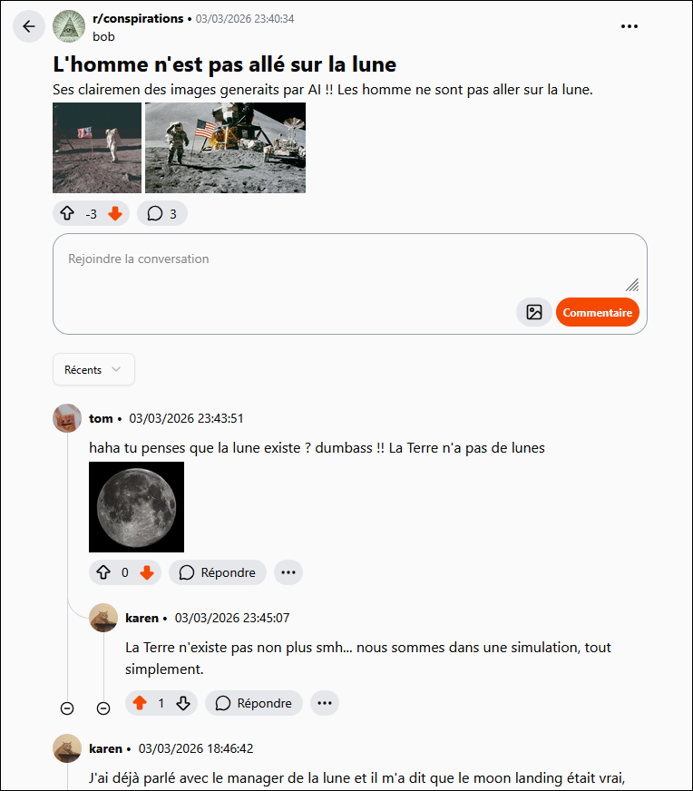

## 📜 Résumé des fonctionnalités

👥 Chaque équipe aura un **membre hot-doye 🌭** et un **membre sushi 🍣**. Vous serez **évalués séparément** pour la plupart des fonctionnalités. Vous êtes obligés d'implémenter seulement vos propres fonctionnalités, telles que listées ci-dessous.

🔍 Ceci n'est qu'un résumé des fonctionnalités, vérifiez les énoncés **par membre** pour avoir tous les détails et indices. La quantité de travail est **très similaire**, sauf que 🌭 aura un peu plus de travail lors de F-G-H et 🍣 aura un peu plus de travail lors de C-D-E.

<table>
<tr>
    <th>Membre 🌭</th>
    <th>Membre 🍣</th>
</tr>
<tr>
    <td colspan="2">
    Étape A-🌭🍣  
    Décidez quel membre sera 🍣 et quel membre sera 🌭. Si votre partenaire est absent(e), vous êtes obligé(e) de choisir seul(e) pour pouvoir commencer le travail dès maintenant.
    </td>
</tr>
<tr>
    <td colspan="2">
    Étape B-🌭🍣  
    Suivez les étapes dans les notes de cours sur Git :
    * Créez un repo de départ avec les deux projets.
    * Ajoutez l'autre membre et l'enseignant(e) en collaborateurs.
    * Créez la branche `dev`. Il faudra créer une nouvelle branche individuelle pour chaque étape du TP. Il faudra effectuer un merge une fois chaque étape terminée.
    </td>
</tr>
<tr>
    <td>
        Étape C-🌭  
        Lorsqu’on crée un commentaire, on doit être capable d’y joindre de zéro à plusieurs images.
    </td>
    <td>
        Étape C-🍣  
        Lorsqu’on crée une publication (`post`), on doit être capable d’y joindre de zéro à plusieurs images.
    </td>
</tr>
<tr>
    <td colspan="2">
    🛑 HALTE ! 
    * Au plus tard le **4 mai à 17h59**, vous devez, à deux, vous **présenter en classe** et prendre 5 minutes pour montrer les étapes A, B et C à l'enseignant(e).
    * Si vous ne le faites pas, il y aura une **pénalité de 25%**.
    * Il n'y a rien à préparer pour la présentation, à part le TP.
    * Si à cette date votre partenaire est absent(e), vous pouvez présenter votre partie seul(e) pour ne pas avoir la pénalité.
    </td>
</tr>
<tr>
    <td>
        Étape D-🌭  
        Les utilisateurs doivent pouvoir choisir un avatar personnalisé. Il sera affiché à plusieurs endroits dans les pages Web. L’avatar peut être changé à tout moment.
    </td>
    <td>
        Étape D-🍣  
        Lorsqu'on crée un forum (`hub`), on doit pouvoir choisir une image qui servira d'icône, optionnellement. Les aperçus des publications doivent contenir leur première image, lorsqu'applicable.
    </td>
</tr>
<tr>
    <td>
        Étape E-🌭  
        Cliquer sur une image doit permettre de l’afficher en pleine taille, dans un autre onglet.
    </td>
    <td>
        Étape E-🍣  
        On peut « sauvegarder » des publications pour les ajouter à nos favoris. Les publications sauvegardées seront affichées dans notre profil, dans l'onglet « Favoris ». On peut également retirer une publication de nos favoris.
    </td>
</tr>
<tr>
    <td>
        Étape F-🌭  
        On doit pouvoir supprimer les images d’un commentaire / post, individuellement.
    </td>
    <td>
        Étape F-🍣  
        Lorsqu’on supprime un commentaire ou un post, toutes ses images doivent être supprimées.
    </td>
</tr>
<tr>
    <td>
        Étape G-🌭  
        Les utilisateurs peuvent signaler (Report) les commentaires / posts des autres utilisateurs.
    </td>
    <td>
        Étape G-🍣  
        Les utilisateurs doivent pouvoir se connecter en utilisant leur nom d’utilisateur OU leur adresse courriel. (Plutôt que seulement leur nom d’utilisateur) Les utilisateurs doivent pouvoir changer leur mot de passe.
    </td>
</tr>
<tr>
    <td>
        Étape H-🌭  
        Un rôle modérateur doit être créé. Les modérateurs peuvent voir la liste des commentaires signalés. Ils peuvent supprimer les commentaires de leur choix via cette liste. Un utilisateur avec le rôle modérateur est ajouté dans le seed.
    </td>
    <td>
        Étape H-🍣  
        Un rôle administrateur doit être créé. Les administrateurs peuvent ajouter le rôle modérateur à des utilisateurs. Un utilisateur avec le rôle administrateur est ajouté dans le seed.

    </td>
</tr>
<tr>
    <td colspan="2">
    Étape I-🌭🍣  
    S’assurer que les critères communs (Voir grille de correction) sont respectés. S’assurer que tout a été merge dans **dev**, puis dans **main**. S’assurer que tout fonctionne.
    </td>
</tr>
</table>

## ✅ Grille de correction

Bien entendu, il y a plus de détails sur les fonctionnalités demandées dans les énoncés du TP.

### Membre 🌭 (32 pts)

<table>
    <tr>
        <th>Critère</th>
        <th>Points</th>
    </tr>
    <tr>
        <td>On peut ajouter des images lorsqu’on crée un commentaire et les voir ensuite.</td>
        <td>10 pts</td>
    </tr>
    <tr>
        <td>Les utilisateurs peuvent choisir un avatar (et le prévisualiser) et le modifier à volonté.</td>
        <td>4 pts</td>
    </tr>
    <tr>
        <td>Toute image (sauf les avatars) peut être cliquée pour être affichée en grand dans un nouvel onglet.</td>
        <td>2 pts</td>
    </tr>
    <tr>
        <td>Les images des posts et des commentaires peuvent être supprimées individuellement par l’auteur.</td>
        <td>6 pts</td>
    </tr>
    <tr>
        <td>Les posts / commentaires des autres utilisateurs peuvent être signalés si on est connecté.</td>
        <td>4 pts</td>
    </tr>
    <tr>
        <td>Le rôle de modérateur existe, permet de supprimer des commentaires signalés et présente un utilisateur avec le rôle dans le seed.</td>
        <td>6 pts</td>
    </tr>
</table>

### Membre 🍣 (32 pts)

<table>
    <tr>
        <th>Critère</th>
        <th>Points</th>
    </tr>
    <tr>
        <td>On peut ajouter des images lorsqu’on crée un post et les voir ensuite.</td>
        <td>11 pts</td>
    </tr>
    <tr>
        <td>On peut choisir une icône lorsqu'on crée un forum.</td>
        <td>4 pts</td>
    </tr>
    <tr>
        <td>La première image d'une publication est affichée dans son aperçu.</td>
        <td>1 pt</td>
    </tr>
    <tr>
        <td>La sauvegarde de publications est fonctionnelle.</td>
        <td>6 pts</td>
    </tr>
    <tr>
        <td>Supprimer un post ou un commentaire supprime ses images.</td>
        <td>2 pts</td>
    </tr>
    <tr>
        <td>La connexion fonctionne avec le nom d’utilisateur et le courriel.</td>
        <td>1 pt</td>
    </tr>
    <tr>
        <td>On peut modifier son mot de passe à volonté.</td>
        <td>2 pts</td>
    </tr>
    <tr>
        <td>Le rôle d’administrateur existe, permet de nommer des modérateurs et présente un utilisateur avec le rôle dans le seed.</td>
        <td>5 pts</td>
    </tr>
</table>

### Commun 👥 (18 pts)

<table>
    <tr>
        <th>Critère</th>
        <th>Points</th>
    </tr>
    <tr>
        <td>L’architecture du projet serveur respecte les lignes directrices vues dans les notes de cours. (Les contrôleurs n’ont pas accès au DbContext, usage de Models et de DTOs au besoin, etc.) De plus, sur le serveur, évitez la répétition de code dans la mesure du raisonnable.</td>
        <td>2 pts</td>
    </tr>
    <tr>
        <td>
            Git a été utilisé de manière appropriée, c’est-à-dire :
            * Branches **main** et **dev** bien utilisées.
            * Une branche créé et un merge par fonctionnalité du TP.
            * ⛔ Le français est évalué dans les messages des commits.
            * Les titres et les descriptions des commits sont présents, appropriés et clairs.
        </td>
        <td>
              2 pts 6 pts 6 pts 2 pts
        </td>
    </tr>
    <tr>
        <td>
            ☢ Pénalités variées possibles :
            * Fonctionnalités déjà implémentées devenues brisées.
            * Au moins une des applications ne compile pas.
            * Remise partielle non réalisée.
            * Interface déformée et / ou ne correspond pas aux exemples illustrés.
            * Structure des projets fournis non respectée.
        </td>
        <td>
              -25% -25% -25% -10% -10%
        </td>
    </tr>
</table>

## 📶 Liste des requêtes pour référence

* ✅ Déjà complétée et n'aura jamais à être modifiée.
* 📝 Fonctionne déjà mais devra être modifiée pour ajouter des fonctionnalités.
* 🥚 Devra être créée à partir de zéro.

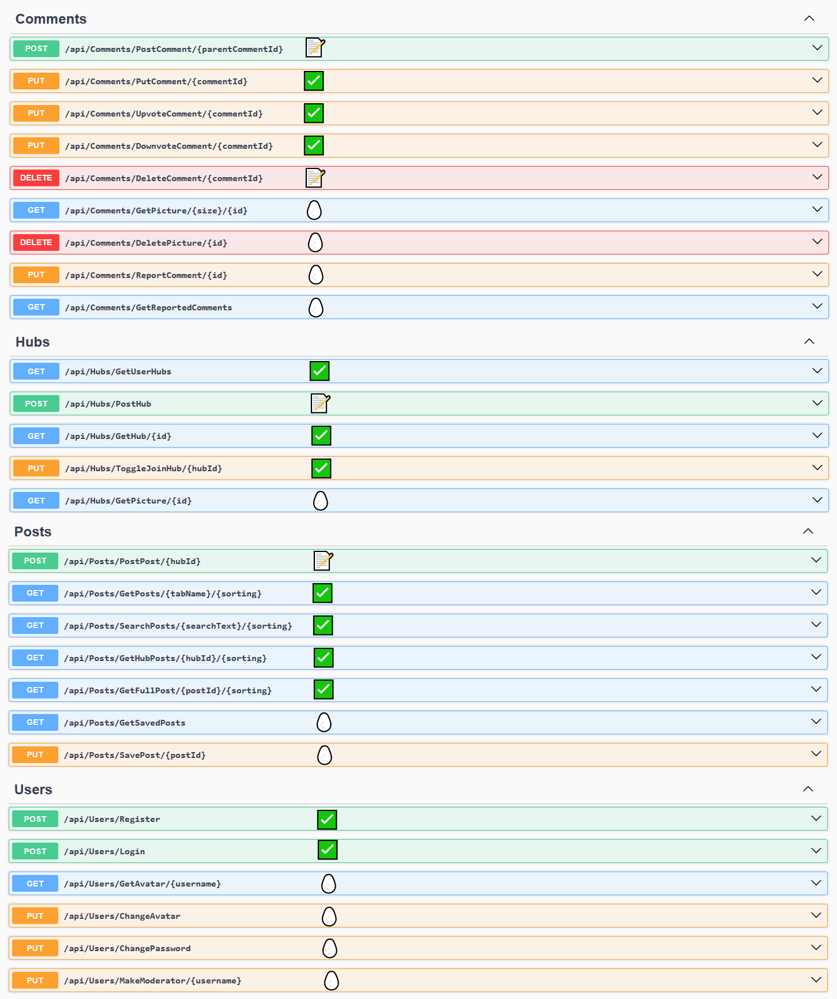

## 🔍 Organisation du projet Next.js

Vous n'aurez **aucun** composant à créer pendant le **TP4**, à priori. Cependant il faudra s'y retrouver parmi tous les composants existants.

### 🗺 Composants chargés par routage

La plupart des noms de ces **composants** parlent d'eux-mêmes. 

* `FullPost` sert à afficher une **publication** en entier, avec ses **commentaires**. 
* `FullHub` permet d'afficher un aperçu de toutes les **publications** d'un **forum**.
* `Home` affiche des aperçus de **publications** qui viennent généralement de **plusieurs forums**.

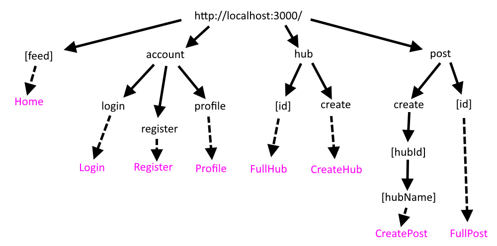

### ♻ Composants réutilisables

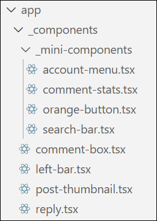

<Tabs>
    <TabItem value="component1" label="AccountMenu" default>
    Petit menu déroulant en haut à droite de la page qui propose des options différentes lorsque nous sommes connectés. Il est intégré dans le `HomeLayout`.
    
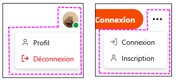

    </TabItem>
    <TabItem value="component2" label="CommentStats" default>
    Affichage des votes et du nombre de commentaires. Permet d'upvoter et de downvoter le commentaire principal d'une publication. Ce composant est intégré dans les composants `FullPost` et `PostThumbnail`. Ce composant n'est pas utilisé par le composant `CommentBox`, qui gère son propre affichage des votes.
    
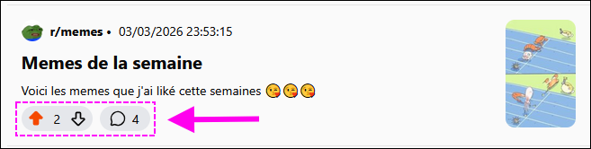

    </TabItem>
    <TabItem value="component3" label="OrangeButton" default>
    Simple bouton orange utilisé à 6 endroits dans le site Web.
    
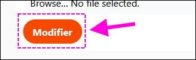

    </TabItem>
    <TabItem value="component4" label="SearchBar" default>
    Barre de recherchée intégrée dans le `HomeLayout`.
    
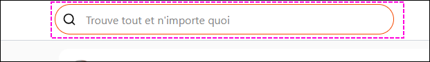

    </TabItem>
    <TabItem value="component5" label="CommentBox" default>
    Composant qui permet d'afficher un **commentaire**, ses votes et ses **sous-commentaires**. Ce composant est intégré dans `FullPost` et dans **lui-même** ! (Chaque sous-commentaire est une autre instance de `CommentBox`)
    
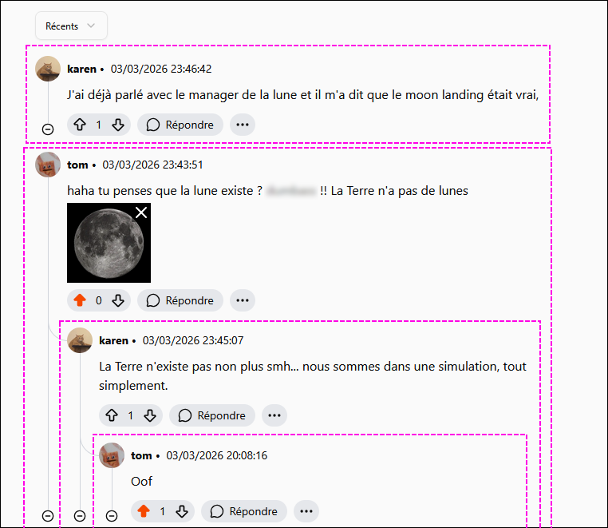

    </TabItem>
    <TabItem value="component6" label="LeftBar" default>
    Menu de gauche intégré dans le `HomeLayout`.
    
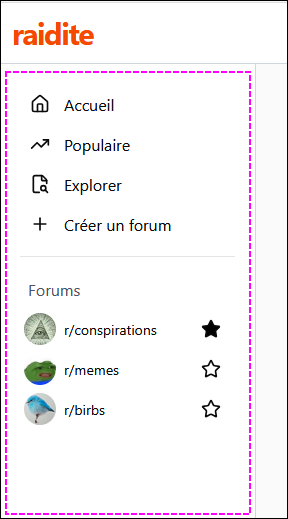

    </TabItem>
    <TabItem value="component7" label="PostThumbnail" default>
    Composant intégré répétitivement dans `FullHub` et dans `Home` pour afficher l'aperçu de plusieurs **publications**.
    
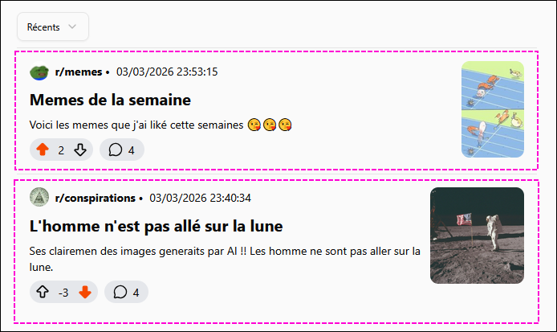

    </TabItem>
    <TabItem value="component8" label="Reply" default>
    Composant intégré dans `FullPost` et dans `CommentBox`. Permet autant de créer un commentaire qu'un sous-commentaire.
    
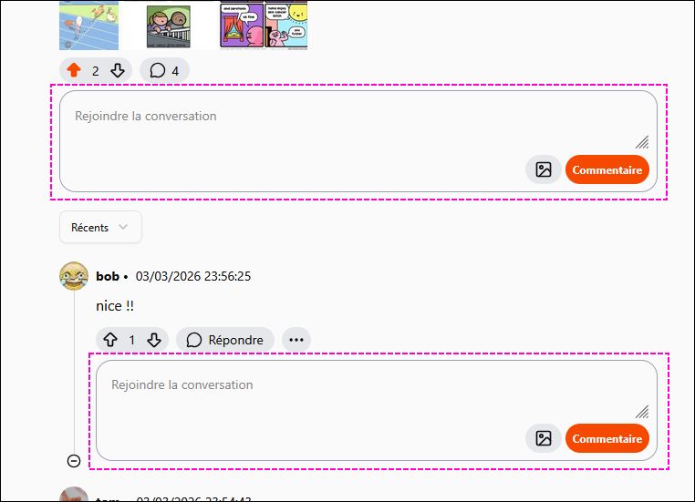

    </TabItem>
</Tabs>