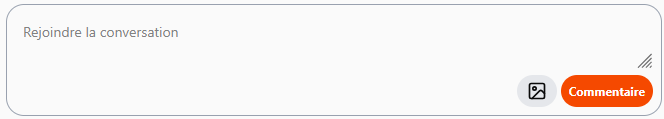
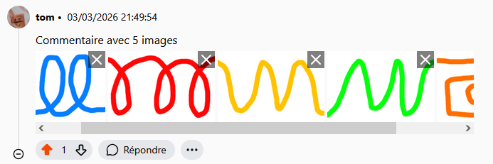
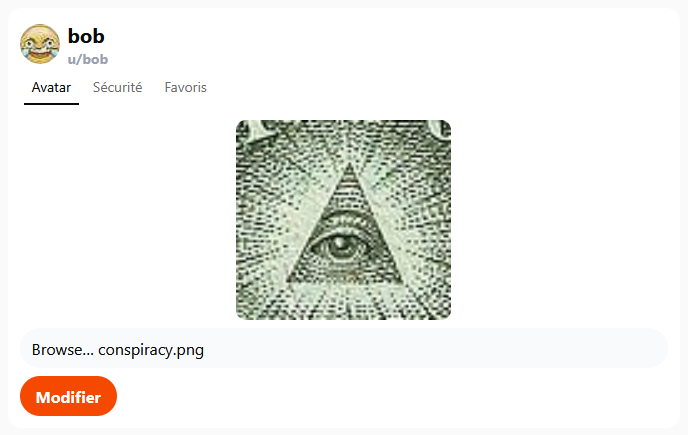
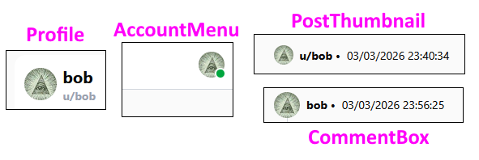
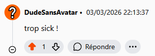
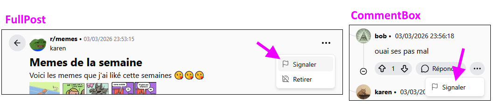
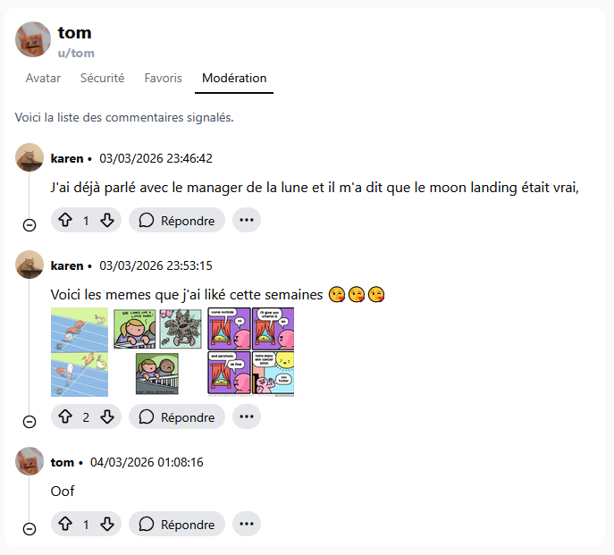

# TP4 - Raidite - Hot-doye 🌭

Cet énoncé précise les fonctionalités du membre 🌭 et donne quelques pistes pour réussir.

## Étape C

Lorsqu’on crée un **commentaire**, on doit être capable d’y joindre zéro à plusieurs images, qui seront sauvegardées en taille originale et en miniature.

Que ce soit pour créer un **commentaire** ou un **sous-commentaire**, cela se passe dans le composant réutilisable nommé `Reply` :

Voici quelques pistes non exhaustives pour savoir où donner de la tête. Cette étape sera de loin la plus longue, entre autres car il faut explorer le projet et s'y retrouver !

**📶 Envoyer des images au serveur :**

* Le composant `Reply`, en utilisant le **hook** `useComment`, devra maintenant envoyer un **FormData** plutôt qu'un **DTO** pour pouvoir y joindre 0 à plusieurs images en plus du texte du commentaire.
* L'action `PostComment` du `CommentsController` devra recevoir ce **FormData** plutôt qu'un `CommentDTO`. La classe `Comment` devra avoir une relation **One-To-Many** avec la classe `Picture`. Il faudra modifier la méthode `CreateComment` du `CommentService` et ajouter la méthode `CreatePicture` dans le `PictureService`.

**🖼 Afficher les images sur le client :**

* Le serveur n'envoie pas de `Comment` au client, mais plutôt des `CommentDisplayDTO`. (C'est déjà le cas) Ajouter la **liste des ids des images d'un commentaire** dans le `CommentDisplayDTO` et dans la classe `comment.ts` devrait facilement permettre de rendre accessibles tous les **ids** nécessaires au projet **Next.js**.
* Pour pouvoir afficher les images dans le composant réutilisable `CommentBox`, il faudra une action `GetPicture` dans le `CommentsController` et il faudra glisser une requête directement dans le HTML de `CommentBox` pour afficher chaque image du commentaire à l'aide des **ids** reçus.

:::warning

Il est pas mal **incontournable** de faire le merge de la branche de cette étape en présence de votre partenaire ! (Seulement lorsque la 2e personne fera son merge) Il y aura **beaucoup de conflits**, et il faut que les deux partenaires soient présents pour bien comprendre comment résoudre ces conflits.

:::

## Étape D

Les utilisateurs doivent pouvoir choisir un avatar personnalisé. L’avatar peut être changé / remplacé à tout moment. On doit pouvoir **prévisualiser** l'image choisie quand on change son avatar.

* Ceci se déroule surtout dans le composant `Profile` et dans le `UsersController`.
* ⛔ N’utilisez pas la classe `Picture` pour les avatars, ajoutez seulement un `FileName` et un `MimeType` dans la classe `User`, c’est plus simple. Exceptionnellement, vous pouvez vous en tirer sans utiliser de service côté serveur pour cette fois. (À l’aide de `UserManager`)
* La requête pour afficher l’avatar sera plus simple si le paramètre dans l’URL est le **pseudo de l’utilisateur**.
* Attention ! L'avatar est affiché à quatre endroits : `Reply`, `CommentBox`, `PostThumbnail` et `Profile`. Ne vous mélangez pas avec les **icônes des forums** (hubs), qui sont affichés à plusieurs endroits aussi.

* Un avatar par défaut doit être affiché pour ceux qui n'ont pas choisi d'avatar.

## Étape E

Cliquer sur une image dans une publication ou un commentaire doit permettre de l’afficher en pleine taille, dans un autre onglet.

* Ne vous compliquez pas la vie : Ajoutez une balise `<a>` avec un `href` qui contient la requête vers l’image en **pleine taille**. Cela redirigera vers une autre page qui contient seulement l’image. C’est suffisant. Vous devez ouvrir l’image dans un nouvel onglet.
* Ceci concerne TOUTES les images qui ne sont pas des avatars ou des icônes de forum. (Donc ça inclut les images du message principal d'une publication !)

## Étape F

On doit pouvoir supprimer les images d’un **commentaire** et d'une **publication**, individuellement.

* L’image doit disparaître immédiatement de la page lorsqu’on le fait.
* Cette suppression concerne une seule image à la fois. Les autres ne sont pas touchées.
* Bien entendu, on peut seulement supprimer les images **de nos propres commentaires / publications**. On ne veut pas voir le petit X si on n’est pas l’auteur du message.

:::danger

Une image supprimée de la **base de données** doit aussi être supprimée du **File System** !

:::

## Étape G

Les utilisateurs peuvent signaler (*Report*) les commentaires / publications des autres utilisateurs.

* Les publications ne pourront pas vraiment être signalées, mais plutôt le commentaire principal (`mainComment`) d'une publication. Bref, c'est la même requête au serveur, que ce soit une publication, un commentaire ou un sous-commentaire.
* Le signalement d'un commentaire peut être un simple `bool` mis à `true` ou encore une `List<User> Reporters` si vous voulez faire ça proprement.
* Un utilisateur ne peut pas signaler ses propres commentaires. Si on est l'auteur d'un message, on ne peut pas voir l'option « Signaler ».
* Si on n'est pas connecté, on ne peut pas signaler un message et utiliser l'option « Signaler » nous déplace vers `/account/login`.

## Étape H

Un rôle modérateur doit être créé. (Sauf si votre partenaire l'a déjà créé) Les modérateurs peuvent voir la liste des commentaires signalés dans l'onglet **Modération** de leur **profil**. Ils peuvent supprimer les commentaires de leur choix via cette liste. Un utilisateur avec le rôle modérateur doit être ajouté dans le seed.

Il suffira de remplir une liste de commentaires dans le composant `Profile` avec tous les commentaires ayant été signalés si on est un **modérateur**. Le bouton `Supprimer` appelera exactement la même action du serveur que si un utilisateur supprimait son propre message. Il faudra donc permettre aux modérateurs ET à l'auteur d'un message de le supprimer.

## Étape I

* Lorsque votre partenaire fera ses derniers **merges** dans **dev**, vérifiez vos fonctionnalités ! Votre partenaire les a peut-être brisé...
* N'oubliez pas de faire le merge ultime dans **main** lorsque votre partenaire et vous aurez terminé le TP.