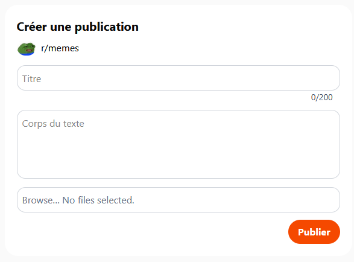
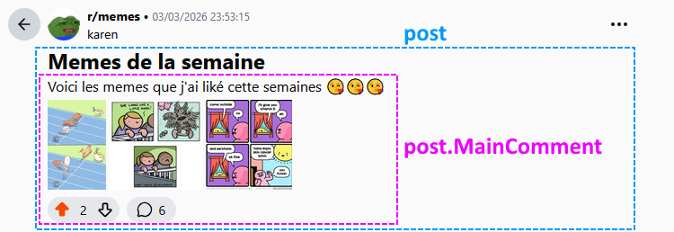
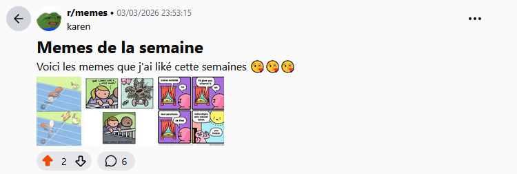
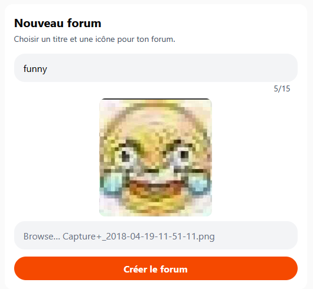
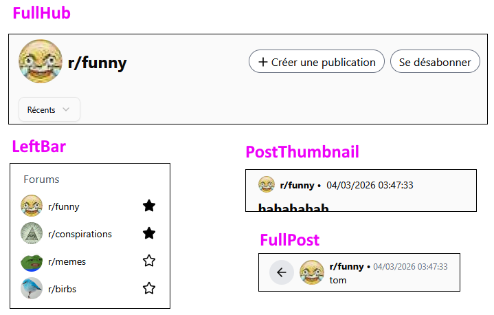
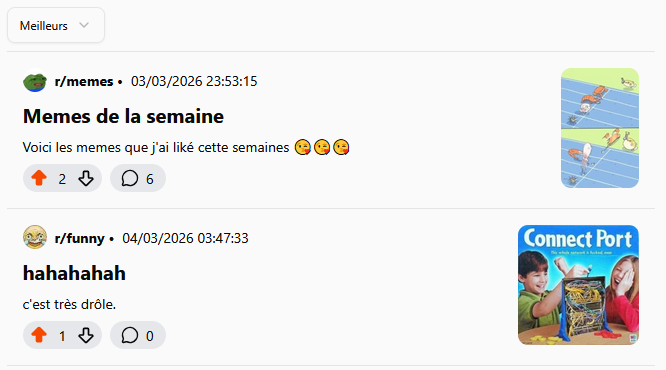
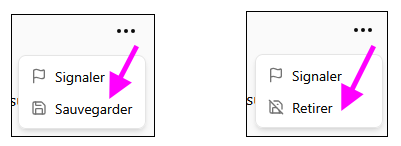
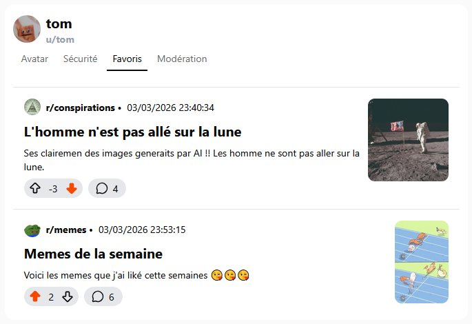
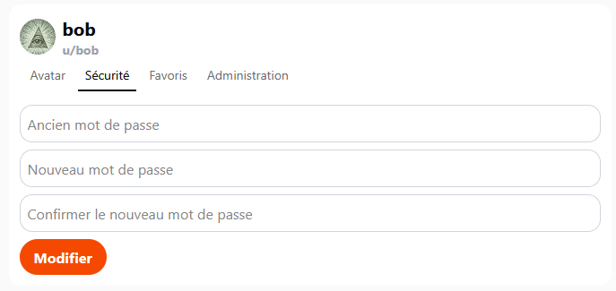
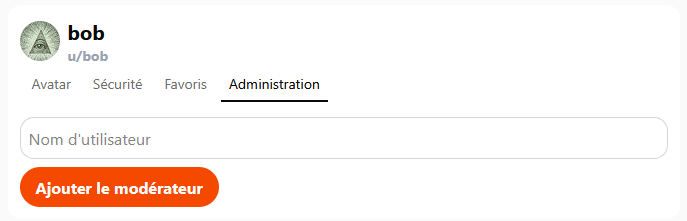

# TP4 - Raidite - Pinotte 🥜

Cet énoncé précise les fonctionalités du membre 🥜 et donne quelques pistes pour réussir.

## Étape C

Lorsqu'on crée une **publication**, on doit être capable d'y joindre zéro à plusieurs images, qui seront sauvegardées en taille originale et en miniature.

Rendez-vous dans le composant `CreatePost` pour créer une **publication**.

:::danger

⛔ Attention ! Un `Post`, c'est seulement un **titre**. Le message qu'on voit sous le titre est un `Comment`. Lorsqu'on crée un `Post`, cela crée un `Post` ET un `Comment`. (Qui contient le texte et les upvotes / downvotes) Si on regarde dans le modèle `Post`, il y a une propriété nommée `MainComment` ! Bref, les images seront associées au `MainComment` (donc à un `Comment`) et non au `Post` !

:::

Voici quelques pistes non exhaustives pour savoir où donner de la tête. Cette étape sera de loin la plus longue, entre autres car il faut explorer le projet et s'y retrouver !

**📶 Envoyer des images au serveur :**

* Le composant `FullPost`, en utilisant le **hook** `usePost`, devra maintenant envoyer un **FormData** plutôt qu'un **DTO** pour pouvoir y joindre 0 à plusieurs images en plus du texte du commentaire.
* L'action `PostPost` du `PostsController` devra recevoir ce **FormData** plutôt qu'un `PostDTO`. La classe `Comment` devra avoir une relation **One-To-Many** avec la classe `Picture`. Il faudra modifier la méthode `CreateComment` du `CommentService` et ajouter la méthode `CreatePicture` dans le `PictureService`.

**🖼 Afficher les images sur le client :**

* Le serveur n'envoie pas de `Post` et de `Comment` au client, mais plutôt des `PostDisplayDTO` et des `CommentDisplayDTO`. (C'est déjà le cas) Ajouter la **liste des ids des images d'un commentaire** dans le `CommentDisplayDTO` et dans la classe `comment.ts` devrait facilement permettre de rendre accessibles tous les **ids** nécessaires au projet **Next.js**.
* Pour pouvoir afficher les images dans le composant `FullPost`, il faudra une action `GetPicture` dans le `CommentsController` et il faudra glisser une requête directement dans le HTML de `FullPost` pour afficher chaque image de la publication à l'aide des **ids** reçus.

:::warning

Il est pas mal **incontournable** de faire le merge de la branche de cette étape en présence de votre partenaire ! (Seulement lorsque la 2e personne fera son merge) Il y aura **beaucoup de conflits**, et il faut que les deux partenaires soient présents pour bien comprendre comment résoudre ces conflits.

:::

## Étape D

Lorsqu'on crée un forum (`hub`), on doit pouvoir choisir une image qui servira d'icône, optionnellement. Les aperçus des publications doivent contenir leur première image, lorsqu'applicable.

L'icône choisie lors de la création du forum doit pouvoir être **prévisualisée** :

Attention ! L'icône du forum est affichée à quatre endroits : `FullHub`, `LeftBar`, `FullPost` et `PostThumbnail`. Ne vous mélangez pas avec les **avatars**, qui sont affichés à plusieurs endroits aussi.

Si on ne choisit pas d'icône en créant un forum, une icône par défaut est affichée pour le forum :

Pour l'affichage de la première image d'une publication dans `PostThumbnail` (vous aviez peut-être oublié cette partie ?), ça ne devrait pas être trop complexe : si la publication possède au moins une image, utilisez l'id de la première image pour l'afficher dans l'aperçu :

## Étape E

On peut « sauvegarder » des publications pour les ajouter à nos favoris. Les publications sauvegardées seront affichées dans notre profil, dans l'onglet « Favoris ». On peut également retirer une publication de nos favoris.

* L'option pour sauvegarder / retirer sera située dans `FullPost`. Il faut toujours voir une option OU l'autre, dépendant de si on a déjà sauvegardé la publication ou non.
* Un utilisateur non authentifié est redirigé vers `/account/login` s'il utilise cette option.
* Ajouter une propriété `IsSaved` dans le `PostDisplayDTO` devrait simplifier l'affichage de la **bonne** option parmi les deux.

:::tip

Pour avoir tous vos points, que ce soit pour **sauvegarder** ou **retirer** la publication de nos favoris, il faut que ce soit **la même requête / action**. Ça fera moins de code à écrire, en plus.

:::

Il restera ensuite à créer une requête permettant d'obtenir toutes les publications qu'on a sauvegardées dans `Profile` :

## Étape F

Lorsqu’on supprime un **commentaire** ou une **publication**, toutes ses images doivent être supprimées de la base de données et du File System.

* Vous remarquerez que l’action `DeleteComment` fait peur. C’est parce qu’elle _hard-supprime_ également tout commentaires parents qui étaient déjà _soft-supprimés_. Ne vous inquiétez pas trop avec cela : votre objectif est seulement de supprimer les images du commentaire cliqué s’il en avait. (Vous n'avez RIEN à ajouter dans la boucle de l'action donc. Ça se passe **avant** la boucle.)
* Les images du commentaire supprimé doivent être cachées immédiatement dans la page Web.
* L'option pour supprimer un commentaire et une publication ne doit être visible que pour son **auteur**.

## Étape G

Les utilisateurs doivent pouvoir se connecter en utilisant leur nom d’utilisateur OU leur adresse courriel. (Plutôt que seulement leur nom d’utilisateur) Les utilisateurs doivent pouvoir changer leur mot de passe.

* Indice : Pas besoin de modifier la structure du `LoginDTO`... Dites-vous juste que `username` contiendra le pseudo OU le courriel.
* C'est une des rares questions où il n'y aura pas les méthodes nécessaires dans les notes de cours. Vérifiez les fonctions qui existent avec `UserManager`. Il y en a une pour changer un mot de passe et une pour trouver un utilisateur via son courriel.
* Tout se passera dans `Profile` et dans `UsersController`.

## Étape H

Un rôle administrateur doit être créé. Les administrateurs peuvent ajouter le rôle modérateur à des utilisateurs. (Créez le rôle modérateur dans le seed si votre partenaire ne l'a pas déjà fait) Un utilisateur avec le rôle administrateur doit être ajouté dans le seed.

* Votre partenaire s'occupera de rendre utiles les modérateurs à votre place, mais pour le moment créez juste le rôle s'il n'existe pas déjà.
* Il faudra rendre disponible un onglet supplémentaire **seulement visible pour les administrateurs** dans le profil.

