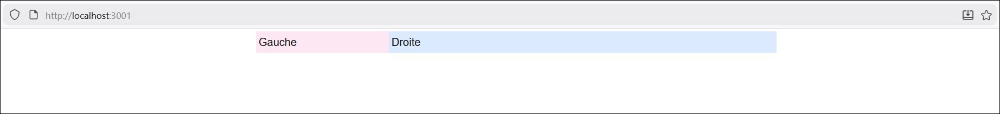
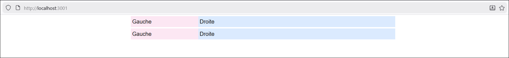
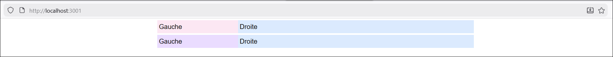
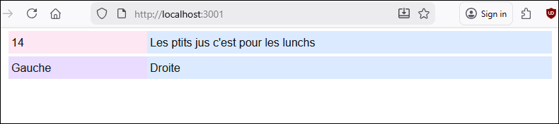
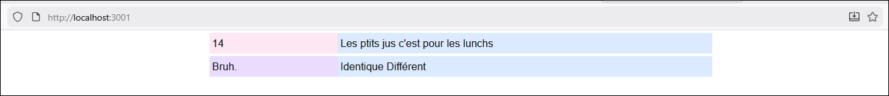
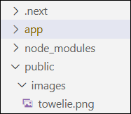
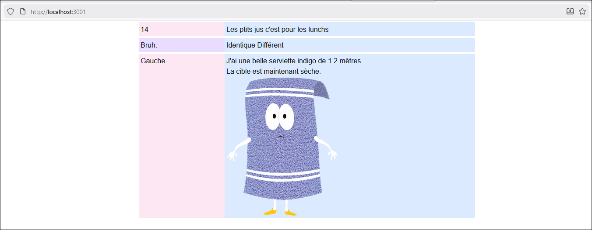
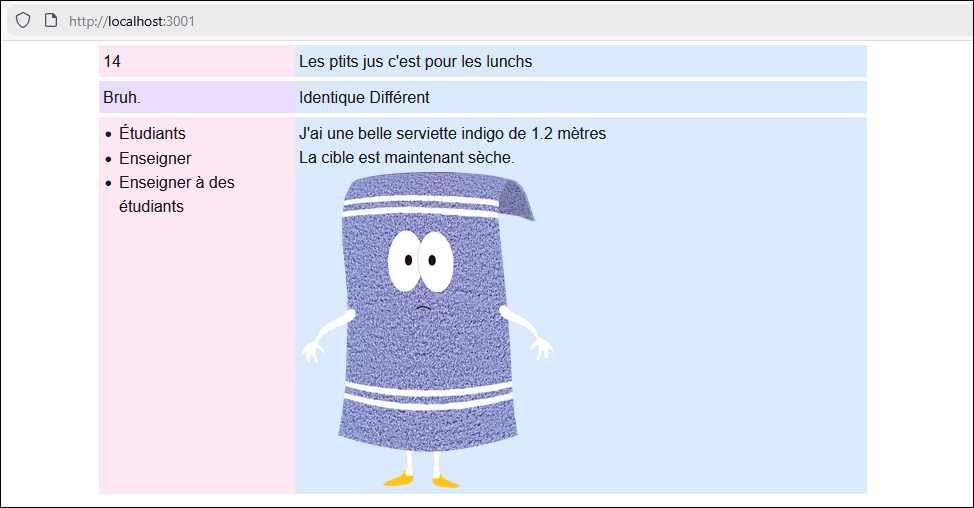
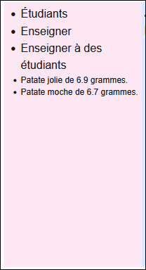

# Laboratoire 1

Pour ce premier laboratoire il n'y aura pas de matériel de départ. Pour tous les laboratoires, 
n'hésitez jamais à cliquer sur l'ampoule 💡 à côté d'un énoncé pour être redirigé vers la section
des notes de cours où les notions associées sont abordées. Pour garder la page du laboratoire
ouverte en cliquant sur l'💡, maintenez `ctrl` appuyé.

## ✊ Étape 1 - Git Good

### **1 -** Créer le repo

[💡](/notes/rencontre1.1#-git) Créez un nouveau repository Git vide à l'aide de **Fork** 🔱

#### 🦸‍♂️ Tous pour un ou Un pour tous ?

Si vous ne comptez pas utiliser Git pour vos labos -> faites-le au moins une fois avant le TP1 (Cours 4) car pour les TPs vous
serez forcés.

Si vous comptez utiliser Git pour vos labos -> décidez si vous voulez faire 1 repo avec TOUS vos labos (moins de bordel sur GitHub) ou bien 1 repo par labo. (Projets mieux séparés... mais bordel sur GitHub)

### **2 -** Créer le projet Next.js dans le repo

[💡](/notes/rencontre1.1#-créer-un-projet-nextjs) Créez un nouveau projet Next.js et nommez-le `labo1` ou `lab1` ou `laboratoire1` ou `labo01` ou `lab01` ou
`laboratoire01` ou `labo_1` ou `labo_01` ou `lab_1` ou `lab_01` ou `laboratoire_1` ou `laboratoire_01` ou 
`coccinelle`.

Faites un premier commit et un premier push.

:::tip

Pour la suite du laboratoire, n'hésitez pas à faire un commit et un push à la fin de chaque étape pour ne jamais perdre votre travail.

:::

### **3 -** Lancer le projet

[💡](/notes/rencontre1.1#-ouvrir-et-exécuter-un-projet-nextjs) Vous pouvez maintenant exécuter la commande `npm run dev` dans le terminal de Visual Studio Code pour exécuter le projet.

:::note

À chaque fois que vous travaillerez sur un projet Next.js, la première étape suivante sera toujours de lancer l'exécution du projet avec `npm run dev`. Ça permet de compiler les changements à chaque fois qu'on sauvegarde un fichier du projet et de rapidement intercepter les erreurs. Ça permet aussi de visualiser son site Web à l'adresse `http://localhost:3000` dans le navigateur de son choix.

Si vous clonez un projet qui était déjà sur Git plutôt que d'en créer un nouveau, il faut toujours commencer par réinstaller les dépendances du projet à l'aide de la commande `npm install`. Ça permet de restaurer une tonne de fichiers qui sont absents de Git à cause du `.gitignore`.

:::

Si ce n'est pas déjà fait, affichez votre site Web dans le navigateur de votre choix (Il n'y a pas de mauvais choix à part tout ce qui
n'est pas **Firefox** 🦊🔥) à l'aide de l'adresse `http://localhost:3000`.

### **4 -** Un peu de HTML / CSS

Pour le moment, si vous jetez un coup d'oeil à votre page Web dans le navigateur, ça ressemble à ceci :

<center></center>

[💡](/notes/rencontre1.1#-pagetsx) Supprimez tout le code HTML présent dans le fichier `page.tsx`, et mettez un `<div>` vide à la place :

```tsx showLineNumbers
return(
  <div></div>
);
```

Sauvegardez le fichier, et retournez voir la page Web. Elle devrait être complètement vide. (Il reste des balises comme `<head>`, `<body>`, notre `<div>`, etc. mais rien de visible)

Copiez-collez ce HTML dans le composant `Home` (`page.tsx`) à la place du `<div>` existant :

```tsx showLineNumbers
return(
  <div className="m-auto w-3xl">
    <div className="flex mt-1">
      <div className="flex-1 p-1 AAA">
        Gauche
      </div>
      <div className="flex-3 p-1 BBB">
        Droite
      </div>
    </div>
  </div>
);
```

Grâce aux classes utilitaires de **Tailwind**, deux colonnes devraient bien être côte-à-côte dans la page.
Notez que les classes `AAA` et `BBB` ne font rien pour le moment et n'ont pas de lien avec **Tailwind**.

:::info

> Pourquoi on utilise l'attribut `className` plutôt que `class`, comme en HTML ordinaire ?

Comme un fichier `tsx` contient du **HTML** ET du **TypeScript**, le terme `class` est sensible : il sert à déclarer une classe en TypeScript. Il a donc fallu que React trouve une alternative... l'attribut `className` est transformé en attribut `class` en cachette lorsque la page Web est exécutée.

:::

[💡](/notes/rencontre1.1#-classes-tailwind) Remplacez les classes `AAA` et `BBB` par deux **classes utilitaires Tailwind**
pour que la colonne de gauche ait un fond **rose pâle** et que la colonne de droite ait un fond **bleu pâle**.

<center></center>

Dupliquez une partie du HTML pour obtenir ce résultat :

<center></center>

[💡](/notes/rencontre1.1#-globalscss) Ajoutez une classe personnalisée et du **code CSS classique** (pas de Tailwind !) _au bon endroit_ pour modifier la couleur du cadran inférieur gauche (la section en bas à gauche 🙄) Vous êtes invités à choisir une couleur qui représente bien l'âme de l'esprit du mental de la tête de l'aura de votre personne. 

Ouf ! C'est assez de CSS pour le moment. Vous êtes probablement _é-pui-sé(e)_.

<center></center>

## 👶 Étape 2 - Mon tout premier TypeScript

### **5 -** Afficher des états

[💡](/notes/rencontre1.1#-afficher-une-variable-un--état--dans-la-page-web) Déclarez un état nommé `myWisdom` dans votre composant `Home`. Affectez-lui une phrase (un `string`) qui vous inspire.

Déclarez un deuxième état nommé `n` et affectez-lui un nombre quelconque de votre choix entre 7 et 13. (Mais surtout pas plus que 13.)

Remplacez ensuite, dans le HTML, dans la première rangée, le mot « Droite » par la valeur de `myWisdom` à l'aide d'accolades. De plus, remplacez le mot « Gauche » par la valeur de `n`.

<center></center>

Vérifiez votre posture : votre dos est-il droit ? Oui ? Très bien, continuez.

### **6 -** Afficher des résultats de fonction

[💡](/notes/rencontre1.1#-afficher-le-résultat-dune-fonction) Nous allons créer deux fonctions dans le composant `Home`. C'est excitant.

La première fonction se nomme `bruh`, ne reçoit aucun paramètre et retourne un `string`. La fonction retourne
la valeur `"Bruh."`.

La deuxième fonction se nomme `equalToN`, reçoit un `number` en paramètre et retourne un `string`. La fonction
retourne `"Identique"` si le paramètre reçu est identique à la valeur de la variable de classe `n` et retourne `"Différent"` sinon.

Affichez le résultat de la fonction `bruh()` dans la colonne de gauche de la 2e rangée.

De plus, affichez le résultat de la fonction `equalToN()` deux fois dans la colonne de droite de la 2e rangée : une fois en fournissant un paramètre qui est égal à votre état `n` et une autre fois en fournissant un paramètre qui n'est pas égal à votre état `n`.

<center></center>

## 🧩 Étape 3 - Sais un peu plus compliquais

### **7 -** Créer une classe

[💡](/notes/rencontre1.1#-afficher-un-objet-personnalisé) Nous allons maintenant créer une classe personnalisée.

Préparez un nouveau dossier `_types` qui pourra accueillir une classe. Voici la classe à créer :

La classe `Towel`, qui possède trois propriétés :

* `color` : un `string` assigné par le constructeur.
* `length` : un `number` assigné par le constructeur.
* `image` : un `string` assigné par le constructeur.
* `wet` : un `boolean` automatiquement assigné à `false`.

[💡](/notes/rencontre1.1#-classes-variables-et-fonctions-en-typescript) ...et qui possède une fonction :

* `use()` : ne possède pas de paramètre et retourne un `string`. Retourne "La cible est maintenant sèche."
 si la serviette n'est pas mouillée et retourne "Ça ne fonctionne pas..." sinon.

:::note

Dans une **classe**, les fonctions ne sont pas précédées du mot-clé `function`. De plus, pour utiliser une variable de classe, il faut utiliser `this.nomDeLaVariable`. C'est légèrement différent dans le composant `Home` car un composant n'est pas une classe, mais une (grosse) fonction.

:::

### **8 -** Afficher un objet

Dupliquez (encore) une des rangées dans le HTML pour qu'on puisse ajouter du contenu dans une 3e rangée.

Trouvez, sur **Google images**, une image inspirante de serviette. Placez-la dans le dossier `public/images` de votre
projet (vous aurez à créer `/images`) :

<center></center>

[💡](/notes/rencontre1.1#-afficher-un-objet-personnalisé) Créez un état de type `Towel` dans le composant `Home`. Donnez lui votre couleur préférée (sauf si votre couleur préférée est bleu, dans ce cas choisissez `brun`), une taille de `1.2` et le nom de votre fichier image. (Ex : `"servietteBleue.jpeg"`)

Dans la colonne de droite, faites-le nécessaire pour obtenir un affichage similaire à celui ci-dessous. Utilisez Tailwind si l'image a une taille dysjonctée. (`w-3xs` devrait bien limiter sa largeur)

Pour l'image, vous aurez besoin d'un élément `` dans lequel vous glisserez l'attribut `src={'/images/' + myTowel.image}`. (Avec de la concaténation, on combine le chemin `/images/` avec le nom de votre fichier.)

<center></center>

### **9 -** Afficher un tableau

[💡](/notes/rencontre1.1#-afficher-un-tableau) Déclarez un état avec un tableau de `string` nommé `hateList` dans le composant `Home` et affectez-lui un tableau avec trois choses que vous détestez.

Dans le HTML du composant `Home`, à l'aide d'un élément `<ul>` qui contient trois éléments `<li>`, affichez
les trois éléments du tableau `hateList` dans la colonne de gauche de la dernière rangée.

<center></center>

Il faut utiliser les classes `list-disc` et `ml-5` sur le `<ul>` pour que la liste ne soit pas moche.

### **10 -** Afficher un tableau ... d'objets !

Ajoutez cette classe dans vos `/_types` :

```ts showLineNumbers
export class Potato{

    constructor(
        public isPretty : boolean,
        public weight : number
    ){}

}
```

Dans votre composant `Home`, déclarez un état qui contiendra un **tableau de patates**.

Le tableau contiendra deux patates :
* Une patate jolie avec un poids de 6.9.
* Une patate pas jolie avec un poids de 6.7.

Finalement, dans le HTML, faites un autre `<ul>` (avec `list-disc`, `ml-5` et `text-xs`) avec deux `<li>` pour afficher les patates comme ceci :

<center></center>

Attention ! Les deux `<li>` doivent être **identiques** dans le code ! (Sauf pour les index `[0]` et `[1]`) Ça veut dire qu'il faudra une **condition ternaire** pour bien afficher `jolie` ou `moche`. ( `{ condition ? "jolie" : "moche" }` ) 

## 👋 Étape 4 - J'aI fInI mOnSiEuR

### **11 -** Ranger son projet et quitter

Faites un dernier commit et un dernier push et allez toucher un peu de gazon. 🌱

Si vous n'utilisez pas Git 🙄, transférez votre projet dans l'espace de stockage de votre choix, mais n'oubliez surtout
pas de d'abord supprimer les dossiers `node_modules` et `.next` !