# Laboratoire 2

Pour ce deuxième laboratoire il y aura un projet de départ à télécharger. Le [voici](../../static/files/labo2.zip). 🎁

<center>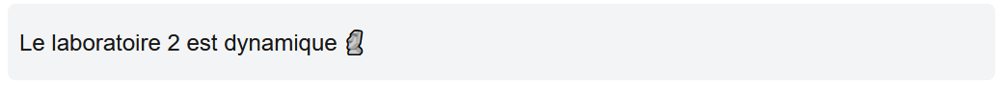</center>

## 😵 Étape 1 - J'ai déjà tout oublié React

### **1 -** Télécharger et lancer le projet

Téléchargez le projet et initialisez un repo Git au besoin. 

[💡](/notes/rencontre1.1#-gestion-des-dépendances) Avant d'ouvrir le projet, réinstallez les dépendances avec `npm install` en vous situant à la racine du projet avec PowerShell.

:::info

> Pourquoi faut-il faire `npm install` et « réinstaller les dépendances » ?

Quand un projet **Next.js** est hébergé sur GitHub ou stocké en infonuagique, il faut à tout prix retirer les dossiers `node_modules` et `.next` du projet, qui contiennent une quantité gigantesque 🐳 de dossiers et de fichiers qui correspondent aux **dépendances** du projet **Next.js**. (Du code et des ressources nécessaire au fonctionnement du projet et ses librairies) Bien entendu, si vous utilisez Git, le fichier `.gitignore` exclut déjà `node_modules`et `.next`.

La commande `npm install` vérifie toutes les dépendances listées dans le fichier `package.json` et les télécharge de nouveau pour restaurer le dossier `node_modules`.

:::

[💡](/notes/rencontre1.1#-ouvrir-et-exécuter-un-projet-nextjs) Ouvrez le projet avec Visual Studio Code et exécutez l'application avec un terminal dans Visual Studio Code. Et voilà, on est prêt à se lancer tête première dans le laboratoire 2. On s'amuse déjà ! 😐

## 👄 Étape 2 - Je commence à saisir le potentiel de React

Commençons par nous familiariser avec la fonction `.map()` et les **événements**.

### **2 -** Liste avec .map()

Déclarez un état nommé `loveList` dans le composant `Home`. Ça doit être un tableau de `string` 
immédiatement initialisé avec trois choses que vous aimez plus que la _Prog Web_. 😱😍

[💡](/notes/rencontre1.2#-afficher-une-liste) Dans le HTML, utilisez `.map()` pour parcourir votre liste et dupliquer un élément `<li>` trois
fois à l'intérieur d'un élément `<ul className="list-disc ml-4">` pour afficher tous les éléments de votre liste élégamment.

<center>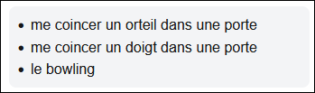</center>

### **3 -** Condition

Déclarez un état nommé `userAge` et affectez-lui la valeur 19.

[💡](/notes/rencontre1.2#-affichage-conditionnel) Dans le HTML, rédigez la phrase « J'aime les `???`. » Selon la valeur de `userAge`,
remplacez `???` par un texte différent :

* Si userAge est supérieur ou égal à 18 : `cigarettes`.
* Si userAge est inférieur à 18 : `LEGO Star Wars`.

Vous pourrez jouer avec la valeur de `userAge` pour tester que les deux possibilités fonctionnent.

<center>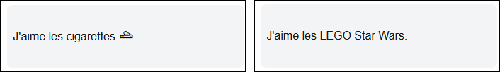</center>

:::warning

🧠 Pouvez-vous faire l'**exercice 3** en utilisant la forme `booléen && expression` ou encore en utilisant une **condition ternaire** directement dans le HTML ? Ça va alléger le code du composant `Home`.

:::

### **4 -** Événement avec clic

Cette fois-ci je vous donne un peu moins de pistes alors soyez prudents. 👷‍♂️👷‍♀️

[💡](/notes/rencontre1.2#-événements)[💡](/notes/rencontre1.2#-changer-un-état) Trouvez le moyen, en créant un état et une fonction dans le composant `Home`, que cliquer 10 fois sur le bouton « Chatouiller la bombe » remplace la bombe 💣 par une explosion 💥. (Bref, après avoir cliqué 10 fois sur le bouton, on affiche 💥 plutôt que 💣. Cliquer plus de 10 fois ne change rien.) De plus, on voit un décompte qui commence à 10 et qui diminue de 1 à chaque fois qu'on clique sur le bouton.

N'hésitez pas à modifier le HTML. Personnellement j'ai dû ajouter deux `<span>` et une condition ternaire pour réussir.

<center>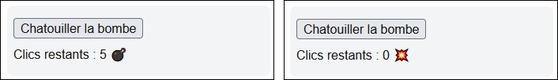</center>

### **5 -** Mini thème sombre

Présentement, la classe `light` est appliquée au `<div>` qui contient le bouton « Changer le fond » dans le HTML. Nous aimerions que le bouton « Changer le fond » permette de basculer cette classe vers `dark`. (Puis à nouveau vers `light` si on clique encore)

En exploitant les **événements**, en créant un **état** et en créant une **fonction**, trouvez le
moyen de rendre tout cela fonctionnel.

:::tip

On peut combiner des variables (qui contiennent des noms de classes) et des classes *hard-codées* dans le HTML :

```tsx
<div className={'classe1 classe2 ' + maVariable1 + ' ' + maVariable2}>Blabla</div>
```

Si vous préférez les **template strings** :

```tsx
<div className={`classe1 classe2 ${maVariable1} ${maVariable2}`}>Blabla</div>
```

:::

<center>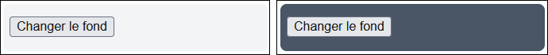</center>

:::note

Vous commencez peut-être à trouver qu'il commence à y avoir beaucoup de code (TypeScript + HTML) dans le composant `Home`. C'est normal, habituellement, pour une page sophistiquée comme celle-ci, on sépare le code en **plusieurs composants**. Néanmoins, nous apprendrons seulement à le faire lors du **Cours 5**, alors pour le moment, on continue de façonner notre tour de Babel dans `Home` 🗼

:::

## 🧾 Étape 3 - La formule R

Pour les prochains exercices, nous travaillerons avec des éléments de formulaire. Nous ferons un usage excessif du **Two-way binding**. C'est un outil indispensable pour toute la session, car ça permet d'accéder à l'input utilisateur facilement.

### **6 -** Saluer avec le nom fourni

[💡](/notes/rencontre1.2#-formulaires) Utilisez le champ texte présent et associez-le à un état de type `string`. Le but est de pouvoir entrer son nom dans le champ, puis, de cliquer sur le bouton pour faire afficher le  message `"Salut nom"`. Vous aurez besoin d'une fonction qui appelera `alert(...message...)` dans le composant.

<center>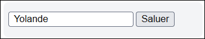</center>
<center>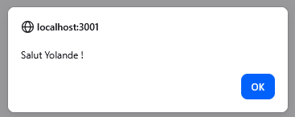</center>

### **7 -** Choix d'une couleur de fond

À l'aide d'un champ `<select>`, on doit pouvoir choisir parmi trois couleurs de fond pour un élément HTML. (Les trois classes possibles doivent être `cyan`, `red` et `amber`. Par défaut, `cyan` est déjà appliqué au `<div>` qui nous intéresse) Avec un champ `<select>`, le **two-way binding** fonctionne un peu différemment...

Les attributs `value` et `onChange` **auront seulement à être placés à un endroit** : dans la balise `<select>`. L'état associé au champ `<select>` grâce au **two-way binding** va contenir la valeur spécifiée dans l'attribut `value` de l'élément `<option>` qui aura été choisi par l'utilisateur. (Relisez cette phrase plusieurs fois au besoin 😬)

Si je le formule autrement, ça donnerait « Dans le fond dude l'`<option>` que t'as choisie, ben c'est sa `value` qui va aller dans l'état associé au `<select>`. Genre, si t'as choisi l'option **Bleu**, ben ton état va contenir `"cyan"` dude. ». 

Le but sera simplement d'utiliser cette valeur parmi les **classes**. Avec un peu de concaténation pour glisser un **état** qui contient la **classe**, vous y arriverez.

<center>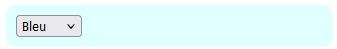</center>
<center>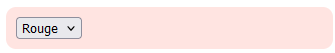</center>
<center>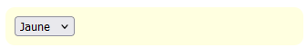</center>

### **8 -** Formulaire pour créer un objet

[💡](/notes/rencontre1.2#-exemple-sophistiqué-2) Complétez le formulaire fourni pour qu'il permette d'ajouter un `VideoGame` dans la liste
`videoGames`. ([💡](/notes/rencontre1.2#-changer-un-tableau) Vérifiez comment modifier un tableau stocké dans un état !)

Vous aurez quelques défis pour certains types de champs :

* Pour la **checkbox**, associez le champ à un état de type `boolean` et 
affectez-lui la valeur `true` ou `false` par défaut. Au lieu d'utiliser l'attribut `value`, il faudra utiliser l'attribut `checked={monEtat}`. Finalement, pour l'événement `onChange`, on va utiliser `e.target.checked` plutôt que `e.target.value`.

* Pour les boutons **radio**, ça fonctionne un peu comme un `<select>`... sauf qu'il faut répéter le **two-way binding** dans chaque bouton : On utilise le même `onChange` que d'habitude, qui sera identique dans les trois boutons radio. Puis, au lieu d'utiliser `value`, on utilise `checked={monEtat == 'valueDeMonRadio'}`.

Exemple pour un des trois boutons radio de la solution :

```tsx
→ Hors ligne <input type="radio" name="vgMode" value="hors ligne" checked={mode == 'hors ligne'} onChange={(e) => setMode(e.target.value)} />
```

* Pour les genres séparés par des virgules (ex : `action,rpg,solo`), ce sera bel et bien un `string`, mais lorsque vous allez créer votre `VideoGame` avec `new VideoGame(...)`, vous devrez fournir un tableau `string[]` au constructeur en faisant `maChaine.split(",")`, ce qui va convertir la chaîne de caractères en tableau `string[]` en prenant chaque élément entre les virgules.

L'affichage avec `map()` est déjà fourni pour être sûr que ça fonctionne bien lorsque vous testerez.

<center>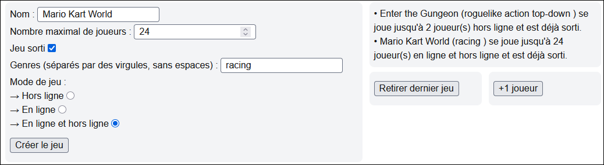</center>

### **9 -** Liste vide

[💡](/notes/rencontre1.2#-affichage-conditionnel) L'affichage des jeux était déjà faite, mais pouvez-vous mettre un message spécial qui s'affiche seulement lorsque la liste est vide ? Utilisez la forme `booléen && expression`.

<center>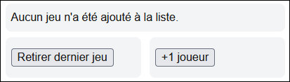</center>

## 👽 Étape 4 - Mutation de tableau

### **10 -** Retrait du dernier élément

[💡](/notes/rencontre1.2#-changer-un-tableau) Rendez ce bouton fonctionnel pour qu'il retire le dernier jeu du tableau `videoGames`. Si c'est bien codé, appuyer sur le bouton mettra automatiquement à jour l'affichage de la liste dans la page.

<center>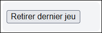</center>

### **11 -** Mutation de tous les éléments

[💡](/notes/rencontre1.2#-changer-un-tableau) Rendez ce bouton fonctionnel pour qu'il augmente le nombre de joueurs de tous les jeux du tableau `videoGames` de 1. Si c'est bien codé, appuyer sur le bouton mettra automatiquement à jour l'affichage de la liste dans la page.

<center>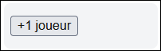</center>