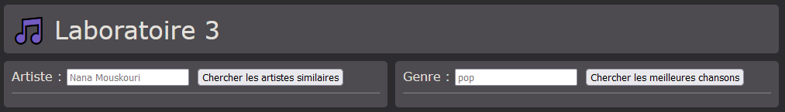
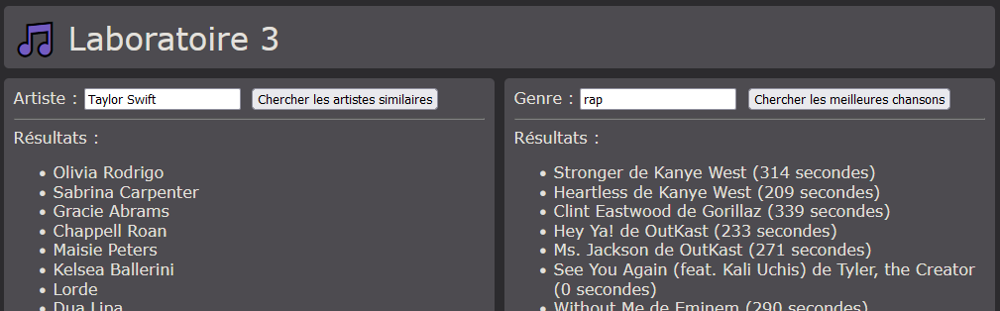
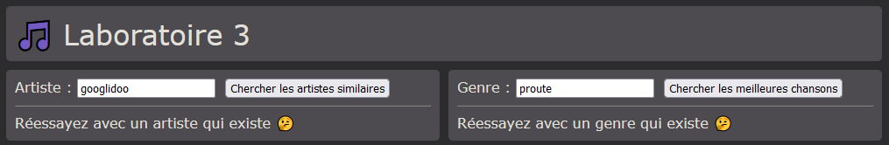
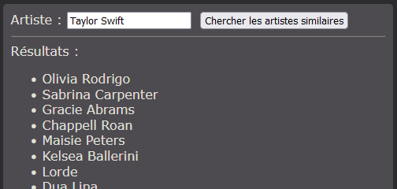
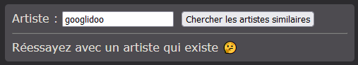
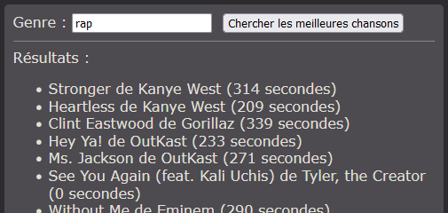
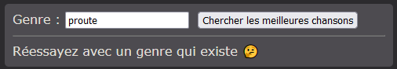

# Laboratoire 3

Commencez par télécharger le ⛔ [projet de départ](https://github.com/departement-info-cem/4W6-WebServices/releases/latest/download/code-labo3.zip) pour ce laboratoire. 🎁

Clé d'API Last FM fournie : `9a8a3facebbccaf363bb9fd68fa37abf`

Documentation des requêtes à utiliser pendant le laboratoire :

* Obtenir les artistes similaires : [https://www.last.fm/api/show/artist.getSimilar](https://www.last.fm/api/show/artist.getSimilar)
* Obtenir les meilleures chansons pour un genre : [https://www.last.fm/api/show/tag.getTopTracks](https://www.last.fm/api/show/tag.getTopTracks)

## 🧠 Étape 0 - Version 200 QI

Si vous vous sentez très confiant(e) et que vous n'avez pas besoin d'instructions pas-à-pas, voici
un résumé de la tâche à réaliser.

Avant d'envoyer la moindre requête, la page aura l'air de ceci :

Si on envoie des requêtes valides, la page aura l'air de ceci :

Si on envoie des requêtes invalides (ou avec 0 résultats), la page aura l'air de ceci :

## 👶 Étape 1 - Je veux du pas-à-pas s'il vous plait monsieur

Même les meilleurs ont besoin d'un coup de pouce ! 🤫

### **1 -** Télécharger et lancer le projet

Comme d'habitude, après avoir téléchargé le projet, on doit réinstaller les dépendances avec `npm install`.

[💡](/notes/rencontre2.1#-envoyer-une-requête) Par contre, avant de lancer le projet, n'oubliez pas d'installer la dépendance qui sera nécessaire pour les requêtes.

Une fois que c'est fait, ouvrez le projet dans VS Code et exécutez-le.

## 🤨 Étape 2 - Two-way binding ? Ça ne me dit rien

### **2 -** Compléter les formulaires

[💡](/notes/rencontre1.2#-formulaires) Avant de lancer les requêtes, pouvez-vous associer les champs (les `<input`>) avec les bons états ? Ces états nous serviront pour exploiter l'input de l'utilisateur lorsque nous lancerons une requête.

[💡](/notes/rencontre1.2#-événements) De plus, assurez-vous que cliquer sur les boutons appelle bel et bien la fonction appropriée dans le code. (Bien que les fonctions en question soient vides pour le moment)

## 👻 Étape 3 - Esprit es-tu là ?

Nous allons maintenant envoyer des requêtes aux serveurs Web de Last FM pour obtenir des données à afficher dans la page.

Clé d'API Last FM fournie : `9a8a3facebbccaf363bb9fd68fa37abf`

Documentation des requêtes à utiliser :

* Obtenir les artistes similaires : [https://www.last.fm/api/show/artist.getSimilar](https://www.last.fm/api/show/artist.getSimilar)
* Obtenir les meilleures chansons pour un genre : [https://www.last.fm/api/show/tag.getTopTracks](https://www.last.fm/api/show/tag.getTopTracks)

:::warning

Ces deux URLs mènent vers la **documentation** à utiliser ! Ce ne sont pas les requêtes telles quelles ! 😠

:::

### **3 -** Artistes similaires

[💡](/notes/rencontre2.1#-envoyer-une-requête) Lancez la requête pour obtenir les artistes similaires à celui fourni par l'utilisateur.

[💡](/notes/rencontre2.1#-personnaliser-la-requête-choisir-linput) N'oubliez pas de bien utiliser l'input de l'utilisateur lors de la recherche.

[💡](/notes/rencontre2.1#-ranger-la-clé-dapi-dans-une-constante) Glissez la clé d'API dans une constante plutôt que de la _hardcoder_ dans la requête.

N'hésitez pas à commencer par visualiser **l'objet JSON** obtenu grâce à `console.log()`.

[💡](/notes/rencontre2.1#-extraire-un-tableau-de-données) Une fois l'objet JSON bien en vue, faites le nécessaire, avec une boucle, pour
extraire le nom de tous les artistes similaires. Il suffira de les ajouter dans le tableau de `string` nommé `similarArtists`. Comme ce
sont de simples `string`, la boucle fera quelque chose comme `monTableau.push(...le string...)`.

Le résultat d'une requête valide devrait ressembler à ceci :

[💡](/notes/rencontre2.1#-gérer-les-erreurs) Si on utilise un artiste qui n'existe pas dans la requête, l'API Web de Last FM nous retournera
une erreur. Faites le nécessaire pour obtenir un affichage similaire si une erreur est obtenue suite à la recherche :

Finalement, assurez-vous de vider le tableau `similarArtists` à chaque fois que vous lancez une nouvelle recherche ! (Même si la requête a généré une erreur) Sinon les anciens résultats vont s'accumuler avec les nouveaux. 

En TypeScript / JavaScript, on peut vider un tableau en faisant `monTableau = []`. Dans ce cas, avec un état, ce sera plutôt `setMonEtat([])`.

### **4 -** Meilleures chansons d'un genre

C'est à peu près les mêmes étapes à réaliser, mais avec deux défis supplémentaires.

[💡](/notes/rencontre2.1#-extraire-un-tableau-de-données) L'extraction des données dans l'objet JSON sera un peu plus sophistiquée. Vous devrez d'ailleurs remplir la liste `topSongs` en créant des `new Song(...)` (la classe `Song` existe déjà dans `/app/_types`) dans la boucle for qui parcourera l'objet JSON.

Le résultat d'une requête valide devrait ressembler à ceci :

Pour la gestion des erreurs, cette fois-ci, l'API Web de Last FM ne génèrera pas d'erreurs si on utilise un genre invalide. L'objet
JSON va tout simplement contenir 0 chansons à la place. Ainsi, pour afficher un message d'erreur, il faudra plutôt vérifier combien
de résultats ont été obtenus.

Le résultat d'une requête invalide devrait ressembler à ceci :

## 🚌 Étape 4 - Commencer le TP1 ? Oublie ça mon autobus passe dans 5 minutes

Vous êtes désormais bien préparés pour réaliser le TP1. Il est à peu près de la même longueur que ce laboratoire.
N'hésitez pas à le commencer dès maintenant, mais sachez que le prochain cours sera entièrement consacré à réaliser le TP1.
(Pas de théorie, pas de labo)