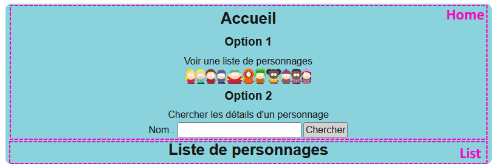
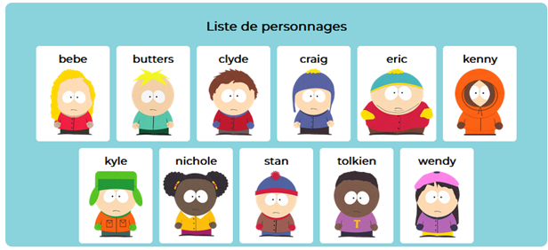
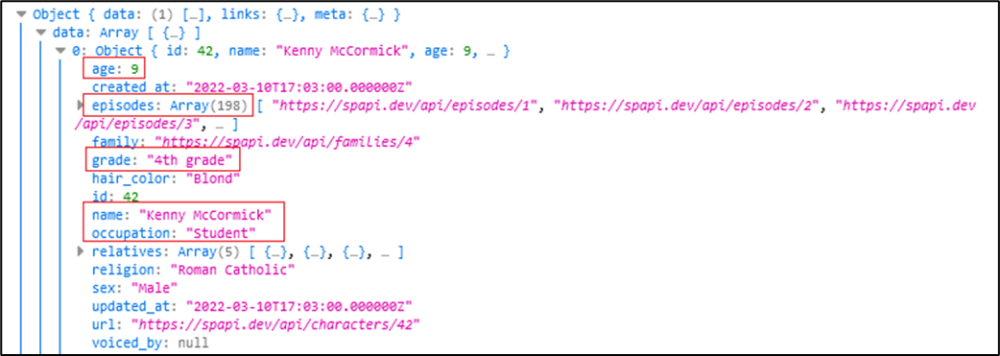
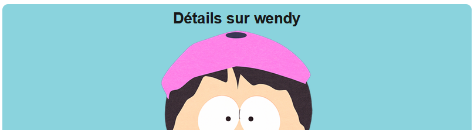
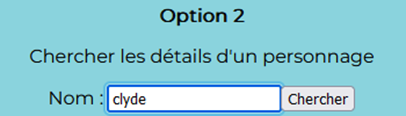

# Laboratoire 5

<center></center>

:::note

À partir de ce laboratoire, du CSS personnalisé sera utilisé à la place des classes **Tailwind**. Ce n'est pas mieux ou pire, c'est juste une autre approche. Dans ce cas, l'objectif est d'alléger le HTML des laboratoires.

Le titre dans la page ressemble à « Laboratoire 3 », mais c'est parce que vous n'êtes pas allé chez l'optométriste depuis longtemps. C'est bel et bien un 5 qui est affiché.

:::

## ☃ Étape 1 - Parc du sud

Téléchargez le [projet de départ](../../static/files/labo5.zip).

Réinstallez les dépendances avec `npm install`, ouvrez Visual Studio Code et exécutez l'application Web avec `npm run dev`.

## 🤹‍♂️ Étape 2 - Jongleur de composants

Pour le moment, seuls les composants **Home** et **List** existent. Il y aussi pas mal de HTML dans le **layout racine**. (Header, nav, footer) En exécutant l'application, on peut voir les composants `Home` ET `List` dans la page.

`Home` est affiché à cause du `{children}` dans le **layout racine** et de la **route vide**, mais `List` lui, est affiché à cause du `<List />`, à titre de composant réutilisable.

<center></center>

### ⛵ 1 - Routage et menu de navigation

[💡](/notes/rencontre3.1#-créer-un-nouveau-composant) Commencez par créer un nouveau composant `Details` dans `/app/_components`. 
Il peut simplement retourner un `<div>` qui est aussi vide que notre espoir en un monde meilleur.

[💡](/notes/rencontre3.1#-routage) Nous aimerions que le `<main>` du **layout racine** affiche un composant différent
selon la route actuelle. Créez les dossiers nécessaires, déplacez deux composants existants et modifiez très légèrement `layout.tsx` pour que :

* `Home` soit chargé lorsque la route est vide. (C'est déjà le cas ... mais on ne veut plus voir `List` en-dessous !)
* `List` soit chargé lorsque la route `http://localhost:3000/list`.
* `Details` soit chargé lorsque la route est `http://localhost:3000/details`.

[💡](/notes/rencontre3.1#-layouts-et-menus-de-navigation) De plus, assurez-vous que les trois boutons du menu de navigation soient fonctionnels pour changer de route et donc de composant. On devrait pouvoir « se promener entre les trois pages » grâce au menu.

### 🚗 2 - Deux boutons de navigation de plus

* Dans le composant `Home`, cliquer sur le bouton « Voir une liste de personnages » mène vers la route `/list`.
* Le bouton « Chercher » doit mener vers la route `/details`. (Pour le moment on ne touche pas à l'`<input>` au-dessus)

:::tip

Un élément `<Link>` peut très bien enrober une portion du texte ou un autre élément HTML. Sinon on peut toujours utiliser un événement `onClick` et [changer la route avec du TypeScript](/notes/rencontre3.1#-rediriger-lutilisateur), mais c'est très légèrement plus verbeux.

:::

## 😇 Étape 3 - Jeunes et innocents

Dans cette étape, nous allons surtout travailler sur les composants `List` et `Card`. (Ce dernier n'existe pas encore, comme votre plaisir à réaliser ce labo, mais d'ici là fin du labo, une de ces deux choses va exister)

### 👶 3 - Créer un autre composant

[💡](/notes/rencontre3.1#-créer-un-nouveau-composant) Créez un nouveau composant **réutilisable** nommé `Card`. Il servira à afficher
**un** personnage. (Son nom et son image) Voici le HTML et le CSS pour le composant `Card` :

```html showLineNumbers
<div className="card" title="Afficher les détails de ???">
    <h4>???</h4>
    
</div>
```

( Le CSS ira vers la fin de `globals.css` )

```css showLineNumbers
.card{
    background-color:white; text-align: center; padding:5px;
    border-radius:5px; overflow: hidden; cursor:pointer; min-width:100px;
}

.card img{ height:100px; display:inline; }

.card h4{ margin:5px 0px; }
```

Ce composant ne sera pas accessible via le menu de navigation. Il sera intégré dans le composant `List` dans les étapes qui suivent.

### ♻ 4 - Intégration d'un composant réutilisable

[💡](/notes/rencontre3.1#-composants-réutilisables) Dans le TypeScript du composant `List`, remarquez qu'il y a une liste de personnages.
Le but est, **pour chaque personnage de cette liste**, d'afficher un composant `Card` auquel nous enverrons un nom de personnage, via
un paramètre (ou *prop*) nommé `characterName`.

* En gros, grâce à `.map()`, vous allez afficher le composant `Card` qui reçoit le nom `bebe`, puis un qui reçoit le nom `butters`,
puis un qui reçoit le nom `clyde`, etc.

Dans le HTML de `Card`, remplacez tous les `???` par le paramètre `characterName`, qui contient le nom du personnage à afficher. Cela complètera l'affichage.

<center></center>

Le composant `Card` peut sembler un peu inutile. (Pourquoi ne pas directement tout mettre dans `List` ?) Cela dit, dès qu'on compte réutiliser cet affichage ailleurs dans le site Web, on économise quelques lignes de HTML et de TypeScript.

:::tip

Ultimement, dans un projet **Next.js**, n'ayez jamais peur de *morceller* vos pages en autant de composants que vous voulez dès que vous remarquez des morceaux **répétitifs**.

:::

## 📜 Étape 4 - Des détails sans intérêt

C'est au tour du composant `Details` (qui est encore vide) de subir nos manipulations maladroites.

Voici le HTML et le CSS à utiliser initialement :

```tsx showLineNumbers
<div>
    <h3>Détails sur ???</h3>
    

    <div>
        <table>
            <tbody>
                <tr><td><b>Nom complet</b> : </td><td>???</td></tr>
                <tr><td><b>Âge</b> : </td><td>???</td></tr>
                <tr><td><b>Occupation</b> : </td><td>???</td></tr>
                <tr><td><b>Grade</b> : </td><td>???</td></tr>
                <tr><td><b>Nombre d'épisodes</b> : </td><td>???</td></tr>
            </tbody>
        </table>
    </div>
</div>
```

( Le CSS ira vers la fin de `globals.css` )

```css showLineNumbers
table{margin:auto;}

td:first-child{text-align:right;}

td:last-child{text-align: left;}
```

### 📶 5 - Implémenter une requête

Dans le **TypeScript** de `Details`, créez deux états :

* `characterName`, qui sera un `string | null`. Affectez-lui la valeur `null`.
* `characterDetails`, qui sera un `Character | null`. Affectez-lui la valeur `null`.

[💡](/notes/rencontre2.1#-lancer-la-requête-dès-le-chargement-de-la-page-web) Ensuite, dans `useEffect()` :

* Affectez la valeur `"kenny"` à l'état `characterName`. (Ceci est temporaire)
* [💡](/notes/rencontre2.1#-envoyer-une-requête) Envoyez la requête suivante et tentez de créer un objet de type `Character` pour remplir
la variable `characterDetails`. (**Axios** est déjà installé)

```ts showLineNumbers
"https://spapi.dev/api/characters?search=" + "kenny"
```

<center>  
Pour le nombre d'épisodes... vous avez besoin de `.length` !</center>

<br/>

À l'aide des états `characterName` et `characterDetails`, remplacez tous les `???` dans le HTML.

* Le nom et l'image au début utiliseront `characterName`.
* Toutes les données dans le tableau utiliserons `characterDetails.property`.

:::warning

> Woah ! Le HTML lève parfois des erreurs quand je tente d'utiliser `characterName` et `characterDetails` !

En effet, comme ces deux états contiennent potentiellement `null`, React a peur de générer des exceptions 🐞 en les utilisant.

Une solution « simple » est d'utiliser une condition du genre :

```tsx showLineNumbers
{ 
  characterName != null && characterDetails != null && 
  <div>
    ..tout le HTML sensible...
  </div> 
}
```

Les éléments HTML qui utilisent ces états ne s'afficheront pas tant que les deux états ne seront pas bien remplis, mais il n'y aura aucun risque d'exception et aucune erreur ne sera levée dans VS Code.

:::

## 🔌 Étape 5 - Quelques derniers branchements

### 📬 6 - Paramètres de routes

Pour le moment, le composant `Details` affiche toujours les informations sur Kenny.

[💡](/notes/rencontre3.1#-routes-dynamiques) Créez une route dynamique qui permet d'envoyer un **paramètre de route** au composant `Details`.

* Ce paramètre de route servira à envoyer le nom d'un personnage comme « tolkien », « wendy », etc.

Dans le composant `Details`, attrapez le paramètre de route et faites-en deux usages :

* Affectez-le dans l'état `characterName` (Plutôt que forcément `"kenny"`)
* Utilisez le nom reçu pour la requête. (Plutôt que forcément `"kenny"`)

Vous pouvez tester avec cette route, par exemple : `http:localhost:3000/details/wendy` (Utilisez des noms en minuscules !)

<center>  </center>

Modifiez le `<Link>` du menu de navigation pour qu'il mène vers `/details/kenny`, sinon il ne fonctionnera plus.

Dans le composant `Card`, ajoutez un `<Link>` sur le `<div>` pour rediriger vers le chemin `/details/nom_du_personnage_cliqué`. (Par exemple, cliquer sur le `<div>` de Wendy va nous rediriger vers `/details/wendy`)

### 📝 7 - Mini formulaire

Dans le composant `Home`, faites les modifications nécessaires pour qu'on puisse écrire le nom d'un personnage dans l'`<input>` et que ce nom soit ensuite utilisé comme **paramètre de route** quand on appuie sur le bouton « Chercher » qui mène vers la route `/details`. (Donc, si on écrit « eric » dans l'`<input>`,le bouton va rediriger vers `/details/eric`)

<center>  </center>

Ce n'est pas grave si le composant `details` fonctionne mal avec un nom invalide.

### 🛴 8 - Paramètre optionnel

[💡](/notes/rencontre3.1#-routes-dynamiques-optionnelles) Nous aimerions que le paramètre de route soit optionnel pour aller vers `/details`. Il va falloir renommer un dossier et modifier comment on accède au paramètre de route. Désormais, si jamais aucun paramètre de route n'a été fourni, on utilise `"kenny"` comme nom de personnage. (Mais si un nom est fourni en paramètre de route, on continue de l'utiliser, comme avant !)

Dans le menu de navigation, remettez simplement `/details` dans le troisième `<Link>`, comme avant.

### 🎨 9 - Un module CSS simple

*Oof !* Il y a beaucoup de styles dans `globals.css`... Faisons semblant de vouloir améliorer la situation.

[💡](/notes/rencontre3.1#-modules-css) Créez un module qui contient les styles qui sont seulement utilisés par le composant `Card`. Adaptez le composant `Card` pour utiliser ce module. L'affichage de la page `/list` devrait être identique à avant si vous avez bien réussi.

Youpi. Dans un gros projet, isoler un peu le CSS dans des **modules** aide à organiser le code et à moins avoir un méga bordel dans `globals.css`.

<hr/>

🥳 Bravo, grâce à [texte conclusif sur l'usage des composants qui offre une perspective satisfaisante sur l'apprentissage réalisé] !