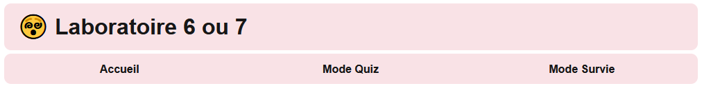
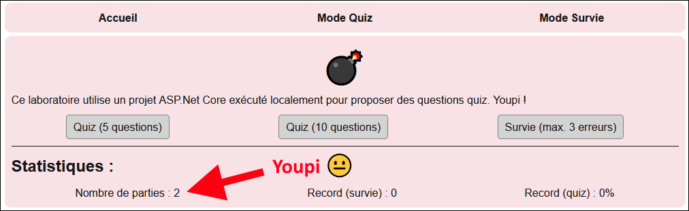
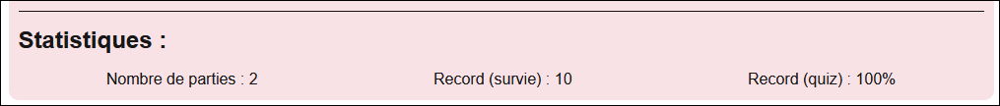

# Laboratoire 6

Téléchargez le [projet de départ](../../static/files/labo6.zip), mais ne le lancez pas tout de suite. ⛔🧤⚾

## 🚀 Étape 1 - Laboratoire du turfu

Ce laboratoire utilise une **API Web** *faite maison* plutôt qu'une **API publique**. Il y aura quelques étapes de plus à réaliser avant de commencer à coder.

### 🏗 1 - Lancer deux projets

Le projet `labo6_client` est un projet **Next.js**, comme d'habitude. C'est sur lui qu'on va travailler. Vous pouvez déjà le lancer comme d'habitude, avec `npm install` puis `npm run dev`.

Le projet `labo6_serveur` est un projet **ASP.NET Core** qui sert de **serveur Web**. Cela correspond au type de projet que nous allons créer à partir du **cours 15**. Aujourd'hui, nous n'allons pas modifier ce projet, nous allons simplement l'utiliser : c'est l'API Web à laquelle nous enverrons des requêtes. Le projet vous retournera du **JSON** lorsque vous lui enverrez des requêtes. Pour une fois, les requêtes n'iront *pas très loin* : elles sont envoyées de votre ordinateur vers ... *votre ordinateur*. (Puisque les deux applications Web roulent sur la même machine)

Nous n'allons pas ouvrir `labo6_serveur` dans un **IDE**. Vous avez seulement à exécuter deux commandes avec **PowerShell** en vous situant dans le dossier `/labo6_serveur` : `dotnet ef database update`, puis `dotnet run`. ⛔ Laissez cette fenêtre PowerShell **ouverte** pendant votre laboratoire ! Sinon le serveur ne sera plus actif.

:::note

Lors des examens, nous procéderons **de la même manière** : un **client Next.js** et un **serveur ASP.NET Core** rouleront sur votre ordinateur, ce qui permet de couper l'internet pendant l'examen. 😩🌐

:::

Avant de poursuivre, visitez le site Web dans votre navigateur et familiarisez-vous avec l'application Web : visitez les trois pages et prenez une minute pour essayer et comprendre les deux types de quiz. Il y a aussi une bombe qu'on peut cliquer de 1 à 10 fois avant qu'elle explose dans toutes les pages, mais ça n'a aucun lien avec les quiz 🙄

## 📉 Étape 2 - Mon laboratoire ne compte pas pour vous

Dans les trois pages, il y a une statistique qui compte le **nombre de parties jouées**. Quand on termine un **quiz normal** ou un **quiz de survie**, dans le haut de la page, on peut voir que le nombre de parties jouées **passe à 1**. Bémol : cette information n'est jamais sauvegardée, alors dès qu'on change de page, cette statistique retourne à 0...

### 🫃 2 - Création d'un Context

[💡](/notes/rencontre3.2#-contexts) Comme on souhaite partager un **état** entre trois composants (`Home`, `Survival` et `Play`), il faudra créer un Context qui permettra de partager une donnée. Le parent de ces trois composants est le **layout racine** ET on veut partager la **valeur** et le **setter** d'un état, alors ça ressemble comme deux gouttes d'eau 💧💧 à l'exemple compliqué dans les notes de cours.

Une fois que vous aurez créé un nouveau composant et le context à partager entre les trois composants, il y aura quelques modifications à faire dans les trois composants :

* Un état dans chacun de ces composants sera remplacé par l'usage de votre Context.
* Dans le code de `Survival` et de `Play`, il y a une fonction qui **augmente le nombre de parties de 1**. Adaptez ce code pour faire usage du Context. (Selon le nom de vos variables, il se peut qu'il n'y ait rien à changer)
* Dans le HTML des trois composants, adaptez le morceau qui servait à afficher le nombre de parties jouées. (Encore là, il se peut que vous n'ayez rien à changer si vous avez gardé les mêmes noms de variables)

Si tout va bien, à partir de maintenant, en jouant des parties (faites plein d'erreurs pour tester rapidement), le nombre de parties jouées devrait être compté sans être réinitialisé à 0 lorsqu'on change de page. (Alternez entre accueil et quiz ou encore entre quiz et survie, par exemple)

:::danger

Si vous réactualisez la page ou si vous fermez l'onglet, même un Context se fera réinitialisé... Testez sans réinitialiser la page.

:::

### 🐳 3 - Context plus large

Vous l'aurez peut-être vu venir : il reste deux statistiques (**record pour survie** et **record pour quiz**) qui sont chacune utilisée par deux pages. Nous allons les intégrer au Context que nous avons déjà créé.

:::note

Normalement, nous aurions pu créer deux autres Contexts et il y aurait eu une seule information dans chacun des trois Contexts. Dans ce cas-ci, les trois informations sont liées et cela fait du sens de les agglomérer ensemble, alors autant utiliser un seul Context.

:::

Voici un peu d'aide pour réussir à intégrer **trois états** dans le même Context. Gardez à l'esprit que le but est de partager les **valeurs** et les **setters** de trois états à plusieurs composants.

1. Dans votre composant qui sert de *Context wrapper*, ajoutez un état pour le record (quiz) et un état pour le record (survie).
2. Dans votre **Provider**, au lieu de juste glisser `{ nbGames, setNbGames }`, on doit glisser **6 morceaux** maintenant.
3. Dans les trois composants qui utilisent votre Context, il faudra remplacer certains états et adapter un peu de code, dont du code qui notait les nouveaux records. (Encore une fois, si vos noms de variables n'ont pas changé, il se peut que vous n'ayez presque rien à adapter)

Désormais, les scores records devraient être affichés dans deux composants chacun. (`Home` et la page associée au type de jeu)

:::warning

On a utilisé un seul Context pour trois données, mais ça ne veut pas dire que c'est une bonne idée d'utiliser un seul Context pour *cinquante-douze* données dans une grande application ! Lorsqu'un composant utilise seulement 2 données sur 30 dans un Context, c'est signe qu'il commence à être temps de diviser le Context en plus petits morceaux.

:::

## 🙈 Étape 3 - Déplacer le problème

*Oof* ! Vous l'aurez peut-être déjà remarqué, mais il y a pas mal de logique (de code) qui se répète parmi les trois composants ! Nous allons y remédier grâce aux **hooks**.

### 💣 4 - Créer un petit hook

Dans chaque page, il y a une **bombe** qui peut être cliquée de 1 à 10 fois avant d'exploser. Le problème est que le code nécessaire au fonctionnement de la bombe est répété dans chaque composant. Nous allons rassembler le plus de code répétitif possible dans un **hook**.

[💡](/notes/rencontre3.2#-hooks) Créez un hook nommé `useFidgetBomb`. D'habitude, l'extension du fichier d'un hook aurait été `.ts`, mais dans ce cas, vous pourriez utiliser `.tsx` si vous remarquez qu'il y a un peu de **HTML** qui est retourné par une des fonctions du hook.

* Il y a **un état** et **deux fonctions** qui sont répétitifs pour la bombe. Les trois devront être déplacés dans votre **hook**.
* Il y a plusieurs manières de réussir, mais dans le meilleur scénario, votre **hook** aura seulement besoin de retourner une seule **fonction** pour la rendre accessible aux composants qui utiliseront ce **hook**.
* N'oubliez pas d'adapter vos trois composants en retirant du code et en faisant les modifications pour bien exploiter votre nouveau **hook**.

Le fonctionnement de la bombe dans les trois composants devrait être identique à avant.

### 📶 5 - Hook pour requête

[💡](/notes/rencontre3.2#-hooks) Dans les composants `Play` et `Survival`, il y a quelques fonctions et états qui sont répétitifs. Rassemblez-les autant que possible dans un nouveau **hook** nommé `useQuiz`. Adaptez les deux composants en conséquence en retirant / modifiant du code.

* Votre hook devrait contenir, au mieux, deux **états** et trois **fonctions**.
* Votre hook devra probablement retourner les deux **valeurs** et **setters** des états et les trois **fonctions**. (Donc un objet avec 7 choses)

:::warning

Le bloc `useEffect()` ne peut pas être déplacé dans un **hook**.

:::

Toutes les pages devraient fonctionner comme avant une fois votre **hook** bien créé et exploité. De plus, il y aura pas mal moins de code dans les composants `Play` et `Survival` ! 🤏

## 🧠 Étape 4 - Donc les contexts et hooks ne servent à rien ?

👑 Bon travail ! N'oubliez pas :

* Dès qu'une donnée doit être partagée en plusieurs composants : on se tourne vers un **Context**.
* Dès qu'il y a de la logique / du code répétitif entre plusieurs composants : on se tourne vers un **Hook**.

:::note

Dans certains cas, quand il y a énormément de logique / de code dans un composant, même si ce n'est pas répétitif, on peut songer à le déplacer dans un **hook**. (Ou même dans de simples **classes**, selon le contexte) On doit éviter d'avoir des **méga-composants**. (Autant en terme de **HTML** qu'en terme de **TypeScript**)

:::