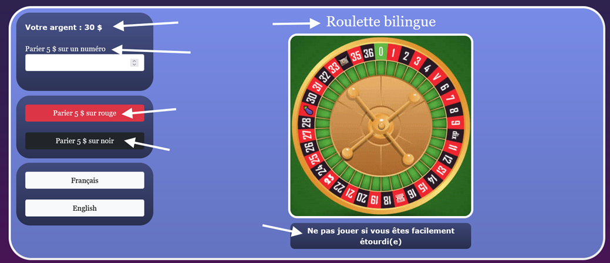

# Laboratoire 7 💩

## 🐌 Étape 1 - La routine... ou presque.

### 📦 1 - Installer deux dépendances pour i18n

Téléchargez le [projet de départ](../../static/files/labo7.zip) et réinstallez les dépendances.

[💡](/cours/rencontre4.1#étape-1----installer-deux-dépendances) Avant d'ouvrir le projet, installez les deux dépendances supplémentaires.

Vous pourrez ensuite ouvrir le projet et l'exécuter.

## ⌚ Étape 2 - Travailler dur pour que ça dure

Dans cette partie, nous travaillerons principalement sur le composant `stockage`. (« Machine à sous »)

Dans l'application Web, créez un profil dans la première page. Vous pouvez également jouer avec la machine à sous pour remarquer que votre montant d'argent changera. Changez d'onglet et revenez au jeu de la machine à sous : votre profil a disparu 😭

L'objectif de cette étape sera d'exploiter le **stockage local** pour faire persister le profil de l'utilisateur.

### 💾 2 - Sauvegarder le profil dans le stockage du navigateur

[💡](/cours/rencontre4.1#-sauvegarder-une-donnée-dun-autre-type-que-string) Faites le nécessaire pour ranger le profil dans le **stockage de session**. 

* Le profil doit être sauvegardé lors de sa création.
* Le profil doit être sauvegardé à chaque fois que la valeur du portefeuille évolue.

:::tip

Lorsqu'on sauvegarde une donnée avec **la même clé** qu'une donnée existante, l'ancienne donnée est tout simplement écrasée.
[💡](/cours/rencontre4.1#-vérifier-le-stockage-local-dans-le-navigateur) N'hésitez pas à utiliser **l'outil stockage** de votre navigateur pour visualiser la donnée stockée. 

:::

Même si vous avez bien stocké le profil, gardez à l'esprit que pour l'instant, du point de vue de l'utilisateur, **ça ne fonctionne toujours pas**. (Même si la donnée sera bel et bien présente dans le stockage local) C'est parce qu'il faut réaliser la prochaine section.

### 📬 3 - Récupérer le profil dans le stockage du navigateur

[💡](/cours/rencontre4.1#-récupérer-une-donnée-dun-autre-type-que-string) Faites le nécessaire pour que le profil soit **chargé** à chaque
fois que le composant est chargé. (Donc dès que l'onglet est affiché)

⛔ Notez que la variable `this.profile` sert à stocker, en tout temps, le profil du joueur lorsque le composant est actif.

## 👅 Étape 3 - Embrasser toutes les langues

Dans cette partie, nous travaillerons principalement sur le composant `i18n`. (« Roulette bilingue »)

L'objectif sera de traduire tous les textes visibles dans la page en français et en anglais. (Textes fournis plus loin)

### 🌐 4 - Internationaliser un composant

[💡](/cours/rencontre4.1#-internationalisation) Faites le nécessaire pour rendre disponibles en français et en anglais tous les textes pointés dans l'image plus haute. ⛔ N'oubliez pas que vous avez déjà installé les deux dépendances nécessaires.

N'oubliez pas de rendre fonctionnels les boutons `Français` et `English`.

Je vous fournis tous les textes parce que vous êtes tout mignons 😩 :

|Français|Anglais|
|:-|:-|
|Votre argent : VARIABLE $|Your money : $ VARIABLE|
|Parier 5 $ sur un numéro|Bet $ 5 on a number|
|Parier 5 $ sur rouge|Bet $ 5 on red|
|Parier 5 $ sur noir|Bet $ 5 on black|
|Roulette bilingue|Bilingual roulette|
|Ne pas jouer si vous êtes facilement étourdi(e)|Do not play if you get dizzy easily|

Attention : pour votre santé psychologique il est interdit de visiter le casino de Montréal dans les 7 prochains jours.

## 🛑 Étape 4 - Une API qui ne répond pas à n'importe qui

Dans cette partie, nous travaillerons principalement sur le composant `token`. (« Spotify ») Il n'y aura presque aucun code à produire et cela
pourrait être très facile à compléter, c'est normal. Le but est simplement d'avoir un exemple de code fonctionnel pour se lancer plus vite dans le TP2 ensuite.

### 🎵 5 - Créer un compte Spotify et obtenir son ID et secret

[💡](/cours/rencontre4.1#étape-1----créer-un-compte) Créez un compte Spotify si vous n'en avez pas déjà un. Obtenez un `Client ID` et un 
`Client Secret`.

[💡](/cours/rencontre4.1#étape-2---%EF%B8%8F%EF%B8%8F-hard-coder-le-client-id-et-le-client-secret) Hardcodez votre ID et votre secret dans le service `spotify`.

### 🪙 6 - Obtention du token

Initialement, vous remarquerez que la page n'affiche rien : c'est normal. Il faudra que l'utilisateur se connecte à l'API de Spotify pour
pouvoir lancer sa première recherche.

[💡](/cours/rencontre4.1#étape-3----utiliser-une-requête-de-connexion) La requête de connexion est déjà codée pour vous. Vous devrez simplement trouver **où l'appeler** pour qu'un **token d'authentification Spotify** soit obtenu **dès le chargement de la page**.

### 📶 7 - Requêtes avec authentification

Une fonction permettant de rechercher un artiste dans l’API Spotify et d’afficher son nom et sa photo dans la page est déjà présente dans le service `spotify`. Trouvez où appeler cette fonction à partir du composant `token` pour que le formulaire de recherche soit fonctionnel.

🥳 Bon travail ! Vous avez terminé. Il n'y a pas d'autres instructions en-dessous de cette phrase.

Ceci n'est pas une instruction.

Ceci non plus.

Arrêtez de lire ! Vous avez terminé le laboratoire ! Allez faire autre chose de plus utile 😠 (Ceci n'est toujours pas une instruction)

Vous lisez encore ... ? Oof

Bon... peut-être que si on mentionne des détails absolument inintéressants sur le cours, vous allez finir par passer à autre chose et arrêter de lire ? Très bien, ne sous-estimez pas la capacité d'un enseignant à désintéresser les étudiants, vous finirez toujours surpris. Saviez-vous que c'est la dernière session où Angular sera enseigné dans ce cours ? C'est bien vrai, dès la session d'hiver nous passons à React, un autre framework client Web similaire à Angular. Bon, on dit « similaire », mais il y a pas mal de différences... mais sommes toutes, en terme de fonctionnalités, on parle de la même chose. Vous lisez encore ? Très bien. Rassurez-vous, dans le cours de Programmation Web avancée, vous continuerez d'utiliser Angular. Il aurait donc été bête d'apprendre React cette session. N'ayez crainte, apprendre Angular reste très pertinent. Maintenant que vous connaissez Angular, apprendre React sera plus simple. On a juste remarqué qu'un nombre croissant de milieux de stage recherchait des programmeurs (... ou programmeuses ! Bien entendu !) compétent(e)s avec React. (Et de moins en moins avec Angular, bien que ce soit toujours le cas, ne vous inquiétez pas) Vous êtes toujours là ? Haha vous êtes tenaces on vous l'accorde. C'est beaucoup de travail de devoir refaire le cours en changeant un *framework*, mais dans ce cas-ci, la bonne nouvelle est que la deuxième moitié du cours ne changera pas trop. Voyez-vous : nous continuerons d'utiliser *ASP.NET Core* dans la deuxième partie du cours malgré le passage à *React*. Il fo sav01r ke m0d1fi3r 1 c0urs f41t p4rt13 1nt3gr4nt3 du tr4v41l d'1 3ns31gn4nt, car li nrss u9iles8oys t8usows le m2m1 m9ry987v vdiu f98798 gregr 0939r30 uen. Foife 9887 fjoijewfw, foi, fdsioij few fei ae vxc efoibvcb oi, ouoi ! He988af, feoid ll fihf ba oieeaf iiil... Vous continuez de lire même si ça ne fait aucun sens ?! Bon, très bien, vous gagnez, on n'a pas envie d'écrire plus longtemps.
