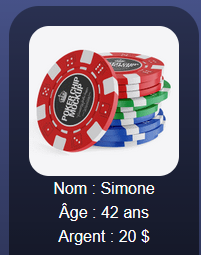
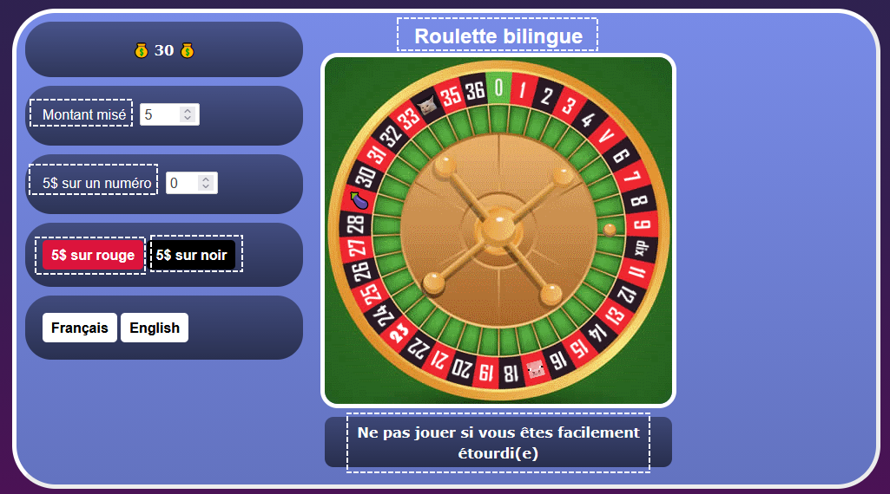

# Laboratoire 7

<center></center>

## 🐌 Étape 1 - La routine... ou presque.

### 📦 1 - Installer une dépendance pour i18n

Téléchargez le [projet de départ](../../static/files/labo7.zip) et réinstallez les dépendances.

[💡](/notes/rencontre4.1#-internationalisation) Avant d'ouvrir le projet, installez la dépendance nécessaire pour l'internationalisation.

Vous pourrez ensuite ouvrir le projet et l'exécuter.

## 🔞 Étape 2 - Avez-vous au moins 18 ans ?

Dans cette partie, nous travaillerons principalement sur le composant `Home`. (Machine à sous)

Dans l'application Web, créez un profil dans la première page. Vous pouvez également jouer avec la machine à sous pour remarquer que votre **montant d'argent changera**. Changez d'onglet et revenez au jeu de la machine à sous : votre profil a disparu 😭

L'objectif de cette étape sera d'exploiter le **stockage local** pour faire persister le profil de l'utilisateur.

<center></center>

### 💾 2 - Sauvegarder le profil dans le stockage du navigateur

[💡](/notes/rencontre4.1#-sauvegarder-une-donnée) Faites le nécessaire pour ranger le profil dans le **stockage de session**. 

* Le profil doit être sauvegardé lors de sa création.
* Le profil doit être sauvegardé à chaque fois que la valeur du portefeuille évolue.

:::tip

Lorsqu'on sauvegarde une donnée avec **la même clé** qu'une donnée existante, l'ancienne donnée est tout simplement écrasée.
[💡](/notes/rencontre4.1#-inspecter-le-stockage-local) N'hésitez pas à utiliser **l'outil stockage** de votre navigateur pour visualiser la donnée stockée. 

:::

:::warning

N'oubliez pas que lorsqu'on utilise le *setter* d'un état, l'état ne contient pas immédiatement la donnée assignée. (Un mécanisme ayant lieu **une fois la fonction terminée** va gérer l'affectation)

⛔ Ceci ne fonctionnera pas :

```ts showLineNumbers
setAnimal(new Animal("lapin", 4));
sessionStorage.setItem("animal", animal); // animal (l'état) ne contient pas encore le nouvel Animal !
```

✅ Utilisez plutôt :

```ts showLineNumbers
const newAnimal = new Animal("lapin", 4); // Un crée une constante qui sera utilisée deux fois
setAnimal(newAnimal);
sessionStorage.setItem("animal", newAnimal);
```

:::

Même si vous avez bien stocké le profil, gardez à l'esprit que pour l'instant, du point de vue de l'utilisateur, **ça ne fonctionne toujours pas**. (Même si la donnée sera bel et bien présente dans le stockage local) C'est parce qu'il faut réaliser la prochaine section.

### 📬 3 - Récupérer le profil dans le stockage du navigateur

[💡](/notes/rencontre4.1#-récupérer-une-donnée) Faites le nécessaire pour que le profil soit **chargé** à chaque
fois que le composant est chargé. (Donc dès que l'onglet est affiché)

⛔ Notez que l'état `profile` sert à stocker, en tout temps, le profil du joueur lorsque le composant est actif.

### 🚮 4 - Supprimer un profil

[💡](/notes/rencontre4.1#-supprimer-des-données) Finalement, grâce au bouton « Nouveau profil », nous aimerions pouvoir supprimer le profil. (Immédiatement, de la page, mais aussi dans le stockage local) Assurez-vous qu'une fois supprimé, le profil ne réapparait pas même si on réactualise la page.

## 👅 Étape 3 - Embrasser toutes les langues

Dans cette partie, nous travaillerons principalement sur le composant `roulette`.

L'objectif sera de traduire les textes dans la page en français et en anglais. (Textes fournis plus loin)

<center></center>

### 🌐 5 - Internationaliser un composant

[💡](/notes/rencontre4.1#-internationalisation) Faites le nécessaire pour rendre disponibles en français et en anglais tous les textes encadrés dans l'image plus haute. ⛔ N'oubliez pas que vous avez déjà installé la dépendance nécessaire.

N'oubliez pas de rendre fonctionnels les boutons `Français` et `English`.

Je vous fournis tous les textes parce que vous êtes tout mignons 😩 :

<center>
|Français|Anglais|
|:-|:-|
|Montant misé :|Wager amount :|
|VARIABLE $ sur un numéro :|$ VARIABLE on a number :|
|VARIABLE $ sur rouge|$ VARIABLE on red|
|VARIABLE $ sur noir|$ VARIABLE on black|
|Roulette bilingue|Bilingual roulette|
|Ne pas jouer si vous êtes facilement étourdi(e)|Do not play if you get dizzy easily|
</center>

Attention : pour votre santé psychologique il est interdit de visiter le casino de Montréal dans les 7 prochains jours.

## 🛑 Étape 4 - Une API qui ne répond pas à n'importe qui

Dans cette partie, nous travaillerons principalement sur le composant `Spotify`. Il n'y aura presque aucun code à produire et cela
pourrait sembler très facile à compléter, c'est normal. Le but est simplement d'avoir un exemple de code fonctionnel pour se lancer plus vite dans le TP2 ensuite.

### 🎵 6 - Créer un compte Spotify et obtenir son ID et secret

[💡](/notes/rencontre4.1#-requête-avec-authentification-token) Créez un compte Spotify si vous n'en avez pas déjà un. Obtenez un `Client ID` et un 
`Client Secret`.

[💡](/notes/rencontre4.1#étape-2---%EF%B8%8F%EF%B8%8F-hard-coder-le-client-id-et-le-client-secret) Hardcodez votre ID et votre secret dans le composant `Spotify`.

### 🪙 7 - Obtention du token

Initialement, vous remarquerez que la page n'affiche rien : c'est normal, c'est à cause d'un `booléen && expression` dans le HTML. Il faudra que l'utilisateur se connecte à l'API de Spotify pour pouvoir lancer sa première recherche.

[💡](/notes/rencontre4.1#étape-3----utiliser-une-requête-de-connexion) La requête de connexion est déjà codée pour vous. Vous devrez simplement trouver **où l'appeler** pour qu'un **token d'authentification Spotify** soit obtenu **dès le chargement de la page**.

### 📶 8 - Requêtes avec authentification

Une fonction permettant de rechercher un artiste dans l’API Spotify et d’afficher son nom et sa photo dans la page est déjà présente dans le composant `Spotify`. Testez-la en lançant une recherche pour vous assurer que tout est en ordre.

🥳 Bon travail ! Vous avez terminé. Il n'y a pas d'autres instructions en-dessous de cette phrase.

Ceci n'est pas une instruction.

Ceci non plus.

Arrêtez de lire ! Vous avez terminé le laboratoire ! Allez faire autre chose de plus utile 😠 (Ceci n'est toujours pas une instruction)

Vous lisez encore ... ? *Oof*