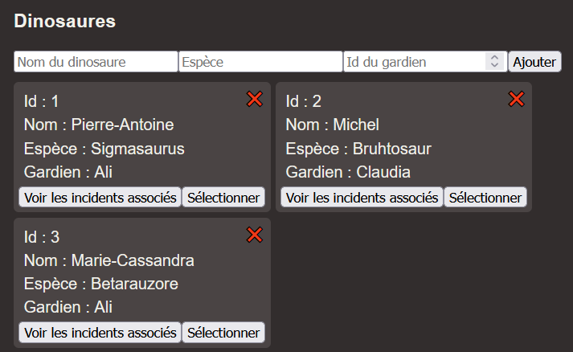
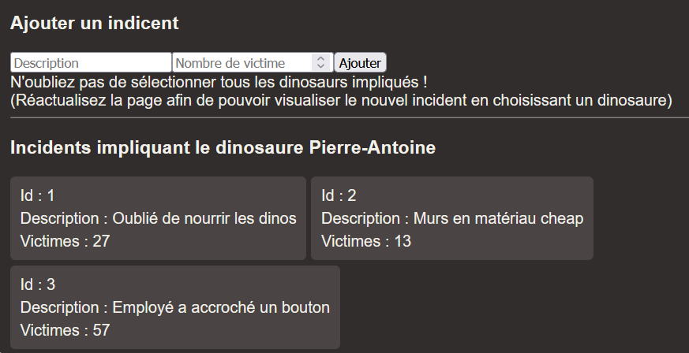

# Laboratoire 15

Un [projet de départ](../../static/files/labo15.zip) Angular et ASP.NET Core vous sont fournis.

**Mise en situation dont personne n'avait besoin** : M. Robidoux gère un zoo de dinosaures, mais il a besoin d'un système pour répertorier tous les incidents qui surviennent pour simplifier la collaboration avec ses assureurs.

Vous devrez compléter le système existant, essentiellement en implémentant la création (Post) de `zookeeper`, de `dinosaur` et d'`incident` ainsi que la suppression (Delete) de `zookeeper` et de `dinosaur`. Comme ces entités ont des relations, ça pourrait être délicat.

## 😵 Qu'est-ce qui se passe ici

Commencez par jeter un coup d'oeil aux deux projets. Portez principalement attention aux classes `Zookeeper`, `Dinosaur` et `Incident`. Assurez-vous de bien comprendre le type de relation entre chacune de ses classes.

En résumé :
* Un `Zookeeper` est responsable de plusieurs `Dinosaur`.
* Un `Dinosaur` est géré par un `Zookeeper` et est associé à plusieurs `Incident`.
* Un `Incident` est associé à plusieurs `Dinosaur`.

## 🥚 Donner naissance est difficile

### 1 - Créer des zookeepers

Créez une action `Post` dans `ZookeepersController` permettant de créer des nouveaux gardiens.

Il faudra aussi compléter une requête dans le `DinosaurService` **côté client**.

Bien que `Zookeeper` ait une relation avec `Dinosaur`, comme un `Zookeper` peut exister sans `Dinosaur`,
ça devrait être _ultra simple_ et ressembler à un `Post` auto-généré.

### 2 - Créer des dinosaures

Créez une action `Post` dans `DinosaursController` permettant de créer des nouveaux dinosaures.

Il faudra aussi compléter une requête dans le `DinosaurService` **côté client**.

[💡](/cours/rencontre8.1#-création) Comme un `Dinosaur` doit absolument être associé à un `Zookeeper` dès sa création, il faudra aussi transmettre l'id du `Zookeeper` associé.

[💡](/cours/rencontre8.1#-data-transfer-objects) Vous aurez besoin d'un DTO pour y arriver.

### 3 - Créer des incidents

Créez une action `Post` dans `IncidentsController` permettant de créer des nouveaux incidents.

Il faudra aussi compléter une requête dans le `DinosaurService` **côté client**.

[💡](/cours/rencontre8.1#-création) Lors de la création d'un `Incident`, nous voudrons **immédiatement** indiquer à quels `Dinosaur` cet `Incident` est associé. Il faudra donc envoyer la liste des ids des `Dinosaur` associés au serveur.

[💡](/cours/rencontre8.1#-data-transfer-objects) Vous aurez besoin d'un DTO pour y arriver.

## 🔪 Supprimer n'est pas plus facile

### 4 - Supprimer des zookeepers

[💡](/cours/rencontre8.1#-suppression) Lorsqu'on supprime un `Zookeeper`, on doit aussi supprimer tous ses `Dinosaur` associés, sinon il y aura une erreur en lien avec une **clé étrangère** dans la base de données.

Créez une action `Delete` dans le `ZookeepersController` **côté serveur** et complétez le `DinosaurService` **côté client**.

### 5 - Supprimer des dinosaures

[💡](/cours/rencontre8.1#-suppression) Lorsqu'on supprime un `Dinosaur`, on doit aussi supprimer tous ses `Incident` associés **SI CE DINOSAURE ÉTAIT LE DERNIER ÉTANT ASSOCIÉ À L'INCIDENT** (Il faudra un petit `if` avec `maListe.Count == 1` par exemple !), sinon on laisse dans la base de données un `Indicent` un peu inutile.

Créez une action `Delete` dans le `DinosaursController` **côté serveur** et complétez le `DinosaurService` **côté client**.

### 6 - Modifier la suppression de zookeepers

Un instant ! Supprimer un `Zookeeper` implique également de supprimer des `Dinosaur` ! Allez copier-coller un peu de code pour supprimer les `Indicent` (comme vous avez fait pour `DeleteDinosaur` dans le `DinosaursController`) dans le `ZookeepersController`. (Encore une fois, pour empêcher un `Incident` associé à aucun `Dinosaur` de continuer d'exister)

## ⚙ Rendez-vous service en utilisant les services

### 7 - Compléter trois services

[💡](/cours/rencontre8.1#-services) Pour chacune des trois entités qui existent, complétez un **service**. L'objectif est de retirer le `DbContext` des trois contrôleurs. 

Vous risquez d'avoir environ 7 méthodes à créer dans vos 3 services. (Au total) Ça peut sembler long, mais il s'agit principalement de déplacer du code et de découper des méthodes. C'est plutôt simple.

Gardez à l'esprit que le plus important est de débarrasser toutes les lignes de code impliquant `_context` des contrôleurs.