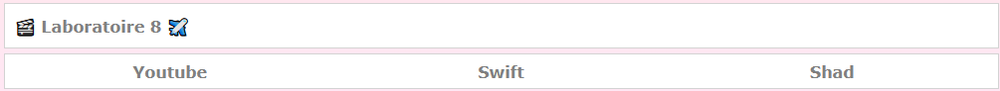
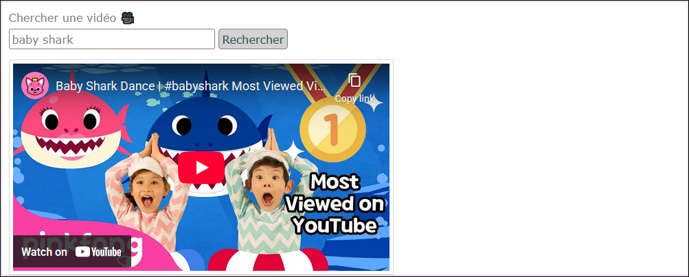
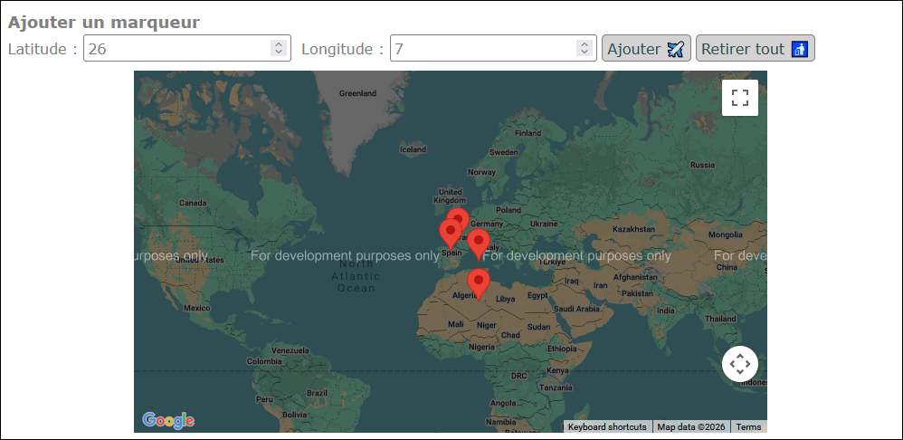

# Laboratoire 8

<center></center>

Téléchargez le [projet de départ](../../static/files/labo8.zip) et réinstallez les dépendances.

### 🎥 Étape 1 - À la merci de l'algorithme YouTube

Cette partie utilisera le composant `Home`. Le but est de permettre à l’utilisateur de chercher une vidéo Youtube grâce au formulaire. La première vidéo trouvée par l’API YouTube Data sera affichée en-dessous.

[💡](/notes/rencontre4.2#-requête-youtube) Commencez par vous créer un compte Gougueule (ou utilisez un compte existant) et suivez les étapes pour obtenir une clé d’API.

* ⛔ N'oubliez pas d'activer l'API Youtube Data également.
* Dans `Home`, remplissez la constante `googleApiKey`.

Faites le nécessaire pour envoyer une requête à l'API de YouTube avec le texte fourni par l'utilisateur dans l'`<input>` et obtenir l'`id` de la première vidéo trouvée. À l'aide de cet id, construisez un URL valide pour finalement afficher la vidéo. (`https://www.youtube.com/embed/VOTRE_ID`)

<center></center>

### 🌐 Étape 2 - Une globe-trotteuse compulsive

Cette partie utilisera le composant `Swift`. C'est normal que la carte Google s'affiche potentiellement mal au début.

🍀 La dépendance `@react-google-maps/api` est déjà installée.

[💡](/notes/rencontre4.2#-intégration-google-maps) À l’aide de votre (même) clé d’API Google, complétez la configuration du **hook** `useJsApiLoader`.

La carte Google devrait mieux s’afficher maintenant. (Vous pouvez vous promener dedans)

:::warning

C'est normal qu'une erreur de facturation soit affichée. Nous n'utiliserons pas la version payante de cette API. Ignorez l'erreur.

:::

[💡](/notes/rencontre4.2#-ajouter-des-marqueurs-sur-une-carte) Créez une variable de classe dans le composant `Swift` qui contiendra un tableau de marqueurs à mettre sur la map Google. Initialement, mettez déjà un marqueur avec la latitude `42` et la longitude `-4` dans ce tableau.

* Modifiez le HTML pour que tous les (éventuels) marqueurs soient affichés dans la map Google.
* Complétez la fonction `addMarker()` pour permettre à l’utilisateur d’ajouter des marqueurs dans cette variable grâce aux `<input>` présents.
* Complétez la fonction `clearMarkers()` pour permettre à l’utilisateur de vider le tableau de marqueurs.

<center></center>

### ✨ Étape 3 - La beauté : à quel prix ?

Cette partie utilisera le composant `Shad`. Nous allons brièvement embellir 🪄🎩 la page.

[💡](/notes/rencontre4.2#-shadcn) Commencez par installer **shadcn** dans le projet du laboratoire 8.

Oups haha ! **shadcn** est *coquin*, il a retiré le style `background: linear-gradient(#ffe7ef,#ffe7ff, #eae7ff, #e7faff) fixed;` du `body` dans `globals.css`, alors on va le remettre manuellement. 🤬 L'univers manquait justement d'une librairie qui ne se mêle pas de ses affaires.

Transformez la page pour obtenir le résultat suivant, qui exploite quatre **composants** de **Shadcn**.

<center></center>

Les quatre **composants shadcn** à utiliser :

* [Button](https://ui.shadcn.com/docs/components/radix/button) et [Input](https://ui.shadcn.com/docs/components/radix/input)

Vous avez de la chance, les notes de cours présentent déjà **button** et **input** en exemple. 😩

Attention de bien transférer les **anciens attributs** pour ne rien briser du fonctionnement de la page. En terme de **classes**, j'ai abandonné les anciennes (`.basicInput` et `.basicButton`) et j'ai dû utiliser `className="w-4xs mr-1"` sur le `<Input>` pour limiter sa largeur et l'écarter du bouton.

* [Spinner](https://ui.shadcn.com/docs/components/radix/spinner)

Pour le **spinner**, on veut seulement qu'il apparaisse quand on appuie sur « Chercher », puis qu'il disparaisse dès que la requête est terminée. (Un état qui contient un `boolean` dont la valeur est basculée au début et à la fin de la fonction `searchDigimon()` devrait faire le travail 🤫) J'ai utilisé deux classes pour qu'il se positionne confortablement à côté du bouton : `className="inline-block ml-1"`.

* [Carousel](https://ui.shadcn.com/docs/components/radix/carousel)

*Oh non, un carrousel*. Quel malheur s'abat sur vous ? 🎠

Contrairement à l'exemple dans la documentation, au lieu d'afficher des `Card` (composant que vous n'aurez pas à installer !), le but sera de dupliquer cinq fois `<CarouselItem>...</CarouselItem>` en y glissant ces deux lignes de code :

```tsx

<div className="text-center">Nom : {d}</div>
```

Le carrousel doit utiliser les cinq images dont le nom est indiqué dans la constante nommée `digiImages`. (La première image était affichée seule, initialement) Vous vous doutez sûrement qu'il faudra manigancer quelque chose avec `digiImages.map(...)` plutôt que d'utiliser le `Array.from({ length: 5 }).map((_, index)` crotté de la documentation.

:::note

Êtes-vous également choqués par le « s » solitaire du mot « carrousel » ? C'est parce que la prononciation alternative « ca-rou-zel » est valide 😐

:::

## 📏 Étape 4 - Ce n'est pas la taille qui compte

Ce labo n'était pas censé être très long. Vous avez maintenant l'opportunité de commencer le TP2 si ce n'est pas déjà fait. N'êtes-vous pas tenté(e) ? 😏

🥳 Bon travail !