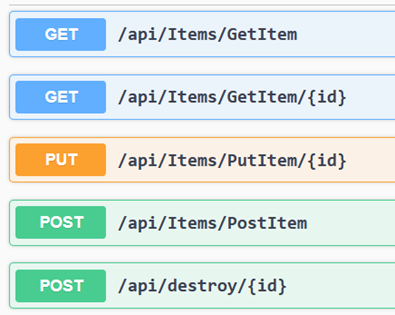

# Laboratoire 15

:::warning

Malaise... À partir de ce labo et jusqu'à la fin de la session, notez que les numéros de labos sont décalés de 1. (Quand vous allez télécharger le projet de départ, il sera nommé labo14... c'est normal !) C'est parce qu'on a décalé plusieurs séances 😩

:::

Un [projet de départ](../../static/files/labo14.zip) Angular vous est fourni pour ce labo. Vous devrez créer le projet ASP.NET Core Web API vous-mêmes cela dit.

## 🫃 Ma première Web API

### 1 - Création du projet

[💡](/cours/rencontre7.2#-serveur-web-api-simple) Créez un projet ASP.NET Core Web API avec la version .NET 8 nommé `labo14_serveur`.

Suivez toutes les étapes des notes de cours bêtement et arrêtez vous juste avant la **création du modèle**.

### 2 - Création d'un modèle

[💡](/cours/rencontre7.2#-modèle) Créez un modèle `Item.cs` avec les propriétés suivantes :

* Id (int) -> Ex. 2
* Name (string) -> Ex. "Silencieux d’autmobile"
* Value (int) -> Ex. 80

### 3 - Création d'un contrôleur

[💡](/cours/rencontre7.2#-contrôleur) Créez un contrôleur avec des actions auto-générées pour ce modèle.

Exécutez ensuite votre application et vérifiez que Swagger affiche les informations des requêtes de ce nouveau contrôleur. (L’ordre des requêtes pourrait être différent)

## 🚗 Faire fausse route

Nous allons modifier quelques routes dans `ItemsController`.

### 4 - Utiliser une règle globale

[💡](/cours/rencontre7.2#-règles-globales) Changez la règle globale de routage de votre contrôleur pour que le nom des actions soit inclus dans les URL de requête.

### 5 - Utiliser une règle spécifique

[💡](/cours/rencontre7.2#-règles-par-action) Ajoutez une règle spécifique à l’action `Delete` pour que l’url de requête soit `localhost:port/api/destroy`.

De plus, changez la méthode de l'action pour que ce soit `POST` plutôt que `DELETE`. (Le code à l'intérieur de l’action doit rester identique, cela servira encore à supprimer un Item de la base de données. On s’amuse juste à changer le type de méthode / requête pour se rendre compte qu’on peut en faire ce qu’on veut)

Si vous exécutez à nouveau le serveur, vous devriez avoir ceci :

## 💿 SQL c'est plate smh

### 6 - Générer la base de données

[💡](/cours/rencontre7.2#-créer-la-base-de-données) Faites toutes les étapes nécessaires pour générer une base de données qui pourra contenir des objets de type `Item`. Remerciez au passage `Entity Framework` pour l'opportunité de ne pas écrire la moindre ligne de SQL aujourd'hui.

## 🖥 Angular ? Ça ne me dit rien

Faites le nécessaire pour ouvrir et exécuter le projet Angular fourni. La classe `Item` existe déjà dans le projet Angular. Si vous avez bien respecté les noms indiqués pour la classe `Item` côté serveur, tout devrait bien fonctionner.

### 7 - Créer 5 requêtes

Vous aurez seulement à modifier la classe `ItemService`. Tout le reste est déjà mis en place.

Pour les implémentations qui suivent, n’hésitez pas à jeter un coup d’œil à **l’interface Swagger** en exécutant votre serveur pour savoir quelles requêtes utiliser.

[💡](/cours/rencontre7.2#-get) Implémentez `GetAll`. Comme `Post` n'est pas encore implémenté, c'est normal que l'objet JSON retourné par le serveur soit une liste **vide**. Dans tous les cas, retournez la liste d'items obtenue.

[💡](/cours/rencontre7.2#-post) En utilisant la `value` et le `name` spécifiés par l’utilisateur, implémentez la requête `Post`.

[💡](/cours/rencontre7.2#-get) En utilisant l’`id` spécifié par l’utilisateur, implémentez la requête `Get` et retournez l'item obtenu.

[💡](/cours/rencontre7.2#-put) En utilisant l'`id`, la `value` et le `name` spécifiés par l'utilisteur, implémenter la requête `Put` qui permettra de modifier un item existant dans la base de données.

[💡](/cours/rencontre7.2#-delete) Implémentez la requête `Delete` en utilisant l'`id` fourni par l'utilisateur.

* N’oubliez pas qu’on a donné le type POST à cette requête dans notre Web API. Ça veut dire qu’on est obligés de fournir un **corps** à la requête HTTP. 
* Cela dit, nous n’avons rien de pertinent à insérer dans le **corps** (Il suffit de mettre l’`id` de l’item à supprimer dans l’URL...), donc mettez « `null` » comme corps. 
* Bien entendu, c’est normal que ça ne fonctionne pas si l’`id` spécifié n’existe pas dans la base de données.

Bravo ! Vous avez réalisé une application Web qui respecte l'architecture `REST` ! Allez maintenant vous `reposer`.