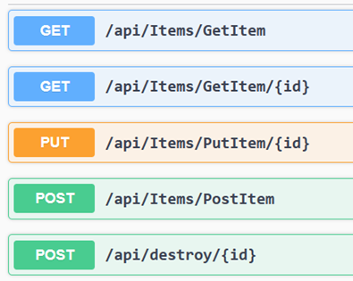
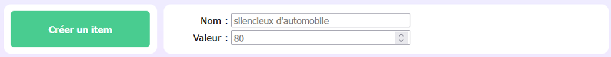
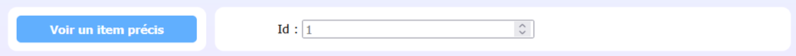
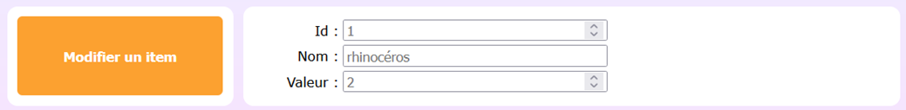
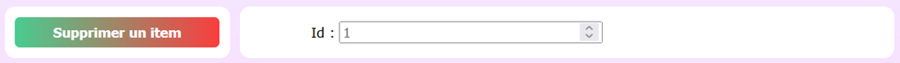

# Laboratoire 15

Un [projet de départ](../../static/files/labo15.zip) Next.js vous est fourni pour ce labo. Vous devrez créer le projet ASP.NET Core Web API vous-mêmes cela dit.

## 🫃 Ma première Web API

### 1 - Création du projet

[💡](/notes/rencontre8.1#-serveur-web-api-simple) Créez un projet ASP.NET Core Web API avec la version .NET 8 nommé `labo14_serveur`.

Suivez toutes les étapes des notes de cours bêtement et arrêtez vous juste avant la **création du modèle**.

### 2 - Création d'un modèle

[💡](/notes/rencontre8.1#-modèle) Créez un modèle `Item.cs` avec les propriétés suivantes :

* Id (int) -> Ex. 2
* Name (string) -> Ex. "Silencieux d’automobile"
* Value (int) -> Ex. 80

### 3 - Création d'un contrôleur

[💡](/notes/rencontre8.1#-contrôleur) Créez un contrôleur avec des actions auto-générées pour ce modèle.

Exécutez ensuite votre application et vérifiez que Swagger affiche les informations des requêtes de ce nouveau contrôleur. (L’ordre des requêtes pourrait être différent)

    

## 🚗 Faire fausse route

Nous allons modifier quelques routes dans `ItemsController`.

### 4 - Utiliser une règle globale

[💡](/notes/rencontre8.1#-règles-globales) Changez la règle globale de routage de votre contrôleur pour que le nom des actions soit inclus dans les URL de requête.

### 5 - Utiliser une règle spécifique

[💡](/notes/rencontre8.1#-règles-par-action) Ajoutez une règle spécifique à l’action `Delete` pour que l’url de requête soit `localhost:port/api/destroy`.

De plus, changez la méthode de l'action pour que ce soit `POST` plutôt que `DELETE`. (Le code à l'intérieur de l’action doit rester identique, cela servira encore à supprimer un Item de la base de données. On s’amuse juste à changer le type de méthode / requête pour se rendre compte qu’on peut en faire ce qu’on veut)

Si vous exécutez à nouveau le serveur, vous devriez avoir ceci :

## 💿 SQL c'est plate smh

### 6 - Générer la base de données

[💡](/notes/rencontre8.1#-base-de-données) Faites toutes les étapes nécessaires pour générer une base de données qui pourra contenir des objets de type `Item`. Remerciez au passage `Entity Framework` pour l'opportunité de ne pas écrire la moindre ligne de SQL aujourd'hui.

## 🖥 React ? Ça ne me dit rien

Faites le nécessaire pour ouvrir et exécuter le projet Next.js fourni. La classe `Item` existe déjà dans le projet Next.js. Si vous avez bien respecté les noms indiqués plus tôt pour la classe `Item` côté serveur, tout devrait bien fonctionner plus tard.

### 7 - Créer 5 requêtes

Vous aurez seulement à modifier le hook `useItemAPI`, dans lequel les 5 requêtes seront centralisées. Il n'y aura rien à changer dans le composant `Home`, le **hook** est déjà bien intégré et exploité.

Pour les implémentations qui suivent, n’hésitez pas à jeter un coup d’œil à **l’interface Swagger** en exécutant votre serveur pour savoir quelles requêtes utiliser.

:::tip

Au lieu de pitonner l'URL de la requête au complet à chaque fois, ajoutez le port de votre serveur Web dans la constante `domain`, comme ça vos requêtes ressembleront à ceci :

`domain + "/api/ControllerName/ActionName"`

:::

[💡](/notes/rencontre8.1#-get) Implémentez `GetAll`. Comme `Post` n'est pas encore implémenté, c'est normal que l'objet JSON retourné par le serveur soit une liste **vide**. Dans tous les cas, remplissez l'état `itemList`.

[💡](/notes/rencontre8.1#-post) En utilisant la `value` et le `name` spécifiés par l’utilisateur, implémentez la requête `Post`.

Testez le `GetAll` à nouveau. Si `itemList` a bien été rempli, un ou des items devraient être visibles dans la page.

[💡](/notes/rencontre8.1#-get) En utilisant l’`id` spécifié par l’utilisateur, implémentez la requête `Get` et glissez l'item obtenu dans l'état `singleItem`.

Si `singleItem` a bien été rempli, il devrait être visible dans la page.

[💡](/notes/rencontre8.1#-put) En utilisant l'`id`, la `value` et le `name` spécifiés par l'utilisteur, implémenter la requête `Put` qui permettra de modifier un item existant dans la base de données.

[💡](/notes/rencontre8.1#-delete) Implémentez la requête `Delete` en utilisant l'`id` fourni par l'utilisateur.

* N’oubliez pas qu’on a donné le type POST à cette requête dans notre Web API. Ça veut dire qu’on est obligés de fournir un **corps** (un contenu en 2e paramètre) à la requête HTTP. 
* Cela dit, nous n’avons rien de pertinent à insérer dans le **corps** (Il suffit de mettre l’`id` de l’item à supprimer dans l’URL...), donc mettez `null` comme corps. 
* Bien entendu, c’est normal que ça ne fonctionne pas si l’`id` spécifié n’existe pas dans la base de données.

:::note

À l'avenir, nous n'allons pas utiliser l'étiquette `POST` pour les actions qui permettent de supprimer des données. C'était juste un test.

:::

Bravo ! Vous avez réalisé une application Web *full-stack* qui respecte l'architecture `REST` ! Allez maintenant vous `reposer`.