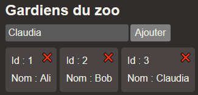
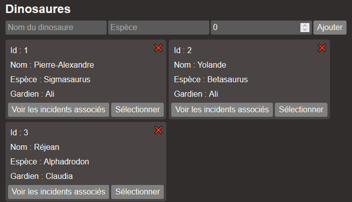

# Laboratoire 16

<center></center>

Des [projets de départ](../../static/files/labo16.zip) Angular et ASP.NET Core vous sont fournis. Orchestrez bien `npm install`, `npm run dev` et `dotnet ef database update`.

**Mise en situation dont personne n'avait besoin** : M. Robidoux gère un zoo de dinosaures, mais il a besoin d'un système pour répertorier tous les incidents qui surviennent pour simplifier la collaboration avec ses assureurs.

Vous devrez compléter le système existant, essentiellement en implémentant la création (Post) de `zookeeper`, de `dinosaur` et d'`incident` ainsi que la suppression (Delete) de `zookeeper` et de `dinosaur`. Comme ces entités ont des relations, ça pourrait être délicat.

## 😵 Qu'est-ce qui se passe ici

Commencez par jeter un coup d'oeil aux deux projets. Portez principalement attention aux classes `Zookeeper`, `Dinosaur` et `Incident`. Assurez-vous de bien comprendre le type de **relation** entre chacune de ses classes.

En résumé :
* Un `Zookeeper` est responsable de **0 à N** `Dinosaur`.
* Un `Dinosaur` est géré par **1** `Zookeeper` et est associé à **0 à N** `Incident`.
* Un `Incident` est associé à **1 à N** `Dinosaur`.

## 🥚 Donner naissance est difficile

L'application permet déjà de créer des `Zookeeper`. Vérifiez le code de l'action `PostZookeeper()` sur le serveur : il est ultra simple et reçoit directement un `Zookeeper` en paramètre. C'est similaire au code par défaut pour `POST` quand on génère un contrôleur. Pour créer des `Dinosaur` et des `Incident`, ce sera moins simple ... il faudra utiliser des **DTOs** !

<center></center>

### 1 - Créer des dinosaures

Créez une action `Post` dans `DinosaursController` permettant de créer des nouveaux dinosaures.

Il faudra aussi compléter une requête dans le hook `useDinoAPI` **côté client**. Ce **hook** est déjà bien intégré au composant `Home` et pour toute la durée du labo on ne touchera jamais à `Home`.

[💡](/notes/rencontre8.2#-one-to-many-1) Comme un `Dinosaur` doit absolument être associé à un `Zookeeper` dès sa création, il faudra aussi transmettre l'id du `Zookeeper` associé. Il faudra créer un [DTO](/notes/rencontre8.2#-data-transfer-objects) pour transférer le **nom** et l'**espèce** du `Dinosaur` ainsi que l'**id** de son `Zookeeper`.

Une fois le `Zookeeper` trouvé, le `Dinosaur` créé et la BD sauvegardée, retournez le nouveau `Dinosaur` créé comme ceci : 

```cs
return Ok(dinosaur);
```

Gardez à l'esprit que, côté client, `response.data` contiendra le nouveau `Dinosaur`, à ajouter dans l'état `dinosaurs`.

<center></center>

:::info

Si vous rencontrez une **erreur 400** 🐞, c'est-à-dire une erreur de **validation**, c'est parce que vous n'envoyez pas les bonnes données au serveur. Est-ce que les données envoyées portent les mêmes **noms** que les **propriétés** de votre **DTO** ? Est-ce que les **types** sont compatibles et valides ?

:::

### 2 - Créer des incidents

Créez une action `Post` dans `IncidentsController` permettant de créer des nouveaux incidents.

[💡](/notes/rencontre8.2#-many-to-many-1) Lors de la création d'un `Incident`, nous voudrons **immédiatement** indiquer à quels `Dinosaur` cet `Incident` est associé. Il faudra donc envoyer la liste des ids des `Dinosaur` associés au serveur. Vous aurez encore besoin d'un DTO pour y arriver.

Notez que la date de l'incident pourra être déterminée sur le serveur, à l'aide de `DateTime.Now`.

Une fois la liste de `Dinosaur` trouvée, le nouvel `Incident` créé et la BD sauvegardée, retournez le nouvel `Incident` créé comme ceci :

```cs
return Ok(dinosaur);
```

Si jamais 0 `Dinosaur` ont été trouvés à l'aide des ids reçus, retournez une erreur :

```cs
return BadRequest(new { Message = "Les ids reçus sont invalides ou vides." });
```

`response.data` contiendra le nouvel `Incident`.

<center></center>

## 🔪 Supprimer n'est pas plus facile

Congé de **DTOs** ! Pour supprimer une donnée, il suffit d'envoyer son `id` avec la requête. Cela dit, les **clés étrangères** (relations de nos objets) complexifieront la suppression.

### 3 - Supprimer des dinosaures

[💡](/notes/rencontre8.2#-suppression) Lorsqu'on supprime un `Dinosaur`, on doit commencer par supprimer tous ses `Incident` associés **SI CE DINOSAURE ÉTAIT LE DERNIER ÉTANT ASSOCIÉ À L'INCIDENT** (Il faudra un petit `if` avec `maListe.Count == 1` par exemple !), sinon on laisse dans la base de données un `Indicent` un peu inutile. Les incidents qui sont encore associés à au moins un autre dinosaure n'ont pas à être supprimés.

Créez une action `Delete` dans le `DinosaursController` **côté serveur** et complétez le `DinosaurService` **côté client**.

### 4 - Supprimer des zookeepers

[💡](/notes/rencontre8.2#-suppression) Lorsqu'on supprime un `Zookeeper`, on doit aussi supprimer tous ses `Dinosaur` associés, sinon il y aura une erreur en lien avec une **clé étrangère** dans la base de données. 

Comme pour la **question précédente**, il faudra encore supprimer certains `Incident` si un `Dinosaur` associé qu'on s'apprête à supprimer était le **dernier associé à l'incident**. 

Créez une action `Delete` dans le `ZookeepersController` **côté serveur** et complétez le `DinosaurService` **côté client**.
