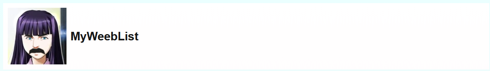
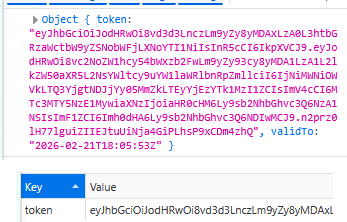
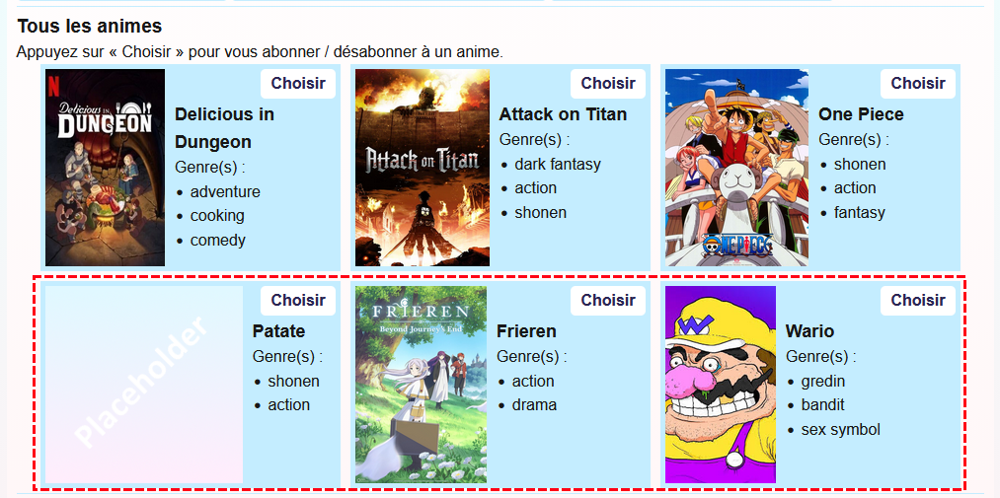
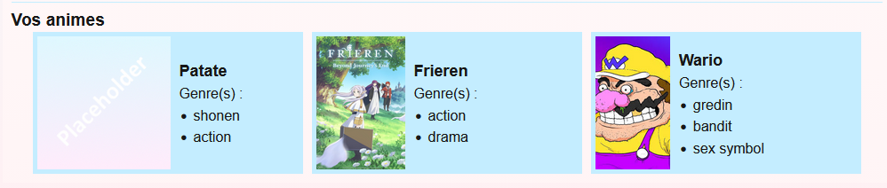
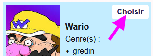

# Laboratoire 17

📦 Téléchargez les [projets de départ](../../static/files/labo17.zip).

## 👤 Problèmes identitaires

La **gestion des utilisateurs** est déjà totalement complétée côté **serveur**. Il manque seulement quelques morceaux côté **client**. Vous devrez déjà compléter la gestion des utilisateurs dans le **TP3**, alors on vous épargne cela pour le moment sachant que ce n'est pas très *stimulant*. 

### 🔌 1 - Connexion

[💡](/notes/rencontre9.1#-connexion) Terminez le code de la requête pour la connexion côté **client**, dans le **hook** `useWeebAuth`.  (Tout est prêt côté **serveur**) Plutôt que de ranger le **token 🔑** dans un **état**, rangez-le dans le **stockage de session**.

Tentez de vous **inscrire**, puis de vous **connecter**. Assurez-vous que le **token 🔑** est bien reçu.

### 📶 2 - Intercepteur

[💡](/notes/rencontre9.1#-intercepteurs) Créez un intercepteur pour ne pas avoir à joindre le **token** constamment, à chaque requête nécessitant l'authentification. Le fichier `/app/auth-interceptor.ts` est déjà créé, il faudra juste le compléter.

En compétant les exercices 4 à 6, plus bas, vous aurez la confirmation que votre intercepteur fonctionne ou pas. (Vous aurez des erreurs **401** si votre intercepteur est mal codé ou que vous oubliez de vous connecter)

## 🍙 Cinéma alternatif

Vous allez coder plusieurs **actions** côté **serveur** qui exploitent l'authentification. Côté **client**, les requêtes sont déjà toutes prêtes dans le **hook** `useWeebAPI`.

### 👥 3 - Ajouter une relation

[💡](/notes/rencontre8.2#-many-to-many) Ajoutez une **relation** entre les classes `User.cs` et `Anime.cs`. On souhaite qu'un `User` puisse être « abonné » à **plusieurs** `Anime`. On souhaite aussi qu'un `Anime` puisse être « suivi » par **plusieurs** `User`.

[💡](/notes/rencontre8.1#-base-de-données) Une fois les deux **propriétés de navigation** ajoutées et les fichiers bien sauvegardés, faites une nouvelle **migration** et mettez **à jour** la base de données. (Il faudra arrêter le serveur pendant ces opérations) Dans les coulisses, **Entity Framework** va créer une **table de liaison** entre `User` et `Anime`.

[💡](/notes/rencontre8.2#-objets-json-infinis) Attention ! ⛔ Il y aura un `[JsonIgnore]` à placer quelque part pour éviter un **objet JSON infini** quand on `GET` les `Anime`.

### 📩 4 - Créer un anime

[💡](/notes/rencontre9.1#%EF%B8%8F%EF%B8%8F-déterminer-qui-envoie-la-requête) Compléter la requête `PostAnime`. Il n'y a pas de `DTO` à utiliser, donc c'est un `POST` plutôt simple, sauf que :

* Il faut déterminer **qui** envoie la requête.
* On veut immédiatement associer cet `User` à l'`Anime` qui est créé. (On est automatiquement **abonné** à un `Anime` si on est celui / celle qui l'a `POST` )

Dans tous les cas, pour le moment, assurez-vous que l'anime est bien créé et visible ensuite :

### 📬 5 - Obtenir mes animes

[💡](/notes/rencontre9.1#%EF%B8%8F%EF%B8%8F-déterminer-qui-envoie-la-requête) Compléter la requête `GetMyAnimes`. Le but est simplement de retourner la liste des `Anime` auquel l'utilisateur qui envoie la requête est **abonné**. C'est censé être simple (max. 3 lignes de code)

Les animes que vous avez `POST` vous-mêmes devraient déjà être présents :

Si ce n'est pas le cas, c'est qu'il y a un souci avec votre `PostAnime`. Je vous mets au défi de demander de l'aide à l'enseignant 😳

### 🎟 6 - S'abonner à un anime

La dernière action, `SubscribeAnime`, permet, lorsqu'on appuie sur le bouton « Choisir », de **s'abonner / se désabonner** d'un anime. L'action vérifie qui envoie la requête, trouve l'`Anime` associé à l'`id` reçu, puis :

* L'utilisateur est déjà abonné à l'`Anime` : il perd sa relation avec l'`Anime`. (Désabonné)
... ou ...
* L'utiliasteur n'est pas abonné à l'`Anime` : il obtient une relation avec l'`Anime`. (Abonné)

Si ça fonctionne bien, appuyer sur « Choisir » devrait permettre d'ajouter ou de retirer un `Anime` de la liste « Vos animes ».

## ⚙ Une classe serviable

*Oh non ...* des services. 

### 📐 7 - Fonctions d'un service

[💡](/notes/rencontre9.1#-exemples) Parmi les 5 **actions** du `AnimesController`, il y en a ...

* Une qui est déjà adaptée au service. (`GetAnime`)
* Une qui n'aura pas besoin d'être adaptée car elle ne manipule pas le `_context`. (`GetMyAnimes`, à moins que vous l'ayez codée... de manière *suspecte*)
* Deux que vous devrez adapter.

Un squelette de **méthode** est déjà préparé pour ces deux **actions** dans le `AnimeService`. Il y a aussi la **méthode** `GetOne()` dans le service, qui pourrait vous servir dans `AnimesController`.

Notez que vous devrez continuer d'utiliser le `UserManager` dans le contrôleur, car on ne veut pas **injecter un service dans un autre service** ⛔. (`UserManager` *est* un service)

:::note

Il y a plusieurs bonnes manières de créer des **méthodes** dans un **service**. L'important est de s'assurer de ne plus utiliser le `_context` dans le `AnimesController` !

:::

Une fois que c'est fait :

* Retirez l'injection du `_context` dans `AnimesController`.
* Testez au moins ces trois actions à l'aide de la page Web pour être sûr(e) que tout fonctionne encore.