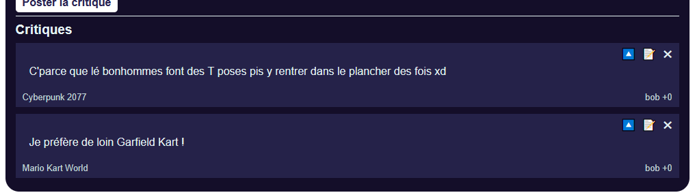
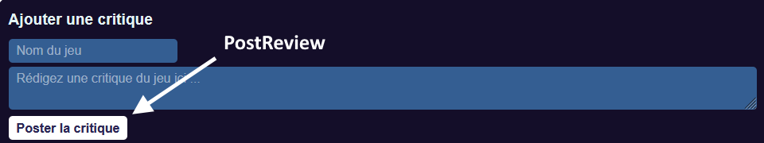
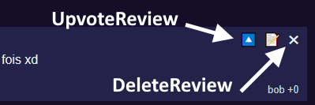
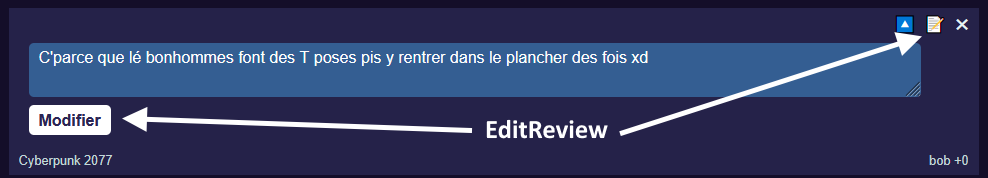

# Laboratoire 18

Téléchargez les [projets de départ](../../static/files/labo16.zip). N'oubliez pas de mettre à jour la base de données avec `dotnet ef database update`.

La gestion des utilisateurs est déjà fonctionnelle et un intercepteur est déjà complété. (Vous n'aurez jamais à joindre token vous-mêmes, mais il faudra quand même être connecté !) Notez qu'il y a déjà deux `reviews` existantes dans la base de données. Elles ont été créées par l'utilisateur `bob` dont le mot de passe est `allo`. Sacré *Bob*.

Pendant le laboratoire, vous aurez **cinq requêtes** à rendre fonctionnelles, principalement dans le `ReviewsController`.

## 🔥 Retour de flamme

Dans cette section, vous aurez à compléter deux actions de `ReviewsController`. Ce sont des `reviews` qui devront être retournées par le serveur, mais il faudra un *DisplayDTO* vu que les classes `Review` du client et du serveur sont différentes.

### 1 - ReviewDisplayDTO

[💡](/notes/rencontre9.2#-data-transfer-objects) Comparez les classes `Review.cs` (serveur) et `review.ts` (client). Créez un *DisplayDTO* qui permettra d'envoyer au client des `Review` avec les données nécessaires.

### 2 - GetReview

[💡](/notes/rencontre9.2#-data-transfer-objects) Pour le moment, les `reviews` ne s'affichent pas dans la page Web. C'est normal, il faut implémenter l'action `GetReview` d'abord. Elle va simplement récupérer toutes les `reviews` dans la base de données et les convertir en `ReviewDisplayDTO` pour les envoyer au client. Une fois que ce sera fait, *décommentez* l'instruction `getReviews()` dans le `useEffect()` du composant `Home`.

### 3 - PostReview

:::warning

Pour cette requête et les suivantes, vous pourriez être agacé(e)s par le fait que les notes de cours montrent des exemples **avec contrôleur + service**, alors que dans ce projet, il n'y a **pas de service**. Vous devriez être capables de rassembler toutes les opérations nécessaires dans le contrôleur malgré tout. Sinon, sachez que dans le **TP3** il y aura des services, alors ces exemples vous serviront.

:::

:::info

Connectez-vous avant de poster une `Review` !

:::

[💡](/notes/rencontre9.2#-post) Complétez l'action `PostReview` qui permettra d'ajouter un `Review` dans la base de données. La `Review` créée devra être associé à l'auteur qui a envoyé la requête.

[💡](/notes/rencontre9.2#-data-transfer-objects) Il faudra retourner, avec `Ok(...)`, le nouveau `Review`... converti en `ReviewDisplayDTO`, bien entendu

Le code côté **Next.js** est déjà complété. un **DTO** est envoyé avec le texte et le nom du jeu.

## 🔒 Critiques sécuritaires

### 4 - DeleteReview

[💡](/notes/rencontre9.2#-delete) Seul l'**auteur** d'une critique doit être capable de la supprimer. 

Le code côté client est déjà complété.

### 5 - UpvoteReview

[💡](/notes/rencontre9.2#-put) Seul un utilisateur authentifié **qui N'est PAS** l'auteur d'une critique doit être capable de la _posivoter_.

Notez que si on _posivote_ une critique qu'on a **déjà _posivoté_**, ça doit annuler / retirer notre upvote.

Le code côté client est déjà complété.

### 6 - EditReview

[💡](/notes/rencontre9.2#-put) Seul l'auteur d'une critique doit être capable de la modifier.

[💡](/notes/rencontre9.2#-put) Seul le texte de la critique doit pouvoir être modifié. (Utilisez le même **DTO** que pour `PostReview` et ignorez le nom du jeu, par exemple !)

Le code côté client est déjà complété.