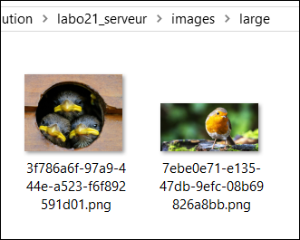
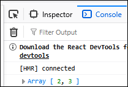
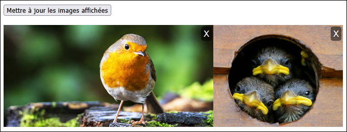

# Laboratoire 21

📦 Un [projet serveur et un projet client](../../static/files/labo21.zip) vous sont fournis. N'exécutez pas tout de suite le serveur, il y aura un modèle à ajouter, une migration à créer puis à exécuter plus tard.

🎨 La librairie `ImageSharp` est déjà installée sur le serveur.

## 📸 Il y a défaut tôt

L'objectif sera de permettre à l'utilisateur de sélectionner une image, l’envoyer au serveur, puis l’ajouter dans la BD et dans le File System du serveur.

### 1 - Requête et formulaire client

[💡](/notes/rencontre11.1#-envoyer-un-fichier-au-serveur) Modifiez l’`<input>` de type `file` et exploitez `useRef` pour accéder au fichier joint par l’utilisateur.

Produisez un **FormData** qui contiendra l’image et envoyez le **FormData** au serveur dans une requête `POST`. (Il se peut que vous deviez modifier l’URL de la requête plus tard sachant que l'action n'existe pas encore)

:::warning

La requête sera dans le **hook** `usePictureAPI`, mais il faut construire **FormData**  dans le composant `Home`. Vous pourrez envoyer le **FormData** sous forme de paramètre à `postPicture` dans le hook. (Le type du paramètre sera `any`)

:::

### 2 - Ajouter une action POST serveur

[💡](/notes/rencontre11.1#-sauvegarder-une-image-sur-le-serveur) Complétez la classe `Picture.cs` qui servira de modèle pour les images. Elle n’aura que 3 propriétés. Ce modèle n’a absolument pas besoin d’exister côté client. Une fois le modèle finalisé et sauvegardé, créez une migration et mettez à jour la base de données.

Dans le contrôleur relativement vide fourni, complétez l’action `POST` qui recevra le fichier et l’ajoutera dans la **BD** et le **File System**.

On veut une **version originale** de l’image et une **version de taille réduite** avec une **hauteur de 200 pixels**.

Bien entendu, pour le moment on ne peut pas afficher ces images dans la page Web.

:::warning

Des dossiers existent déjà pour les images, vérifiez le répertoire du serveur.

:::

## 🐦 Le petit oiseau va sortir, attrapez-le

L’objectif pour cette étape sera d’envoyer la liste des ids de toutes les images au projet **Next.js**. On n’a pas besoin d’envoyer les `FileName` et les `MimeType`, juste les ids.

### 3 - Envoyer les ids des images au client

Complétez une action `GET` qui retourne simplement la liste de tous les ids des images dans la base de données. (Donc une `List<int>`)
Votre return pourrait ressembler à ceci :

`return Ok(pictures.Select(p => p.Id));`

### 4 - Recevoir les ids côté client

Assurez-vous simplement de recevoir la **liste d’ids** grâce à `useEffect`. Ça ne sera pas suffisant pour pouvoir afficher les images, mais on y est presque.

## 🖼 Sages commes des images

Nous allons permettre au serveur de retourner des fichiers images pour pouvoir les afficher dans le HTML.

### 5 - Ajouter une action GET côté serveur

[💡](/notes/rencontre11.1#-afficher-une-image-sur-le-client) En vous inspirant des notes de cours, retournez le fichier associé à l’id demandé.

N’oubliez pas de permettre de choisir entre les tailles « large » et « small ».

### 6 - Afficher les images côté client

[💡](/notes/rencontre11.1#-afficher-une-image-sur-le-client) Dans le HTML, modifiez l’attribut `src` pour demander l’image au serveur en format small, pour chaque id d’image existante. (La liste d'ids reçue par le client permet d'afficher chaque image, individuellement, à l'aide d'une requête dans le `src`.)

De plus, il faut que cliquer sur une image l’affiche en format large dans un autre onglet. (Utilisez un élément `<a>` et mettez la bonne requête dans son attribut `href`, ça ouvrira une page qui contiendra juste la grande image.)

## 🚮 On va en prendre une autre

Pour cette étape, nous allons rendre fonctionnels les petits « X » côté client pour supprimer les images.

### 7 - Ajouter un action DELETE côté serveur

[💡](/notes/rencontre11.1#-supprimer-une-image-du-serveur) Inspirez-vous de l’action Delete dans les notes de cours pour trouver l’image dans le **DbContext** et la supprimer. (N’oubliez pas de supprimer ses deux copies sur le disque également)

Simplement retourner `Ok()` est convenable.

### 8 - Envoyer la requête côté client

Il faudra lancer une requête qui fournit simplement l’id de l’image à supprimer. La requête est déjà prête, il manque seulement un événement `onClick` dans le HTML qui appelle correctement une fonction.

## 🍇 Un c'est bien, mais cinquante-douze c'est mieux

Pour cette étape **qui vous servira beaucoup dans le TP4**, on souhaite permettre à l’utilisateur de poster plusieurs images simultanément plutôt qu’une seule à la fois. Il y aura plusieurs changements à faire pour que ce soit possible.

### 9 - Modifier le client

[💡](/notes/rencontre11.1#-envoyer-un-fichier-au-serveur) Dans l’`<input>` de type file, ajoutez l’attribut HTML `multiple` (il n’a pas de valeur), qui permet de sélectionner plusieurs fichiers à la fois.

Lorsque vous meublerez le formData, vous allez devoir `.append()` un à plusieurs fichiers maintenant. Comme chaque **clé** doit être unique, visez quelque chose comme `"image0"`, `"image1"`, `"image2"`, etc.

Quand il y avait un seul fichier, on allait le chercher avec `.current.files[0]`. Pour les suivants, il suffira de remplacer le 0 par 1, puis 2, puis 3, etc. ou encore de parcourir `for (let f of ...current.files)`

### 10 - Modifier l'action POST du serveur

[💡](/notes/rencontre11.1#-sauvegarder-une-image-sur-le-serveur) Un peu la même idée que côté client : comme on va recevoir un à plusieurs fichiers, il faudra mettre une boucle dans le code et faire `GetFile( … )` jusqu’à ce qu’on ait épuisé tous les fichiers.

Assurez-vous que ça fonctionne une fois que vous avez terminé.