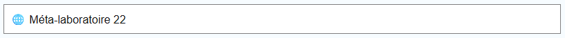
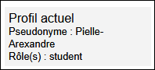
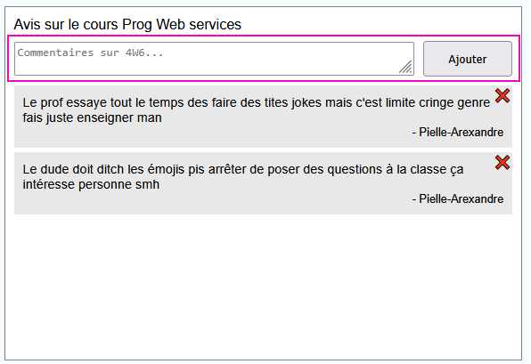
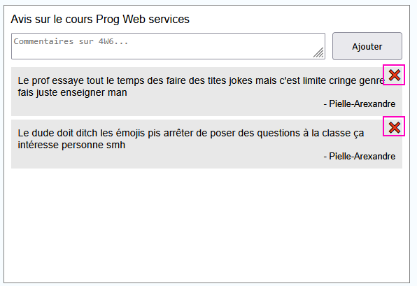

# Laboratoire 22

C'est le dernier laboratoire ! 😭 Téléchargez les [projets de départ](../../static/files/labo22.zip) en séchant vos larmes 💦

## 😩 Jeu de rôles

### 1 - Créer des rôles

[💡](/notes/rencontre11.2#-créer-un-rôle) Créer deux rôles nommés **student** et **corruptedTeacher** dans le seed.

### 2 - Attribuer des rôles

[💡](/notes/rencontre11.2#-créer-un-rôle) Toujours dans le seed, attribuez le rôle **student** à **Pielle-Arexandre** et à **Masie-Carrandra**.
De plus, attribuez le rôle **corruptedTeacher** à **maxou**.

### 3 - Limiter l'accès à des actions

[💡](/notes/rencontre11.2#-limiter-laccès-aux-actions) L'action `PostReview` doit seulement être utilisable par des **student**. De plus, l'action `DeleteReview` doit seulement être utilisable par **l'auteur d'un review OU par un corruptedTeacher**. (Un **corruptedTeacher** peut supprimer tous les reviews et un **student** peut seulement supprimer ses propres reviews.)

Assurez-vous de bien tester toutes ces nouvelles contraintes et n'hésitez pas à créer de nouveaux utilisateurs sans rôle en vous inscrivant.

|Utilisateur|Mot de passe|Rôle|
|-|-|-|
|maxou|allo|corruptedTeacher|
|Pielle-Arexandre|allo|student|
|Masie-Carrandra|allo|student|

## 📜 Qui suis-je ?

L'objectif de cette section sera d'afficher les données de l'utilisateur côté Angular. Comme le modèle `User` n'existe pas côté client et qu'on n'a pas accès à la base de données et aux rôles, il faudra être un peu créatif. (Mais pas beaucoup)

### 4 - Modifier la connexion

[💡](/notes/rencontre11.2#-données-de-connexion) Côté serveur, dans l'action `Login`, ajoutez deux choses dans **l'objet JSON qui contient le token** :

* Le pseudonyme de l'utilisateur.
* La liste de strings avec tous les rôles de l'utilisateur.

Ces deux informations ne sont pas censées être difficiles à trouver dans le code existant.

### 5 - Afficher le profil

[💡](/notes/rencontre11.2#-données-de-connexion) Côté client, dans le **hook** `useReviewAPI`, remarquez que la requête `Login` retourne `x.data`, qui contient maintenant deux informations supplémentaires. Trouvez où la fonction `login()` est appelée dans le composant `Home`, et stockez le **pseudo** et les **rôles** à deux endroits :

1. Dans les états `username` et `roles`. (Serviront pour des **affichages conditionnels**)
2. Dans le stockage de session. (Permettra de faire perdurer les données si on réactualise la page)

✍ Modifiez le HTML de `Home` ... :

* Affichez le pseudo de l'utilisateur connecté.
* Affichez les rôles de l'utilisateur connecté. (Pas besoin de `.map()`, juste `{roles}`)
* Cacher toute la boîte du profil lorsque le pseudo de l'utilisateur est `null`.

:::note

Hélas, ce fonctionnement est brisé si on réactualise la page. Pas de panique : c'est pour ça qu'on a stocké le pseudo et les rôles dans le **stockage de session** !

:::

⏰ Ajoutez un `useEffect()` dans `Home` pour :

* Récupérer le pseudo et les rôles, qui sont dans le **stockage de session**.
* Modifier les deux états appropriés pour restaurer les données identitaires.

Désormais, le panneau du profil devrait être fonctionnel en tout temps, même si on réactualise la page !

🔌 Un dernier détail important : la déconnexion ! Modifiez la fonction `logoff()` dans `Home` :

* Elle doit supprimer le **token**, le **pseudo** et les **rôles** du stockage de sessuib.
* Elle doit réinitialiser les deux états appropriés.

Assurez-vous qu'en vous déconnectant, le panneau du profil devienne invisible. (Et qu'il le reste lorsqu'on réactualise la page)

## 👀 Ce qu'on ne voit pas ne nous fait pas de mal

### 6 - Cacher des éléments selon le profil

À l'aide de la forme `{ condition && élément HTML }` et des **états** qu'on a remplis, vous devrez cacher certains éléments dans la page Web.

📝 La zone pour créer un `Review` doit seulement être visible pour les utilisateurs avec le rôle `student`. (L'instruction en JavaScript `monTableau.includes(valeur)`, qui retourne un booléen, sera utile !)

❌ Le bouton pour supprimer un `Review` doit seulement être visible pour l'auteur du `Review` ET pour tous les `corruptedTeacher`. (Comparez le pseudo dans l'état avec le nom de l'auteur du `Review`...)

:::tip

> Un instant ! L'affichage des `Reviews` est dans un autre composant.

Ce n'est pas un problème : il y a un **Context** qui permet de partager les valeurs des états `username` et `roles` au composant `Post`.

:::

Testez avec les quatre types d'utilisateurs (aucun rôle, corruptedTeacher, student auteur et student pas auteur) si tous les éléments graphiques sont bien cachés au bon moment.

|Utilisateur|Mot de passe|Rôle|
|-|-|-|
|maxou|allo|corruptedTeacher|
|Pielle-Arexandre|allo|student|
|Masie-Carrandra|allo|student|

👄 Merci d'avoir complété le dernier laboratoire 👄

