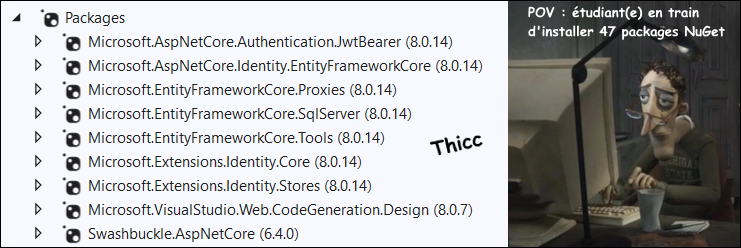

import Tabs from '@theme/Tabs';
import TabItem from '@theme/TabItem';

# Cours 22 - Rôles et signaux

## 👮‍♀️👨‍🍳 Rôles

Identifier qui envoie la requête à l'aide de ...  
`User? user = await _userManager.FindByIdAsync(User.FindFirstValue(ClaimTypes.NameIdentifier)!);`  
... nous aide à limiter l'accès aux données, mais ce n'est pas suffisant : il faudra aussi utiliser les **rôles** pour limiter l'accès **aux actions**.

### 📦 Packages

Il n'y en a pas de nouveaux par rapport à avant ! Assurez-vous simplement que tout soit déjà installé.

<center></center>

:::warning

Comme toujours, assurez-vous d'utiliser la dernière version `8.X.X` pour tous les packages. (Sauf `Swashbuckle`)

:::

### 🤰 Créer un rôle

Il y plusieurs manières de le faire. Par souci de simplicité, on pourrait le faire avec **seed** :

```cs showLineNumbers
protected override void OnModelCreating(ModelBuilder builder){
    
    base.OnModelCreating(builder);

    // Rôles
    builder.Entity<IdentityRole>().HasData(
        new IdentityRole { Id = "1", Name = "admin", NormalizedName = "ADMIN" },
        new IdentityRole { Id = "2", Name = "moderator", NormalizedName = "MODERATOR" }
    );

    // Utilisateur(s)
    PasswordHasher<User> hasher = new PasswordHasher<User>();
    User u1 = new User{
        Id = "11111111-1111-1111-1111-111111111111",
        UserName = "Bob69",
        Email = "bobibou@mail.com",
        NormalizedUserName = "BOB69",
        NormalizedEmail = "BOBIBOU@MAIL.COM"
    };
    u1.PasswordHash = hasher.HashPassword(u1, "Salut1!");
    builder.Entity<User>().HasData(u1);

    // Relation entre utilisateurs et rôles
    builder.Entity<IdentityUserRole<string>>().HasData(
        new IdentityUserRole<string> { UserId = u1.Id, RoleId = "1" } // Bob69 est un admin ! Wouhou 🥳
    );

}
```

### 🔑 Inclure les rôles dans le token

On le faisait déjà ! Il suffit de continuer d'utiliser la même méthode pour la connexion :

```cs showLineNumbers
[HttpPost]
public async Task<ActionResult> Login(LoginDTO login)
{
    User? user = await _userManager.FindByNameAsync(login.Username);

    if (user != null && await _userManager.CheckPasswordAsync(user, login.Password))
    {
        // ⛔ Récupérer les rôles de l'utilisateur ⛔
        IList<string> roles = await _userManager.GetRolesAsync(user);
        List<Claim> authClaims = new List<Claim>();
        foreach (string role in roles)
        {
            authClaims.Add(new Claim(ClaimTypes.Role, role));
        }
        authClaims.Add(new Claim(ClaimTypes.NameIdentifier, user.Id));

        // Générer et chiffrer le token 
        SymmetricSecurityKey key = new SymmetricSecurityKey(Encoding.UTF8
            .GetBytes("LooOOongue Phrase SiNoN Ça ne Marchera PaAaAAAaAas !"));
        JwtSecurityToken token = new JwtSecurityToken(
            issuer: "https://localhost:6969",
            audience: "http://localhost:4200",
            claims: authClaims, // ⛔ Rôle(s) joint(s) au token !
            expires: DateTime.Now.AddMinutes(30),
            signingCredentials: new SigningCredentials(key, SecurityAlgorithms.HmacSha256Signature)
            );

        // Envoyer le token à l'application cliente sous forme d'objet JSON
        return Ok(new
        {
            token = new JwtSecurityTokenHandler().WriteToken(token),
            validTo = token.ValidTo
        });
    }
    else
    {
        return StatusCode(StatusCodes.Status400BadRequest,
            new { Message = "Le nom d'utilisateur ou le mot de passe est invalide." });
    }
}
```

### 🔒 Limiter l'accès aux actions

Pour limiter l'usage d'une action (donc d'une requête) à certains rôles, on utilise l'annotation `[Authorize(Roles = "...")]`.

Il faut être **admin** 👑 pour utiliser cette action : 

```cs showLineNumbers
[HttpGet]
[Authorize(Roles = "admin")]
public async Task<IActionResult> DoSomethingSus(){
    ...
}
```

Il faut être admin 👑 **OU** modérateur ⚖ pour utiliser cette action : 

```cs showLineNumbers
[HttpGet]
[Authorize(Roles = "admin, moderator")]
public async Task<IActionResult> DoSomethingSus(){
    ...
}
```

Il faut être admin 👑 **ET** modérateur ⚖ pour utiliser cette action : 

```cs showLineNumbers
[HttpGet]
[Authorize(Roles = "admin")]
[Authorize(Roles = "moderator")]
public async Task<IActionResult> DoSomethingSus(){
    ...
}
``` 

On peut également vérifier le rôle d'un utilisateur **dans le code de l'action**. C'est pratique dans certaines situations.

```cs showLineNumbers
User? user = await _userManager.FindByIdAsync(User.FindFirstValue(ClaimTypes.NameIdentifier)!);
bool isAdmin = await _userManager.IsInRoleAsync(user, "admin");

// On n'a pas le droit d'exécuter l'opération si on est NI propriétaire de l'objet, NI administrateur.
if (myObject.User != user && !isAdmin) return Unauthorized();
``` 

### 🏅 Assigner un rôle

```cs showLineNumbers
[HttpPut]
[Authorize(Roles = "admin")]
public async Task<IActionResult> MakeRedactor(string username){
    
    User? newRedactor = await _userManager.FindByNameAsync(username);
    if(newRedactor == null) return NotFound(new { Message = "Cet utilisateur n'existe pas. 👻" });

    await _userManager.AddToRoleAsync(newRedactor, "redactor");
    return Ok(new { Message = username = " est maintenant rédacteur / rédactrice ! ✍" });

}
``` 

:::tip

Pour retirer un rôle, c'est très similaire :

```cs
await _userManager.RemoveFromRoleAsync(newRedactor, "redactor");
```

:::

### 🥚 Créer un rôle dynamiquement

Il faudra utiliser le `RoleManager` pour y arriver. On peut l'**injecter dans un contrôleur** exactement comme le `UserManager`.

```cs showLineNumbers
[HttpPost]
[Authorize(Roles = "admin")]
public async Task<IActionResult> PostRole(string roleName){
    
    bool roleExists = await _roleManager.RoleExistsAsync(roleName);
    if(roleExists) return BadRequest(new { Message = "Le rôle existe déjà." });

    IdentityResult result = await _roleManager.CreateAsync(new IdentityRole { Name = rolename});
    if(result.Succeeded) return Ok(new { Message = "Rôle " + roleName + " créé !" });
    else return BadRequest(new { Message = "La création du rôle a échoué." });

}
```

## 📶 Signaux (Angular)

Un `signal` est un type de variable un peu plus sophistiqué présentant des avantages inusités que nous aborderons un peu plus loin.

### ❌ Exemple sans signal

Ci-dessous, on a un simple **compteur** qui peut être incrémenté à l'aide d'un bouton. Tel qu'on le sait, la variable `n` sera mise à jour dans le HTML à chaque fois que nous appelerons la fonction `plusOne()` en cliquant sur le bouton.

<Tabs>
    <TabItem value="html" label="HTML">
        ```html showLineNumbers
        <p>{{n}}</p>
        <button (click)="plusOne()">Incrémenter</button>
        ```
    </TabItem>
    <TabItem value="ts" label="TypeScript" default>
        ```ts showLineNumbers
        export class AppComponent{

            n : number = 0;

            plusOne(){
                this.n++;
            }

        }
        ```
    </TabItem>
</Tabs>

:::warning

Utiliser la variable `n` telle quelle est tout à fait acceptable, mais il y a un ⛔ bémol : Angular ne sait pas quand la variable `n` change de valeur. L'application doit vérifier le composant en entier pour détecter tous les éventuels changements et mettre à jour la page Web avec la nouvelle valeur de `n`.

À petite échelle, ce n'est pas un problème, mais à grande échelle, avec des pages plus vastes et sophistiquées, c'est de moins en moins performant.

:::

### ✅ Exemple avec signal

Déclarer une variable avec un signal : `maVariable : WritableSignal<T> = signal( ... valeur initiale ... );`  
Obtenir la valeur d'un signal (c'est une fonction) : `maVariable()`  
Changer la valeur d'un signal : `maVariable.set( ... nouvelle valeur .. );`  

<Tabs>
    <TabItem value="html" label="HTML">
        ```html showLineNumbers
        <p>{{n()}}</p>
        <button (click)="plusOne()">Incrémenter</button>
        ```
    </TabItem>
    <TabItem value="ts" label="TypeScript" default>
        ```ts showLineNumbers
        export class AppComponent{

            // Initialiser n avec un signal possédant la valeur 0
            n : WritableSignal<number> = signal(0);

            plusOne(){
                // Remarquez this.n() et non this.n ! n() est une fonction, pas une simple variable !
                this.n.set(this.n() + 1);
            }

        }
        ```
    </TabItem>
</Tabs>

:::note

Cette fois, puisqu'on utilise un `signal`, Angular est immédiatement **notifié** lorsque la valeur change et il peut mettre à jour la valeur de `n` affichée dans la page de manière beaucoup plus efficace. Cela dit, du point de vue de l'utilisateur, le fonctionnement de la page est identique.

:::

### ✍🔍 Signaux non-modifiables

Les signaux abordés plus haut sont _Writable_. (C'est-à-dire qu'on peut modifier leur valeur)

Il est possible de créer un signal non modifiable (« **Computed signal** ») à l'aide de la fonction `computed()`.

<Tabs>
    <TabItem value="html" label="HTML">
        ```html showLineNumbers
        <p>Prix : {{price()}}</p>
        <p>Prix avec taxes : {{priceWithTaxes()}}</p>
        ```
    </TabItem>
    <TabItem value="ts" label="TypeScript" default>
        ```ts showLineNumbers
        export class AppComponent{

            // signal modifiable
            price : WritableSignal<number> = signal(10);

            // signal non-modifiable (dérivé de this.price)
            priceWithTaxes : Signal<number> = computed(() => {
                return this.price() * 1.15;
            });

        }
        ```
    </TabItem>
</Tabs>

Notez bien :

* Le signal `priceWithTaxes` **ne peut pas être modifié**. (⛔ Faire `this.priceWithTaxes.set(...)` lancerait une exception)
* Dès que la valeur du signal `price` changera, la valeur de `priceWithTaxes` évoluera automatiquement. (Cela restera toujours la valeur actuelle de `price`, multipliée par `1.15`)
* Pour afficher la valeur de `priceWithTaxes`, on utilise `priceWithTaxes()`, comme pour un signal normal.

:::info

Les **signaux non-modifiables** sont très utiles lorsque l'on souhaite s'assurer qu'une variable conserve une **valeur cohérente** en lien avec une autre variable.

* Impossible de modifier sa valeur par erreur.
* Sa valeur est recalculée automatiquement lorsque nécessaire.

:::

### 🍒 Signal pour plusieurs composants

Bien entendu, lorsqu'on souhaite rendre accessibles à plusieurs composants des **données** ou des **fonctions**, il faut utiliser un **service**.

Pour rendre la valeur d'un signal accessible à plusieurs composants, on peut créer un signal dans un service et **injecter ce service** dans tous les composants nécessaires.

```ts showLineNumbers
export class DataService {

  private usernameSignal : WritableSignal<string|null> = signal(null);

  readonly username : Signal<string|null> = this.usernameSignal.asReadonly();

  ...
}
```

Fonctionnement :

* Comme le signal `usernameSignal` possède l'étiquette `private`, seul le service lui-même peut modifier ou lire sa valeur.
* Tous les composants dans lesquels nous injecterons le `DataService` pourront lire la valeur de `username` (à l'aide de `this.dataService.username()`), qui est un signal non-modifiable. (`this.usernameSignal.asReadonly()` est l'équivalent de `computed(() => return this.usernameSignal())`)

Et si on souhaite permettre aux composants de modifier `usernameSignal` ?

* Il faudrait simplement ajouter une fonction dans `DataService`, comme ceci :

```ts showLineNumbers
editUsername(name : string | null){
    this.usernameSignal.set(name);
}
```

Tel qu'abordé plus haut, la valeur du signal non-modifiable `username` s'adaptera automatiquement ensuite.

:::note

Vous vous dites peut-être :

> Wow wow wow, pourquoi ne pas simplement utiliser une variable ordinaire dans le service, qui sera accessible et modifiable dans tous les composants ?

Il est vrai que cela pourrait faire le travail. Les arguments avancés pour l'usage des signaux sont les suivants :

* La mise à jour du HTML est **plus efficace** avec les signaux qu'avec les variables ordinaires. (Angular n'a pas à tout vérifier le JavaScript et le HTML, car le signal notifie Angular dès un changement)
* Ce design permet **l'encapsulation** du pseudo de l'utilisateur. Il y a moins de chances qu'un composant modifie la valeur par erreur.

Bref, les signaux sont probablement plus intéressants dans des projets plus grands et sophistiqués, où on souhaite prévilégier la performance, la cohérence des données et la cohésion des classes.


:::